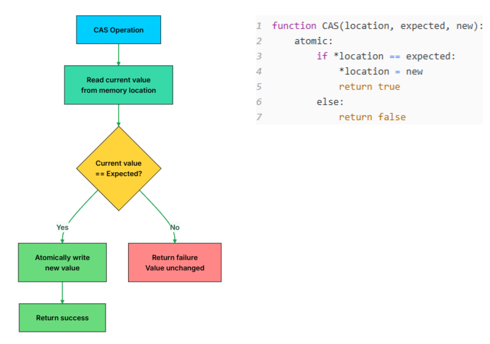
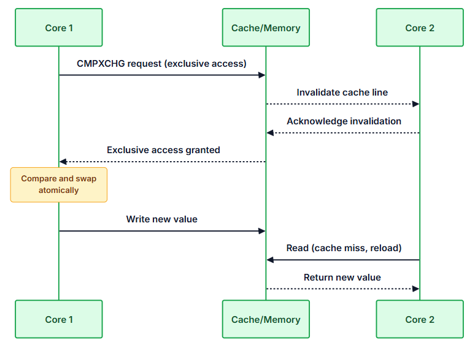
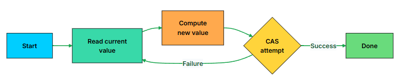

1. CAS and lock free + ABA problem
2. MemoryBarrier
3. VolatileRead
4. VolatileWrite
5. Interlocked class https://www.youtube.com/watch?v=0xXeYzYFbrk


## 1. Compare and Swap

**Real World Analogy**

Imagine you are updating a shared document with a colleague. Before making changes, you note the document's version number: version 5. You spend time writing your edits.

When you try to save, the system checks: is the document still on version 5? If yes, your changes are saved and the version becomes 6. If no, someone else edited it while you were working, and you must re-read, merge, and try again.

**Technically**

In technical terms, CAS is an atomic operation that takes three arguments: a memory location, an expected value, and a new value. 

It atomically compares the current value at the memory location with the expected value. If they match, it replaces the current value with the new value and returns success. If they do not match, it leaves the memory unchanged and returns failure.



**Benefits of CAS**

**1. Performance Benefits**

Locks have overhead. Acquiring a mutex involves system calls, context switches, and thread scheduling. Even an uncontended lock takes 10-100 nanoseconds. Under contention, a thread might sleep for microseconds or milliseconds waiting for the lock holder.

CAS avoids all of this. A successful CAS is just a few CPU cycles. A failed CAS returns immediately, letting the thread retry without involving the operating system.

| Scenario | Mutex Lock    | CAS Operation | 
|----------|---------------|-----------|
Uncontended|~25 ns| ~5-10 ns|
Low contention|	~50-100 ns|	~10-30 ns|
High contention|	1-10 μs (blocking)|	50-500 ns (spinning)|


**2. No Blocking**

With a mutex, if one thread crashes or gets stuck in an infinite loop while holding the lock, every other thread waiting for that lock is blocked forever. This is the fundamental vulnerability of lock-based programming.

With CAS, there is no lock to hold. A thread that crashes simply stops participating. Other threads continue their CAS operations without waiting. This property, where system progress does not depend on any single thread, is called lock-freedom, and CAS is the primitive that makes it possible.

**Hardware-Level Implementation**

Modern CPUs provide CAS as a single machine instruction. 

On `x86/x64` processors, it is called `CMPXCHG` (compare and exchange). 

On `ARM`, the equivalent is a pair of instructions: `LDREX` (load exclusive) and STREX (store exclusive). 

These instructions coordinate with the CPU's cache coherence protocol to ensure atomicity across all cores.

When a core executes `CMPXCHG`:

1. The core signals the memory bus that it wants exclusive access to the cache line
2. Other cores invalidate their copies of that cache line (via the MESI cache coherence protocol)
3. The comparison and conditional swap execute atomically
4. For a few nanoseconds, no other CPU core on the entire motherboard is physically allowed to read or write to that specific memory address.
5. Other cores must reload the cache line if they need the value.


This hardware coordination is what makes CAS truly atomic, not just "fast" but impossible to interrupt.



**The CAS Loop Pattern**

A single CAS can fail if another thread modified the value first. In practice, you almost always wrap CAS in a retry loop:

```go
function incrementWithCAS(location):
    loop:
        current = *location          # Read current value
        new = current + 1            # Compute new value
        if CAS(location, current, new):
            return new               # Success: we updated the value
        # Failure: another thread changed it, retry
```

This pattern is called a CAS loop or a lock-free update loop. You read the current value, compute what you want to change it to, and attempt the CAS. If another thread beat you to it, your expected value no longer matches, the CAS fails, and you retry with the new current value.




**.NET API**

```csharp
Interlocked.CompareExchange(ref location, newValue, expectedValue);
```

It returns the value that was *originally* in location right before the swap was attempted.

 - If `returnedValue == expectedValue`, the swap succeeded.

 - If `returnedValue != expectedValue`, another thread changed the data first, and the swap failed.

```csharp
public class CASDemo
{
    private int _counter = 0;

    // Single CAS attempt
    public bool TryIncrement()
    {
        int current = Volatile.Read(ref _counter);
        int next = current + 1;
        // CompareExchange returns the original value
        // Success if original == expected
        return Interlocked.CompareExchange(ref _counter, next, current) == current;
    }

    // CAS loop (guaranteed to succeed eventually)
    public int IncrementAndGet()
    {
        int current, next;
        while(true)
        {
            current = Volatile.Read(ref _counter);
            next = current + 1;

            //CAS succedded.
            if(Interlocked.CompareExchange(ref _counter, next, current) == current)
                break;

            // CAS failed - another thread modified counter
            // Loop continues with fresh read
        }
        
        return next;
    }

    // Using built-in method (also uses CAS internally)
    public int IncrementBuiltIn()
    {
        return Interlocked.Increment(ref _counter);
    }
}
```

**Key Points:**

- `Interlocked.CompareExchange` returns the original value (not a bool like Java)
- `Volatile.Read` ensures we see the latest value from memory
- CAS succeeds when the returned original value equals our expected value
- `Interlocked.Increment` is the built-in atomic increment


**Example: Lock-Free Counter**

```csharp
using System;
using System.Collections.Generic;
using System.Threading;

public class LockFreeCounterDemo
{
    public static void Main(string[] args)
    {
        var counter = new LockFreeCounter();
        var threads = new List<Thread>();

        // 10 threads, each incrementing 100,000 times
        for (int i = 0; i < 10; i++)
        {
            var t = new Thread(() =>
            {
                for (int j = 0; j < 100_000; j++)
                {
                    counter.Increment();
                }
            });
            threads.Add(t);
            t.Start();
        }

        foreach (var t in threads)
        {
            t.Join();
        }

        Console.WriteLine($"Final count: {counter.Get()}");
        Console.WriteLine($"CAS failures: {counter.GetFailureCount()}");
    }
}

public class LockFreeCounter
{
    private int _value = 0;
    private int _failures = 0;

    public void Increment()
    {
        int current, next;
        while(true)
        {
            current = Volatile.Read(ref _value);
            next = current + 1;
            if (Interlocked.CompareExchange(ref _value, next, current) == current)
            {
                return;  // Success
            }
            Interlocked.Increment(ref _failures);  // Track failures
        }
    }

    public int Get()
    {
        return Volatile.Read(ref _value);
    }

    public int GetFailureCount()
    {
        return Volatile.Read(ref _failures);
    }
}
```

 - **What Does Volatile.Read Do?**
Volatile.Read(ref variable) ensures immediate visibility of the latest value from memory, preventing the compiler or CPU from reordering or caching the read.
It provides a memory barrier/fence that guarantees the read happens exactly when called and that subsequent operations see the correct memory state.
It's important in multithreaded environments to avoid stale reads due to CPU cache or compiler optimizations.


 - **What about marking the field as volatile?**
Declaring a field as volatile (e.g., private volatile int _value;) tells the compiler and runtime to:
Always read the latest value from memory (no caching in registers).
Prevent certain reordering optimizations involving that variable.
In C#, volatile fields guarantee acquire/release memory semantics on individual reads and writes to that field.

    This often makes Volatile.Read unnecessary for simple reads of that field.

 - **So, can you replace Volatile.Read with volatile fields?**
Yes, if:
You declare _value and _failures as volatile fields.
Then simply reading them (return _value;) will have the same visibility guarantees as Volatile.Read(ref _value).

 - **Important nuance when using Interlocked.CompareExchange**
The Interlocked.CompareExchange method already provides full memory barriers (both acquire and release semantics).
So inside the CAS loop, the Volatile.Read before the CompareExchange is often redundant because CompareExchange itself ensures proper memory ordering.
However, some developers keep Volatile.Read explicitly to make the code’s intention clearer or for extra safety in very subtle cases.


Solution        | Prevents Race Condition?    | Performance
|---------------|-----------------------------|----------------------|
`volatile`        | No                          | Useless for counters
`lock`            | Yes                         | Slower(threads wait)
`Interlocked`     | Yes                         | Fastest(atomic)