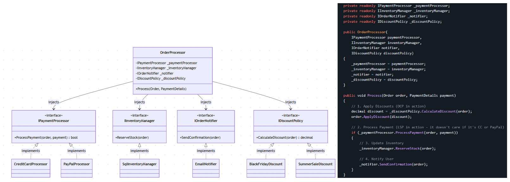

# SOLID in the Real World: The Complete Picture

Let's look at an E-Commerce Order Processing System that perfectly balances all five principles.

## 1. The Interfaces (ISP & DIP)

Instead of one massive `IOrderManager` interface that forces classes to do everything, we segregate our interfaces based on specific roles (`ISP`). Furthermore, our core business logic will depend entirely on these abstractions, not concrete implementations (`DIP`).

```csharp
// ISP: Small, focused role interfaces
public interface IPaymentProcessor
{
    bool ProcessPayment(Order order, PaymentDetails payment);
}

public interface IInventoryManager
{
    void ReserveStock(Order order);
}

public interface IOrderNotifier
{
    void SendConfirmation(Order order);
}

// OCP: An interface that allows us to add endless discount rules
public interface IDiscountPolicy
{
    decimal CalculateDiscount(Order order);
}
```

## 2. The Concrete Implementations (LSP & OCP)

Now we create the classes that do the actual work.

Notice how `CreditCardProcessor` and `PayPalProcessor` can be perfectly substituted for one another without crashing the application (`LSP`). Also, if we want to add a `CryptoProcessor` tomorrow, we just create a new file; we don't have to touch existing code (`OCP`).

```csharp
public class CreditCardProcessor : IPaymentProcessor
{
    public bool ProcessPayment(Order order, PaymentDetails payment)
    {
        // Safe, specific credit card logic
        Console.WriteLine("Charging credit card...");
        return true; 
    }
}

public class PayPalProcessor : IPaymentProcessor
{
    public bool ProcessPayment(Order order, PaymentDetails payment)
    {
        // Safe, specific PayPal logic
        Console.WriteLine("Redirecting to PayPal...");
        return true;
    }
}

public class BlackFridayDiscount : IDiscountPolicy
{
    public decimal CalculateDiscount(Order order) => order.TotalAmount * 0.30m; // 30% off
}

```

## 3. The Core Business Logic (SRP & DIP)

Here is the heart of the application: The `OrderProcessor`.

Its `Single Responsibility (SRP)` is orchestration. It doesn't know how to charge a credit card, it doesn't know how to send an email, and it doesn't know the rules for Black Friday. It simply coordinates the workflow by delegating tasks to its dependencies.

Because it relies purely on interfaces passed into its constructor (DIP), it is completely decoupled from the infrastructure.

```csharp
public class OrderProcessor
{
    // High-level module depending on abstractions (DIP)
    private readonly IPaymentProcessor _paymentProcessor;
    private readonly IInventoryManager _inventoryManager;
    private readonly IOrderNotifier _notifier;
    private readonly IDiscountPolicy _discountPolicy;

    public OrderProcessor(
        IPaymentProcessor paymentProcessor,
        IInventoryManager inventoryManager,
        IOrderNotifier notifier,
        IDiscountPolicy discountPolicy)
    {
        _paymentProcessor = paymentProcessor;
        _inventoryManager = inventoryManager;
        _notifier = notifier;
        _discountPolicy = discountPolicy;
    }

    public void Process(Order order, PaymentDetails payment)
    {
        // 1. Apply Discounts (OCP in action)
        decimal discount = _discountPolicy.CalculateDiscount(order);
        order.ApplyDiscount(discount);

        // 2. Process Payment (LSP in action - it doesn't care if it's CC or PayPal)
        if (_paymentProcessor.ProcessPayment(order, payment))
        {
            // 3. Update Inventory
            _inventoryManager.ReserveStock(order);

            // 4. Notify User
            _notifier.SendConfirmation(order);
        }
    }
}

```

## 4. Tying It All Together (.NET Dependency Injection)

In a modern C# application, you wire all of this together at the very entry point of your app (usually `Program.cs` or `Startup.cs`). The framework handles building the `OrderProcessor` and handing it the correct tools.

```csharp
// In Program.cs
var builder = WebApplication.CreateBuilder(args);

// Registering dependencies (The "Inversion of Control" container)
builder.Services.AddScoped<IPaymentProcessor, CreditCardProcessor>(); // Swap this to PayPalProcessor instantly!
builder.Services.AddScoped<IInventoryManager, SqlInventoryManager>();
builder.Services.AddScoped<IOrderNotifier, EmailNotifier>();
builder.Services.AddScoped<IDiscountPolicy, BlackFridayDiscount>();

// Register the core processor
builder.Services.AddScoped<OrderProcessor>();

var app = builder.Build();
```

## Summary of the SOLID Victory

**SRP:** The `OrderProcessor` orchestrates. The `EmailNotifier` emails. The `CreditCardProcessor` charges.

**OCP:** Marketing wants a new "Summer Sale" discount? Just write a `SummerSaleDiscount.cs` class and change one line in `Program.cs`.

**LSP:** The system confidently passes an `Order` object around knowing that the `IPaymentProcessor` won't randomly throw a `NotSupportedException`.

**ISP:** The inventory system isn't forced to implement email notification methods because the interfaces are separated.

**DIP:** Everything relies on interfaces. You can easily pass a `Mock<IPaymentProcessor>` into the OrderProcessor to write lightning-fast, highly reliable unit tests without hitting a real bank API!

