# Design Patterns — Quick Reference (Implementation Only)

## Table of Contents

- [Creational Patterns](#creational-patterns)
  - [Singleton](#singleton)
  - [Factory](#factory)
  - [Abstract Factory](#abstract-factory)
  - [Builder](#builder)
- [Structural Patterns](#structural-patterns)
  - [Adapter](#adapter)
  - [Decorator](#decorator)
  - [Facade](#facade)
  - [Proxy](#proxy)
- [Behavioral Patterns](#behavioral-patterns)
  - [Observer (Notification)](#observer-notification)
  - [Chain of Responsibility](#chain-of-responsibility)
  - [State](#state)
  - [Mediator](#mediator)
  - [Strategy](#strategy)
  - [Template Method](#template-method)
  - [Command](#command)
  - [Iterator](#iterator)

---

# Creational Patterns

---

## Singleton
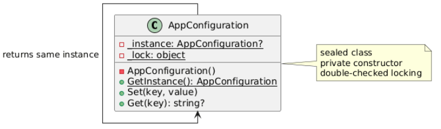
```csharp
public sealed class AppConfiguration
{
    private static AppConfiguration? _instance;
    private static readonly object _lock = new();

    private AppConfiguration()
    {
        if (_instance != null)
            throw new InvalidOperationException("Use GetInstance()");
    }

    public static AppConfiguration GetInstance()
    {
        if (_instance == null)
        {
            lock (_lock)
            {
                if (_instance == null)
                    _instance = new AppConfiguration();
            }
        }
        return _instance;
    }
}
```

---

## Factory
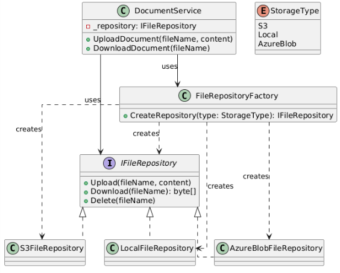
```csharp
public interface IFileRepository
{
    void Upload(string fileName, byte[] content);
    byte[] Download(string fileName);
    void Delete(string fileName);
}

public enum StorageType { S3, Local, AzureBlob }

public class FileRepositoryFactory
{
    public IFileRepository CreateRepository(StorageType type)
    {
        return type switch
        {
            StorageType.S3 => new S3FileRepository(),
            StorageType.Local => new LocalFileRepository(),
            StorageType.AzureBlob => new AzureBlobFileRepository(),
            _ => throw new ArgumentException($"Unknown: {type}")
        };
    }
}

// Usage
var factory = new FileRepositoryFactory();
IFileRepository repo = factory.CreateRepository(StorageType.S3);
repo.Upload("file.pdf", content);
```

---

## Abstract Factory
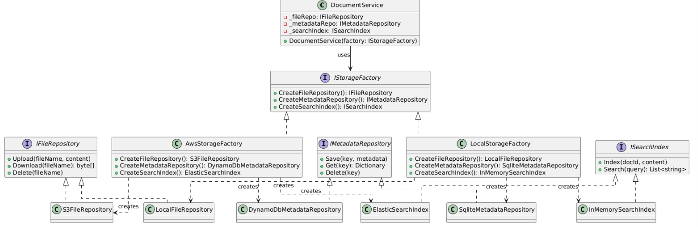
```csharp
public interface IStorageFactory
{
    IFileRepository CreateFileRepository();
    IMetadataRepository CreateMetadataRepository();
    ISearchIndex CreateSearchIndex();
}

public class AwsStorageFactory : IStorageFactory
{
    public IFileRepository CreateFileRepository() => new S3FileRepository();
    public IMetadataRepository CreateMetadataRepository() => new DynamoDbMetadataRepository();
    public ISearchIndex CreateSearchIndex() => new ElasticSearchIndex();
}

public class LocalStorageFactory : IStorageFactory
{
    public IFileRepository CreateFileRepository() => new LocalFileRepository();
    public IMetadataRepository CreateMetadataRepository() => new SqliteMetadataRepository();
    public ISearchIndex CreateSearchIndex() => new InMemorySearchIndex();
}

// Usage
IStorageFactory factory = environment == "production"
    ? new AwsStorageFactory()
    : new LocalStorageFactory();

var service = new DocumentService(factory);
```

---

## Builder
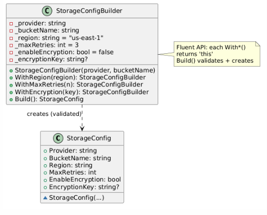
```csharp
public class StorageConfig
{
    public string Provider { get; }
    public string BucketName { get; }
    public string Region { get; }
    public int MaxRetries { get; }
    public bool EnableEncryption { get; }
    public string? EncryptionKey { get; }

    internal StorageConfig(string provider, string bucketName, string region,
        int maxRetries, bool enableEncryption, string? encryptionKey)
    {
        Provider = provider; BucketName = bucketName; Region = region;
        MaxRetries = maxRetries; EnableEncryption = enableEncryption;
        EncryptionKey = encryptionKey;
    }
}

public class StorageConfigBuilder
{
    private readonly string _provider;
    private readonly string _bucketName;
    private string _region = "us-east-1";
    private int _maxRetries = 3;
    private bool _enableEncryption = false;
    private string? _encryptionKey = null;

    public StorageConfigBuilder(string provider, string bucketName)
    {
        _provider = provider;
        _bucketName = bucketName;
    }

    public StorageConfigBuilder WithRegion(string region) { _region = region; return this; }
    public StorageConfigBuilder WithMaxRetries(int n) { _maxRetries = n; return this; }
    public StorageConfigBuilder WithEncryption(string key)
    {
        _enableEncryption = true; _encryptionKey = key; return this;
    }

    public StorageConfig Build()
    {
        if (_enableEncryption && string.IsNullOrWhiteSpace(_encryptionKey))
            throw new InvalidOperationException("Encryption key required");

        return new StorageConfig(_provider, _bucketName, _region,
            _maxRetries, _enableEncryption, _encryptionKey);
    }
}

// Usage
var config = new StorageConfigBuilder("s3", "my-bucket")
    .WithRegion("us-west-2")
    .WithEncryption("AES-256-key")
    .WithMaxRetries(5)
    .Build();
```

---

# Structural Patterns

---

## Adapter
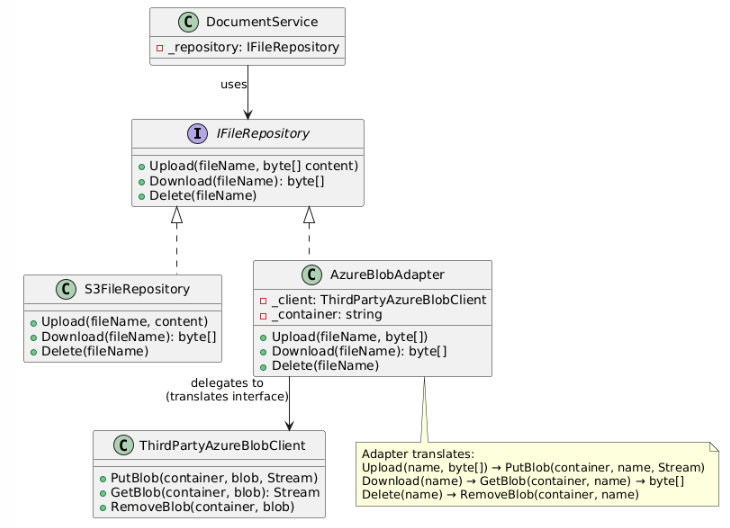
```csharp
// Target (our interface)
public interface IFileRepository
{
    void Upload(string fileName, byte[] content);
    byte[] Download(string fileName);
    void Delete(string fileName);
}

// Adaptee (third-party, incompatible interface — we don't own this)
public class ThirdPartyAzureBlobClient
{
    public void PutBlob(string container, string blob, Stream content) { }
    public Stream GetBlob(string container, string blob) { return Stream.Null; }
    public void RemoveBlob(string container, string blob) { }
}

// Adapter (bridges the gap)
public class AzureBlobAdapter : IFileRepository
{
    private readonly ThirdPartyAzureBlobClient _client;
    private readonly string _container;

    public AzureBlobAdapter(ThirdPartyAzureBlobClient client, string container)
    {
        _client = client;
        _container = container;
    }

    public void Upload(string fileName, byte[] content)
    {
        using var stream = new MemoryStream(content);
        _client.PutBlob(_container, fileName, stream);
    }

    public byte[] Download(string fileName)
    {
        using var stream = _client.GetBlob(_container, fileName);
        using var ms = new MemoryStream();
        stream.CopyTo(ms);
        return ms.ToArray();
    }

    public void Delete(string fileName) => _client.RemoveBlob(_container, fileName);
}

// Usage
IFileRepository repo = new AzureBlobAdapter(new ThirdPartyAzureBlobClient(), "my-container");
repo.Upload("file.pdf", content);
```

---

## Decorator
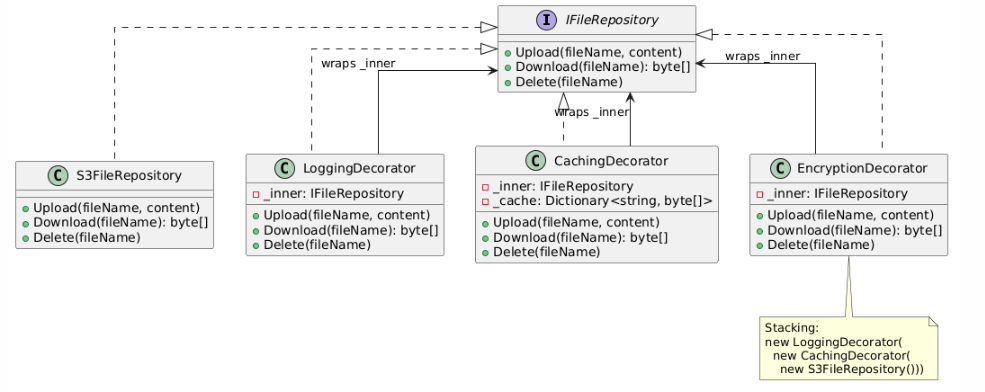
```csharp
public interface IFileRepository
{
    void Upload(string fileName, byte[] content);
    byte[] Download(string fileName);
    void Delete(string fileName);
}

// Concrete component
public class S3FileRepository : IFileRepository
{
    public void Upload(string fileName, byte[] content) { /* S3 upload */ }
    public byte[] Download(string fileName) { /* S3 download */ return Array.Empty<byte>(); }
    public void Delete(string fileName) { /* S3 delete */ }
}

// Decorator: Logging
public class LoggingDecorator : IFileRepository
{
    private readonly IFileRepository _inner;
    public LoggingDecorator(IFileRepository inner) => _inner = inner;

    public void Upload(string fileName, byte[] content)
    {
        Console.WriteLine($"[LOG] Upload: {fileName}");
        _inner.Upload(fileName, content);
        Console.WriteLine($"[LOG] Upload complete");
    }

    public byte[] Download(string fileName)
    {
        Console.WriteLine($"[LOG] Download: {fileName}");
        return _inner.Download(fileName);
    }

    public void Delete(string fileName)
    {
        Console.WriteLine($"[LOG] Delete: {fileName}");
        _inner.Delete(fileName);
    }
}

// Decorator: Caching
public class CachingDecorator : IFileRepository
{
    private readonly IFileRepository _inner;
    private readonly Dictionary<string, byte[]> _cache = new();
    public CachingDecorator(IFileRepository inner) => _inner = inner;

    public void Upload(string fileName, byte[] content)
    {
        _inner.Upload(fileName, content);
        _cache[fileName] = content;
    }

    public byte[] Download(string fileName)
    {
        if (_cache.TryGetValue(fileName, out var cached)) return cached;
        var data = _inner.Download(fileName);
        _cache[fileName] = data;
        return data;
    }

    public void Delete(string fileName)
    {
        _inner.Delete(fileName);
        _cache.Remove(fileName);
    }
}

// Usage: stack decorators
IFileRepository repo =
    new LoggingDecorator(
        new CachingDecorator(
            new S3FileRepository()
        )
    );
```

---

## Facade
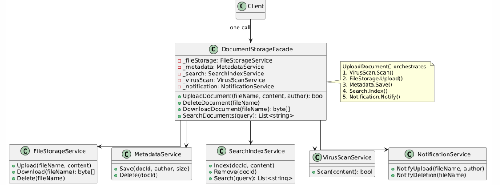
```csharp
public class DocumentStorageFacade
{
    private readonly FileStorageService _fileStorage;
    private readonly MetadataService _metadata;
    private readonly SearchIndexService _search;
    private readonly VirusScanService _virusScan;
    private readonly NotificationService _notification;

    public DocumentStorageFacade(
        FileStorageService fileStorage, MetadataService metadata,
        SearchIndexService search, VirusScanService virusScan,
        NotificationService notification)
    {
        _fileStorage = fileStorage; _metadata = metadata;
        _search = search; _virusScan = virusScan; _notification = notification;
    }

    // ONE method hides 5-step orchestration
    public bool UploadDocument(string fileName, byte[] content, string author)
    {
        if (!_virusScan.Scan(content)) return false;
        _fileStorage.Upload(fileName, content);
        _metadata.Save(fileName, author, content.Length);
        _search.Index(fileName, author);
        _notification.NotifyUpload(fileName, author);
        return true;
    }

    public void DeleteDocument(string fileName)
    {
        _fileStorage.Delete(fileName);
        _metadata.Delete(fileName);
        _search.Remove(fileName);
        _notification.NotifyDeletion(fileName);
    }
}

// Usage
var facade = new DocumentStorageFacade(fileStorage, metadata, search, virusScan, notification);
facade.UploadDocument("report.pdf", content, "Alice");
```

---

## Proxy
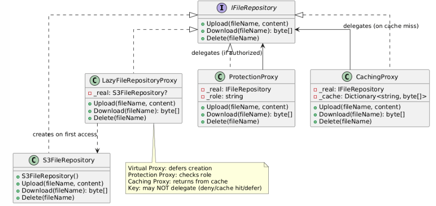
```csharp
public interface IFileRepository
{
    void Upload(string fileName, byte[] content);
    byte[] Download(string fileName);
    void Delete(string fileName);
}

// Virtual Proxy (lazy loading)
public class LazyFileRepositoryProxy : IFileRepository
{
    private S3FileRepository? _real;
    private S3FileRepository Real => _real ??= new S3FileRepository();

    public void Upload(string fileName, byte[] content) => Real.Upload(fileName, content);
    public byte[] Download(string fileName) => Real.Download(fileName);
    public void Delete(string fileName) => Real.Delete(fileName);
}

// Protection Proxy (access control)
public class ProtectionProxy : IFileRepository
{
    private readonly IFileRepository _real;
    private readonly string _role;

    public ProtectionProxy(IFileRepository real, string role)
    { _real = real; _role = role; }

    public void Upload(string fileName, byte[] content)
    {
        if (_role != "writer" && _role != "admin")
            throw new UnauthorizedAccessException("Cannot upload");
        _real.Upload(fileName, content);
    }

    public byte[] Download(string fileName) => _real.Download(fileName);

    public void Delete(string fileName)
    {
        if (_role != "admin")
            throw new UnauthorizedAccessException("Cannot delete");
        _real.Delete(fileName);
    }
}

// Caching Proxy
public class CachingProxy : IFileRepository
{
    private readonly IFileRepository _real;
    private readonly Dictionary<string, byte[]> _cache = new();

    public CachingProxy(IFileRepository real) => _real = real;

    public void Upload(string fileName, byte[] content)
    {
        _real.Upload(fileName, content);
        _cache[fileName] = content;
    }

    public byte[] Download(string fileName)
    {
        if (_cache.TryGetValue(fileName, out var cached)) return cached;
        var data = _real.Download(fileName);
        _cache[fileName] = data;
        return data;
    }

    public void Delete(string fileName)
    {
        _real.Delete(fileName);
        _cache.Remove(fileName);
    }
}

// Usage: stack proxies
IFileRepository repo =
    new ProtectionProxy(
        new CachingProxy(
            new LazyFileRepositoryProxy()
        ), "admin");
```

---

# Behavioral Patterns

---

## Observer (Notification)
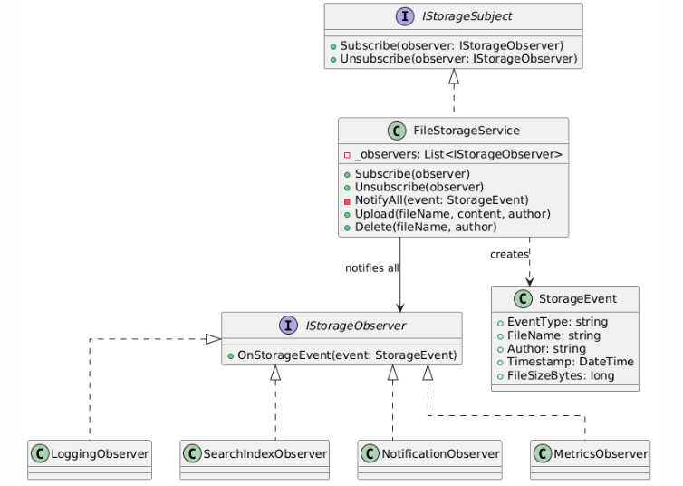
```csharp
public interface IObserver
{
    void Update(string message);
}

public interface ISubject
{
    void Subscribe(IObserver observer);
    void Unsubscribe(IObserver observer);
    void NotifyObservers(string message);
}

public class ParkingLot : ISubject
{
    private readonly List<IObserver> _observers = new();

    public void Subscribe(IObserver observer)
    {
        if (!_observers.Contains(observer))
            _observers.Add(observer);
    }

    public void Unsubscribe(IObserver observer) => _observers.Remove(observer);

    public void NotifyObservers(string message)
    {
        foreach (var observer in _observers)
            observer.Update(message);
    }

    public void ParkCar(string car) => NotifyObservers($"Car {car} parked");
}

// Thread-safe version (Copy-on-Write)
public class ThreadSafeParkingLot : ISubject
{
    private ImmutableList<IObserver> _observers = ImmutableList<IObserver>.Empty;

    public void Subscribe(IObserver observer)
    {
        ImmutableInterlocked.Update(ref _observers, list =>
            list.Contains(observer) ? list : list.Add(observer));
    }

    public void Unsubscribe(IObserver observer)
    {
        ImmutableInterlocked.Update(ref _observers, list => list.Remove(observer));
    }

    public void NotifyObservers(string message)
    {
        foreach (var observer in _observers)
            observer.Update(message);
    }
}

// Usage
var lot = new ParkingLot();
lot.Subscribe(new ConsoleObserver());
lot.Subscribe(new DashboardObserver());
lot.ParkCar("Toyota");
```

---

## Chain of Responsibility
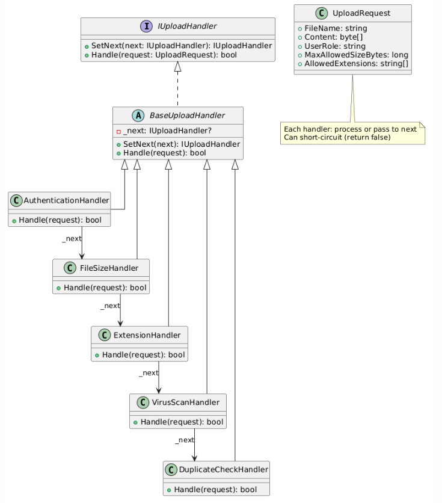
### Flavour 1: Pipeline / All-Run

```csharp
public interface IUploadHandler
{
    IUploadHandler SetNext(IUploadHandler next);
    bool Handle(UploadRequest request);
}

public abstract class BaseUploadHandler : IUploadHandler
{
    private IUploadHandler? _next;

    public IUploadHandler SetNext(IUploadHandler next)
    {
        _next = next;
        return next;
    }

    public virtual bool Handle(UploadRequest request)
    {
        if (_next != null) return _next.Handle(request);
        return true;
    }
}

public class AuthHandler : BaseUploadHandler
{
    public override bool Handle(UploadRequest request)
    {
        if (request.UserRole != "writer" && request.UserRole != "admin")
            return false; // short-circuit

        return base.Handle(request); // pass to next
    }
}

// Build chain
var auth = new AuthHandler();
var size = new FileSizeHandler();
var ext = new ExtensionHandler();
auth.SetNext(size).SetNext(ext);
auth.Handle(request);
```

### Flavour 2: First Match Wins

```csharp
public abstract class BaseHandler : IUploadHandler
{
    private IUploadHandler? _next;

    public IUploadHandler SetNext(IUploadHandler next) { _next = next; return next; }
    protected abstract bool CanHandle(UploadRequest request);
    protected abstract bool Process(UploadRequest request);

    public bool Handle(UploadRequest request)
    {
        if (CanHandle(request))
            return Process(request); // this handler owns it — chain STOPS

        if (_next != null)
            return _next.Handle(request);

        throw new InvalidOperationException("No handler found");
    }
}

public class SmallFileHandler : BaseHandler
{
    protected override bool CanHandle(UploadRequest r) => r.Content.Length < 1_000_000;
    protected override bool Process(UploadRequest r) { /* fast upload */ return true; }
}

public class LargeFileHandler : BaseHandler
{
    protected override bool CanHandle(UploadRequest r) => r.Content.Length >= 1_000_000;
    protected override bool Process(UploadRequest r) { /* multipart upload */ return true; }
}
```

### Flavour 3: Skip-If-Irrelevant + Short-Circuit on Failure

```csharp
public abstract class BaseHandler : IUploadHandler
{
    private IUploadHandler? _next;

    public IUploadHandler SetNext(IUploadHandler next) { _next = next; return next; }
    protected abstract bool CanHandle(UploadRequest request);
    protected abstract bool Process(UploadRequest request);

    public bool Handle(UploadRequest request)
    {
        if (CanHandle(request))
        {
            try
            {
                bool passed = Process(request);
                if (!passed) return false; // rejected — short-circuit
            }
            catch (Exception)
            {
                return false; // exception — short-circuit
            }
        }
        // CanHandle = false → skip silently

        if (_next != null) return _next.Handle(request);
        return true; // end of chain
    }
}

public class VirusScanHandler : BaseHandler
{
    protected override bool CanHandle(UploadRequest r) => r.UserRole != "admin";
    protected override bool Process(UploadRequest r)
    {
        if (IsInfected(r.Content))
            throw new InvalidOperationException("Malware detected!");
        return true;
    }
}
```

---

## State
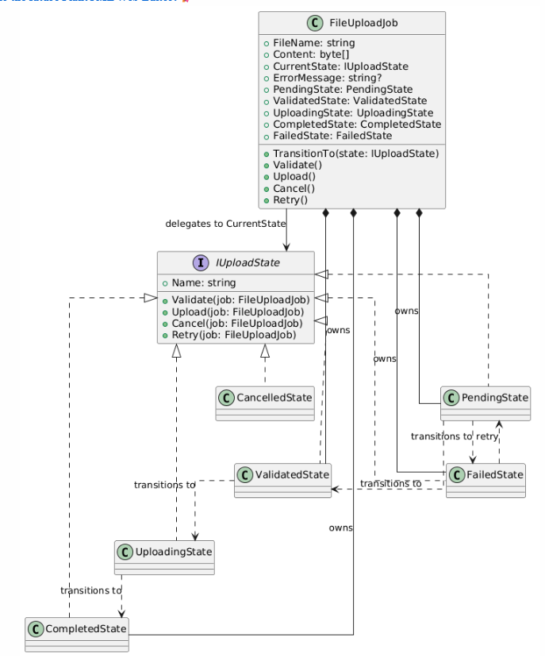
```csharp
public interface IUploadState
{
    string Name { get; }
    void Validate(FileUploadJob job);
    void Upload(FileUploadJob job);
    void Cancel(FileUploadJob job);
    void Retry(FileUploadJob job);
}

// Context — holds pre-created state instances, delegates everything
public class FileUploadJob
{
    public IUploadState CurrentState { get; private set; }
    public string FileName { get; }
    public byte[] Content { get; }
    public string? ErrorMessage { get; set; }

    // Pre-created states — no allocations on transitions
    public PendingState PendingState { get; }
    public ValidatedState ValidatedState { get; }
    public CompletedState CompletedState { get; }
    public FailedState FailedState { get; }

    public FileUploadJob(string fileName, byte[] content)
    {
        FileName = fileName; Content = content;
        PendingState = new PendingState();
        ValidatedState = new ValidatedState();
        CompletedState = new CompletedState();
        FailedState = new FailedState();
        CurrentState = PendingState;
    }

    public void TransitionTo(IUploadState state) => CurrentState = state;
    public void Validate() => CurrentState.Validate(this);
    public void Upload() => CurrentState.Upload(this);
}

// Concrete state
public class PendingState : IUploadState
{
    public string Name => "Pending";
    public void Validate(FileUploadJob job)
    {
        if (job.Content.Length > 10 * 1024 * 1024)
        { job.ErrorMessage = "Too large"; job.TransitionTo(job.FailedState); return; }
        job.TransitionTo(job.ValidatedState);
    }
    public void Upload(FileUploadJob job) => Console.WriteLine("Validate first");
    public void Cancel(FileUploadJob job) { /* transition to Cancelled */ }
    public void Retry(FileUploadJob job) { }
}

// Usage
var job = new FileUploadJob("report.pdf", new byte[1024]);
job.Validate(); // Pending → Validated
job.Upload();   // Validated → Completed
```

---

## Mediator
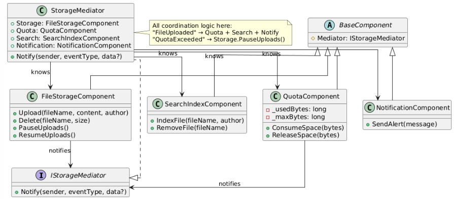
```csharp
public interface IStorageMediator
{
    void Notify(object sender, string eventType, Dictionary<string, object>? data = null);
}

public abstract class BaseComponent
{
    protected IStorageMediator Mediator { get; }
    protected BaseComponent(IStorageMediator mediator) => Mediator = mediator;
}

public class FileStorageComponent : BaseComponent
{
    public FileStorageComponent(IStorageMediator mediator) : base(mediator) { }

    public void Upload(string fileName, byte[] content, string author)
    {
        Console.WriteLine($"[Storage] Uploading '{fileName}'");
        Mediator.Notify(this, "FileUploaded", new Dictionary<string, object>
            { ["fileName"] = fileName, ["author"] = author, ["size"] = (long)content.Length });
    }
    public void PauseUploads() => Console.WriteLine("[Storage] Paused");
}

public class QuotaComponent : BaseComponent
{
    private long _used;
    private readonly long _max;
    public QuotaComponent(IStorageMediator mediator, long max) : base(mediator) { _max = max; }
    public void ConsumeSpace(long bytes)
    {
        _used += bytes;
        if (_used >= _max) Mediator.Notify(this, "QuotaExceeded");
    }
}

// Mediator — all coordination in one place
public class StorageMediator : IStorageMediator
{
    public FileStorageComponent Storage { get; }
    public QuotaComponent Quota { get; }
    public NotificationComponent Notification { get; }

    public StorageMediator(long maxQuota)
    {
        Storage = new FileStorageComponent(this);
        Quota = new QuotaComponent(this, maxQuota);
        Notification = new NotificationComponent(this);
    }

    public void Notify(object sender, string eventType, Dictionary<string, object>? data = null)
    {
        switch (eventType)
        {
            case "FileUploaded":
                Quota.ConsumeSpace((long)data!["size"]);
                Notification.SendAlert($"'{data["fileName"]}' uploaded");
                break;
            case "QuotaExceeded":
                Storage.PauseUploads();
                break;
        }
    }
}
```

---

## Strategy
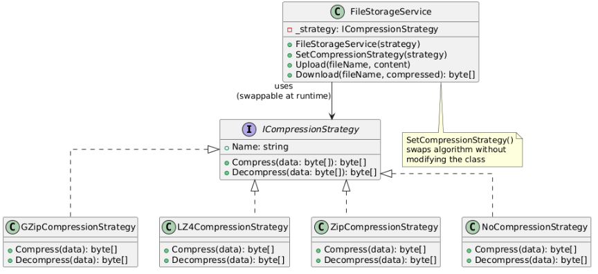
```csharp
public interface ICompressionStrategy
{
    string Name { get; }
    byte[] Compress(byte[] data);
    byte[] Decompress(byte[] data);
}

public class GZipStrategy : ICompressionStrategy
{
    public string Name => "GZip";
    public byte[] Compress(byte[] data) { /* GZip logic */ return new byte[(int)(data.Length * 0.6)]; }
    public byte[] Decompress(byte[] data) { return new byte[(int)(data.Length / 0.6)]; }
}

public class LZ4Strategy : ICompressionStrategy
{
    public string Name => "LZ4";
    public byte[] Compress(byte[] data) { return new byte[(int)(data.Length * 0.7)]; }
    public byte[] Decompress(byte[] data) { return new byte[(int)(data.Length / 0.7)]; }
}

// Context — swaps strategy at runtime
public class FileStorageService
{
    private ICompressionStrategy _strategy;
    public FileStorageService(ICompressionStrategy strategy) => _strategy = strategy;
    public void SetStrategy(ICompressionStrategy s) => _strategy = s;

    public void Upload(string fileName, byte[] content)
    {
        var compressed = _strategy.Compress(content);
        Console.WriteLine($"Uploading '{fileName}' ({compressed.Length} bytes, {_strategy.Name})");
    }
}

// Usage
var storage = new FileStorageService(new GZipStrategy());
storage.Upload("logs.txt", data);
storage.SetStrategy(new LZ4Strategy());
storage.Upload("realtime.bin", data);
```

---

## Template Method
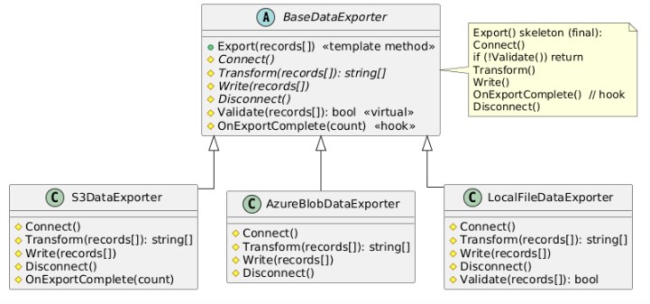
```csharp
public abstract class BaseDataExporter
{
    // Template method — fixed skeleton, cannot be overridden
    public void Export(string[] records)
    {
        Connect();
        if (!Validate(records)) return;
        var transformed = Transform(records);
        Write(transformed);
        Disconnect();
    }

    protected abstract void Connect();
    protected abstract string[] Transform(string[] records);
    protected abstract void Write(string[] records);
    protected abstract void Disconnect();
    protected virtual bool Validate(string[] records) => records.Length > 0;
}

public class S3DataExporter : BaseDataExporter
{
    protected override void Connect() => Console.WriteLine("[S3] Connecting...");
    protected override string[] Transform(string[] records) => records.Select(r => $"PARQUET:{r}").ToArray();
    protected override void Write(string[] records) => Console.WriteLine($"[S3] Writing {records.Length} records");
    protected override void Disconnect() => Console.WriteLine("[S3] Disconnecting");
}

// Usage
BaseDataExporter exporter = new S3DataExporter();
exporter.Export(records); // Connect → Validate → Transform → Write → Disconnect
```

---

## Command
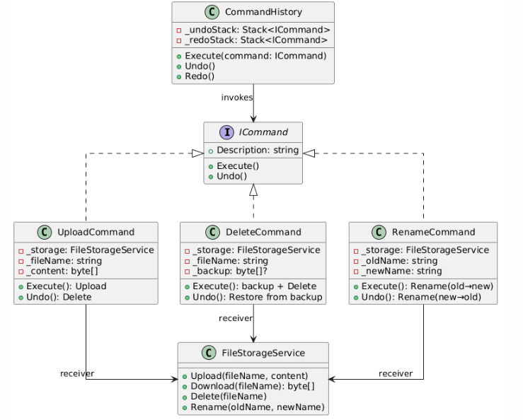
```csharp
public interface ICommand
{
    string Description { get; }
    void Execute();
    void Undo();
}

public class UploadCommand : ICommand
{
    private readonly FileStorageService _storage;
    private readonly string _fileName;
    private readonly byte[] _content;
    public string Description => $"Upload '{_fileName}'";

    public UploadCommand(FileStorageService storage, string fileName, byte[] content)
    { _storage = storage; _fileName = fileName; _content = content; }

    public void Execute() => _storage.Upload(_fileName, _content);
    public void Undo() => _storage.Delete(_fileName);
}

public class DeleteCommand : ICommand
{
    private readonly FileStorageService _storage;
    private readonly string _fileName;
    private byte[]? _backup;
    public string Description => $"Delete '{_fileName}'";

    public DeleteCommand(FileStorageService storage, string fileName)
    { _storage = storage; _fileName = fileName; }

    public void Execute() { _backup = _storage.Download(_fileName); _storage.Delete(_fileName); }
    public void Undo() { if (_backup != null) _storage.Upload(_fileName, _backup); }
}

// Invoker with undo/redo
public class CommandHistory
{
    private readonly Stack<ICommand> _undo = new();
    private readonly Stack<ICommand> _redo = new();

    public void Execute(ICommand cmd) { cmd.Execute(); _undo.Push(cmd); _redo.Clear(); }
    public void Undo() { if (_undo.Count == 0) return; var c = _undo.Pop(); c.Undo(); _redo.Push(c); }
    public void Redo() { if (_redo.Count == 0) return; var c = _redo.Pop(); c.Execute(); _undo.Push(c); }
}

// Usage
var history = new CommandHistory();
history.Execute(new UploadCommand(storage, "file.pdf", content));
history.Execute(new DeleteCommand(storage, "file.pdf"));
history.Undo(); // restores file.pdf
```

---

## Iterator
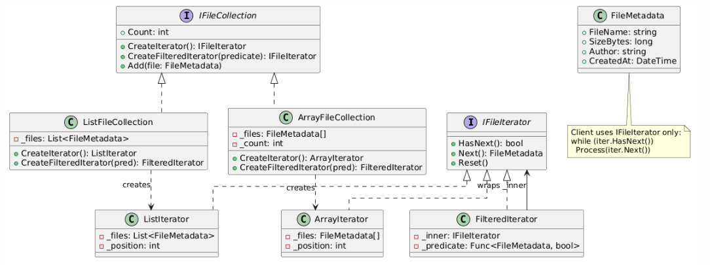
```csharp
public interface IFileIterator
{
    bool HasNext();
    FileMetadata Next();
    void Reset();
}

public interface IFileCollection
{
    IFileIterator CreateIterator();
    IFileIterator CreateFilteredIterator(Func<FileMetadata, bool> predicate);
}

public class ArrayFileCollection : IFileCollection
{
    private readonly FileMetadata[] _files;
    private int _count;

    public ArrayFileCollection(int capacity) => _files = new FileMetadata[capacity];
    public void Add(FileMetadata file) => _files[_count++] = file;

    public IFileIterator CreateIterator() => new ArrayIterator(_files, _count);
    public IFileIterator CreateFilteredIterator(Func<FileMetadata, bool> pred)
        => new FilteredIterator(CreateIterator(), pred);

    private class ArrayIterator : IFileIterator
    {
        private readonly FileMetadata[] _f; private readonly int _c; private int _i;
        public ArrayIterator(FileMetadata[] f, int c) { _f = f; _c = c; }
        public bool HasNext() => _i < _c;
        public FileMetadata Next() => _f[_i++];
        public void Reset() => _i = 0;
    }
}

public class FilteredIterator : IFileIterator
{
    private readonly IFileIterator _inner;
    private readonly Func<FileMetadata, bool> _pred;
    private FileMetadata? _next;

    public FilteredIterator(IFileIterator inner, Func<FileMetadata, bool> pred)
    { _inner = inner; _pred = pred; Advance(); }

    public bool HasNext() => _next != null;
    public FileMetadata Next() { var c = _next!; Advance(); return c; }
    public void Reset() { _inner.Reset(); Advance(); }
    private void Advance()
    { _next = null; while (_inner.HasNext()) { var x = _inner.Next(); if (_pred(x)) { _next = x; return; } } }
}

// Usage — same code for any collection
var iter = collection.CreateIterator();
while (iter.HasNext()) Process(iter.Next());

var filtered = collection.CreateFilteredIterator(f => f.Author == "Alice");
while (filtered.HasNext()) Process(filtered.Next());
```

---

# Quick Comparison

| Pattern | Type | One-liner |
|---------|------|-----------|
| Singleton | Creational | One instance, private ctor, double-checked lock |
| Factory | Creational | One method creates one product type by enum/param |
| Abstract Factory | Creational | One interface creates a FAMILY of related products |
| Builder | Creational | Fluent step-by-step construction with validation |
| Adapter | Structural | Wraps incompatible interface to look like ours |
| Decorator | Structural | Wraps same interface, adds behavior, always delegates |
| Facade | Structural | One class orchestrates multiple subsystems |
| Proxy | Structural | Controls access (lazy, auth, cache) — may NOT delegate |
| Observer | Behavioral | Subject notifies list of observers on state change |
| Chain of Responsibility | Behavioral | Request passes through handlers until handled/rejected |
| State | Behavioral | Object delegates to current state; states control transitions |
| Mediator | Behavioral | Central hub coordinates many-to-many communication |
| Strategy | Behavioral | Swap algorithms at runtime via interface injection |
| Template Method | Behavioral | Base class defines skeleton; subclasses fill in steps |
| Command | Behavioral | Encapsulate operation as object — supports undo/queue/log |
| Iterator | Behavioral | Uniform traversal without exposing internal structure |
