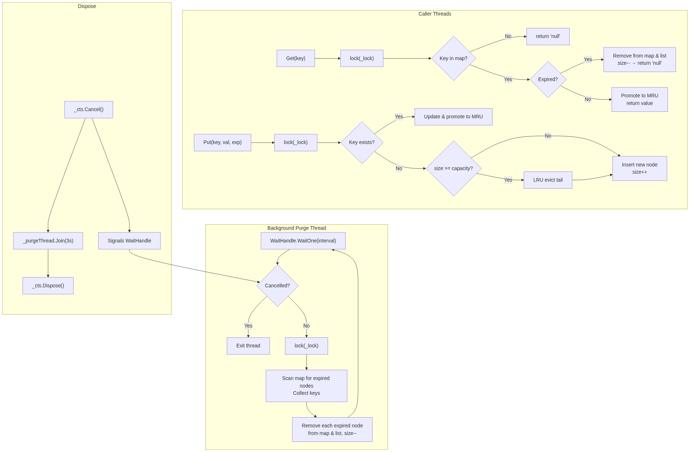

## 1. LRU Cache with LRU Eviction

An LRU (Least Recently Used) cache stores a fixed number of items. When the cache
is full and a new item arrives, the item that was accessed least recently is evicted.

### Data Structures

| Structure | Role |
|---|---|
| `Dictionary<int, Node>` | O(1) key lookup |
| `DoublyLinkedList` | Tracks access order — head = most recent, tail = least recent |

The doubly linked list uses dummy `head` and `tail` sentinel nodes so that
`AddFirst` and `RemoveNode` never need null checks.

### Operations

**Get(key)**
1. Look up the key in the dictionary.
2. If found, detach the node from its current position and move it to the head (MRU).
3. Return the value (or `"null"` if not found).

**Put(key, value, expiresAt)**
1. If the key already exists, update its value and move it to the head.
2. If the key is new:
   - Create a node and add it to the dictionary.
   - If the cache is over capacity, remove the node just before the tail sentinel (the LRU item).
   - Insert the new node at the head.

Both operations are **O(1)**.

### Example

```
Capacity = 2

Put(1, "one")    → [1]
Put(2, "two")    → [2, 1]
Get(1)           → promotes 1 → [1, 2]
Put(3, "three")  → cache full, evict LRU (2) → [3, 1]
Get(2)           → "null" (evicted)
```

---

## 2. TTL Implementation in Get (Lazy Expiration)

Each `Node` carries a `DateTimeOffset ExpiresAt` field. The `HasExpired()` method
compares it against `DateTimeOffset.UtcNow`.

Expiration is checked **lazily** — only when `Get` is called:

```csharp
public string Get(int key)
{
    if (!_map.TryGetValue(key, out Node? node))
        return "null";

    if (node.HasExpired())          // ← TTL check
    {
        _map.Remove(key);
        _list.RemoveNode(node);
        return "null";
    }

    _list.RemoveNode(node);
    _list.AddFirst(node);           // promote to MRU
    return node.Value;
}
```

If a caller never reads an expired key, the node stays in the cache until it is
either accessed or evicted by LRU. This is simple and keeps `Get` at O(1), but
it introduces the **Dead Weight problem**.


Because the eviction logic in Set only checks the total count (_cacheMap.Count >= _capacity) and blindly evicts the tail of the LinkedList, expired items effectively hold your cache capacity hostage until they are explicitly requested via Get.

The Worst-Case Scenario
To illustrate how right you are, consider this scenario:

1. You have a cache capacity of 10.
2. You insert 9 items with a short TTL (e.g., 1 second). You access them frequently, keeping them at the front (MRU) of the linked list.
3. You insert 1 item with a long TTL (e.g., 1 hour). You don't access it, so it naturally falls to the tail (LRU) of the list.
4. 2 seconds pass. The 9 items at the front are now expired, but because `Get` hasn't been called on them, they are still in the dictionary counting towards the capacity.
5. You call `Set` to insert an 11th item.

**The Result:** The cache sees it is at capacity and evicts the item at the tail. It just evicted your **only valid item** (the 1-hour TTL item), while keeping 9 completely useless, expired items in memory!


**How to Fix It (The Trade-offs)**

Fixing this requires shifting away from a purely *O(1)* lazy approach. Here are the three standard ways 
engineers solve this in production:

**1. The Priority Queue Approach (Algorithmic Fix)**
To evict the explicitly expired items first, you need to know which items expire soonest without scanning the whole dictionary.
- **How it works:** You maintain a **PriorityQueue<TKey, DateTimeOffset>** alongside your dictionary and
  linked list. The priority is the expiration time. The item expiring soonest is always at the top.
- **Ghost Entry** - Priority Queues are incredibly fast at inserting **O(log N)** and peeking **O(1)**, 
  but they are terrible at updating an existing item's priority.
  To solve this, we use a pattern called **Lazy Removal (or Ghost Entries)**. 
  When you update an item's TTL, we don't search the queue to update the old timestamp. 
  Instead, we just enqueue a second entry with the new timestamp. When the Priority Queue 
  eventually pops the old timestamp, we check if it matches the actual timestamp in our Dictionary. 
  If it doesn't match, we know it's a "ghost" entry, and we just discard it.
- **On Set when full:** You peek at the Priority Queue. If the item at the top of the queue has an 
  expiration time in the past, you pop it and remove it from the cache. 
  If it is not expired, only then do you fall back to evicting the tail of the LRU linked list.
- **Trade-off:** Your Set operation goes from **O(1)** to **O(log N)** because of the priority queue insertions.

```csharp
public void Put(key, value){
    ...if key already exists, update its value in linkedlist node.
    ...insert a new entry in the priority_queue (stale entries are handled lazily)
    //Evict if cache is full
    if (_size >= _capacity){
        PurgeExpiredKeys();
        
        // Only LRU-evict if purging didn't free enough space
        if (_size >= _capacity)
            LRUEvict();
    }
    ...Add new key
}

public void PurgeExpiredKeys()
{
   while (_expiryQueue.Count > 0){
      _expiryQueue.TryPeek(out int key, out DateTimeOffset expiry);

      // 2 scenarios for this key.
      // 1. This key is present in the Map and List
      if (_map.TryGetValue(key, out Node? currentNode))
      {
         // 1. This key was updated with a new expiry using Put.
         //    So this is a stale key in the queue. Delete it
         if (currentNode.ExpiresAt != expiry)
         {
            _expiryQueue.Dequeue();
            continue;
         }
         // 2. This key is still alive but has expired. Delete it.
         else if (currentNode.ExpiresAt < DateTimeOffset.UtcNow)
         {
            _expiryQueue.Dequeue();
            _map.Remove(key);
            _list.RemoveNode(currentNode);
            _size--;
         }
         // 3. This key is still alive and has not expired. So no other 
         //    entries will be expired. Break;
         else
         {
            break;
         }
      }
      // 2. This key is not present in the Map and the List
      else
      {
         //The key is in the queue but was already deleted from the map 
         // (e.g., evicted by LRU capacity or manually removed). 
         // It is an orphaned ghost entry. Discard it.

         _expiryQueue.Dequeue();
      }
   }
}
```

### PurgeExpiredKeys — All Possible States

When `Put` triggers `PurgeExpiredKeys()`, the loop peeks at the priority queue
and encounters one of four scenarios for each entry. Here is a walkthrough of
each.

#### State 1: Expired Entry (Normal Purge)

The key exists in the map, its expiry in the queue matches the node's expiry,
and that expiry is in the past. This is the happy path — remove the dead weight.

```
Capacity = 2
Time: T=0

Put(1, "one",   T+5s)   → Map: {1}, List: [1],    PQ: [(1, T+5s)]
Put(2, "two",   T+60m)  → Map: {1,2}, List: [2,1], PQ: [(1, T+5s), (2, T+60m)]

... T=10s — item 1 has expired ...

Put(3, "three", T+60m)  → cache full, call PurgeExpiredKeys()

  PQ peek → (1, T+5s)
  Map has key 1? YES
  node.ExpiresAt == T+5s == queue expiry? YES (not stale)
  T+5s < UtcNow (T=10s)? YES → EXPIRED
  → Dequeue, remove key 1 from map & list, size--

  Map: {2}, List: [2], size = 1 < capacity 2 → no LRU evict needed
  Insert 3 → Map: {2,3}, List: [3,2], PQ: [(2, T+60m), (3, T+60m)]

Item 2 survives. ✓
```

#### State 2: Stale Entry (Key Was Updated with New Expiry)

The key exists in the map, but the node's current `ExpiresAt` doesn't match the
expiry stored in the queue. This happens when `Put` updates an existing key with
a new TTL — it re-enqueues but can't remove the old queue entry (heaps don't
support arbitrary deletion). The old entry is now stale — skip it.

```
Capacity = 2
Time: T=0

Put(1, "one", T+5s)   → Map: {1}, List: [1],    PQ: [(1, T+5s)]
Put(2, "two", T+60m)  → Map: {1,2}, List: [2,1], PQ: [(1, T+5s), (2, T+60m)]

... T=3s — update key 1 with a longer TTL ...

Put(1, "one-v2", T+60m)
  → Key 1 exists. Update node: ExpiresAt = T+60m. Re-enqueue.
  → PQ: [(1, T+5s), (2, T+60m), (1, T+60m)]
         ^^^^^^^^^ stale — node's ExpiresAt is now T+60m, not T+5s

... T=10s ...

Put(3, "three", T+60m) → cache full, call PurgeExpiredKeys()

  PQ peek → (1, T+5s)
  Map has key 1? YES
  node.ExpiresAt (T+60m) == queue expiry (T+5s)? NO → STALE
  → Dequeue, continue loop

  PQ peek → (2, T+60m)
  Map has key 2? YES
  node.ExpiresAt == queue expiry? YES
  T+60m < UtcNow (T=10s)? NO → ALIVE → break

  size (2) >= capacity (2) → LRU evict tail (key 2)
  Insert 3 → Map: {1,3}, List: [3,1]

Stale entry was harmlessly discarded. ✓
```

#### State 3: Orphaned Ghost Entry (Key Already Removed)

The key in the queue no longer exists in the map. This happens when a key was
previously evicted by LRU capacity (or removed via lazy expiration in `Get`),
but its queue entry was never cleaned up. It's a ghost — discard it.

```
Capacity = 2
Time: T=0

Put(1, "one", T+30s)  → Map: {1}, List: [1],    PQ: [(1, T+30s)]
Put(2, "two", T+60m)  → Map: {1,2}, List: [2,1], PQ: [(1, T+30s), (2, T+60m)]

Put(3, "three", T+60m)
  → Cache full. PurgeExpiredKeys: nothing expired yet. LRU evict tail → key 1.
  → Map: {2,3}, List: [3,2], PQ: [(1, T+30s), (2, T+60m), (3, T+60m)]
                                   ^^^^^^^^^ ghost — key 1 no longer in map

... T=35s ...

Put(4, "four", T+60m) → cache full, call PurgeExpiredKeys()

  PQ peek → (1, T+30s)
  Map has key 1? NO → GHOST (orphaned)
  → Dequeue, continue loop

  PQ peek → (2, T+60m)
  Map has key 2? YES
  node.ExpiresAt == queue expiry? YES
  T+60m < UtcNow (T=35s)? NO → ALIVE → break

  size (2) >= capacity (2) → LRU evict tail (key 2)
  Insert 4 → Map: {3,4}, List: [4,3]

Ghost entry was harmlessly discarded. ✓
```

#### State 4: Live Entry (Nothing to Purge — Stop)

The top of the queue is a valid, non-expired entry. Since the priority queue is
a min-heap ordered by expiry, if the soonest-expiring item is still alive, then
everything behind it is alive too. Stop the loop.

```
Capacity = 2
Time: T=0

Put(1, "one", T+60m)  → Map: {1}, List: [1],    PQ: [(1, T+60m)]
Put(2, "two", T+60m)  → Map: {1,2}, List: [2,1], PQ: [(1, T+60m), (2, T+60m)]

... T=5s ...

Put(3, "three", T+60m) → cache full, call PurgeExpiredKeys()

  PQ peek → (1, T+60m)
  Map has key 1? YES
  node.ExpiresAt == queue expiry? YES
  T+60m < UtcNow (T=5s)? NO → ALIVE → break

  Nothing purged. size (2) >= capacity (2) → LRU evict tail (key 1)
  Insert 3 → Map: {2,3}, List: [3,2]

Falls back to standard LRU eviction. ✓
```

**2. The Background Sweeper (Active TTL)**
Instead of waiting for a `Set` or `Get` to clean up the mess, you run a dedicated background thread that periodically prunes the cache.
- **How it works:** You use a background thread that fires every few seconds. 
  It locks the cache, iterates through it, and actively removes any nodes where 
  DateTimeOffset.UtcNow > ExpirationTime.
- **Trade-off:** It adds background CPU overhead and increases lock contention. 
  If the timer fires while your main thread is trying to read/write, the main thread has to wait.


```csharp
// HouseKeeping Thread Pattern v1
private readonly Thread _sweeperThread;
private readonly CancellationTokenSource _cts;
private readonly object _lock = new object();
private bool _isDisposed = false;  //false - Alive, true - Dead

ctor{
    _cts = new CancellationTokenSource();
    _sweeperThread = new Thread(SweepLoop)
    {
        // CRITICAL: This ensures the thread doesn't prevent the application from exiting.
        IsBackground = true, 
        Name = "LruCacheSweeperThread"
    };        
    _sweeperThread.Start();    
}


public void PurgeExpiredKeysBasic()
{
    var token = _cts.Token;

    //infinite loop
    while (true)
    {
        try
        {
            // Sleep : Issue - When cancellation triggered, the Thread is hot woke up
            // immediately. It completes its sleep interval.
            Thread.Sleep(_purgeInterval);

            //Check if cancellation triggered
            token.ThrowIfCancellationRequested();

            //else do the housekeeping job
            lock (_cacheLock)
            {
                //Collect all the keys from the map that have expired.
                List<Node> expiredKeys = new List<Node>();
                foreach (var entry in _map)
                {
                    if (entry.Value.HasExpired())
                        expiredKeys.Add(entry.Value);
                }

                //Remove them from map and list
                foreach (Node node in expiredKeys)
                {
                    _map.Remove(node.Key);
                    _list.RemoveNode(node);
                    _size--;
                }
            }
        }
        catch (OperationCanceledException e)
        {
            //Cancellation of this Thread triggered. So log + break from loop
            Console.WriteLine(e.Message);
            break;
        }
        catch(Exception e)
        {
            //Exception occurred in the housekeeping. Just log. No break.
            //If we break, then the houskeeping will not run.
            Console.WriteLine(e.Message);
        }
    }
}

public void Dispose()
{
    if (_isDisposed) return;
    _isDisposed = true;
    
    // 1. Signal the thread to wake up and exit its loop
    _cts.Cancel();
    
    // 2. Wait for the thread to gracefully finish whatever it is currently doing
    if (_houseKeepingThread.IsAlive)
    {
        _houseKeepingThread.Join(); 
    }
    
    _cts.Dispose();
}
```

To understand the difference between `Thread.Sleep` and `WaitOne`, it helps to use a real-world analogy:
- **Thread.Sleep(5000)** is like taking a strong sleeping pill and setting an alarm for 5 hours. 
  You are completely unconscious. Even if your house catches fire, you will not wake up until those 
  5 hours are strictly over.

- **WaitHandle.WaitOne(5000)** is like taking a nap on the couch waiting for a delivery. You set an alarm 
  for 5 hours, but if the doorbell rings (a signal) after just 1 hour, you instantly wake up and handle it. 
  If the doorbell never rings, you wake up when the 5-hour alarm goes off.

Here is the detailed technical breakdown of how they work and why one is vastly superior for background services.

**1. Thread.Sleep (Unconditional Suspension)**

When you call `Thread.Sleep(TimeSpan)`, you are telling the operating system's thread scheduler to suspend 
the current thread and explicitly remove it from the CPU queue for that exact amount of time.

**The mechanics:**

- **No early exit:** Once the thread goes to sleep, there is no standard, safe way to wake it up early.
  If you trigger the cancellation token exactly 1 second into the 5-second sleep, nothing happens. 
  The thread remains completely unconscious for the remaining 4 seconds. It will only notice the cancellation 
  after it wakes up and loops back to evaluate `ThrowIfCancellationRequested`. If your application is trying to  
  shut down, it will hang and wait for that sleep to finish.

- **The Exception route:** The only way to force it awake is by calling `Thread.Interrupt()` or `Thread.Abort()` 
  from another thread. This violently throws a `ThreadInterruptedException` on the sleeping thread. 
  Relying on exceptions for normal application flow (like shutting down) is a major anti-pattern in 
  C# because it can easily corrupt data or leave locks orphaned.

- **When to use it:** Almost never in production code. It is mostly used for quick hacks, 
  writing automated UI tests (e.g., waiting for an animation to finish), or testing timeout logic.

**2. WaitOne (Conditional Synchronization)**

WaitOne is a method that belongs to a `WaitHandle` (which is a wrapper around OS-level synchronization 
primitives like events or mutexes). You see this most commonly on `ManualResetEvent`, `AutoResetEvent`, 
or the `.WaitHandle` property of a `CancellationToken`.

When you call `myHandle.WaitOne(TimeSpan)`, you are telling the OS: 
*"Suspend this thread until someone signals this handle, OR until the timeout expires—whichever 
happens first."*

**The mechanics:**

- **Instantly Responsive:** If another thread calls `.Set()` on the event (or `.Cancel()` on the 
  cancellation token), the OS instantly wakes up the waiting thread.
  If you trigger the cancellation token 1 second into the 5-second wait, the WaitHandle receives 
  an immediate OS-level signal. The thread wakes up instantly, `WaitOne` returns true, the while loop 
  condition breaks, and the thread exits immediately. Your application shuts down instantly with 
  zero hanging.

- **Return Value:** Unlike `Sleep`, `WaitOne` returns a `bool`.    
  - It returns `true` if it woke up because it received the signal.
  - It returns `false` if it woke up because the timeout clock ran out.

- **When to use it:** Background workers, polling loops, graceful application shutdowns, and 
coordinating multiple threads.

```csharp
// HouseKeeping Thread Pattern v2
public void PurgeExpiredKeys()
{
    var token = _cts.Token;

    // WaitOne pauses the thread. But wakes it up immediately when signalled 
    // for cancellation. 
    // It returns true if cancelled (breaking the loop). 
    // It returns false if the interval passed (continuing the loop).

    while (!token.WaitHandle.WaitOne(_purgeInterval))
    {
        try
        {
            lock (_cacheLock)
            {
                //Collect all the keys from the map that have expired.
                List<Node> expiredKeys = new List<Node>();
                foreach (var entry in _map)
                {
                    if (entry.Value.HasExpired())
                        expiredKeys.Add(entry.Value);
                }

                //Remove them from map and list
                foreach (Node node in expiredKeys)
                {
                    _map.Remove(node.Key);
                    _list.RemoveNode(node);
                    _size--;
                }
            }
        }
        catch (Exception e)
        {
            // Catch ALL exceptions. Log them, but let the while loop continue.
            // This guarantees the housekeeper thread never dies unexpectedly.
            Console.WriteLine(e.Message);
        }            
    }
    Console.WriteLine("Purge routine cancelled. Exiting gracefully.");
}

//Same as previous version
public void Dispose()
{
    if (_isDisposed) return;
    _isDisposed = true;
    
    // 1. Signal the thread to wake up and exit its loop
    _cts.Cancel();
    
    // 2. Wait for the thread to gracefully finish whatever it is currently doing
    if (_houseKeepingThread.IsAlive)
    {
        _houseKeepingThread.Join(); 
    }
    
    _cts.Dispose();
}
```

### Complexity Trade-off

| | PriorityLRUCache | BackgroundLRUCache |
|---|---|---|
| Get | O(1) | O(1) |
| Put | O(log N) | O(1) |
| Background cost | None | O(N) per sweep |
| Thread safety | Not required | Required (lock) |
| Dead weight window | Zero (checked at eviction time) | Up to `purgeInterval` |

### When to Pick Which

- **Priority Queue** — best when you need deterministic, immediate cleanup with
  no dead weight window, and can tolerate O(log N) writes. Single-threaded.
- **Background Thread** — best when you want O(1) hot-path performance and can
  accept a short window where expired items linger. Requires thread safety but
  naturally fits multi-threaded applications that already need locking.


### Why `Interlocked.CompareExchange` in Dispose?

```csharp
if (Interlocked.CompareExchange(ref _disposed, 1, 0) != 0)
    return;
```

If two threads call `Dispose()` concurrently, both would cancel the token and
join the thread. `Interlocked.CompareExchange` atomically checks "is `_disposed`
still 0?" and sets it to 1 in a single operation. Only the first caller wins;
the second sees 1 and returns immediately. This is cheaper and more correct than
a `lock` around `Dispose`.

---

## 3. Generic Cache Implementation

```csharp
public class Node<TKey, TValue>
{
    TKey Key;
    TValue Value;
    public Node<TKey, TValue>? Prev;
    public Node<TKey, TValue>? Next;
    public DateTimeOffset ExpiresAt;

}

public class DoublyLinkedList<TKey, TValue>
{
    public Node<TKey, TValue> head;
    public Node<TKey, TValue> tail;

    public DoublyLinkedList()
    {
        //create dummy head and tail
        head = new Node<TKey, TValue>(default(TKey)!, default(TValue)!, DateTimeOffset.MaxValue);
        tail = new Node<TKey, TValue>(default(TKey)!, default(TValue)!, DateTimeOffset.MaxValue);
        head.Next = tail;
        tail.Prev = head;
    }
    
    ...
}

public class LRUCache<TKey, TValue> : IDisposable where TKey : notnull
{
    ...
}
```



