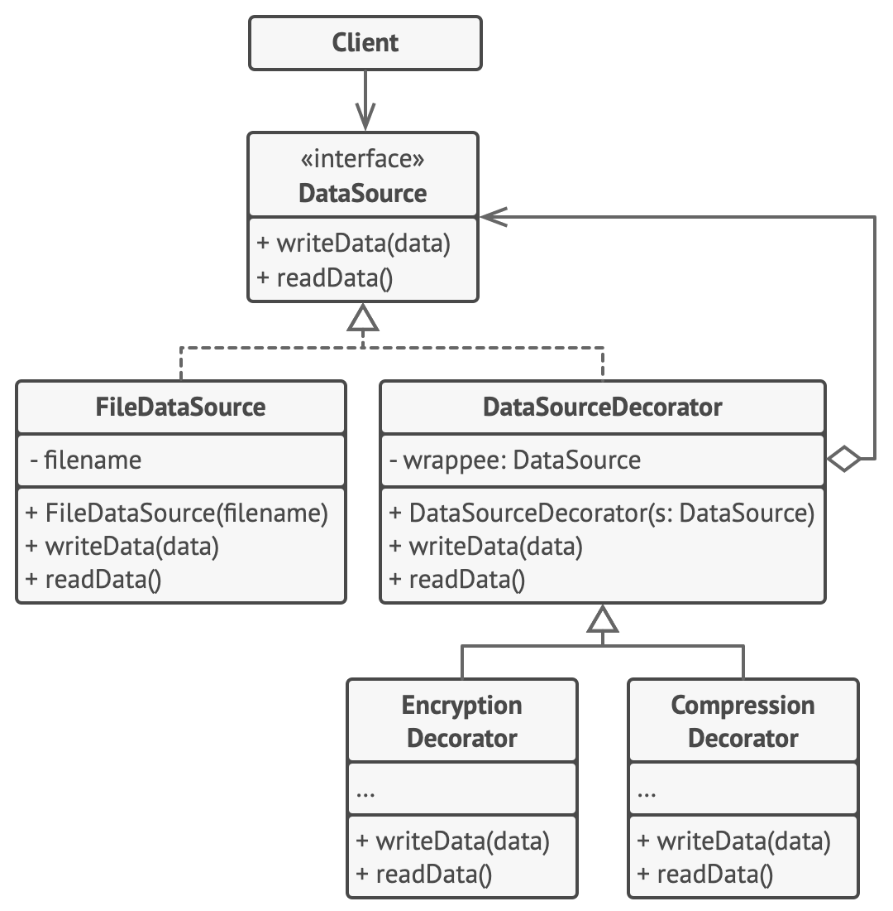

# Decorator Design Pattern

Decorator is a structural design pattern that lets you attach new behaviors to objects by placing these objects inside special wrapper objects that contain the behaviors.

# Problem

Imagine that you’re working on a notification library which lets other programs notify their users about important events.

* The initial version of the library was based on the Notifier class that had only a few fields, a constructor and a single send method. 
* The method could accept a message argument from a client and send the message to a list of emails that were passed to the notifier via its constructor. 
* A third-party app which acted as a client was supposed to create and configure the notifier object once, and then use it each time something important happened.


* At some point, many of the users would like to receive an SMS about critical issues. Others would like to be notified on Facebook and, of course, the corporate users would love to get Slack notifications.


* How hard can that be? You extended the Notifier class and put the additional notification methods into new subclasses. Now the client was supposed to instantiate the desired notification class and use it for all further notifications.

* But then someone reasonably asked you, “Why can’t you use several notification types at once? If your house is on fire, you’d probably want to be informed through every channel.”

* You tried to address that problem by creating special subclasses which combined several notification methods within one class. However, it quickly became apparent that this approach would bloat the code immensely, not only the library code but the client code as well.


* What are the problems with this approach?
    * Too hard to maintain all the subclasses.
    * Inheritance is static. You can’t alter the behavior of an existing object at runtime. You can only replace the whole object with another one that’s created from a different subclass.
    * Subclasses can have just one parent class. In most languages, inheritance doesn’t let a class inherit behaviors of multiple classes at the same time.

* One of the ways to overcome these caveats is by using **Aggregation or Composition**  instead of Inheritance. Both of the alternatives work almost the same way: one object has a reference to another and delegates it some work, whereas with inheritance, the object itself is able to do that work, inheriting the behavior from its superclass.
    * Aggregation : object A contains objects B; B can live without A.
    * Composition : object A consists of objects B; A manages life cycle of B; B can’t live without A.


## Structure



## Production Code

```csharp

//1. Define the Component Interface:
//This interface defines the common contract for both the core object and the decorators.
public interface INotifier
{
    void Send(string message);
}

//2. Create the concrete component
//This is the original object to which we want to add functionalities.
public class BasicNotifier : INotifier
{
    public void Send(string message)
    {
        Console.WriteLine($"Sending basic notification: {message}");
    }
}

//3. Create the Decorator Abstract Class:
//This abstract class acts as a base for all concrete decorators. It holds a reference to the component it decorates and implements the component interface by delegating the call to the wrapped component.
public abstract class NotifierDecorator : INotifier
{
    protected INotifier _notifier;

    public NotifierDecorator(INotifier notifier)
    {
        _notifier = notifier;
    }

    public virtual void Send(string message)
    {
        _notifier.Send(message);
    }
}

//4. Create Concrete Decorators:
//These classes inherit from the NotifierDecorator and add specific functionalities by overriding the Send method. They can add behavior before, after, or around the call to the wrapped component.

public class EmailDecorator : NotifierDecorator
{
    public EmailDecorator(INotifier notifier) : base(notifier) { }

    public override void Send(string message)
    {
        base.Send(message); // Call the wrapped object's Send method
        Console.WriteLine($"Sending email: {message}");
    }
}

public class SMSDecorator : NotifierDecorator
{
    public SMSDecorator(INotifier notifier) : base(notifier) { }

    public override void Send(string message)
    {
        base.Send(message); // Call the wrapped object's Send method
        Console.WriteLine($"Sending SMS: {message}");
    }
}

public class SlackDecorator : NotifierDecorator
{
    public SlackDecorator(INotifier notifier) : base(notifier) { }

    public override void Send(string message)
    {
        Console.WriteLine($"Sending Slack message: {message}");
        base.Send(message); // Call the wrapped object's Send method
    }
}

//5. Using the Decorators:
//Now, let's see how we can use these decorators to dynamically add functionalities to our BasicNotifier.

public class Program
{
    public static void Main(string[] args)
    {
        string message = "Hello, decorator pattern in action!";

        // Basic notification
        INotifier basicNotifier = new BasicNotifier();
        basicNotifier.Send(message);
        Console.WriteLine();

        // Notification with email
        INotifier emailNotifier = new EmailDecorator(new BasicNotifier());
        emailNotifier.Send(message);
        Console.WriteLine();

        // Notification with SMS
        INotifier smsNotifier = new SMSDecorator(new BasicNotifier());
        smsNotifier.Send(message);
        Console.WriteLine();

        // Notification with email and SMS
        INotifier emailAndSmsNotifier = new EmailDecorator(new SMSDecorator(new BasicNotifier()));
        emailAndSmsNotifier.Send(message);
        Console.WriteLine();

        // Notification with Slack and then email
        INotifier slackThenEmailNotifier = new EmailDecorator(new SlackDecorator(new BasicNotifier()));
        slackThenEmailNotifier.Send(message);
        Console.WriteLine();
    }
}

```


## Decorator vs Builder Pattern

In essence, the Decorator pattern is about enhancing an object's capabilities _after it has been created_, while the Builder pattern is about _managing the complex process of creating an object_. They address different problems in object-oriented design.

## Real-World Example: Stream Class in .NET
In .NET, the Stream class and its decorators (BufferedStream, CryptoStream, GZipStream) exemplify the Decorator Pattern. Streams provide a way to read/write data, and decorators add behaviors like buffering, compression, or encryption.

### How Stream Class Implements the Decorator Pattern
* Component Interface:
    * Stream is the base class that defines the contract for reading, writing, and seeking data.

* Concrete Component:
    * Examples include FileStream, MemoryStream, and NetworkStream. These are basic implementations of Stream.

* Decorator Classes:
    * BufferedStream: Adds buffering to enhance performance when accessing streams.
    * CryptoStream: Adds encryption/decryption when accessing streams.
    * GZipStream: Adds compression/decompression to a stream.

Example: Adding Compression to a FileStream Using GZipStream
Here’s an example of using GZipStream to compress data being written to a file:

```csharp
using System;
using System.IO;
using System.IO.Compression;

class Program
{
    static void Main(string[] args)
    {
        string filePath = "example.txt";
        string compressedFilePath = "example.gz";

        // Writing uncompressed data to a file
        using (var fileStream = new FileStream(filePath, FileMode.Create))
        using (var streamWriter = new StreamWriter(fileStream))
        {
            streamWriter.WriteLine("This is an example of the Decorator Pattern.");
            streamWriter.WriteLine("Streams can be decorated dynamically in .NET.");
        }

        // Compressing data using GZipStream
        using (var fileStream = new FileStream(filePath, FileMode.Open))
        using (var compressedFileStream = new FileStream(compressedFilePath, FileMode.Create))
        using (var gzipStream = new GZipStream(compressedFileStream, CompressionMode.Compress))
        {
            fileStream.CopyTo(gzipStream); // Compresses the file content
        }

        Console.WriteLine($"File compressed to {compressedFilePath}");

        // Decompressing and reading data using GZipStream
        using (var compressedFileStream = new FileStream(compressedFilePath, FileMode.Open))
        using (var gzipStream = new GZipStream(compressedFileStream, CompressionMode.Decompress))
        using (var streamReader = new StreamReader(gzipStream))
        {
            string decompressedContent = streamReader.ReadToEnd();
            Console.WriteLine("Decompressed Content:");
            Console.WriteLine(decompressedContent);
        }
    }
}

```
