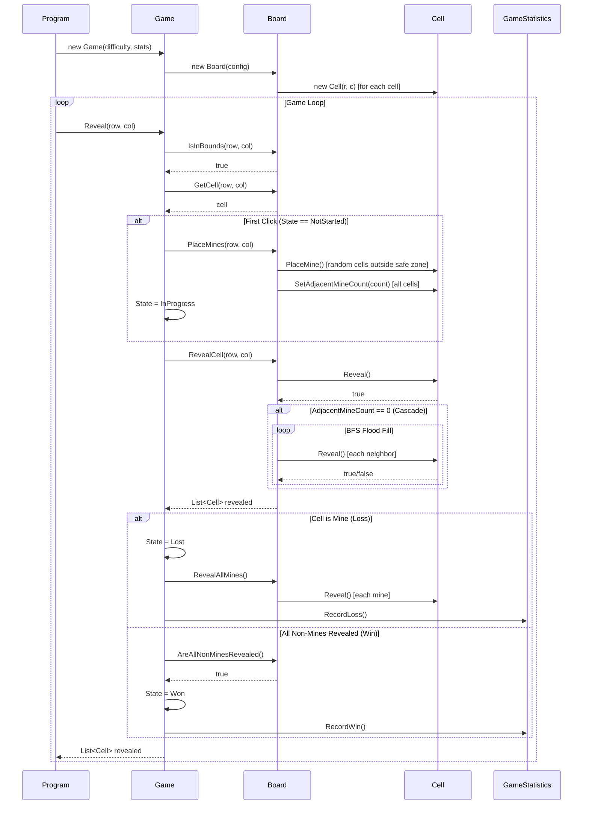
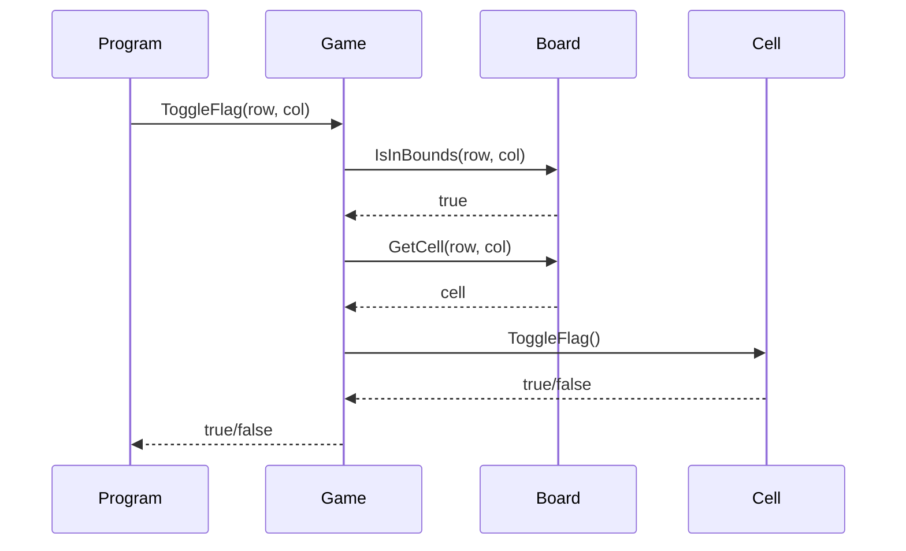
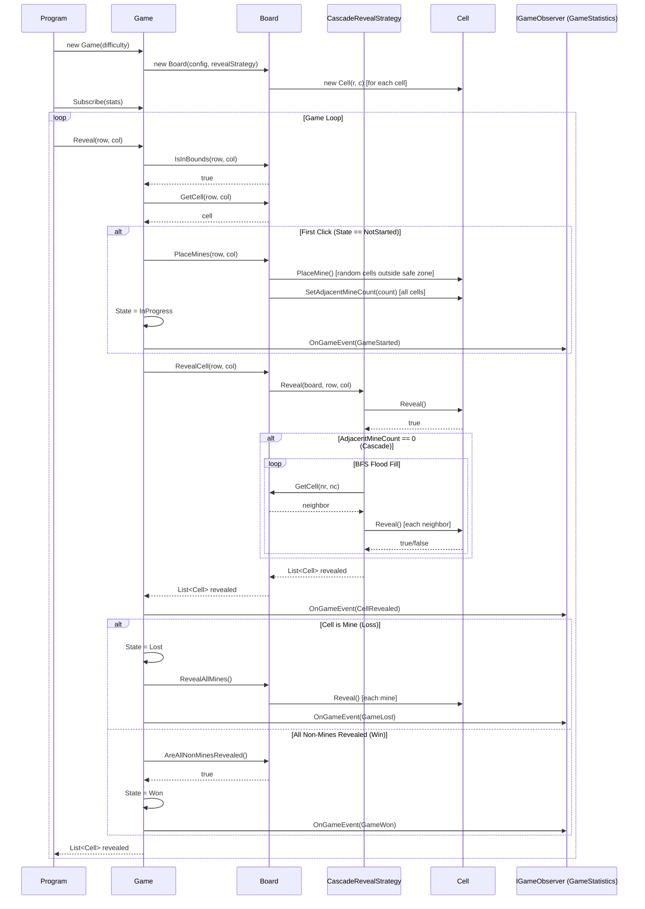

# MineSweeper — Low-Level Design Document

## Table of Contents

1. [Problem Statement](#1-problem-statement)
2. [Requirements](#2-requirements)
3. [Step 1 — Identify Core Entities](#step-1--identify-core-entities)
4. [Step 2 — Basic Design (No Patterns Yet)](#step-2--basic-design-no-patterns-yet)
5. [Step 3 — Introduce the Strategy Pattern for Reveal Logic](#step-3--introduce-the-strategy-pattern-for-reveal-logic)
6. [Step 4 — Introduce the Observer Pattern for Game Events](#step-4--introduce-the-observer-pattern-for-game-events)
7. [Final Class Diagram](#final-class-diagram)
8. [Sequence Diagrams](#sequence-diagrams)
9. [Key Design Decisions Summary](#key-design-decisions-summary)

---

## 1. Problem Statement

Design a console-based MineSweeper game that supports configurable difficulty, safe first-click, cascade reveal, flagging, win/loss detection, and cross-game statistics tracking. The design must be object-oriented, modular, extensible, and thread-safe.

---

## 2. Requirements

### Functional

| # | Requirement |
|---|-------------|
| F1 | Configurable board sizes and mine counts via difficulty presets (Easy, Medium, Hard) |
| F2 | First click is always safe (never a mine) |
| F3 | Revealing a zero-adjacent-mine cell triggers cascade reveal of neighbors |
| F4 | Players can flag/unflag cells to mark suspected mines |
| F5 | Flagged cells cannot be revealed until unflagged |
| F6 | Game detects a win when all non-mine cells are revealed |
| F7 | Game detects a loss when a mine is revealed |
| F8 | Statistics (games played, wins, losses) tracked across multiple games |

### Non-Functional

| # | Requirement |
|---|-------------|
| NF1 | OOP with clear separation of concerns |
| NF2 | Modular and extensible for future features |
| NF3 | Thread-safe for concurrent access |

---

## Step 1 — Identify Core Entities

Before writing any code, identify the nouns and behaviors from the requirements.

### Enums

| Enum | Values | Purpose |
|------|--------|---------|
| `Difficulty` | Easy, Medium, Hard | Selects board configuration preset |
| `CellState` | Hidden, Revealed, Flagged | Tracks the interaction state of a single cell |
| `GameState` | NotStarted, InProgress, Won, Lost | Tracks the lifecycle of a game session |

### Classes

| Class | Responsibility |
|-------|---------------|
| `Cell` | Represents a single cell. Knows its position, whether it's a mine, its adjacent mine count, and its current state (Hidden/Revealed/Flagged). Owns state transition logic (`Reveal()`, `ToggleFlag()`). |
| `Board` | Manages the 2D grid of `Cell` objects. Handles mine placement (with safe-zone exclusion), adjacency count calculation, and delegates reveal behavior. |
| `DifficultyConfig` | Value object that maps a `Difficulty` enum to concrete `(rows, columns, mineCount)` values. Encapsulates the preset definitions. |
| `Game` | Orchestrator. Manages game state transitions, enforces rules (can't act after game over, can't reveal flagged cells), handles first-click lazy mine placement, and coordinates between the board and external systems. |
| `GameStatistics` | Tracks wins, losses, and total games played across multiple game sessions. Persists across `Game` instances. |

### Relationships (Initial Mental Model)

```
Game  ──owns──▶  Board  ──owns──▶  Cell[,]
Game  ──uses──▶  GameStatistics
Board ──configured-by──▶  DifficultyConfig
```

---

## Step 2 — Basic Design (No Patterns Yet)

Start with the simplest correct design. No patterns — just clean OOP.

### Cell

```csharp
public sealed class Cell
{
    public int Row { get; }
    public int Column { get; }
    public bool IsMine { get; private set; }
    public int AdjacentMineCount { get; private set; }
    public CellState State { get; private set; }  // Hidden by default

    public void PlaceMine();
    public void SetAdjacentMineCount(int count);
    public bool Reveal();       // Hidden → Revealed; returns false if not Hidden
    public bool ToggleFlag();   // Hidden ↔ Flagged; returns false if Revealed
}
```

Thread-safety: Each mutation is protected by a `lock` since multiple threads could act on the same cell.

### DifficultyConfig

```csharp
public sealed class DifficultyConfig
{
    public int Rows { get; }
    public int Columns { get; }
    public int MineCount { get; }

    public static DifficultyConfig FromDifficulty(Difficulty difficulty);
    // Easy → (9, 9, 10), Medium → (16, 16, 40), Hard → (16, 30, 99)
}
```

Private constructor + static factory. This prevents invalid configs and keeps preset logic centralized.

### Board (v1 — reveal logic inline)

```csharp
public sealed class Board
{
    private readonly Cell[,] _grid;

    public Board(DifficultyConfig config);
    public Cell GetCell(int row, int col);
    public bool IsInBounds(int row, int col);
    public void PlaceMines(int safeRow, int safeCol);  // excludes safe zone
    public List<Cell> RevealCell(int row, int col);     // BFS cascade built-in
    public bool AreAllNonMinesRevealed();
    public void RevealAllMines();
}
```

`PlaceMines` is called lazily on the first click, receiving the clicked cell's coordinates. It builds a safe zone (the cell + its 8 neighbors) and places mines randomly outside that zone. This guarantees requirement F2.

`RevealCell` contains the BFS flood-fill: if the revealed cell has 0 adjacent mines, it enqueues neighbors and continues until all connected zero-regions (and their borders) are revealed.

### Game (v1 — direct dependency on GameStatistics)

```csharp
public sealed class Game
{
    private readonly Board _board;
    private readonly GameStatistics _statistics;

    public Game(Difficulty difficulty, GameStatistics statistics);
    public List<Cell> Reveal(int row, int col);
    public bool ToggleFlag(int row, int col);
}
```

### GameStatistics (v1 — standalone)

```csharp
public sealed class GameStatistics
{
    public void RecordWin();
    public void RecordLoss();
}
```

### Class Diagram — Step 2

```
┌─────────────────────┐       ┌──────────────────┐
│       Game           │──────▶│      Board        │
│                      │       │                   │
│ - _statistics        │       │ - _grid: Cell[,]  │
│ - State: GameState   │       │                   │
│                      │       │ + PlaceMines()    │
│ + Reveal()           │       │ + RevealCell()    │  ◄── BFS logic is HERE
│ + ToggleFlag()       │       │ + AreAllNonMines  │
└──────────┬───────────┘       │   Revealed()      │
           │                   └────────┬──────────┘
           ▼                            │ owns
┌──────────────────────┐       ┌────────▼──────────┐
│   GameStatistics     │       │       Cell         │
│                      │       │                    │
│ + RecordWin()        │       │ + Reveal()         │
│ + RecordLoss()       │       │ + ToggleFlag()     │
└──────────────────────┘       └────────────────────┘
```

### What's wrong with this design?

Two problems emerge when you think about extensibility:

1. **Reveal logic is hardcoded in `Board`.**
   If we want a different reveal behavior (e.g., single-cell-only mode, a power-up that reveals a radius, or a "safe reveal" that skips mines), we'd have to modify `Board.RevealCell()` directly. This violates the Open/Closed Principle.

2. **`Game` directly calls `GameStatistics`.**
   If we want to add more reactions to game events (logging, sound effects, UI notifications, achievements), we'd have to inject each one into `Game` and add explicit calls. `Game` becomes a god class that knows about every downstream consumer.

---

## Step 3 — Introduce the Strategy Pattern for Reveal Logic

### The Problem

The reveal algorithm (BFS cascade) is embedded inside `Board`. We want to support multiple reveal behaviors without modifying `Board`.

### Why Strategy Pattern?

| Pattern Considered | Verdict |
|--------------------|---------|
| **Strategy** ✅ | Encapsulates the reveal algorithm behind an interface. `Board` delegates to it. New behaviors = new classes, zero changes to `Board`. |
| Template Method | Would require `Board` to be abstract with a `DoReveal()` hook. But `Board` has many other responsibilities — forcing inheritance just for reveal logic is heavy-handed. We'd also lose the ability to swap strategies at runtime. |
| Command | Overkill here. Command is for encapsulating requests as objects (undo/redo, queuing). We don't need request history — we just need interchangeable algorithms. |
| Decorator | Could wrap reveal behavior, but the core problem is "which algorithm to use," not "add behavior around an existing algorithm." |

### The Interface

```csharp
public interface IRevealStrategy
{
    List<Cell> Reveal(Board board, int row, int col);
}
```

The strategy receives the `Board` so it can query cells and bounds. It returns the list of all cells it revealed.

### Default Implementation: CascadeRevealStrategy

```csharp
public sealed class CascadeRevealStrategy : IRevealStrategy
{
    public List<Cell> Reveal(Board board, int row, int col)
    {
        // 1. Reveal the target cell
        // 2. If adjacentMineCount == 0, BFS flood-fill neighbors
        // 3. Return all revealed cells
    }
}
```

This is the exact same BFS logic that was previously inside `Board.RevealCell()`, now extracted into its own class.

### Updated Board (v2)

```csharp
public sealed class Board
{
    private readonly IRevealStrategy _revealStrategy;

    public Board(DifficultyConfig config, IRevealStrategy? revealStrategy = null)
    {
        _revealStrategy = revealStrategy ?? new CascadeRevealStrategy();
        // ...
    }

    public List<Cell> RevealCell(int row, int col) =>
        _revealStrategy.Reveal(this, row, col);
}
```

`Board` no longer contains any reveal algorithm. It delegates entirely to the injected strategy. The default is `CascadeRevealStrategy` so existing callers don't break.

### Class Diagram — Step 3

```
                          ┌─────────────────────────┐
                          │    «interface»           │
                          │    IRevealStrategy       │
                          │                          │
                          │ + Reveal(Board, r, c)    │
                          └────────────▲─────────────┘
                                       │ implements
                          ┌────────────┴─────────────┐
                          │ CascadeRevealStrategy     │
                          │                           │
                          │ + Reveal(Board, r, c)     │
                          │   (BFS flood-fill)        │
                          └────────────▲──────────────┘
                                       │ delegates to
┌─────────────────────┐       ┌────────┴──────────┐
│       Game           │──────▶│      Board        │
│                      │       │                   │
│ - _statistics        │       │ - _revealStrategy │
│                      │       │                   │
│ + Reveal()           │       │ + RevealCell()────┘  (delegates)
│ + ToggleFlag()       │       │
└──────────┬───────────┘       └────────┬──────────┘
           │                            │ owns
           ▼                   ┌────────▼──────────┐
┌──────────────────────┐       │       Cell         │
│   GameStatistics     │       └────────────────────┘
└──────────────────────┘
```

### Extensibility Example

Want a single-cell reveal (no cascade)?

```csharp
public sealed class SingleCellRevealStrategy : IRevealStrategy
{
    public List<Cell> Reveal(Board board, int row, int col)
    {
        var cell = board.GetCell(row, col);
        return cell.Reveal() ? new List<Cell> { cell } : new List<Cell>();
    }
}

// Usage:
var game = new Game(Difficulty.Easy, new SingleCellRevealStrategy());
```

No changes to `Board`, `Game`, or `Cell`. Open/Closed Principle satisfied.

---

## Step 4 — Introduce the Observer Pattern for Game Events

### The Problem

`Game` directly calls `_statistics.RecordWin()` and `_statistics.RecordLoss()`. If we want to add more reactions to game events (a logger, an achievement tracker, a UI notifier), we'd have to:
- Add a field for each new dependency
- Add explicit calls in `Reveal()` and `ToggleFlag()`
- Modify `Game` every time a new consumer appears

This violates both the Open/Closed Principle and the Single Responsibility Principle.

### Why Observer Pattern?

| Pattern Considered | Verdict |
|--------------------|---------|
| **Observer** ✅ | `Game` (Subject) publishes events. Any number of observers subscribe and react independently. Adding a new observer = zero changes to `Game`. |
| Mediator | Useful when multiple objects need to communicate with each other (many-to-many). Here it's one-to-many: `Game` → multiple listeners. Observer is simpler and more direct. |
| Event Bus / Message Queue | Adds indirection and infrastructure. For an in-process game, Observer is sufficient. An event bus would be warranted in a distributed or plugin-based system. |
| Direct Dependency Injection | What we had in Step 2. Doesn't scale — `Game` constructor grows with every new consumer. |

### The Interface

```csharp
public enum GameEventType
{
    GameStarted,
    CellRevealed,
    CellFlagged,
    GameWon,
    GameLost
}

public interface IGameObserver
{
    void OnGameEvent(GameEventType eventType);
}
```

A single method with an event type enum keeps the interface simple. If events need payload data in the future, this can evolve to `OnGameEvent(GameEvent event)` with a base class.

### GameStatistics (v2 — now an Observer)

```csharp
public sealed class GameStatistics : IGameObserver
{
    public void OnGameEvent(GameEventType eventType)
    {
        switch (eventType)
        {
            case GameEventType.GameWon:
                _gamesPlayed++; _wins++;
                break;
            case GameEventType.GameLost:
                _gamesPlayed++; _losses++;
                break;
            // Ignores other events — that's fine
        }
    }
}
```

`GameStatistics` no longer has `RecordWin()`/`RecordLoss()` methods called by `Game`. It reacts to events it cares about and ignores the rest.

### Updated Game (v2 — Subject)

```csharp
public sealed class Game
{
    private readonly List<IGameObserver> _observers = new();

    public void Subscribe(IGameObserver observer);
    public void Unsubscribe(IGameObserver observer);
    private void NotifyObservers(GameEventType eventType);

    public Game(Difficulty difficulty, IRevealStrategy? revealStrategy = null)
    {
        // No more GameStatistics in constructor
    }

    public List<Cell> Reveal(int row, int col)
    {
        // ... on first click:
        NotifyObservers(GameEventType.GameStarted);

        // ... after reveal:
        NotifyObservers(GameEventType.CellRevealed);

        // ... on mine hit:
        NotifyObservers(GameEventType.GameLost);

        // ... on all non-mines revealed:
        NotifyObservers(GameEventType.GameWon);
    }
}
```

`NotifyObservers` takes a snapshot of the observer list before iterating, so observers can safely subscribe/unsubscribe during notification without causing concurrent modification issues.

### Wiring (in Program.cs)

```csharp
var stats = new GameStatistics();

var game = new Game(Difficulty.Easy);
game.Subscribe(stats);   // stats reacts to GameWon / GameLost
```

### Extensibility Example

Want to add logging?

```csharp
public sealed class GameLogger : IGameObserver
{
    public void OnGameEvent(GameEventType eventType)
    {
        Console.WriteLine($"[LOG] {DateTime.Now}: {eventType}");
    }
}

game.Subscribe(new GameLogger());
```

Zero changes to `Game`, `Board`, or `GameStatistics`.

---

## Final Class Diagram

```
┌──────────────────────────────────────────────────────────────────────────────┐
│                              ENUMS                                           │
│                                                                              │
│  Difficulty { Easy, Medium, Hard }                                           │
│  CellState  { Hidden, Revealed, Flagged }                                    │
│  GameState  { NotStarted, InProgress, Won, Lost }                            │
│  GameEventType { GameStarted, CellRevealed, CellFlagged, GameWon, GameLost } │
└──────────────────────────────────────────────────────────────────────────────┘

┌──────────────────────┐
│   DifficultyConfig   │
│                      │
│ + Rows: int          │
│ + Columns: int       │
│ + MineCount: int     │
│                      │
│ + FromDifficulty()   │
└──────────┬───────────┘
           │ configures
           ▼
┌──────────────────────────┐         ┌──────────────────────────┐
│         Board            │────────▶│    «interface»           │
│                          │delegates│    IRevealStrategy       │
│ - _grid: Cell[,]         │         │                          │
│ - _revealStrategy        │         │ + Reveal(Board, r, c)    │
│                          │         └──────────▲───────────────┘
│ + GetCell(r, c)          │                    │ implements
│ + IsInBounds(r, c)       │         ┌──────────┴───────────────┐
│ + PlaceMines(safeR, C)   │         │ CascadeRevealStrategy    │
│ + RevealCell(r, c)───────┘         │                          │
│ + AreAllNonMinesRevealed()         │ BFS flood-fill algorithm │
│ + RevealAllMines()       │         └──────────────────────────┘
└──────────┬───────────────┘
           │ owns
           ▼
┌──────────────────────────┐
│          Cell            │
│                          │
│ + Row, Column: int       │
│ + IsMine: bool           │
│ + AdjacentMineCount: int │
│ + State: CellState       │
│                          │
│ + PlaceMine()            │
│ + Reveal(): bool         │
│ + ToggleFlag(): bool     │
└──────────────────────────┘

┌──────────────────────────┐         ┌──────────────────────────┐
│          Game            │────────▶│    «interface»           │
│       (Subject)          │notifies │    IGameObserver         │
│                          │         │                          │
│ - _board: Board          │         │ + OnGameEvent(type)      │
│ - _observers: List<>     │         └──────────▲───────────────┘
│ - State: GameState       │                    │ implements
│                          │         ┌──────────┴───────────────┐
│ + Subscribe(observer)    │         │    GameStatistics        │
│ + Unsubscribe(observer)  │         │                          │
│ + Reveal(r, c)           │         │ + GamesPlayed: int       │
│ + ToggleFlag(r, c)       │         │ + Wins: int              │
└──────────────────────────┘         │ + Losses: int            │
                                     │                          │
                                     │ + OnGameEvent(type)      │
                                     └──────────────────────────┘
```

---

## Sequence Diagrams

### SimpleMineSweeper — Reveal Flow

In the simple version, `Game` directly owns `GameStatistics` and calls `RecordWin()`/`RecordLoss()`. The BFS cascade logic lives inside `Board.RevealCell()`.



### SimpleMineSweeper — Flag Flow



### CompleteMineSweeper — Reveal Flow

In the complete version, `Game` uses the Observer pattern to notify subscribers (like `GameStatistics`) and the Strategy pattern to delegate reveal logic to `IRevealStrategy` (default: `CascadeRevealStrategy`).



### CompleteMineSweeper — Flag Flow


---

## Key Design Decisions Summary

| Decision | Pattern | Why This Over Alternatives |
|----------|---------|---------------------------|
| Reveal behavior is pluggable | **Strategy** | Encapsulates algorithm behind interface. Avoids inheritance (Template Method) and unnecessary request wrapping (Command). New reveal modes = new class, zero changes to Board. |
| Game events are broadcast to listeners | **Observer** | Decouples Game from all downstream consumers. Avoids constructor bloat (DI of each consumer) and over-engineering (Mediator, Event Bus). New listener = new class + `Subscribe()`. |
| Mine placement deferred to first click | **Lazy Initialization** | Guarantees first-click safety (F2) without pre-generating and re-shuffling boards. |
| DifficultyConfig uses static factory | **Factory Method** | Private constructor prevents invalid configs. Centralizes preset definitions. Easy to add custom difficulty later. |
| Cell/Game/GameStatistics use locks | **Monitor Pattern** | Simplest correct thread-safety for in-process concurrency (NF3). No need for lock-free structures at this scale. |
| NotifyObservers snapshots the list | **Defensive Copy** | Prevents concurrent modification if an observer subscribes/unsubscribes during notification. Standard practice in Observer implementations. |

---

### How to Approach This in an Interview

1. **Start with requirements.** Clarify functional and non-functional. Write them down.
2. **Identify entities.** Nouns → classes. Verbs → methods. States → enums.
3. **Build the simplest correct design first.** No patterns. Just clean OOP with SRP.
4. **Identify pain points.** Where does the design violate Open/Closed? Where is coupling too tight?
5. **Apply patterns surgically.** One pattern per pain point. Justify why *this* pattern over alternatives.
6. **Draw the class diagram.** Show relationships, interfaces, and delegation.
7. **Discuss thread-safety last.** It's a cross-cutting concern — mention where locks are needed and why.

The key insight interviewers look for: **don't start with patterns**. Start with a working design, then evolve it. Every pattern should solve a specific, articulable problem.
