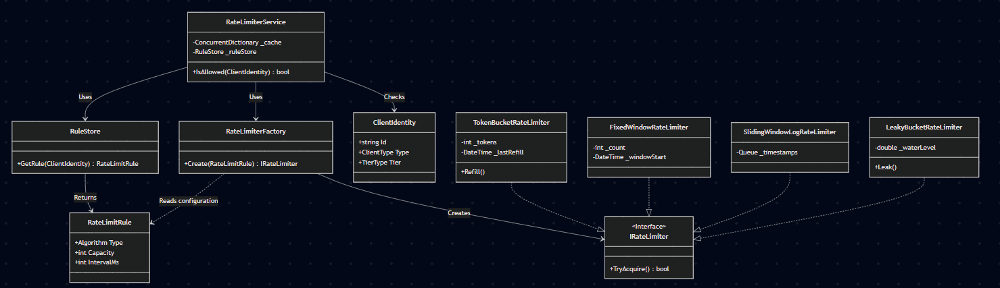

# Rate Limiting Algorithms

## 1. Token Bucket

 - This is the industry standard (used by Amazon and Stripe) because it balances flexibility with control.

 - **How it works:** You have a bucket of tokens. Each request takes a token. Tokens refill over time.
 
 - **Pros:**

	- **Allows Bursts:** If a user has been inactive, their bucket fills up. They can make a rapid burst of requests (up to _bucketLimit) without being blocked. This is great for user experience (e.g., loading a dashboard).
	- **Efficient:** Very low memory and CPU usage.

 - **Cons:** Slightly more complex to implement than Fixed Window.

 - **Use Case:** Most public APIs where you want to allow legitimate users to burst occasionally but cap their long-term average.

 - **Implementation:**
 
```csharp
    public bool TryAcquire()
    {
        lock (_lock)
        {
            Refill();

            //if the user has enough tokens to process the request
            if (_tokens > 0)
            {
                //process the request
                _tokens--;
                return true;
            }
            return false;
        }
    }

    public void Refill()
    {
        var now = DateTime.UtcNow;
        var elapsedTime = (now - _lastRefillTime).TotalMilliseconds;
        if (elapsedTime >= _refillIntervalMs)
        {
            // 1. Calculate how many full refill cycles have passed
            // Casting to int automatically floors the value (e.g., 2.5 cycles becomes 2)
            int cyclesPassed = (int)(elapsedTime / _refillIntervalMs);

            // 2. Calculate tokens to add
            int tokensToAdd = (int)(cyclesPassed * _tokensToRefillPerRefillCycle);

            if (tokensToAdd > 0)
            {
                // 3. Add tokens, clamping to the bucket limit
                _tokens = Math.Min(_bucketLimit, _tokens + tokensToAdd);
                //_lastRefillTime = now;
                _lastRefillTime.AddMilliseconds(cyclesPassed * _refillIntervalMs);
            }
        }
    }
```
 - **Key Logic Changes Explained**
    - **cyclesPassed Calculation:** Instead of multiplying time, we divide elapsedTime / _refillIntervalMs. 
                              If your interval is 1000ms and 2500ms have passed, cyclesPassed is 2.

    - **Time Drift Prevention:**
      1. If we set _lastRefillTime = DateTime.UtcNow, we lose the extra 500ms from the example above (2500ms elapsed vs 2000ms 
                                accounted for).
      2. By doing _lastRefillTime.AddMilliseconds(cyclesPassed * _refillIntervalMs), that "remainder" 500ms stays in the 
    calculation for the next call, ensuring your rate is mathematically precise over long periods.


## 2. Leaky Bucket

Think of this as a funnel. No matter how much water you pour in at the top, it comes out the bottom at a steady, constant trickle.

 - **How it works:** Requests enter a queue (bucket). They are processed (leaked) at a constant rate. If the queue is full, new requests are dropped.
 - **Pros:**
   - **Smooths Traffic:** It forces a constant outflow rate. This protects downstream services (like your database) from getting hammered by spikes.
 - **Cons:**
   - **"Lag" Perception:** If the bucket is full, valid requests might be rejected immediately even if the server is currently idle, because the leak rate is fixed.

 - **Use Case:** Background job processing, writing to databases with limited IOPS, or any system that needs a stable, predictable load.

 - **Implementation:**

```csharp
    public bool TryAcquire()
    {
        lock (_lock)
        {
            Leak();

            // Check if adding 1 unit of water would overflow the bucket
            if ((_currentWaterLevel + 1) <= _maxBucketCapacity)
            {
                // Add the request (water) to the bucket
                _currentWaterLevel++;
                return true;
            }
            // Bucket is full (Overflow)
            return false;
        }        
    }

    public void Leak()
    {
        // Step 1: Calculate how much time has passed
        var now = DateTime.UtcNow;
        var elapsedTime = (now - _lastLeakTime).TotalMilliseconds;

        if (elapsedTime <= 0)
            return;

        // Step 2: Calculate the "Leak Rate" per millisecond
        // We cast to double to ensure floating-point precision
        double leakRatePerMs = (double)_outflowTokens / _leakIntervalMs;

        // Step 3: Calculate total water to drain based on elapsed time
        double waterToDrain = elapsedTime * leakRatePerMs;

        // Step 4: Apply the leak (Drain the water)
        // We ensure the water level never drops below zero
        if (waterToDrain > 0)
        {
            _currentWaterLevel = _currentWaterLevel - waterToDrain;

            // Handle the "Empty Bucket" edge case
            if (_currentWaterLevel < 0)
            {
                _currentWaterLevel = 0;

            }

            // Step 5: Update the timestamp
            // Since we use 'double' for water level (continuous flow), 
            // we can safely set the last leak time to 'now'.
            _lastLeakTime = now;
        }
    }
```

## 3. Fixed Window Counter
The simplest approach. "You get 100 requests between 12:00 and 12:01."

 - **How it works:** A counter increments for the current time window. At the start of the next window, the counter resets to 0.

 - **Pros:** Easiest to implement and debug. Lowest memory footprint.

 - **Cons:**

   - **Boundary Issue:** If a user makes 100 requests at 12:00:59 and 100 more at 12:01:01, they have made 200 requests in 2 seconds, effectively doubling the allowed rate for that brief period.

 - **Use Case:** Basic rate limiting where strict precision isn't required, or for internal services where you trust the clients.
 - **Implementation:**

```csharp
    public bool TryAcquire()
    {
        lock (_lock)
        {
            var now = DateTime.UtcNow;
            var elapsedTime = (now - _windowStartTime).TotalMilliseconds;

            //if elapsedTime is more than the window size then reset the start time and the count
            if (elapsedTime >= _windowSizeInMs)
            {
                _windowStartTime = now;
                _requestsMade = 0;
            }

            if (_requestsMade < _requestsAllowedPerWindow)
            {
                _requestsMade++;
                return true;
            }
            return false;
        }
    }
```

## 4. Sliding Window Log
The most accurate but most expensive approach.
 - **How it works:** Keeps a log (queue) of timestamps for every request. Removes timestamps older than the window.
 - **Pros:**
   - **100% Accurate:** No "boundary issues." It strictly enforces the limit over any rolling time window.

 - **Cons:**
   - **Memory Heavy:** Stores a timestamp for every request. If you allow 1 million requests/hour, you need to store 1 million timestamps per user.
   - **Slow Cleanup:** Iterating through the queue to remove old timestamps can be slow under high load.

 - **Use Case:** Security-critical limits with low volume, such as "Max 5 failed login attempts per minute" or "Max 10 OTP requests per day."

 - **Implementation:**

```csharp
    private Queue<DateTime> _requestTimeStamps = new Queue<DateTime>();

    public bool TryAcquire()
    {
        lock (_lock)
        {
            var now = DateTime.UtcNow;
            while (_requestTimeStamps.Count > 0 && ((now - _requestTimeStamps.Peek()).TotalMilliseconds > _windowSizeInMs))
            {
                _requestTimeStamps.Dequeue();
            }

            if (_requestTimeStamps.Count < _requestsAllowedPerWindow)
            {
                _requestTimeStamps.Enqueue(now);
                return true;
            }
            return false;
        }
    }
```

## Quick Comparison Table

| Algorithm | Mechanism | Burst Handling | Memory Usage | Accuracy | Best For |
| :--- | :--- | :--- | :--- | :--- | :--- |
| **Token Bucket** | Tokens refill at set rate | ✅ **Excellent** (Allows bursts up to capacity) | Low ($O(1)$) | High | **General Purpose APIs** (User-centric) |
| **Leaky Bucket** | Queue drains at constant rate | ⚠️ **Strict** (Smooths bursts into constant flow) | Low ($O(1)$) | High | **Traffic Shaping** (Protecting Databases/Background Jobs) |
| **Fixed Window** | Counter resets every window | ❌ **Poor** (Can allow 2x limit at boundaries) | Lowest ($O(1)$) | Medium | **Basic DDoS Protection** / Low priority services |
| **Sliding Log** | Tracks every request timestamp | ✅ **Good** (Accurate rolling window) | High ($O(N)$) | **Perfect** | **Strict, Low-Volume APIs** (e.g., "3 failed logins per hour") |

## Recommendation
- **Default Choice:** Start with **Token Bucket**. It handles user behavior best.

- **Strict Protection:** Use **Leaky Bucket** if you are protecting a fragile downstream resource (like a legacy database).

- **Strict Rules:** Use **Sliding Window Log** only for low-volume, high-precision rules (like login attempts).



```csharp
    enum ClientType{
		User, Service, IP
	}

	enum TierType{
		FREE, PREMIUM, INTERNAL
	}

	class ClientIdentity{
		string Id {get; set;}
		ClientType clientType {get; set;}
		TierType tier{get; set;}

		public override string ToString() => return $"{clientType:tierType}";
	}

	class RateLimitRule
	{
		public RateLimitAlgorithm RateLimitAlgorithm { get; set; }

		/* Algorithm specific properties */
		public int TokensToRefillPerRefillCycle { get; set; } 
		public int RefillIntervalMs { get; set; }
		public int BucketLimit { get; set; }
		public int RequestsAllowedPerWindow { get; set; }
		public int WindowSizeInMs { get; set; }
		public int outflowTokens { get; set; }
		public int leakIntervalMs { get; set; }
	}

	class RuleStore {
		//We can get the rules from Db or some other data-stores
		public RateLimitRule? GetRule(ClientIdentity client)
		{
			// Example logic: Different rules for different Tiers and Types
			if (client.ClientType == ClientType.IP)
				return new RateLimitRule { RateLimitAlgorithm = RateLimitAlgorithm.FixedWindow, RequestsAllowedPerWindow = 10, WindowSizeInMs = 1000 };

			return client.Tier switch
			{
				TierType.Premium => new RateLimitRule { RateLimitAlgorithm = RateLimitAlgorithm.TokenBucket, BucketLimit = 1000, TokensToRefillPerRefillCycle = 10, RefillIntervalMs = 100 },
			};
		}
	}

	class RateLimitFactory {
	    public static IRateLimiter Create(RateLimitRule rule)
		{
			return rule.RateLimitAlgorithm switch
			{
				RateLimitAlgorithm.TokenBucket => new TokenBucketRateLimiter(tokensToRefillPerRefillCycle: rule.TokensToRefillPerRefillCycle, refillIntervalMs: rule.RefillIntervalMs, bucketLimit: rule.BucketLimit),
				RateLimitAlgorithm.LeakyBucket => new LeakyBucketRateLimiter(outflowTokens: rule.outflowTokens, leakIntervalMs: rule.leakIntervalMs, bucketLimit: rule.BucketLimit),
				RateLimitAlgorithm.FixedWindow => new FixedWindowRateLimiter(requestsAllowedPerWindow: rule.RequestsAllowedPerWindow, windowSizeInMs: rule.WindowSizeInMs),
				RateLimitAlgorithm.SlidingWindow => new SlidingWindowLogRateLimiter(requestsAllowedPerWindow: rule.RequestsAllowedPerWindow, windowSizeInMs: rule.WindowSizeInMs),
				_ => throw new NotImplementedException()
			};
		}

	}

	class Service{
		ConcurrentDictionary<string, IRateLimiter> _cache;
		RuleStore _ruleStore
		Service(ruleStore) : _ruleStore;

		bool IsAllowed(ClientIdentity client)
		{
			string key = client.ToString();

			IRateLimiter rateLimiter = _cache.GetOrAdd(key, _ =>
			{
				// This lambda only runs if the key doesn't exist
				var rule = _ruleStore.GetRule(client);
				return RateLimiterFactory.Create(rule);
			});

			return rateLimiter.TryAcquire();
		}
	}

	class client{
		RuleStore store = new();
		RateLimiterService service = new(store);

		var freeUser = new ClientIdentity { Id = "user_123", ClientType = ClientType.User, Tier = TierType.Free };
        service.IsAllowed(freeUser);
	}
```
