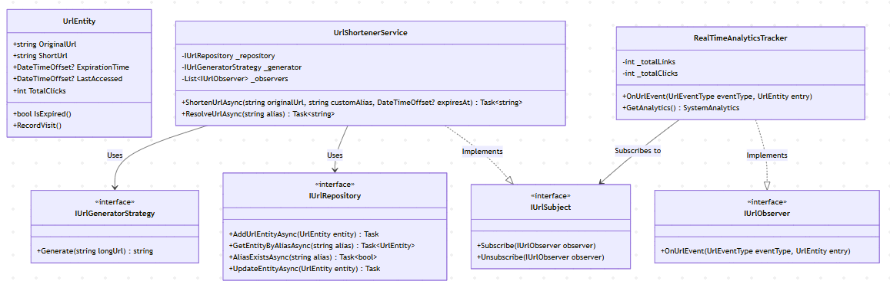

# URL Shortener System

A highly concurrent, object-oriented URL Shortener engine built in C#. This system is designed to handle high-throughput read/write operations while providing real-time analytics using advanced multithreading and design patterns.

Whether the system is processing a steady stream of internal corporate links or surviving a massive traffic spike from a viral social media marketing campaign, the architecture ensures absolute data integrity, minimal latency, and zero deadlocks.

---

## 1. Requirements

### Functional Requirements

- **Short Link Generation:** Automatically generate a unique, highly compact short URL for any given long URL to save character space and improve shareability.
- **Custom Aliases:** Allow users to optionally specify a custom alias (e.g., converting a messy URL into something readable like `my-brand.co/spring-sale-2024`).
- **Expirations:** Allow users to define optional expiration dates for short URLs, perfect for time-sensitive promotions or temporary file sharing.
- **Redirection:** Redirect users to the original long URL seamlessly when the short URL is accessed, while gracefully denying access to expired links (e.g., returning a friendly "Link Expired" page or a `410 Gone` status).
- **Conflict Handling:** Handle URL conflicts gracefully when a custom alias is already taken by prompting the user to select another, without throwing unhandled application errors.
- **Analytics Tracking:** Track the exact number of times a short URL has been visited, capture the last accessed timestamp, and maintain a high-level, system-wide tally of active links and total clicks for administrative dashboards.

### Non-Functional Requirements

- **Uniqueness:** Each short URL (including custom aliases) must be strictly unique across the system to prevent disastrous misdirection of user traffic.
- **Extensibility:** The design must be flexible enough to support future enhancements. For instance, the system should allow developers to seamlessly swap out the URL generation algorithm or migrate the underlying database without altering the core business logic.
- **Maintainability:** Code should follow strict object-oriented principles (SOLID), featuring clean abstractions, dependency injection, and clear separation of concerns to make unit testing trivial.
- **Concurrency & Thread Safety:** The system must survive a web-server environment with thousands of simultaneous requests (the "thundering herd" problem) without crashing, deadlocking, or losing critical analytical data.

---

## 2. Core Entities

The system centers around a core domain model supported by clear abstractions. By employing a "Rich Domain Model" rather than an anemic one, business rules remain tightly coupled to the data they govern:

- **`UrlEntity`:** The primary domain model representing the URL mapping. It encapsulates its own internal state (managing the logic for checking its own expiration via `IsExpired()`) and safely tracks its own analytics (`TotalClicks`, `LastAccessed`) to prevent external classes from tampering with its properties.
- **`SystemAnalytics`:** A Data Transfer Object (DTO) providing a read-only snapshot of system-wide metrics (`TotalLinks`, `TotalClicks`, `ActiveLinks`). This prevents the UI or API layers from accidentally modifying the raw analytical data.
- **Custom Exceptions:** Domain-specific errors that enforce business rules without leaking internal state or stack traces to the end-user (e.g., `AliasAlreadyTakenException`, `UrlExpiredException`, `UrlNotFoundException`).

---

## 3. Architecture & Class Diagram

The system heavily relies on several Gang of Four (GoF) design patterns to guarantee that the application remains loosely coupled and highly cohesive:

- **Strategy Pattern (`IUrlGeneratorStrategy`):** Abstracts the URL generation algorithm. This allows the system to easily toggle between a Random Token generator (for unpredictable links) and a Counter-based Base62 generator (for sequential, guaranteed-unique links) via dependency injection.
- **Repository Pattern (`IUrlRepository`):** Abstracts the entire data access layer. Because the core service only speaks to the `IUrlRepository` interface, the current in-memory dictionary implementation can be swapped for a distributed Redis cache or a persistent SQL Server database later with zero changes to the service layer.
- **Observer Pattern (`IUrlSubject` / `IUrlObserver`):** Completely decouples the core URL shortening service from the analytics processing engine. It broadcasts events (`UrlCreated`, `UrlVisited`) so that analytics can be processed asynchronously without forcing the end-user to wait.


---

## 4. Implementation Details

### 4.1 The Non-Concurrent Approach (The Pitfalls)

In a standard, single-threaded implementation, a naive approach might use:

- A standard `Dictionary<string, UrlEntity>` for storage.
- `_totalClicks++` to record visits.
- A standard `foreach` loop to notify observers synchronously.

**Why this fails catastrophically in production:**

If multiple web requests hit the server simultaneously, a standard `Dictionary` will corrupt. For example, if Thread A triggers the internal array to resize while Thread B is inserting a value, the application will throw a fatal `InvalidOperationException` and crash the request.

Furthermore, concurrent clicks will overwrite each other because `++` is not an atomic operation (it involves reading the value, incrementing it in memory, and writing it back). If two threads read `100` at the same time, both will write `101`, resulting in permanently lost analytics.

Finally, iterating over observers synchronously means if an analytics database write is slow, the user is left staring at a loading screen instead of being redirected.

### 4.2 The Concurrent Implementation (The Robust Solution)

To make the system bulletproof, thread-safe, and highly performant, the following concurrency mechanisms are utilized:

- **`ConcurrentDictionary`:** Used in the `InMemoryUrlRepository`. Methods like `TryAdd` guarantee thread safety via fine-grained locking. If two users request the exact same custom alias simultaneously, the dictionary ensures only one succeeds, rejecting the other cleanly.
- **`Interlocked.Increment(ref _totalClicks)`:** Used inside the `UrlEntity`. This forces a CPU-level lock (often implemented via a hardware `LOCK` instruction prefix) during the math operation. This guarantees that if 10,000 users click a viral link at the exact same millisecond, exactly 10,000 clicks are perfectly recorded with zero lost data.
- **Internal Mutex (`lock`):** Used in the `RealTimeAnalyticsTracker` to protect internal state variables from race conditions while processing incoming system events across multiple threads.

---

### 4.3. ShortenUrl Flow

```csharp

public async Task<string> ShortenUrlAsync(string longUrl, string? customAlias = null, DateTimeOffset? expirationTime = null)
{
    // 1. Check if any customAlias has been provided.
    //  -> If Yes then check if it's available.
    //  ->                   If not available return custom error
    //  ->                   If available then use this as short url

    string aliasToUse;

    if (!string.IsNullOrWhiteSpace(customAlias))
    {
        if (await _repository.AliasExistsAsync(customAlias))
            throw new AliasAlreadyTakenException(customAlias);

        aliasToUse = customAlias;
    }
    else
    {   // 2. Generate a unique short code.
        //    Note we do this in a loop
        //    because there is a small chance that the generated
        //    url might not be unique.
        int maxRetries = 5;
        do
        {
            aliasToUse = _generatorStrategy.Generate(longUrl);
            maxRetries--;
            if (maxRetries == 0) throw new Exception("Failed to generate a unique alias.");
        } while (await _repository.AliasExistsAsync(aliasToUse));
    }

    // 3. Create the entity and store in repository
    var urlEntity = new UrlEntity(originalUrl: longUrl, shortUrl: aliasToUse, expirationTime: expirationTime);
    await _repository.AddUrlEntityAsync(urlEntity);

    // CLASSIC OBSERVER: Notify all attached observers
    NotifyObservers(UrlEventType.UrlCreated, urlEntity);

    return aliasToUse;
}
```
### 4.4. ResolveUrl Flow

```csharp
public async Task<string> ResolveUrlAsync(string alias)
{
    var entity = await _repository.GetEntityByAliasAsync(alias);
    if (entity == null) throw new UrlNotFoundException(alias);
    if (entity.IsExpired()) throw new UrlExpiredException(alias);

    entity.RecordVisit();
    await _repository.UpdateEntityAsync(entity);
    
    // CLASSIC OBSERVER: Notify all attached observers
    NotifyObservers(UrlEventType.UrlVisited, entity);
    
    return entity.OriginalUrl;
}
```

---

## 5. The Notification Pattern (Observer)

To calculate system-wide analytics without bogging down the main database with expensive *O(N)* table scans, we use a Classic Observer Pattern. The `UrlShortenerService` triggers events when a URL is created or visited.

To prevent a slow observer (like an external email service, a logging framework, or a database write) from freezing the main web application thread, we utilize a **Snapshot + Fire-and-Forget** methodology.

### Fire-and-Forget with `Task.Run()`

Inside the subject, we iterate over our observers and push the execution to a background thread pool. This queues the work item in the .NET `ThreadPool`, allowing the primary web request thread to complete its HTTP response immediately and redirect the user without waiting for the analytics to finish saving.

```csharp
foreach (var observer in snapshot)
{
    // Fire and forget! The main thread moves on instantly.
    Task.Run(() => 
    {
        try { observer.OnUrlEvent(urlEventType, entity); }
        catch (Exception ex) { /* Isolate failures so they don't crash other observers */ }
    });
}
```

### Q: Since we used `Task.Run()`, do we still need the snapshot?

**Yes, you still absolutely need the snapshot.**

Here is the exact reason why: `Task.Run()` pushes the execution of the observer's callback to a background thread, but the `foreach` loop itself still iterates over the `_observers` list synchronously on the current thread.

If you write it like this without taking a snapshot first:

```csharp
foreach (var observer in _observers) // <-- The main thread is iterating here
{
    Task.Run(() => observer.OnUrlEvent(urlEventType, entity));
}
```

If another user or system process triggers `Subscribe()` or `Unsubscribe()` while that `foreach` loop is halfway through reading the list, .NET will instantly throw an `InvalidOperationException: Collection was modified; enumeration operation may not execute`.

**The Snapshot Guarantee:**

By taking the snapshot inside the lock first, you are iterating over a completely isolated, private copy of the list. It guarantees that no matter how many other threads are dynamically adding or removing observers in the background, your `foreach` loop will safely complete its iteration over the immutable copy without crashing.

---

## 6. Other Architectural Notes

- **Lazy Expiration vs. Active Polling:** Rather than running a costly background worker thread that continuously scans the database and deletes expired URLs (which wastes CPU cycles and creates database contention), the system evaluates expiration lazily (`IsExpired()`). The system discovers a link is expired at the exact moment a user attempts to resolve it, instantly rejecting the request and optionally triggering a cleanup.
- **Counter-Based Base62 Generator:** The system includes a generator strategy that utilizes a thread-safe incrementing `long` counter (`Interlocked.Increment`) combined with Base62 encoding (`A-Z`, `a-z`, `0-9`). Base62 is deliberately chosen over Base64 because it avoids URL-unsafe characters like `+` and `/`. This strategy guarantees mathematically zero collisions on a single instance, bypassing the need for expensive do-while database retry loops entirely.

```csharp
public class CounterBasedBase62UrlGeneratorStrategy : IUrlGeneratorStrategy
{
    private const string _allowedCharacters = "abcdefghijklmnopqrstuvwxyzABCDEFGHIJKLMNOPQRSTUVWXYZ0123456789";
    private long _counter = 1;

    public string Generate(string longUrl)
    {
        // Atomically increment the counter for thread safety
        long id = Interlocked.Increment(ref _counter);
        return EncodeBase62(id);
    }

    private string EncodeBase62(long id)
    {
        if (id == 0) return _allowedCharacters[0].ToString();

        var shortUrl = new System.Text.StringBuilder();

        while (id > 0)
        {
            int remainder = (int)(id % 62);
            shortUrl.Insert(0, _allowedCharacters[remainder]);
            id /= 62;
        }

        return shortUrl.ToString();
    }
}

```