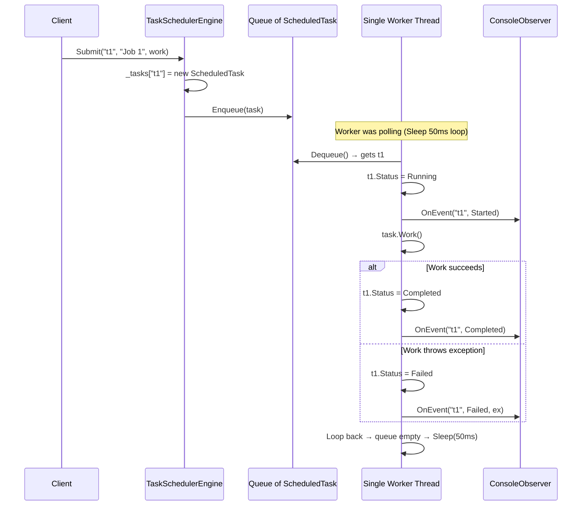
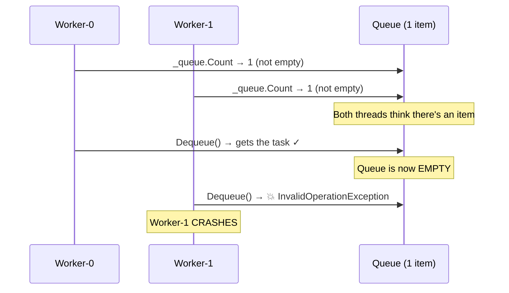
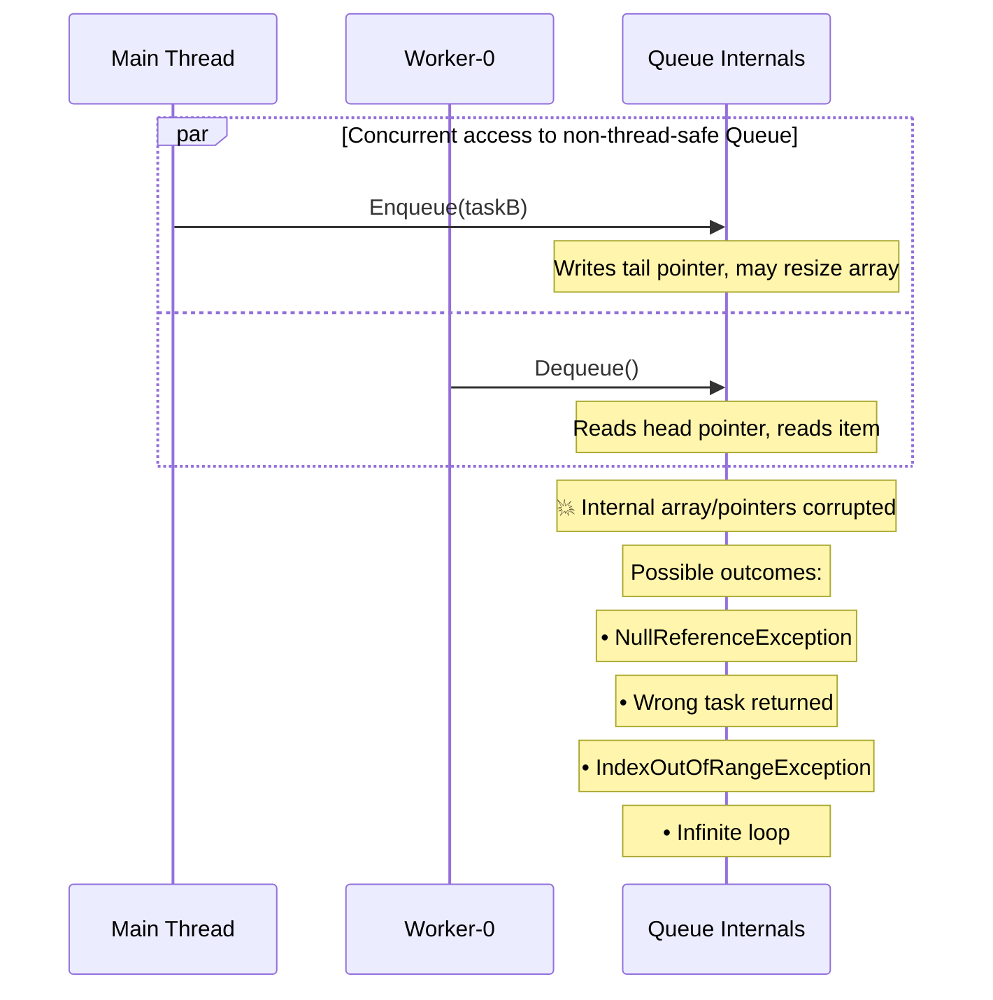
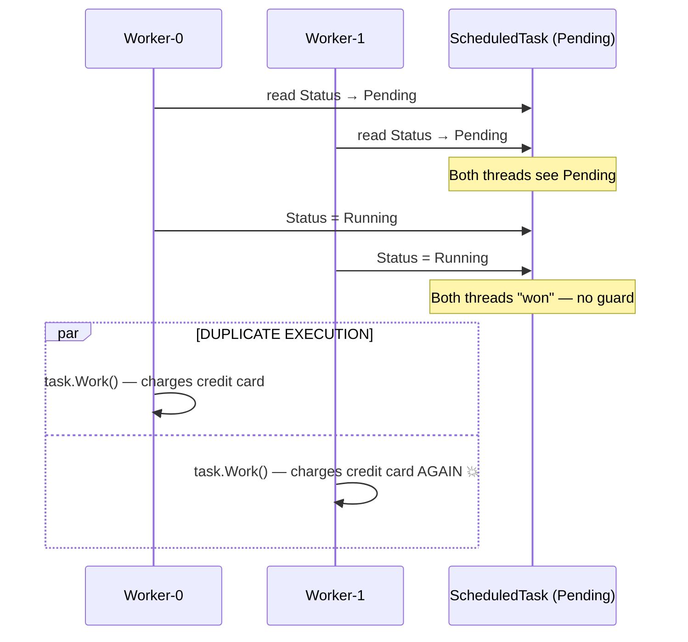
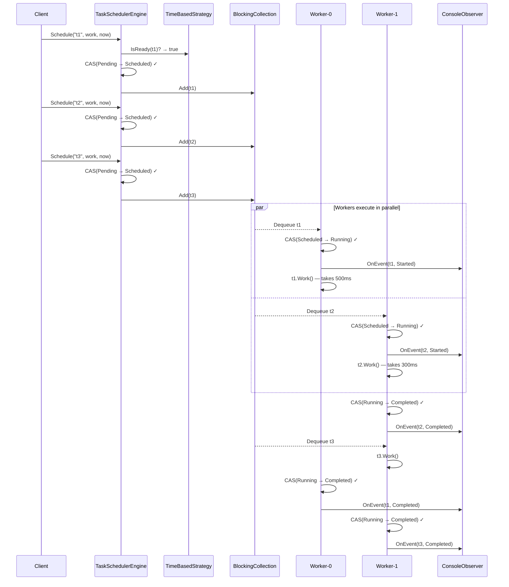
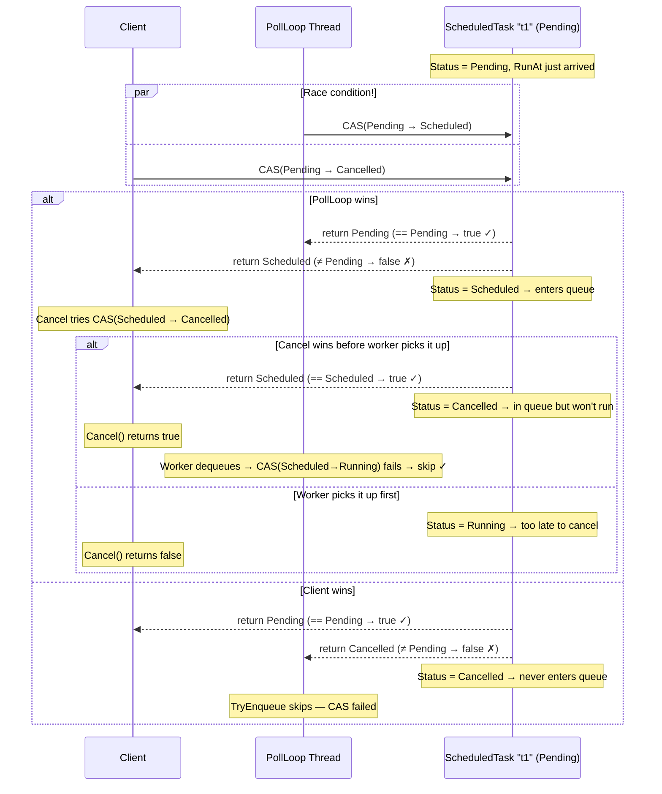
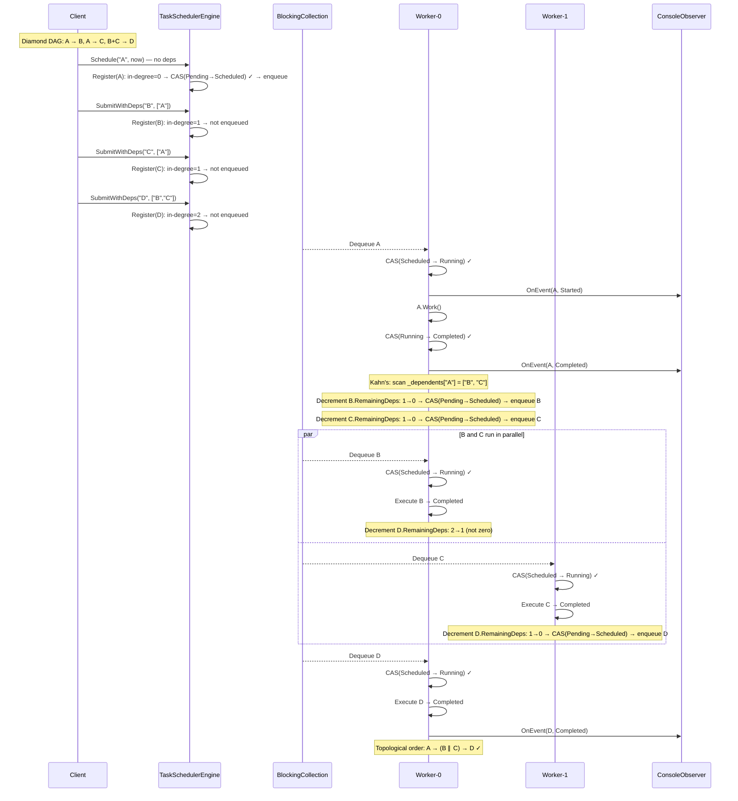
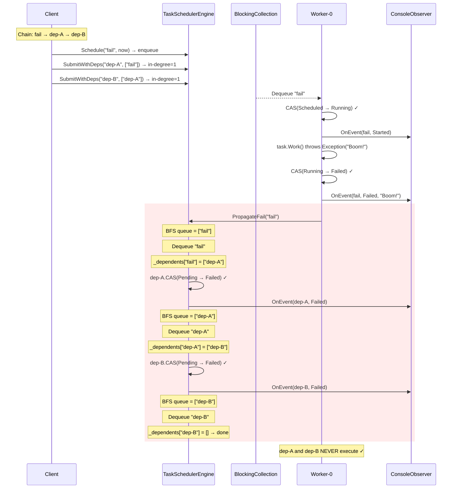
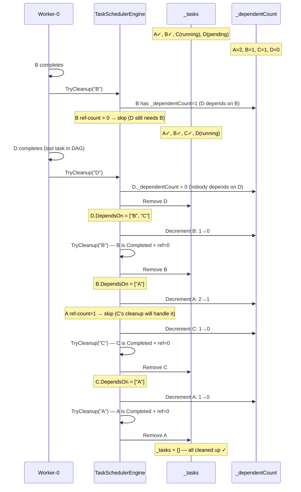

# Concurrent Task Scheduler — LLD Interview Walkthrough (C#)

This README simulates a real interview. We build the scheduler incrementally in 3 rounds, starting from the simplest possible version and layering in complexity. Each round adds code, explains the "why", and includes Mermaid diagrams with step-by-step dry runs.

## How to Run (Final Implementation)

```bash
dotnet build TaskScheduler/TaskScheduler.csproj
dotnet run --project TaskScheduler/TaskScheduler.csproj
```

## Final Project Structure

```
TaskScheduler/
├── Enums/
│   ├── TaskStatus.cs             — Pending, Scheduled, Running, Completed, Failed, Cancelled
│   └── EventType.cs              — Started, Completed, Failed, Cancelled
├── Models/
│   └── ScheduledTask.cs          — CAS-based atomic status transitions
├── Interfaces/
│   ├── ITaskObserver.cs          — observer pattern contract
│   └── ISchedulingStrategy.cs    — strategy pattern for extensibility (OCP)
├── Observers/
│   └── ConsoleObserver.cs        — colored console logging
├── Strategies/
│   └── TimeBasedStrategy.cs      — ready when scheduled time passes
├── Core/
│   └── TaskSchedulerEngine.cs    — engine with embedded dependency graph
└── Program.cs                    — demo exercising all features
```

## Client Code (Exercises Every Feature)

This is `Program.cs` — a single demo that hits all requirements. Each section maps to a round in the walkthrough below.

```csharp
using TaskScheduler.Core;
using TaskScheduler.Observers;
using TaskScheduler.Strategies;

Console.WriteLine("=== Task Scheduler Demo ===\n");

// Create scheduler: 4 worker threads + time-based scheduling strategy
using var scheduler = new TaskSchedulerEngine(4, new TimeBasedStrategy());
scheduler.AddObserver(new ConsoleObserver());

// ── 1. One-time future task (Round 2: PollLoop picks it up after 1s) ──
scheduler.Schedule("t1", "One-Time", () =>
{
    Thread.Sleep(200);
    Console.WriteLine("    → One-time done.");
}, DateTime.UtcNow.AddSeconds(1));

// ── 2. Recurring task (Round 2: re-registers itself every 2s) ──
scheduler.ScheduleRecurring("hb", "Heartbeat", () =>
    Console.WriteLine("    → Heartbeat."), TimeSpan.FromSeconds(2));

// ── 3. Dependency diamond: A → B,C → D (Round 3: Kahn's algorithm) ──
//
//       A
//      / \
//     B   C      ← B and C run in parallel after A completes
//      \ /
//       D        ← D runs only after BOTH B and C complete
//
scheduler.Schedule("A", "Task A", () =>
    { Thread.Sleep(100); Console.WriteLine("    → A done."); }, DateTime.UtcNow);

scheduler.SubmitWithDeps("B", "Task B", () =>
    { Thread.Sleep(100); Console.WriteLine("    → B done."); }, ["A"]);

scheduler.SubmitWithDeps("C", "Task C", () =>
    { Thread.Sleep(100); Console.WriteLine("    → C done."); }, ["A"]);

scheduler.SubmitWithDeps("D", "Task D", () =>
    Console.WriteLine("    → D done (after B & C)."), ["B", "C"]);

// ── 4. Failure propagation (Round 3: BFS marks dependents as Failed) ──
scheduler.Schedule("fail", "Failing", () =>
    throw new Exception("Boom!"), DateTime.UtcNow);

scheduler.SubmitWithDeps("fail-dep", "Depends on Fail", () =>
    Console.WriteLine("    → Should never run."), ["fail"]);

// ── 5. Cancellation (Round 2: CAS prevents execution) ──
scheduler.Schedule("cancel-me", "Cancel Target", () =>
    Console.WriteLine("    → Should not run."), DateTime.UtcNow.AddSeconds(5));

Thread.Sleep(300);
Console.WriteLine($"\n  Cancel result: {scheduler.Cancel("cancel-me")}\n");

// Let recurring tasks tick a few times
Thread.Sleep(6000);

// ── 6. Graceful shutdown (Round 2: CompleteAdding + CTS + Join) ──
Console.WriteLine("\nShutting down...");
scheduler.Shutdown();
Console.WriteLine("Done.");
```

Expected output (colors omitted):

```
=== Task Scheduler Demo ===

  [Started] hb
  [Started] A
  [Started] fail
    → Heartbeat.
  [Completed] hb
  [Failed] fail — Boom!          ← fail throws, caught by worker
  [Failed] fail-dep              ← BFS propagation: never executes
    → A done.
  [Completed] A
  [Started] B                    ← Kahn's: A done → B,C in-degree hit 0
  [Started] C                    ← B and C run in PARALLEL on two workers
    → B done.
    → C done.
  [Completed] B
  [Completed] C
  [Started] D                    ← Kahn's: B+C done → D in-degree hits 0
    → D done (after B & C).
  [Completed] D
  [Cancelled] cancel-me          ← CAS(Pending→Cancelled) or CAS(Scheduled→Cancelled)

  Cancel result: True

  [Started] t1                   ← PollLoop enqueued it after 1s delay
    → One-time done.
  [Completed] t1
  [Started] hb_<tick>            ← Recurring: new instance created after each execution
    → Heartbeat.
  [Completed] hb_<tick>
  ...                            ← Heartbeat repeats every 2s

Shutting down...                 ← CompleteAdding + Cancel + Join
Done.                            ← All workers exited cleanly
```

| Output Line | Feature | Round |
|---|---|---|
| `[Started] hb` / `[Completed] hb` | Recurring task | 2 |
| `[Failed] fail` / `[Failed] fail-dep` | Failure propagation (BFS) | 3 |
| `[Started] B` + `[Started] C` (parallel) | Concurrent workers + Kahn's | 2 + 3 |
| `[Started] D` (after B and C) | Dependency ordering (in-degree) | 3 |
| `[Cancelled] cancel-me` | CAS-based cancellation | 2 |
| `[Started] t1` (after 1s delay) | PollLoop + TimeBasedStrategy | 2 |
| `Shutting down... Done.` | Graceful shutdown | 2 |

---
---

# ROUND 1: The Simplest Scheduler

> "Let's start with the basics. A scheduler that accepts jobs, puts them in a queue, and a single worker thread pulls them out and runs them one by one."

## Round 1 — What We're Building

- A `ScheduledTask` model with an id, name, action, and status
- A `TaskSchedulerEngine` with a `Queue`, one worker thread
- Submit a task → it goes into the queue → worker picks it up → runs it
- Handle success and failure (try/catch)
- Observer notifications (Started / Completed / Failed)
- Cancellation of pending tasks
- Graceful shutdown

No parallelism, no dependencies, no CAS. Just the skeleton.

## Round 1 — State Machine

At this stage, the lifecycle is simple:

```
Pending ──→ Running ──→ Completed
   │            └─────→ Failed
   └──→ Cancelled
```

Only one thread touches tasks, so no race conditions yet. A simple `if` check on status is fine.

## Round 1 — Code

```csharp
// ── Enums ──

enum TaskStatus { Pending, Running, Completed, Failed, Cancelled }
enum EventType  { Started, Completed, Failed, Cancelled }

// ── Observer ──

interface ITaskObserver { void OnEvent(string taskId, EventType type, Exception? ex = null); }

class ConsoleObserver : ITaskObserver
{
    public void OnEvent(string taskId, EventType type, Exception? ex = null)
    {
        Console.WriteLine($"  [{type}] {taskId}" + (ex != null ? $" — {ex.Message}" : ""));
    }
}

// ── Model ──

class ScheduledTask
{
    public string Id { get; }
    public string Name { get; }
    public Action Work { get; }
    public TaskStatus Status { get; set; } = TaskStatus.Pending;

    public ScheduledTask(string id, string name, Action work)
    { Id = id; Name = name; Work = work; }
}

// ── Scheduler (single-threaded, no deps) ──

class TaskSchedulerEngine : IDisposable
{
    readonly Dictionary<string, ScheduledTask> _tasks = new();
    readonly Queue<ScheduledTask> _queue = new();
    readonly List<ITaskObserver> _observers = new();
    readonly Thread _worker;
    volatile bool _shutdown = false;

    public TaskSchedulerEngine()
    {
        _worker = new Thread(WorkerLoop) { IsBackground = true };
        _worker.Start();
    }

    public void AddObserver(ITaskObserver o) => _observers.Add(o);

    public void Submit(string id, string name, Action work)
    {
        var task = new ScheduledTask(id, name, work);
        _tasks[id] = task;
        _queue.Enqueue(task);
    }

    public bool Cancel(string id)
    {
        if (!_tasks.TryGetValue(id, out var t)) return false;
        if (t.Status != TaskStatus.Pending) return false;
        t.Status = TaskStatus.Cancelled;
        Notify(id, EventType.Cancelled);
        return true;
    }

    void WorkerLoop()
    {
        while (!_shutdown)
        {
            if (_queue.Count == 0) { Thread.Sleep(50); continue; }

            var task = _queue.Dequeue();
            if (task.Status == TaskStatus.Cancelled) continue;

            task.Status = TaskStatus.Running;
            Notify(task.Id, EventType.Started);

            try
            {
                task.Work();
                task.Status = TaskStatus.Completed;
                Notify(task.Id, EventType.Completed);
            }
            catch (Exception ex)
            {
                task.Status = TaskStatus.Failed;
                Notify(task.Id, EventType.Failed, ex);
            }
        }
    }

    void Notify(string id, EventType type, Exception? ex = null)
    {
        foreach (var o in _observers)
            try { o.OnEvent(id, type, ex); } catch { }
    }

    public void Shutdown() { _shutdown = true; _worker.Join(TimeSpan.FromSeconds(5)); }
    public void Dispose() => Shutdown();
}
```

## Round 1 — Sequence Diagram



## Round 1 — Dry Run

```
State: _tasks = {}, _queue = [], Worker polling (queue empty, sleeping)

═══ Client submits 3 tasks ═══

Step 1: Submit("t1", "Build", buildAction)
  → _tasks = { "t1": ScheduledTask{Status=Pending} }
  → _queue = [t1]

Step 2: Submit("t2", "Test", testAction)
  → _tasks = { "t1": ..., "t2": ScheduledTask{Status=Pending} }
  → _queue = [t1, t2]

Step 3: Submit("t3", "Deploy", deployAction)
  → _queue = [t1, t2, t3]

═══ Worker wakes up ═══

Step 4: Worker checks _queue.Count → 3 > 0
  → Dequeue() → t1
  → t1.Status = Cancelled? No (Pending)
  → t1.Status = Running
  → Notify(Started) → "[Started] t1"
  → t1.Work() → builds successfully
  → t1.Status = Completed
  → Notify(Completed) → "[Completed] t1"

Step 5: Worker loops → _queue.Count = 2
  → Dequeue() → t2
  → t2.Status = Running
  → Notify(Started) → "[Started] t2"
  → t2.Work() → throws Exception("Tests failed!")
  → catch: t2.Status = Failed
  → Notify(Failed) → "[Failed] t2 — Tests failed!"

Step 6: Worker loops → _queue.Count = 1
  → Dequeue() → t3
  → t3.Status = Running → execute → Completed
  → "[Started] t3" → "[Completed] t3"

Step 7: Worker loops → _queue.Count = 0 → Sleep(50ms) → repeat

═══ Cancellation scenario ═══

Step 8: Submit("t4", "Cleanup", cleanupAction)
  → _queue = [t4]

Step 9: Client calls Cancel("t4") BEFORE worker picks it up
  → _tasks["t4"].Status == Pending → yes
  → t4.Status = Cancelled
  → Notify(Cancelled) → "[Cancelled] t4"

Step 10: Worker dequeues t4
  → t4.Status == Cancelled → skip (continue)
  → Worker moves on

═══ Graceful shutdown ═══

Step 11: Client calls Shutdown()
  → _shutdown = true
  → Worker loop: while(!_shutdown) → false → exits loop
  → _worker.Join(5s) → thread ends

Final state:
  t1=Completed, t2=Failed, t3=Completed, t4=Cancelled
  Worker thread stopped. Scheduler disposed.
```

## Round 1 — What's Wrong With This?

| Problem | Why It Matters |
|---|---|
| Single worker thread | Tasks run sequentially — no parallelism |
| `Queue<T>` is not thread-safe | If client submits while worker dequeues → corruption |
| `task.Status = Running` is not atomic | With multiple threads, two could read Pending simultaneously |
| Busy-waiting with `Thread.Sleep(50)` | Wastes CPU cycles polling an empty queue |
| No time-based scheduling | Can't say "run this in 5 seconds" |
| No dependencies | Can't say "run B after A completes" |

These are exactly the problems we solve in Round 1.5, 2, and 3.

---
---

# ROUND 1.5: Naive Parallelism (The Broken Version)

> "The interviewer says: one worker is too slow, let's add more. You naively spin up multiple threads on the same Queue. Let's see what breaks."

## Round 1.5 — What We're Trying

Take the Round 1 code and just change one thing: instead of 1 worker thread, spin up N.

```csharp
class TaskSchedulerEngine : IDisposable
{
    readonly Dictionary<string, ScheduledTask> _tasks = new();
    readonly Queue<ScheduledTask> _queue = new();       // ⚠ NOT thread-safe
    readonly List<ITaskObserver> _observers = new();
    readonly Thread[] _workers;
    volatile bool _shutdown = false;

    public TaskSchedulerEngine(int workerCount)
    {
        _workers = new Thread[workerCount];
        for (int i = 0; i < workerCount; i++)
        {
            _workers[i] = new Thread(WorkerLoop) { IsBackground = true };
            _workers[i].Start();
        }
    }

    public void Submit(string id, string name, Action work)
    {
        var task = new ScheduledTask(id, name, work);
        _tasks[id] = task;
        _queue.Enqueue(task);       // ⚠ Main thread writes to Queue
    }

    void WorkerLoop()
    {
        while (!_shutdown)
        {
            if (_queue.Count == 0) { Thread.Sleep(50); continue; }  // ⚠ Bug 1

            var task = _queue.Dequeue();                             // ⚠ Bug 2

            if (task.Status != TaskStatus.Pending) continue;
            task.Status = TaskStatus.Running;                        // ⚠ Bug 3

            try
            {
                task.Work();
                task.Status = TaskStatus.Completed;
            }
            catch (Exception ex)
            {
                task.Status = TaskStatus.Failed;
            }
        }
    }

    public void Shutdown()
    {
        _shutdown = true;
        foreach (var w in _workers) w.Join(TimeSpan.FromSeconds(5));
    }

    public void Dispose() => Shutdown();
}
```

This code has **three critical bugs**. Let's trace each one.

## Bug 1: TOCTOU on Queue.Count (Check-Then-Act Race)

```
TOCTOU = Time Of Check To Time Of Use

  Worker-0                         Worker-1
  ─────────                        ─────────
  _queue.Count == 0? → NO (1)     _queue.Count == 0? → NO (1)
  _queue.Dequeue() → gets task     _queue.Dequeue() → ???

  ⚠ Queue had 1 item. Both threads saw Count > 0.
    Worker-0 got the item. Worker-1 calls Dequeue() on an EMPTY queue.
    → InvalidOperationException: Queue empty
    → Worker thread crashes
```

The check (`Count == 0`) and the action (`Dequeue()`) are two separate operations. Between them, another thread can drain the queue.



**Dry Run:**

```
State: _queue = [taskA], Workers = [W0, W1]

T=0ms: W0 reads _queue.Count → 1 → enters the dequeue branch
T=0ms: W1 reads _queue.Count → 1 → enters the dequeue branch (SAME instant)
T=1ms: W0 calls _queue.Dequeue() → gets taskA → _queue = []
T=1ms: W1 calls _queue.Dequeue() → _queue is empty
       → InvalidOperationException: "Queue empty"
       → Unhandled exception → Worker-1 thread dies
       → Now you're running with N-1 workers
       → If this keeps happening, all workers die
```

## Bug 2: Queue\<T\> Internal Corruption (Concurrent Reads + Writes)

`Queue<T>` is not thread-safe. Its internal array and head/tail pointers can corrupt when accessed concurrently:

```
  Worker-0                         Main Thread
  ─────────                        ───────────
  _queue.Dequeue()                 _queue.Enqueue(newTask)
  │ reads head pointer = 3         │ writes tail pointer = 7
  │ moves head to 4                │ resizes internal array
  │ reads item at index 3          │ copies items to new array
  │ ← item is GONE (array resized) │
  │                                │
  ⚠ Worker reads garbage data or gets NullReferenceException
```

This is undefined behavior. The internal state of `Queue<T>` is corrupted. You might get:
- `NullReferenceException` (reading a slot that was moved)
- `IndexOutOfRangeException` (head/tail pointers out of sync)
- Silent data corruption (dequeue returns the wrong task)
- Infinite loop (circular buffer pointers corrupted)



## Bug 3: Double Execution (Status Check Race)

Even if we replaced `Queue<T>` with `ConcurrentQueue<T>`, the status check is still broken:

```csharp
if (task.Status != TaskStatus.Pending) continue;  // READ
task.Status = TaskStatus.Running;                  // WRITE
```

Two separate operations. Two threads can both read `Pending` before either writes `Running`:

```
  Worker-0                         Worker-1
  ─────────                        ─────────
  read task.Status → Pending       read task.Status → Pending
  Pending != Pending? NO           Pending != Pending? NO
  task.Status = Running            task.Status = Running
  task.Work() ← EXECUTES          task.Work() ← EXECUTES

  ⚠ SAME TASK RUNS TWICE!
  If task.Work() is "charge credit card" → customer charged twice
  If task.Work() is "send email" → duplicate email
  If task.Work() is "delete file" → second call fails or corrupts
```



**Dry Run:**

```
State: task = ScheduledTask { Id="charge", Status=Pending }
       Both W0 and W1 dequeued the same task (Bug 2) or both check status

T=0ns: W0 reads task.Status → Pending (value = 0)
T=0ns: W1 reads task.Status → Pending (value = 0)
       (both reads happen before either write — this is legal on modern CPUs)

T=1ns: W0 writes task.Status = Running (value = 1)
T=1ns: W1 writes task.Status = Running (value = 1)
       (both writes succeed — plain assignment has no guard)

T=2ns: W0 enters task.Work() → charges $99.99
T=2ns: W1 enters task.Work() → charges $99.99 AGAIN

Result: Customer charged $199.98 instead of $99.99
```

## Bug 4: Busy-Waiting Wastes CPU

```csharp
if (_queue.Count == 0) { Thread.Sleep(50); continue; }
```

With 4 worker threads and an empty queue:
- All 4 threads wake up every 50ms
- Each checks `_queue.Count` (which is also not thread-safe with concurrent Enqueue)
- All 4 go back to sleep
- That's 80 wakeups per second doing nothing
- On a server with 100 scheduler instances → 8,000 pointless wakeups/sec

Not catastrophic, but wasteful. `BlockingCollection` solves this — workers truly sleep (zero CPU) until an item arrives.

## Round 1.5 — Summary of All Bugs

```
┌──────────────────────────────────────────────────────────────────────┐
│                    Round 1.5 Bug Summary                             │
├──────────┬───────────────────────────────────┬───────────────────────┤
│ Bug      │ What Happens                      │ Fix (Round 2)         │
├──────────┼───────────────────────────────────┼───────────────────────┤
│ TOCTOU   │ Count>0 then Dequeue on empty     │ BlockingCollection    │
│          │ → InvalidOperationException        │ (atomic take-or-wait) │
├──────────┼───────────────────────────────────┼───────────────────────┤
│ Queue    │ Concurrent read+write corrupts    │ BlockingCollection    │
│ corrupt  │ internal array → crashes/garbage   │ (thread-safe wrapper) │
├──────────┼───────────────────────────────────┼───────────────────────┤
│ Double   │ Two threads read Pending, both    │ CAS (TryTransition)   │
│ execute  │ set Running → task runs twice      │ (atomic read+write)   │
├──────────┼───────────────────────────────────┼───────────────────────┤
│ Busy-    │ Threads poll empty queue with     │ BlockingCollection    │
│ wait     │ Sleep(50) → wasted CPU cycles      │ (blocks until item)   │
└──────────┴───────────────────────────────────┴───────────────────────┘
```

These four bugs are exactly why Round 2 introduces `BlockingCollection` and CAS. Not because they're fancy — because the naive approach is fundamentally broken under concurrency.

---
---

# ROUND 2: Parallelism, Thread-Safety, and CAS

> "Round 1.5 showed us everything that breaks. Now let's fix it properly — BlockingCollection for the queue, CAS for status transitions, and clean shutdown with CancellationToken."

## Round 2 — What Changes From Round 1.5

| Round 1 / 1.5 (Broken) | Round 2 (Fixed) | Bug It Fixes |
|---|---|---|
| `Queue<T>` | `BlockingCollection<T>` | TOCTOU, queue corruption, busy-wait |
| `task.Status = Running` | `Interlocked.CompareExchange` (CAS) | Double execution |
| Direct `Pending → Running` | `Pending → Scheduled → Running` (two CAS steps) | Can't cancel queued tasks |
| `volatile bool _shutdown` | `CancellationTokenSource` + `CompleteAdding()` | Clean shutdown for all threads |
| `Dictionary` | `ConcurrentDictionary` | Concurrent registry access |
| No time scheduling | `PollLoop` thread + `ISchedulingStrategy` | Deferred execution + extensibility |

## Round 2 — CAS: The Key Insight

The core problem with multiple workers:

```
Without CAS (BROKEN — Round 1 style with multiple threads):

  Worker-0                         Worker-1
  ─────────                        ─────────
  read status → Pending            read status → Pending
  status == Pending? yes           status == Pending? yes
  write status = Running           write status = Running
  execute task ✓                   execute task ✓

  ⚠ SAME TASK RUNS TWICE!
```

CAS (Compare-And-Swap) fixes this. It's a CPU-level atomic instruction:

```
CAS(memory_location, expected_value, new_value):
  Atomically:
    if *memory == expected → write new_value → return expected (success)
    else → do nothing → return actual value (failure)
```

In C#: `Interlocked.CompareExchange(ref _status, newValue, expectedValue)`

## Round 2 — The Scheduled State: Why Queued ≠ Running

A task in the queue hasn't started executing yet. If we mark it `Running` at enqueue time, we can't cancel it — `Cancel()` only works on `Pending` tasks. We need an intermediate state:

```
Pending ──→ Scheduled ──→ Running ──→ Completed
   │            │             └─────→ Failed
   │            └──→ Cancelled
   └──→ Cancelled
```

- `Pending`: registered, waiting for deps/time
- `Scheduled`: in the BlockingCollection queue, waiting for a worker to pick it up
- `Running`: a worker is actively executing it

This means:
- `TryEnqueue()` does `CAS(Pending → Scheduled)` — puts it in the queue
- Worker does `CAS(Scheduled → Running)` — starts executing
- `Cancel()` tries both `CAS(Pending → Cancelled)` AND `CAS(Scheduled → Cancelled)`

```
With CAS + Scheduled state (CORRECT):

  TryEnqueue:                      Cancel:
  ─────────                        ─────────
  CAS(status, Scheduled, Pending)  CAS(status, Cancelled, Pending) → fails (already Scheduled)
  → wins → task enters queue       CAS(status, Cancelled, Scheduled) → wins!
                                   → task is Cancelled while sitting in queue

  Worker dequeues task:
  CAS(status, Running, Scheduled) → _status is Cancelled ≠ Scheduled → false → skip ✓
```

Only one thread wins each transition. The loser gets `false` and moves on. No locks needed.

## Round 2 — BlockingCollection: Why Not Just a ConcurrentQueue?

`ConcurrentQueue<T>` is thread-safe but doesn't block. Workers would need to poll:

```csharp
// ❌ ConcurrentQueue — workers busy-wait
while (true)
{
    if (_queue.TryDequeue(out var task)) { /* execute */ }
    else Thread.Sleep(50);  // wasting CPU
}

// ✅ BlockingCollection — workers sleep until work arrives
foreach (var task in _queue.GetConsumingEnumerable(cancellationToken))
{
    // automatically blocks when empty, wakes when item added
    // throws OperationCanceledException on shutdown
}
```

`BlockingCollection` gives us:
- Blocking dequeue (workers sleep, zero CPU when idle)
- `CompleteAdding()` for graceful shutdown
- `CancellationToken` integration

## Round 2 — PollLoop: Why Do We Need It?

When a task has `RunAt = 5 seconds from now`, we can't enqueue it immediately — it's not ready. Something needs to check back later.

The PollLoop is a single background thread that wakes every 100ms, scans Pending tasks, and enqueues any that became ready:

```
PollLoop Thread
  │
  └─→ while (!shutdown)
        for each task in _tasks:
          if Status == Pending AND IsReady(task):
            CAS(Pending → Scheduled) → if won → _queue.Add(task)
        Sleep(100ms)
```

| Scenario | Who enqueues? | PollLoop needed? |
|---|---|---|
| Task with `RunAt = now` | `Register()` directly | No |
| Task with `RunAt = future` | PollLoop (when time arrives) | Yes |

## Round 2 — Code (Diff from Round 1)

```csharp
// ── Enums ──

enum TaskStatus { Pending, Scheduled, Running, Completed, Failed, Cancelled }
enum EventType  { Started, Completed, Failed, Cancelled }

// ── Model (CHANGED: CAS instead of plain setter) ──

class ScheduledTask
{
    int _status = (int)TaskStatus.Pending;  // int for Interlocked

    public string Id { get; }
    public string Name { get; }
    public Action Work { get; }
    public DateTime? RunAt { get; }
    public TimeSpan? Interval { get; }

    public TaskStatus Status => (TaskStatus)Volatile.Read(ref _status);

    public ScheduledTask(string id, string name, Action work,
        DateTime? runAt = null, TimeSpan? interval = null)
    { Id = id; Name = name; Work = work; RunAt = runAt; Interval = interval; }

    // NEW: Atomic CAS — only one thread can win this transition
    public bool TryTransition(TaskStatus from, TaskStatus to)
        => Interlocked.CompareExchange(ref _status, (int)to, (int)from) == (int)from;
}

// ── Strategy (NEW: extensibility for scheduling policies) ──

interface ISchedulingStrategy { bool IsReady(ScheduledTask task); }

class TimeBasedStrategy : ISchedulingStrategy
{
    public bool IsReady(ScheduledTask t) => !t.RunAt.HasValue || t.RunAt <= DateTime.UtcNow;
}

// ── Scheduler (CHANGED: parallel workers, BlockingCollection, PollLoop) ──

class TaskSchedulerEngine : IDisposable
{
    readonly ConcurrentDictionary<string, ScheduledTask> _tasks = new();  // was Dictionary
    readonly BlockingCollection<ScheduledTask> _queue = new();            // was Queue
    readonly ISchedulingStrategy _strategy;
    readonly CancellationTokenSource _cts = new();                        // was volatile bool
    readonly Thread[] _workers;                                           // was single Thread
    readonly List<ITaskObserver> _observers = new();

    public TaskSchedulerEngine(int workerCount, ISchedulingStrategy strategy)
    {
        _strategy = strategy;
        _workers = new Thread[workerCount];
        for (int i = 0; i < workerCount; i++)
        {
            _workers[i] = new Thread(WorkerLoop) { IsBackground = true };
            _workers[i].Start();
        }
        new Thread(PollLoop) { IsBackground = true }.Start();  // NEW
    }

    public void AddObserver(ITaskObserver o) { lock (_observers) _observers.Add(o); }

    public void Schedule(string id, string name, Action work, DateTime runAt)
    {
        var task = new ScheduledTask(id, name, work, runAt);
        _tasks[id] = task;
        TryEnqueue(task);  // enqueue immediately if ready
    }

    public void ScheduleRecurring(string id, string name, Action work, TimeSpan interval)
    {
        var task = new ScheduledTask(id, name, work, DateTime.UtcNow, interval);
        _tasks[id] = task;
        TryEnqueue(task);
    }

    public bool Cancel(string id)
    {
        if (!_tasks.TryGetValue(id, out var t)) return false;
        // Try cancelling from Pending (not yet queued) or Scheduled (in queue)
        if (!t.TryTransition(TaskStatus.Pending, TaskStatus.Cancelled) &&
            !t.TryTransition(TaskStatus.Scheduled, TaskStatus.Cancelled))
            return false;
        Notify(id, EventType.Cancelled);
        return true;
    }

    // NEW: CAS-guarded enqueue — prevents duplicate execution
    void TryEnqueue(ScheduledTask t)
    {
        if (_strategy.IsReady(t))
            if (t.TryTransition(TaskStatus.Pending, TaskStatus.Scheduled))  // CAS!
                _queue.Add(t);
    }

    // NEW: polls for time-delayed tasks
    /* Dont use this version : while (!_cts.Token.IsCancellationRequested) + Thread.Sleep();
       Even Cancellation signal is sent, this thread will wakeup only when its sleep inverval is completed.
    void PollLoop()
    {
        while (!_cts.Token.IsCancellationRequested)
        {
            foreach (var t in _tasks.Values)
                if (t.Status == TaskStatus.Pending) TryEnqueue(t);
            try { Thread.Sleep(100); } catch { break; }
        }
    }
    */

    void PollLoop(){
      while(!cts.Token.WaitHandle.WaitOne(100)){
        foreach (var t in _tasks.Values){
          if (t.Status == TaskStatus.Pending) 
            TryEnqueue(t);
        }                
      }
    }

    // CHANGED: BlockingCollection + CAS instead of Queue + if-check
    void WorkerLoop()
    {
        try
        {
            foreach (var task in _queue.GetConsumingEnumerable(_cts.Token))
            {
                // CAS: Scheduled → Running (skip if cancelled while in queue)
                if (!task.TryTransition(TaskStatus.Scheduled, TaskStatus.Running))
                    continue;

                Notify(task.Id, EventType.Started);
                try
                {
                    task.Work();
                    task.TryTransition(TaskStatus.Running, TaskStatus.Completed);
                    Notify(task.Id, EventType.Completed);

                    // Recurring: re-register next instance
                    if (task.Interval.HasValue)
                    {
                        var next = new ScheduledTask($"{task.Id}_{DateTime.UtcNow.Ticks}",
                            task.Name, task.Work,
                            DateTime.UtcNow + task.Interval.Value, task.Interval);
                        _tasks[next.Id] = next;
                        TryEnqueue(next);
                    }
                }
                catch (Exception ex)
                {
                    task.TryTransition(TaskStatus.Running, TaskStatus.Failed);
                    Notify(task.Id, EventType.Failed, ex);
                }
            }
        }
        catch (OperationCanceledException) { /* graceful shutdown */ }
    }

    void Notify(string id, EventType type, Exception? ex = null)
    {
        // Snapshotting (to avoid InvalidOperationException) + Separate Threads.
        List<ITaskObserver> snapshot;
        lock (_observers){
          snapshot = new(_observers);
        }
        foreach (var observer in snap) {
          // Create individual threads for handling the notifications
          Task.Run(()=>{
            try { 
              o.OnEvent(id, type, ex); } 
            catch { }
          });          
        }
    }

    public void Shutdown()
    {
        _queue.CompleteAdding();
        _cts.Cancel();
        foreach (var w in _workers) w.Join(TimeSpan.FromSeconds(5));
    }

    public void Dispose() { Shutdown(); _queue.Dispose(); _cts.Dispose(); }
}
```

## Round 2 — Sequence Diagram: Parallel Execution with CAS



## Round 2 — Dry Run: 3 Tasks, 2 Workers

```
State: _tasks = {}, _queue = [], Workers = [W0, W1] blocked on empty queue

═══ Client submits 3 tasks ═══

Step 1: Schedule("t1", work, now)
  → _tasks["t1"] = ScheduledTask{Status=Pending, RunAt=now}
  → TryEnqueue(t1):
    → strategy.IsReady(t1)? RunAt <= now → true
    → CAS(Pending → Scheduled): _status was 0(Pending), write 1(Scheduled), return 0
      → 0 == 0 → true ✓
    → _queue.Add(t1)
  → _queue = [t1]

Step 2: Schedule("t2", work, now)
  → Same flow → _queue = [t1, t2]

Step 3: Schedule("t3", work, now)
  → Same flow → _queue = [t1, t2, t3]

═══ Workers unblock ═══

Step 4: W0 and W1 both unblock from GetConsumingEnumerable()
  → W0 gets t1, W1 gets t2 (BlockingCollection handles this atomically)
  → _queue = [t3]

Step 5: W0 and W1 transition Scheduled → Running, then execute IN PARALLEL
  → W0: CAS(Scheduled → Running) ✓ → Notify(t1, Started) → t1.Work() (takes 500ms)
  → W1: CAS(Scheduled → Running) ✓ → Notify(t2, Started) → t2.Work() (takes 300ms)

Step 6: W1 finishes first (300ms)
  → CAS(Running → Completed) ✓
  → Notify(t2, Completed)
  → W1 loops → dequeues t3 → _queue = []
  → W1: Notify(t3, Started) → t3.Work()

Step 7: W0 finishes (500ms)
  → CAS(Running → Completed) ✓
  → Notify(t1, Completed)
  → W0 loops → _queue empty → blocks

Step 8: W1 finishes t3
  → CAS(Running → Completed) ✓
  → Notify(t3, Completed)
  → W1 loops → _queue empty → blocks

Final state:
  t1=Completed, t2=Completed, t3=Completed
  Total time: ~500ms (not 500+300+t3 = sequential)
  Both workers idle, blocked on queue.

  Round 1 would have taken: 500 + 300 + t3 ms (sequential)
  Round 2 with 2 workers:   max(500, 300+t3) ms (parallel) ✓
```

## Round 2 — Dry Run: CAS Race Between PollLoop and Cancel



```
Scenario: Task "t1" has RunAt = 10:00:05. It's now 10:00:05.
  PollLoop and Client both act at the same instant.

  _status memory = 0 (Pending)

  PollLoop calls: CAS(ref _status, 1(Scheduled), 0(Pending))
  Client calls:   CAS(ref _status, 5(Cancelled), 0(Pending))

  Case A — PollLoop's CAS hits the CPU first:
    Read _status = 0, expected = 0 → match → write 1 → return 0
    PollLoop: 0 == 0 → true → _queue.Add(t1) → task enters queue as Scheduled
    Client:   CAS(Pending→Cancelled) reads _status = 1 ≠ 0 → false
    Client:   Tries CAS(Scheduled→Cancelled): reads _status = 1, expected = 1 → match → write 5
    Client:   Cancel succeeds! Task is Cancelled while in queue.
    Worker:   Dequeues t1 → CAS(Scheduled→Running): _status = 5(Cancelled) ≠ 1 → false → skip ✓

  Case B — Client's CAS hits the CPU first:
    Read _status = 0, expected = 0 → match → write 5 → return 0
    Client: 0 == 0 → true → Notify(Cancelled)
    PollLoop: CAS reads _status = 5, expected = 0 → no match → return 5
    PollLoop: 5 ≠ 0 → false → skip

  Either way: correct outcome. No corruption. And now Cancel works on queued tasks too!
```

## Round 2 — What's Still Missing?

| Problem | Impact |
|---|---|
| No dependencies | Can't say "run B after A" |
| No failure propagation | If A fails, B doesn't know and might run with bad state |
| Tasks are independent | No way to build pipelines or DAGs |

That's Round 3.

---
---

# ROUND 3: Dependencies and Failure Propagation (Kahn's Algorithm)

> "Now the interviewer says: tasks can depend on other tasks. A task should only run after all its dependencies complete. If a dependency fails, all downstream tasks should fail too."

## Round 3 — What Changes From Round 2

| Round 2 | Round 3 | Why |
|---|---|---|
| No dependencies | `DependsOn: List<string>` on each task | Track what a task waits for |
| No dependency graph | `_dependents: Dict<string, List<string>>` | Adjacency list — forward edges |
| No in-degree tracking | `RemainingDeps: int` on each task | Kahn's algorithm — count unfinished deps |
| Enqueue immediately if ready | Enqueue only when `RemainingDeps == 0` | Respect dependency ordering |
| No failure propagation | `PropagateFail()` — BFS through graph | Transitively fail all dependents |
| `Interlocked.Decrement` not used | Used for in-degree decrement | Two workers completing deps simultaneously |

## Round 3 — Kahn's Algorithm (Online Variant)

Classic Kahn's processes a static graph in batch. Ours is online — tasks arrive dynamically:

```
Classic Kahn's (batch):              Our Online Variant:
───────────────────────              ──────────────────────
1. Compute in-degree for ALL nodes   1. On Register(): compute in-degree
                                        for THIS task only

2. Enqueue all with in-degree 0      2. If in-degree == 0 → enqueue now

3. While queue not empty:            3. On task completion:
   dequeue, decrement neighbors         decrement dependents' in-degree
   if in-degree 0 → enqueue             if any hit 0 → enqueue

4. Done when queue empty             4. Continuous — new tasks arrive anytime
```

Data structures:
- `_dependents[taskId] = [list of tasks that depend on taskId]` — adjacency list (forward edges)
- `task.RemainingDeps` — the in-degree counter, decremented with `Interlocked.Decrement`

## Round 3 — Code (Diff from Round 2)

Only showing what changed — the rest stays identical.

```csharp
// ── Model (CHANGED: added dependency fields) ──

class ScheduledTask
{
    int _status = (int)TaskStatus.Pending;

    public string Id { get; }
    public string Name { get; }
    public Action Work { get; }
    public DateTime? RunAt { get; }
    public TimeSpan? Interval { get; }
    public List<string> DependsOn { get; }    // NEW
    public int RemainingDeps;                  // NEW: in-degree for Kahn's

    public TaskStatus Status => (TaskStatus)Volatile.Read(ref _status);

    public ScheduledTask(string id, string name, Action work,
        DateTime? runAt = null, TimeSpan? interval = null, List<string>? deps = null)
    {
        Id = id; Name = name; Work = work;
        RunAt = runAt; Interval = interval;
        DependsOn = deps ?? new();             // NEW
    }

    public bool TryTransition(TaskStatus from, TaskStatus to)
        => Interlocked.CompareExchange(ref _status, (int)to, (int)from) == (int)from;
}

// ── Scheduler (CHANGED: dependency graph + failure propagation) ──

class TaskSchedulerEngine : IDisposable
{
    // ... (same fields as Round 2, plus:)

    // NEW: Dependency graph — adjacency list
    readonly ConcurrentDictionary<string, List<string>> _dependents = new();

    // NEW: Submit with dependencies
    public void SubmitWithDeps(string id, string name, Action work, List<string> deps)
        => Register(new ScheduledTask(id, name, work, deps: deps));

    // CHANGED: Register now wires dependency edges and computes in-degree
    void Register(ScheduledTask task)
    {
        _tasks[task.Id] = task;
        _dependents.TryAdd(task.Id, new List<string>());

        int inDegree = 0;
        foreach (var depId in task.DependsOn)
        {
            // Wire forward edge: depId → this task
            _dependents.GetOrAdd(depId, _ => new List<string>()).Add(task.Id);

            // Count only unfinished dependencies
            if (!_tasks.TryGetValue(depId, out var dep) || dep.Status != TaskStatus.Completed)
                inDegree++;
        }
        Interlocked.Exchange(ref task.RemainingDeps, inDegree);
        TryEnqueue(task);
    }

    // CHANGED: TryEnqueue now checks dependencies
    void TryEnqueue(ScheduledTask t)
    {
        if (Volatile.Read(ref t.RemainingDeps) == 0 && _strategy.IsReady(t))  // NEW: check deps
            if (t.TryTransition(TaskStatus.Pending, TaskStatus.Scheduled))
                _queue.Add(t);
    }

    // CHANGED: WorkerLoop now does Scheduled→Running CAS + decrements dependents
    void WorkerLoop()
    {
        try
        {
            foreach (var task in _queue.GetConsumingEnumerable(_cts.Token))
            {
                // CAS: Scheduled → Running (skip if cancelled while in queue)
                if (!task.TryTransition(TaskStatus.Scheduled, TaskStatus.Running))
                    continue;

                Notify(task.Id, EventType.Started);
                try
                {
                    task.Work();
                    task.TryTransition(TaskStatus.Running, TaskStatus.Completed);
                    Notify(task.Id, EventType.Completed);

                    // NEW: Kahn's step — decrement in-degree of dependents
                    if (_dependents.TryGetValue(task.Id, out var deps))
                        foreach (var depId in deps)
                            if (_tasks.TryGetValue(depId, out var dep))
                                if (Interlocked.Decrement(ref dep.RemainingDeps) == 0)
                                    TryEnqueue(dep);

                    // Recurring (same as Round 2)
                    if (task.Interval.HasValue)
                        Register(new ScheduledTask($"{task.Id}_{DateTime.UtcNow.Ticks}",
                            task.Name, task.Work,
                            DateTime.UtcNow + task.Interval.Value, task.Interval));
                }
                catch (Exception ex)
                {
                    task.TryTransition(TaskStatus.Running, TaskStatus.Failed);
                    Notify(task.Id, EventType.Failed, ex);
                    PropagateFail(task.Id);  // NEW
                }
            }
        }
        catch (OperationCanceledException) { }
    }

    // NEW: BFS failure propagation through dependency graph
    void PropagateFail(string taskId)
    {
        var q = new Queue<string>();
        q.Enqueue(taskId);
        while (q.Count > 0)
        {
            if (!_dependents.TryGetValue(q.Dequeue(), out var deps)) continue;
            foreach (var depId in deps)
                if (_tasks.TryGetValue(depId, out var dep))
                    if (dep.TryTransition(TaskStatus.Pending, TaskStatus.Failed) ||
                        dep.TryTransition(TaskStatus.Scheduled, TaskStatus.Failed))
                    { Notify(depId, EventType.Failed); q.Enqueue(depId); }
        }
    }

    // CHANGED: Cancel now tries both Pending and Scheduled, and propagates failure
    public bool Cancel(string id)
    {
        if (!_tasks.TryGetValue(id, out var t)) return false;
        if (!t.TryTransition(TaskStatus.Pending, TaskStatus.Cancelled) &&
            !t.TryTransition(TaskStatus.Scheduled, TaskStatus.Cancelled))
            return false;
        Notify(id, EventType.Cancelled);
        PropagateFail(id);  // NEW: dependents can never run
        return true;
    }

    // ... (Shutdown, Dispose, Notify — same as Round 2)
}
```

## Round 3 — Sequence Diagram: Diamond Dependency (Kahn's)



## Round 3 — Dry Run: Diamond Dependency

```
State: _tasks = {}, _dependents = {}, _queue = []

═══ Registration Phase ═══

Step 1: Schedule("A", now)
  → Register(A):
    → _tasks["A"] = ScheduledTask{Status=Pending, DependsOn=[]}
    → _dependents["A"] = []
    → in-degree = 0 (no dependencies)
    → TryEnqueue(A): RemainingDeps=0, IsReady=true
      → CAS(Pending→Scheduled) ✓ → _queue.Add(A)
  → _queue = [A]

Step 2: SubmitWithDeps("B", ["A"])
  → Register(B):
    → _tasks["B"] = ScheduledTask{Status=Pending, DependsOn=["A"]}
    → _dependents["A"].Add("B") → _dependents["A"] = ["B"]
    → _dependents["B"] = []
    → A.Status = Scheduled (not Completed) → inDegree = 1
    → B.RemainingDeps = 1
    → TryEnqueue(B): RemainingDeps=1 ≠ 0 → skip
  → _queue = [A]

Step 3: SubmitWithDeps("C", ["A"])
  → Register(C):
    → _dependents["A"] = ["B", "C"]
    → A not Completed → inDegree = 1
    → C.RemainingDeps = 1
    → TryEnqueue(C): skip
  → _queue = [A]

Step 4: SubmitWithDeps("D", ["B", "C"])
  → Register(D):
    → _dependents["B"].Add("D"), _dependents["C"].Add("D")
    → B not Completed → inDegree++, C not Completed → inDegree++
    → D.RemainingDeps = 2
    → TryEnqueue(D): skip
  → _queue = [A]

  Graph state:
    _dependents = { "A": ["B","C"], "B": ["D"], "C": ["D"], "D": [] }
    In-degrees:  A=0(scheduled), B=1, C=1, D=2

═══ Execution Phase ═══

Step 5: Worker-0 dequeues A
  → CAS(Scheduled → Running) ✓
  → Notify(A, Started)
  → A.Work() → succeeds
  → CAS(Running→Completed) ✓ → A.Status = Completed
  → Notify(A, Completed)
  → Scan _dependents["A"] = ["B", "C"]
    → Interlocked.Decrement(B.RemainingDeps): 1 → 0 → TryEnqueue(B)
      → CAS(Pending→Scheduled) ✓ → _queue.Add(B)
    → Interlocked.Decrement(C.RemainingDeps): 1 → 0 → TryEnqueue(C)
      → CAS(Pending→Scheduled) ✓ → _queue.Add(C)
  → _queue = [B, C]

Step 6: W0 dequeues B, W1 dequeues C (parallel)

  W0 executes B:
    → CAS(Scheduled → Running) ✓
    → B.Work() → succeeds → CAS(Running→Completed) ✓
    → Scan _dependents["B"] = ["D"]
    → Interlocked.Decrement(D.RemainingDeps): 2 → 1
    → 1 ≠ 0 → don't enqueue D

  W1 executes C (simultaneously):
    → CAS(Scheduled → Running) ✓
    → C.Work() → succeeds → CAS(Running→Completed) ✓
    → Scan _dependents["C"] = ["D"]
    → Interlocked.Decrement(D.RemainingDeps): 1 → 0
    → 0 == 0 → TryEnqueue(D) → CAS(Pending→Scheduled) ✓ → _queue.Add(D)
  → _queue = [D]

  KEY INSIGHT: Interlocked.Decrement is atomic.
  Even though W0 and W1 both decrement D's in-degree,
  exactly one sees 0 and enqueues D. No duplicates.

Step 7: W0 dequeues D
  → CAS(Scheduled → Running) ✓
  → D.Work() → succeeds → CAS(Running→Completed) ✓
  → _dependents["D"] = [] → nothing to decrement
  → Workers block on empty queue

Final state:
  A=Completed, B=Completed, C=Completed, D=Completed
  Execution order: A → (B ∥ C) → D
  Topological ordering respected ✓
  B and C ran in parallel ✓
```

```
┌─────────────────────────────────────────────────────────────────┐
│                      TaskSchedulerEngine                        │
│                                                                 │
│  ┌──────────────┐    ┌──────────────────┐    ┌───────────────┐  │
│  │  Public API   │───▶│  DependencyGraph  │    │  IScheduling  │  │
│  │              │    │  (Kahn's Algo)    │    │  Strategy     │  │
│  │ ScheduleTask │    │                  │    │              │  │
│  │ ScheduleRecur│    │ Register()       │    │ IsReady()    │  │
│  │ SubmitWithDep│    │ OnTaskCompleted() │    └───────────────┘  │
│  │ CancelTask   │    │ OnTaskFailed()   │                       │
│  └──────┬───────┘    └────────┬─────────┘                       │
│         │                     │                                 │
│         ▼                     ▼                                 │
│  ┌─────────────────────────────────────────┐                    │
│  │     BlockingCollection<ScheduledTask>    │ ◄── Work Queue    │
│  └──────────────────┬──────────────────────┘                    │
│                     │                                           │
│         ┌───────────┼───────────┐                               │
│         ▼           ▼           ▼                               │
│  ┌──────────┐┌──────────┐┌──────────┐                           │
│  │ Worker-0 ││ Worker-1 ││ Worker-N │  ◄── Configurable Pool    │
│  └──────────┘└──────────┘└──────────┘                           │
│         │           │           │                               │
│         └───────────┼───────────┘                               │
│                     ▼                                           │
│            ┌─────────────────┐                                  │
│            │  ITaskObserver[] │  ◄── Observer Notifications      │
│            └─────────────────┘                                  │
└─────────────────────────────────────────────────────────────────┘
```

Let's trace through the Program.cs DAG step by step. Here's the dependency graph:
```
t1 (FetchData)  ──┐
                  ├──→ t3 (ProcessData) ──→ t4 (GenerateReport) ──→ t5 (SendEmail)
t2 (LoadConfig) ──┘

t6 (Heartbeat)     — independent, recurring
t7 (FlakyTask)  ──→ t8 (DependsOnFlaky)
```

**Phase 1: Registration (Register calls)**

Each Submit/SubmitWithDeps calls Register, which wires edges and computes in-degree:

```
Register(t1): deps=[], inDegree=0 → TryEnqueue → enqueued ✓
Register(t2): deps=[], inDegree=0 → TryEnqueue → enqueued ✓
Register(t3): deps=[t1,t2], inDegree=2 → TryEnqueue → RemainingDeps≠0, stays Pending
Register(t4): deps=[t3], inDegree=1 → stays Pending
Register(t5): deps=[t4], inDegree=1 → stays Pending
Register(t6): deps=[], inDegree=0 → TryEnqueue → IsReady? RunAt is future → not enqueued yet
Register(t7): deps=[], inDegree=0 → TryEnqueue → enqueued ✓
Register(t8): deps=[t7], inDegree=1 → stays Pending
```

Adjacency list (_dependents) after registration:

```
t1 → [t3]
t2 → [t3]
t3 → [t4]
t4 → [t5]
t7 → [t8]
```

**Phase 2: Workers process the queue**

Workers pick up t1, t2, t7 (the three tasks with in-degree 0).

Say Worker 1 completes t2 (LoadConfig):

```
t2 completes → look up _dependents["t2"] → [t3]
  Decrement t3.RemainingDeps: 2 → 1
  Not 0 yet, don't enqueue
```

Worker 2 completes t1 (FetchData):

```
t1 completes → look up _dependents["t1"] → [t3]
  Decrement t3.RemainingDeps: 1 → 0  ← last dependency!
  TryEnqueue(t3) → enqueued ✓
```

Worker 3 runs t7 (FlakyTask) — it throws:

```
t7 fails → PropagateFail("t7")
  BFS: dequeue "t7" → _dependents["t7"] = [t8]
    t8 is Pending → CAS to Failed ✓ → Notify Failed
    enqueue "t8" for further BFS
  BFS: dequeue "t8" → _dependents["t8"] = []
  BFS done. t8 never runs.
```

Worker picks up t3 (ProcessData), completes it:

```
t3 completes → _dependents["t3"] → [t4]
  Decrement t4.RemainingDeps: 1 → 0
  TryEnqueue(t4) → enqueued ✓
```

Worker picks up t4 (GenerateReport), completes it:

```
t4 completes → _dependents["t4"] → [t5]
  Decrement t5.RemainingDeps: 1 → 0
  TryEnqueue(t5) → IsReady? RunAt is 2s in the future → NOT enqueued
  t5 stays Pending with RemainingDeps=0
```
**Phase 3: PollLoop picks up t5 and t6**

PollLoop wakes every second, scans all tasks:

```
Iteration 1 (1s): t6.RunAt has passed → TryEnqueue(t6) ✓
                   t5.RunAt still future → skip
Iteration 2 (2s): t5.RunAt has passed → TryEnqueue(t5) ✓
```

## Round 3 — Sequence Diagram: Failure Propagation (BFS)



## Round 3 — Dry Run: Failure Propagation

```
State: _tasks = {}, _dependents = {}, _queue = []

═══ Registration ═══

Step 1: Schedule("fail", now)
  → Register: in-degree=0, IsReady=true → CAS(Pending→Scheduled) ✓ → enqueue
  → _queue = [fail]

Step 2: SubmitWithDeps("dep-A", ["fail"])
  → _dependents["fail"] = ["dep-A"]
  → fail.Status = Scheduled (not Completed) → dep-A.RemainingDeps = 1
  → Not enqueued

Step 3: SubmitWithDeps("dep-B", ["dep-A"])
  → _dependents["dep-A"] = ["dep-B"]
  → dep-A.Status = Pending (not Completed) → dep-B.RemainingDeps = 1
  → Not enqueued

  Graph: fail → dep-A → dep-B
  In-degrees: fail=0(enqueued), dep-A=1, dep-B=1

═══ Execution ═══

Step 4: Worker-0 dequeues "fail"
  → CAS(Scheduled → Running) ✓
  → Notify(fail, Started) → "[Started] fail"
  → task.Work() → throws Exception("Boom!")
  → catch block:
    → CAS(Running → Failed) ✓ → fail.Status = Failed
    → Notify(fail, Failed, "Boom!") → "[Failed] fail — Boom!"
    → PropagateFail("fail")

═══ BFS Failure Propagation ═══

Step 5: PropagateFail("fail")
  → BFS queue: ["fail"]

  Iteration 1: Dequeue "fail"
    → _dependents["fail"] = ["dep-A"]
    → dep-A.TryTransition(Pending → Failed):
      → CAS: _status=0(Pending), expected=0 → match → write 4(Failed) → return 0
      → 0 == 0 → true ✓
    → dep-A.Status = Failed
    → Notify("dep-A", Failed) → "[Failed] dep-A"
    → BFS queue: ["dep-A"]

  Iteration 2: Dequeue "dep-A"
    → _dependents["dep-A"] = ["dep-B"]
    → dep-B.TryTransition(Pending → Failed):
      → CAS: _status=0(Pending), expected=0 → match → write 4(Failed)
      → true ✓
    → dep-B.Status = Failed
    → Notify("dep-B", Failed) → "[Failed] dep-B"
    → BFS queue: ["dep-B"]

  Iteration 3: Dequeue "dep-B"
    → _dependents["dep-B"] = [] → no dependents
    → BFS queue: [] → done

Final state:
  fail=Failed, dep-A=Failed, dep-B=Failed
  dep-A and dep-B never executed ✓
  Console output:
    [Started] fail
    [Failed] fail — Boom!
    [Failed] dep-A
    [Failed] dep-B

═══ Why CAS matters in PropagateFail ═══

What if PollLoop was simultaneously trying to enqueue dep-A?

  PropagateFail:  CAS(dep-A, Failed, Pending)    → wins → dep-A = Failed
  PollLoop:       CAS(dep-A, Scheduled, Pending)  → _status is Failed ≠ Pending → false → skip

  CAS ensures: either dep-A gets scheduled OR dep-A is marked failed. Never both.
```

---

# BONUS: Fixing the Memory Leak (Task Cleanup)

> "The interviewer notices: _tasks and _dependents keep growing. Completed tasks are never removed. In a long-running scheduler, this is a memory leak."

## The Problem

```
Time 0:    _tasks = { A }                          — 1 entry
Time 1:    _tasks = { A✓, B✓, C✓, D✓ }             — 4 entries (A,B,C,D all Completed)
Time 10:   _tasks = { A✓, B✓, C✓, D✓, ... 1000✓ }  — 1000 entries, all dead weight
Time 100:  _tasks = { ... 100,000 entries ... }      — unbounded growth, OOM eventually

Same for _dependents — adjacency lists for tasks that will never be referenced again.
```

Every completed, failed, or cancelled task stays in memory forever. The PollLoop scans them every 100ms (wasting time on terminal tasks), and the dictionaries grow without bound.

## Why We Can't Just Delete Immediately

Naive approach — remove a task the moment it completes:

```
A completes → remove A from _tasks
B registers with DependsOn=["A"]
  → _tasks.TryGetValue("A") → NOT FOUND
  → Thinks A hasn't completed → inDegree = 1
  → B waits forever for A (which is already gone)
  ⚠ B NEVER EXECUTES
```

We need to keep a completed task around until all its dependents have been processed. Only then is it safe to evict.

## The Solution: Reference Counting

We add a `_dependentCount` dictionary that tracks how many dependents still reference each task:

```
_dependentCount["A"] = 2    means B and C both depend on A
                             (registered via SubmitWithDeps)

When B completes → _dependentCount["A"] decremented to 1
When C completes → _dependentCount["A"] decremented to 0
                   → A is terminal (Completed) AND ref-count is 0
                   → Safe to evict A from _tasks and _dependents
```

## How TryCleanup Works

```
TryCleanup(taskId):
  1. Is the task terminal (Completed/Failed/Cancelled)?
     No → return (still active, can't clean up)

  2. Does anyone still depend on it? (_dependentCount > 0)
     Yes → return (dependents might still need to look it up)

  3. Remove from _tasks, _dependents, _dependentCount

  4. For each of THIS task's own dependencies:
     Decrement their _dependentCount
     If their count hits 0 → recursively TryCleanup(depId)
     (cascading cleanup up the dependency chain)
```

## Sequence Diagram: Cleanup After Diamond DAG



## Dry Run: Cleanup After Diamond DAG

```
═══ After all tasks complete (A✓, B✓, C✓, D✓) ═══

State before cleanup:
  _tasks = { A(Completed), B(Completed), C(Completed), D(Completed) }
  _dependents = { A: [B,C], B: [D], C: [D], D: [] }
  _dependentCount = { A: 2, B: 1, C: 1, D: 0 }

Step 1: A completes → TryCleanup("A")
  → A is Completed ✓
  → _dependentCount["A"] = 2 > 0 → skip (B and C still reference A)

Step 2: B completes → TryCleanup("B")
  → B is Completed ✓
  → _dependentCount["B"] = 1 > 0 → skip (D still references B)

Step 3: C completes → TryCleanup("C")
  → C is Completed ✓
  → _dependentCount["C"] = 1 > 0 → skip (D still references C)

Step 4: D completes → TryCleanup("D")
  → D is Completed ✓
  → _dependentCount["D"] = 0 → safe to evict!
  → Remove D from _tasks, _dependents, _dependentCount
  → D.DependsOn = ["B", "C"]
    → Decrement _dependentCount["B"]: 1 → 0 → TryCleanup("B")
      → B is Completed, ref-count = 0 → evict B
      → B.DependsOn = ["A"]
        → Decrement _dependentCount["A"]: 2 → 1 → skip (still > 0)
    → Decrement _dependentCount["C"]: 1 → 0 → TryCleanup("C")
      → C is Completed, ref-count = 0 → evict C
      → C.DependsOn = ["A"]
        → Decrement _dependentCount["A"]: 1 → 0 → TryCleanup("A")
          → A is Completed, ref-count = 0 → evict A
          → A.DependsOn = [] → nothing to decrement

Final state:
  _tasks = {}              — all evicted ✓
  _dependents = {}         — all evicted ✓
  _dependentCount = {}     — all evicted ✓
  Memory freed. No leak.
```

## Cleanup for Failure Propagation

When `PropagateFail` marks dep-A and dep-B as Failed, it calls `TryCleanup` on each:

```
fail(Failed) → dep-A(Failed) → dep-B(Failed)

TryCleanup("dep-B"):
  → dep-B is Failed, ref-count=0 → evict
  → Decrement dep-A's ref-count → 0 → TryCleanup("dep-A")
    → dep-A is Failed, ref-count=0 → evict
    → Decrement fail's ref-count → 0 → TryCleanup("fail")
      → fail is Failed, ref-count=0 → evict

All three removed. Cascading cleanup works for failures too.
```

---
---

# Summary: Evolution Across Rounds

## What Changed At Each Step

```
Round 1 (Basics)          Round 1.5 (Broken)          Round 2 (Fixed)             Round 3 (Dependencies)      Bonus (Cleanup)
─────────────────         ──────────────────          ─────────────────────       ──────────────────────      ────────────────
Queue<T>            ───→  Queue<T> + N threads  ───→  BlockingCollection<T>       (same)                      (same)
1 worker thread     ───→  N threads (BROKEN)    ───→  N threads (CORRECT)         (same)                      (same)
task.Status = X     ───→  (same — races!)       ───→  CAS (TryTransition)         (same)                      (same)
Pending → Running   ───→  (same — races!)       ───→  Pending → Scheduled → Running  (same)                   (same)
Dictionary          ───→  (same — races!)       ───→  ConcurrentDictionary         (same)                      (same)
volatile bool       ───→  (same)                ───→  CancellationTokenSource     (same)                      (same)
busy-wait polling   ───→  (same — worse w/ N)   ───→  blocking dequeue            (same)                      (same)
no time scheduling  ───→  (same)                ───→  PollLoop + Strategy         (same)                      (same)
                                                                            ───→  DependsOn + RemainingDeps   (same)
                                                                            ───→  _dependents adjacency list  (same)
                                                                            ───→  Interlocked.Decrement       (same)
                                                                            ───→  PropagateFail (BFS)         (same)
                                                                                                        ───→  _dependentCount (ref-count)
                                                                                                        ───→  TryCleanup (cascading eviction)
```

## Thread-Safety Mechanisms (Final)

| Component | Mechanism | Added In |
|---|---|---|
| Task status (enqueue) | `CAS(Pending → Scheduled)` | Round 2 |
| Task status (execute) | `CAS(Scheduled → Running)` | Round 2 |
| Task status (complete/fail) | `CAS(Running → Completed/Failed)` | Round 2 |
| Task registry | `ConcurrentDictionary` | Round 2 |
| Work queue | `BlockingCollection` | Round 2 |
| Observer list | `lock` + snapshot copy | Round 2 |
| In-degree counter | `Interlocked.Decrement` | Round 3 |
| Dependency graph | `ConcurrentDictionary` | Round 3 |
| Ref-count for cleanup | `ConcurrentDictionary` + `AddOrUpdate` | Bonus |

## Design Patterns (Final)

| Pattern | Where | Added In |
|---|---|---|
| Strategy | `ISchedulingStrategy` → `TimeBasedStrategy` | Round 2 |
| Observer | `ITaskObserver` → `ConsoleObserver` | Round 1 |
| Producer-Consumer | `BlockingCollection` between producers and workers | Round 2 |
| State Machine | CAS-based `TryTransition()` with Scheduled state | Round 2 |

## Requirements Coverage (Final)

| # | Requirement | Round |
|---|---|---|
| 1 | One-time future tasks | 2 (PollLoop + Strategy) |
| 2 | Recurring tasks | 2 (re-register on completion) |
| 3 | Configurable worker threads | 2 (Thread[] sized by param) |
| 4 | Cancellation | 1 (basic), 2 (CAS), 3 (+propagation) |
| 5 | Observer notifications | 1 |
| 6 | Status tracking | 1 (basic), 2 (CAS-based) |
| 7 | Task dependencies | 3 (adjacency list + in-degree) |
| 8 | Execute when ready | 3 (in-degree == 0 → enqueue) |
| 9 | Concurrent execution | 2 (N workers on BlockingCollection) |
| 10 | Failure propagation | 3 (BFS in PropagateFail) |
| 11 | Graceful shutdown | 1 (basic), 2 (CompleteAdding + CTS) |

## Interview Tips

- Start with Round 1. Get the skeleton right. Show you can model the problem.
- When the interviewer asks "what if multiple threads?", transition to Round 2. Explain CAS before writing it.
- When they ask "what about dependencies?", draw the DAG on the whiteboard first. Explain Kahn's algorithm verbally, then code it.
- Always explain the "why" before the "how". Why CAS over locks? Why BFS for failure propagation? Why BlockingCollection over ConcurrentQueue?
- The dry runs are your secret weapon. Walk through state changes step by step. Interviewers love seeing you trace through concurrent code.
