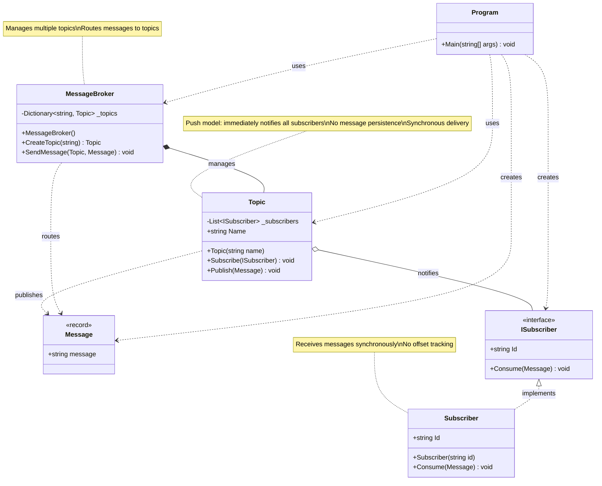

# Class Diagram - Simple Pub/Sub (Push Model)



## Architecture Overview

### Design Pattern: Simple Push-Based Pub/Sub

This is the most basic implementation of the publish-subscribe pattern.

### Core Components

**Message Layer**
- `Message`: Immutable record representing a message
- `ISubscriber`: Interface for message consumers
- `Subscriber`: Simple implementation that prints messages

**Messaging Layer**
- `Topic`: Maintains subscriber list and pushes messages
- `MessageBroker`: Manages multiple topics and routes messages

### Message Flow

```
Publisher → MessageBroker.SendMessage() 
    → Topic.Publish() 
    → ISubscriber.Consume() (for each subscriber)
```

### Key Characteristics

**Advantages:**
- Simple and straightforward
- Immediate delivery
- Easy to understand and implement
- Low latency for fast subscribers

**Limitations:**
- No message persistence (messages lost if no subscribers)
- Slow subscribers block the publisher (synchronous)
- No replay capability
- No independent consumption rates
- No offset tracking
- Tight coupling between publisher and subscriber performance

### Design Principles

1. **Push Model**: Topic actively pushes messages to subscribers
2. **Synchronous Delivery**: Publisher waits for all subscribers to consume
3. **No State**: No message history or offset tracking
4. **Simple Subscription**: Subscribers register directly with topics

### Comparison with Advanced Designs

| Feature | Simple Pub/Sub | With Offsets | With Workers |
|---------|---------------|--------------|--------------|
| Message Persistence | ❌ | ✅ | ✅ |
| Replay Capability | ❌ | ✅ | ✅ |
| Async Consumption | ❌ | ❌ | ✅ |
| Independent Rates | ❌ | ❌ | ✅ |
| Complexity | Low | Medium | High |

This design is suitable for:
- Simple notification systems
- Real-time updates where history doesn't matter
- Scenarios where all subscribers are fast
- Prototyping and learning
