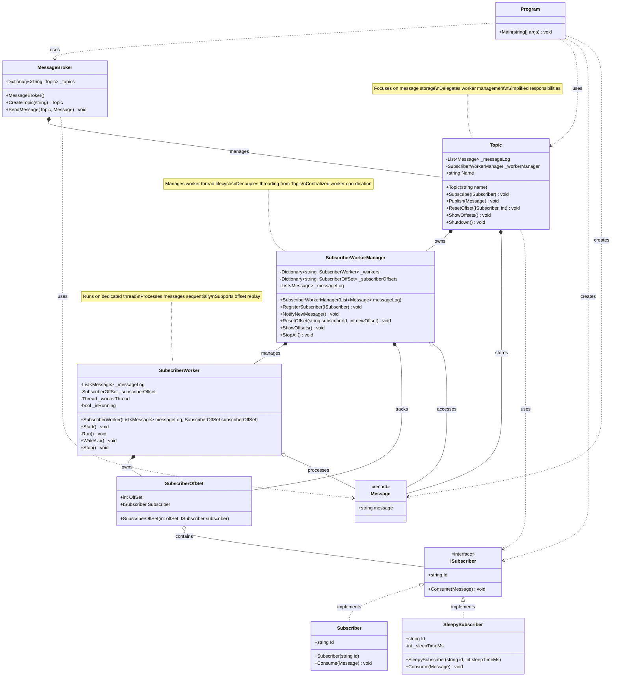

# Class Diagram - Decoupled Worker Manager Architecture

## Architecture Overview

### Core Components

**Message Layer**
- `Message`: Immutable record representing a message
- `ISubscriber`: Interface for message consumers
- `Subscriber` / `SleepySubscriber`: Concrete implementations

**Offset Management**
- `SubscriberOffSet`: Tracks subscriber position in message log

**Worker Layer** (Decoupled)
- `SubscriberWorker`: Individual worker thread for one subscriber
- `SubscriberWorkerManager`: Centralized lifecycle management for all workers

**Messaging Layer**
- `Topic`: Message storage and subscription coordination
- `MessageBroker`: Multi-topic management

### Key Design Principles

1. **Separation of Concerns**
   - Topic: Message storage and publishing
   - SubscriberWorkerManager: Thread lifecycle management
   - SubscriberWorker: Message consumption logic

2. **Single Responsibility**
   - Each class has one clear purpose
   - Worker management is isolated from messaging logic

3. **Dependency Direction**
   - Topic depends on SubscriberWorkerManager
   - Manager depends on Worker
   - Worker depends on SubscriberOffSet and Message log

4. **Encapsulation**
   - Worker threads are hidden behind Manager interface
   - Topic doesn't know about threading details
   - Clean shutdown through Manager

### Benefits

- **Testability**: Can test Topic without threads
- **Flexibility**: Easy to swap threading strategy
- **Maintainability**: Clear boundaries between components
- **Resource Management**: Centralized worker lifecycle control
