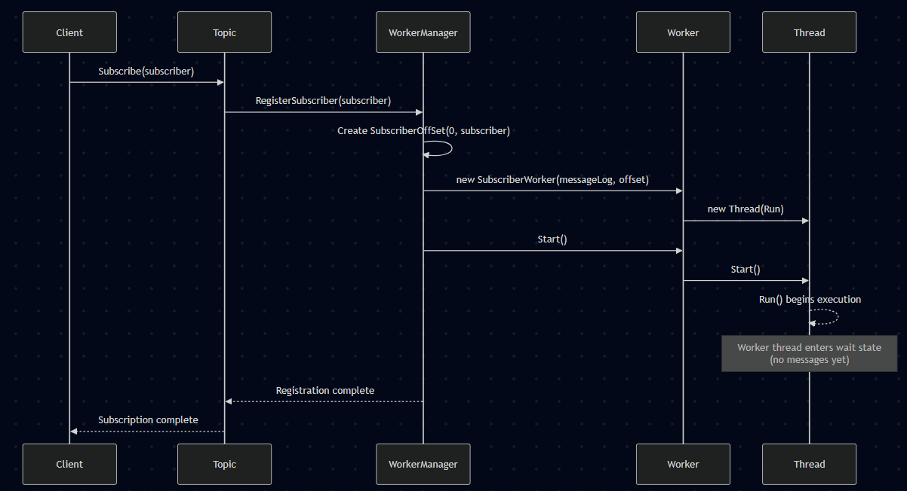
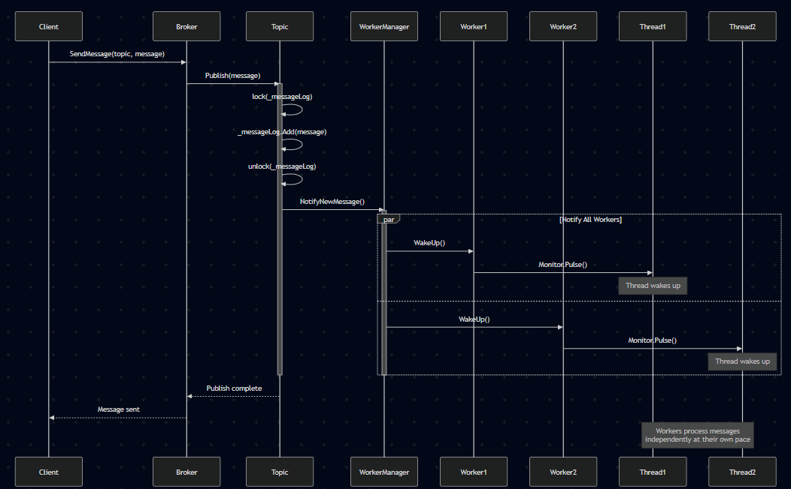
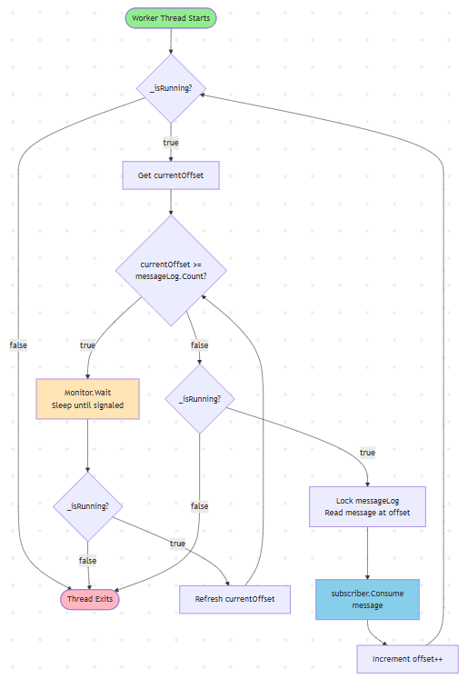
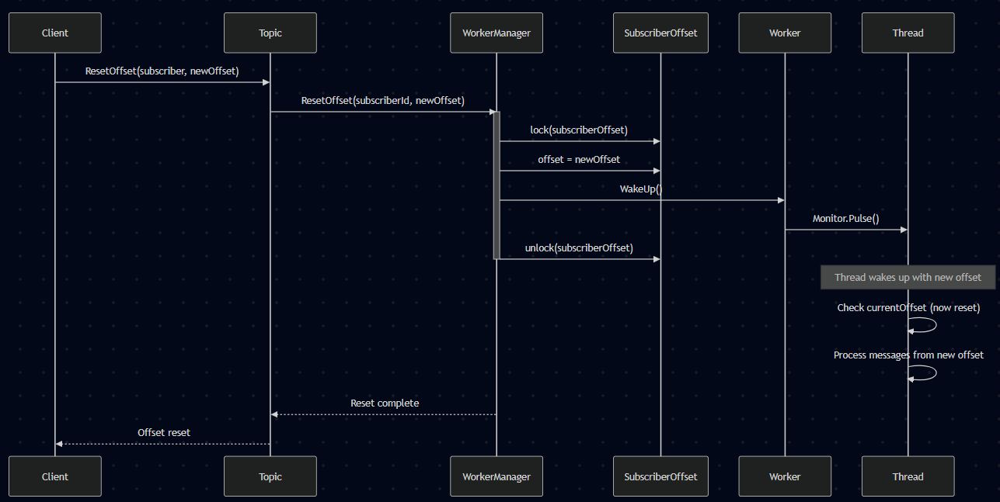
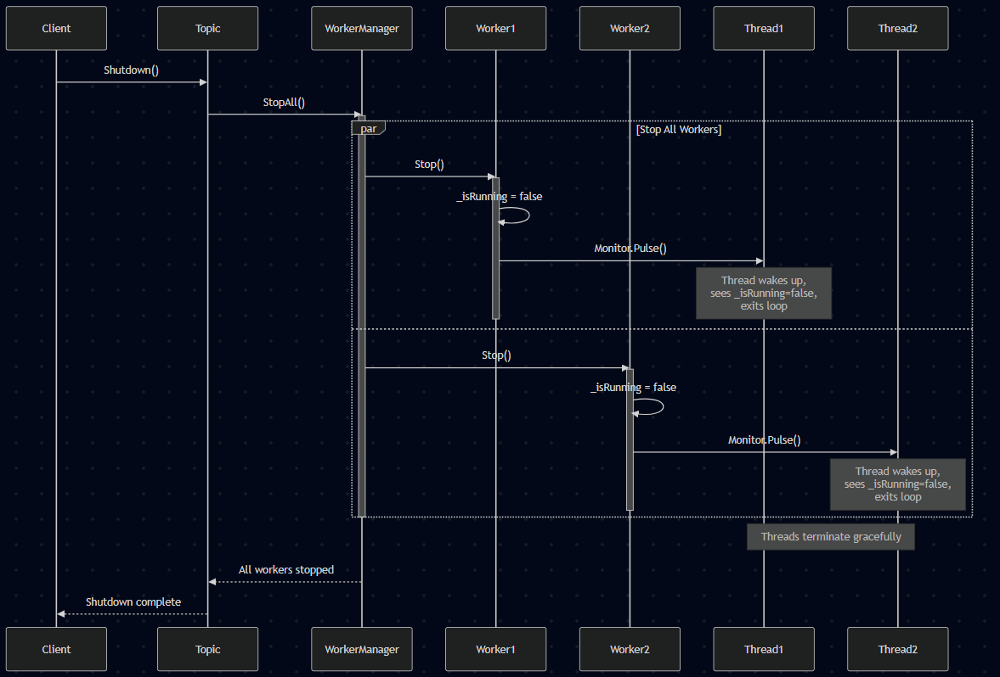
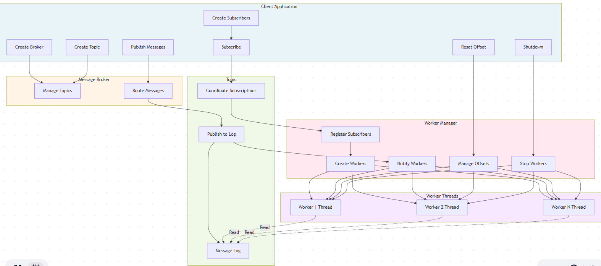

# Flow Diagrams - Decoupled Worker Manager Architecture

## 1. Subscription Flow

## 2. Message Publishing Flow

## 3. Worker Thread Processing Flow

## 4. Offset Reset Flow

## 5. Shutdown Flow

## 6. Complete System Flow (End-to-End)

## Key Flow Characteristics

### Asynchronous Processing
- Workers run on independent threads
- Each worker processes at its own pace
- Publisher doesn't wait for consumers

### Thread Synchronization
- `Monitor.Wait/Pulse` for efficient sleeping/waking
- Locks protect shared state (offsets, message log)
- Minimal lock contention (fine-grained locking)

### Decoupling Benefits
1. **Topic** focuses on message storage
2. **WorkerManager** handles all threading complexity
3. **Workers** process messages independently
4. Clean separation enables easy testing and modification

### Message Guarantees
- Messages are persisted in log
- Each subscriber tracks its own offset
- Replay capability via offset reset
- No message loss (unless log is cleared)
