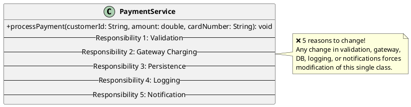

# 1. Single Responsibility Principle (SRP)

## 1. What is it?

The Single Responsibility Principle states that "A class should have one, and only one, reason to change." In simpler terms, a class should only have one primary job or responsibility.
If a class is doing multiple unrelated things, it violates this principle.

## 2. Why is it needed?

- **Maintainability**: Smaller, focused classes are easier to read and understand.
- **Testing**: It is much easier to write unit tests for a class that does one thing compared to a class that handles database calls, business logic, and UI updates.
- **Reduced Coupling**: If a class has multiple responsibilities, changing one part of the class might accidentally break another unrelated part (a regression bug).
- **Team Collaboration**: Different developers can work on different classes (e.g., one on logging, one on database access) without causing merge conflicts in a single massive file.

## 3. Code Example in Java (The Violation)

We're building a payment system. Here's our first attempt at a `PaymentService`. It validates the payment, charges the customer, saves the transaction to the database, and sends a receipt — all in one class.

```java
import java.io.FileWriter;
import java.io.IOException;
import java.time.LocalDateTime;

public class PaymentService {

    public void processPayment(String customerId, double amount, String cardNumber) {
        // Responsibility 1: Validation
        if (amount <= 0) {
            throw new IllegalArgumentException("Amount must be positive.");
        }
        if (cardNumber == null || cardNumber.length() != 16) {
            throw new IllegalArgumentException("Invalid card number.");
        }

        // Responsibility 2: Charging (Gateway Communication)
        System.out.println("Charging $" + amount + " to card ending in " + cardNumber.substring(12));

        // Responsibility 3: Persistence
        String txnId = "TXN-" + System.currentTimeMillis();
        System.out.println("Saving transaction " + txnId + " to database...");

        // Responsibility 4: Logging
        try (FileWriter fw = new FileWriter("payments.log", true)) {
            fw.write(txnId + " | " + customerId + " | $" + amount + " | " + LocalDateTime.now() + "\n");
        } catch (IOException e) {
            e.printStackTrace();
        }

        // Responsibility 5: Notification
        System.out.println("Sending payment receipt to customer " + customerId + "...");
    }
}
```

**The Problem**: This `PaymentService` has 5 reasons to change:
- Validation rules change (e.g., support 19-digit cards)
- Payment gateway changes (e.g., switch from Stripe to Razorpay)
- Database schema changes
- Logging infrastructure changes (e.g., move to CloudWatch)
- Notification channel changes (e.g., SMS instead of email)

### UML Diagram (Violation)



## 4. Code Example in Java (The Fix & Java Benefits)

We fix this by giving each responsibility its own class. The `PaymentService` becomes a thin orchestrator that delegates to focused collaborators.

```java
// 1. Validation Responsibility
public interface PaymentValidator {
    void validate(double amount, String cardNumber);
}

public class CardPaymentValidator implements PaymentValidator {
    @Override
    public void validate(double amount, String cardNumber) {
        if (amount <= 0) throw new IllegalArgumentException("Amount must be positive.");
        if (cardNumber == null || cardNumber.length() != 16)
            throw new IllegalArgumentException("Invalid card number.");
    }
}

// 2. Gateway / Charging Responsibility
public interface PaymentGateway {
    String charge(String customerId, double amount, String cardNumber);
}

public class StripeGateway implements PaymentGateway {
    @Override
    public String charge(String customerId, double amount, String cardNumber) {
        String txnId = "TXN-" + System.currentTimeMillis();
        System.out.println("Stripe: Charging $" + amount + " to card ending in " + cardNumber.substring(12));
        return txnId;
    }
}

// 3. Persistence Responsibility
public interface TransactionRepository {
    void save(String txnId, String customerId, double amount);
}

public class DatabaseTransactionRepository implements TransactionRepository {
    @Override
    public void save(String txnId, String customerId, double amount) {
        System.out.println("Saving transaction " + txnId + " to database...");
    }
}

// 4. Logging Responsibility
public interface PaymentLogger {
    void log(String txnId, String customerId, double amount);
}

public class FilePaymentLogger implements PaymentLogger {
    @Override
    public void log(String txnId, String customerId, double amount) {
        System.out.println("[LOG] " + txnId + " | " + customerId + " | $" + amount);
    }
}

// 5. Notification Responsibility
public interface PaymentNotifier {
    void sendReceipt(String customerId, String txnId, double amount);
}

public class EmailPaymentNotifier implements PaymentNotifier {
    @Override
    public void sendReceipt(String customerId, String txnId, double amount) {
        System.out.println("Emailing receipt for " + txnId + " to customer " + customerId);
    }
}

// 6. Orchestrator (Single Responsibility: coordinate the workflow)
public class PaymentService {

    private final PaymentValidator validator;
    private final PaymentGateway gateway;
    private final TransactionRepository repository;
    private final PaymentLogger logger;
    private final PaymentNotifier notifier;

    public PaymentService(PaymentValidator validator, PaymentGateway gateway,
                          TransactionRepository repository, PaymentLogger logger,
                          PaymentNotifier notifier) {
        this.validator = validator;
        this.gateway = gateway;
        this.repository = repository;
        this.logger = logger;
        this.notifier = notifier;
    }

    public void processPayment(String customerId, double amount, String cardNumber) {
        validator.validate(amount, cardNumber);
        String txnId = gateway.charge(customerId, amount, cardNumber);
        repository.save(txnId, customerId, amount);
        logger.log(txnId, customerId, amount);
        notifier.sendReceipt(customerId, txnId, amount);
    }
}
```

### UML Diagram (Fix)

```plantuml
@startuml SRP_Fix
skinparam classAttributeIconSize 0
skinparam classFontStyle bold

interface PaymentValidator {
    + validate(amount: double, cardNumber: String): void
}

interface PaymentGateway {
    + charge(customerId: String, amount: double, cardNumber: String): String
}

interface TransactionRepository {
    + save(txnId: String, customerId: String, amount: double): void
}

interface PaymentLogger {
    + log(txnId: String, customerId: String, amount: double): void
}

interface PaymentNotifier {
    + sendReceipt(customerId: String, txnId: String, amount: double): void
}

class PaymentService {
    - validator: PaymentValidator
    - gateway: PaymentGateway
    - repository: TransactionRepository
    - logger: PaymentLogger
    - notifier: PaymentNotifier
    + processPayment(customerId: String, amount: double, cardNumber: String): void
}

class StripeGateway
class CardPaymentValidator
class DatabaseTransactionRepository
class FilePaymentLogger
class EmailPaymentNotifier

PaymentService --> PaymentValidator
PaymentService --> PaymentGateway
PaymentService --> TransactionRepository
PaymentService --> PaymentLogger
PaymentService --> PaymentNotifier

CardPaymentValidator ..|> PaymentValidator
StripeGateway ..|> PaymentGateway
DatabaseTransactionRepository ..|> TransactionRepository
FilePaymentLogger ..|> PaymentLogger
EmailPaymentNotifier ..|> PaymentNotifier

note bottom of PaymentService
  ✅ Single responsibility: orchestration.
  Each concern lives in its own class.
  Swap Stripe for Razorpay? Only touch StripeGateway.
end note

@enduml
```



**Java Specific Benefits Here**: Each responsibility is now independently swappable. Want to switch from Stripe to Razorpay? Create a `RazorpayGateway implements PaymentGateway` — the `PaymentService` never changes. In Spring Boot, annotate each implementation with `@Service` and let the IoC container wire them together automatically.

## 5. Implementation Guidelines

- **The "And" Rule**: If you try to describe what a class does and you use the word "and" (e.g., "This class saves the user and sends an email"), you are likely violating SRP.
- **Look at your imports**: If a Java class has `import java.sql.*`, `import javax.mail.*`, and `import java.io.*`, it's almost certainly doing too much.
- **Cohesion**: Group methods and properties that change together. If a class has a set of methods that only use half of the class's private fields, those methods probably belong in their own class.
- **Don't over-fragment**: Don't create a class for every single method. Group them by responsibility (e.g., `EmailService` can handle `sendPasswordReset`, `sendWelcomeEmail`, etc., because they all share the responsibility of emailing).
