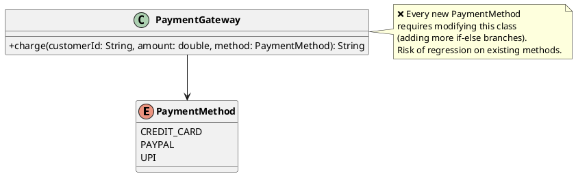
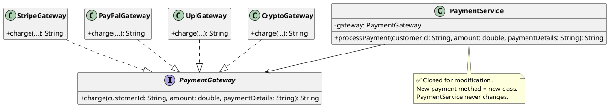
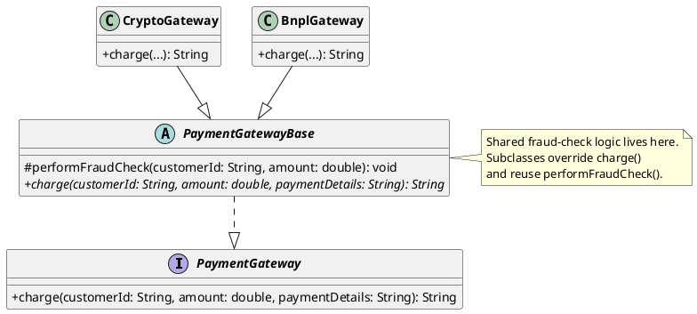

# 2. Open/Closed Principle (OCP)

## 1. What is it?

The Open/Closed Principle states that "Software entities (classes, modules, functions, etc.) should be open for extension, but closed for modification."

**Open for extension**: You should be able to add new features or behaviors to a class.

**Closed for modification**: You should be able to add these new features without changing the existing source code of that class.

## 2. Why is it needed?

- **Regression Bug Prevention**: Touching existing, tested, and working code is risky. By adding new features via new files/classes instead of editing old ones, you drastically reduce the chance of breaking existing functionality.
- **Easier Testing**: When you add a new feature, you only need to write unit tests for the new class you created. You don't have to rewrite or fix the unit tests for the old code.
- **Scalability**: As an application grows, switch statements and if-else chains can become hundreds of lines long. OCP prevents files from bloating into unmaintainable monsters.

## 3. Code Example in Java (The Violation)

Continuing our payment system story from SRP: we separated responsibilities nicely, but our `PaymentGateway` implementation has a problem. Every time the business wants to support a new payment method, we modify the same class.

```java
public enum PaymentMethod {
    CREDIT_CARD,
    PAYPAL,
    UPI
}

public class PaymentGateway {

    public String charge(String customerId, double amount, PaymentMethod method) {
        String txnId = "TXN-" + System.currentTimeMillis();

        // Violation: Every new payment method = modify this class!
        if (method == PaymentMethod.CREDIT_CARD) {
            System.out.println("Connecting to Stripe... Charging card $" + amount);
        } else if (method == PaymentMethod.PAYPAL) {
            System.out.println("Redirecting to PayPal... Charging $" + amount);
        } else if (method == PaymentMethod.UPI) {
            System.out.println("Initiating UPI payment of ₹" + amount);
        }
        // Tomorrow: CRYPTO? BNPL? Apple Pay? More else-if branches...

        return txnId;
    }
}
```

**The Problem**: Marketing wants to add Crypto payments next month, then Buy-Now-Pay-Later the month after. Each time, we open `PaymentGateway.java` and add another else-if. The class is not closed for modification — every new payment method risks breaking the existing, tested ones.

### UML Diagram (Violation)



## 4. Code Example in Java (The Fix & Java Benefits)

We fix this by defining a `PaymentGateway` interface. Each payment method gets its own class. The `PaymentService` (our orchestrator from SRP) depends on the interface — it never needs modification when new methods are added.

### Approach A: Using an Interface

```java
// 1. The abstraction (The "Closed" part - this never changes)
public interface PaymentGateway {
    String charge(String customerId, double amount, String paymentDetails);
}

// 2. Concrete implementations (The "Open" part - add new ones freely)
public class StripeGateway implements PaymentGateway {
    @Override
    public String charge(String customerId, double amount, String paymentDetails) {
        System.out.println("Stripe: Charging $" + amount + " to card ending in " + paymentDetails.substring(12));
        return "TXN-STRIPE-" + System.currentTimeMillis();
    }
}

public class PayPalGateway implements PaymentGateway {
    @Override
    public String charge(String customerId, double amount, String paymentDetails) {
        System.out.println("PayPal: Charging $" + amount + " to account " + paymentDetails);
        return "TXN-PAYPAL-" + System.currentTimeMillis();
    }
}

public class UpiGateway implements PaymentGateway {
    @Override
    public String charge(String customerId, double amount, String paymentDetails) {
        System.out.println("UPI: Transferring ₹" + amount + " via " + paymentDetails);
        return "TXN-UPI-" + System.currentTimeMillis();
    }
}

// 3. The PaymentService NEVER changes when we add CryptoGateway, BnplGateway, etc.
public class PaymentService {
    private final PaymentGateway gateway;

    public PaymentService(PaymentGateway gateway) {
        this.gateway = gateway;
    }

    public String processPayment(String customerId, double amount, String paymentDetails) {
        return gateway.charge(customerId, amount, paymentDetails);
    }
}
```

### Approach B: Using an Abstract Class (Shared Logic)

When gateways share common behavior (e.g., fraud check before charging), use an abstract class.

```java
// 1. Abstract base with shared logic
public abstract class PaymentGatewayBase implements PaymentGateway {

    // Shared: All gateways run a basic fraud check
    protected void performFraudCheck(String customerId, double amount) {
        if (amount > 10000) {
            System.out.println("⚠️ High-value transaction. Flagging for review.");
        }
    }

    @Override
    public abstract String charge(String customerId, double amount, String paymentDetails);
}

// 2. Concrete implementations reuse shared logic
public class CryptoGateway extends PaymentGatewayBase {
    @Override
    public String charge(String customerId, double amount, String paymentDetails) {
        performFraudCheck(customerId, amount); // Reuse!
        System.out.println("Crypto: Transferring " + amount + " USDT to wallet " + paymentDetails);
        return "TXN-CRYPTO-" + System.currentTimeMillis();
    }
}

public class BnplGateway extends PaymentGatewayBase {
    @Override
    public String charge(String customerId, double amount, String paymentDetails) {
        performFraudCheck(customerId, amount); // Reuse!
        System.out.println("BNPL: Splitting $" + amount + " into 4 installments for " + customerId);
        return "TXN-BNPL-" + System.currentTimeMillis();
    }
}
```

### UML Diagram (Fix — Interface Approach)



### UML Diagram (Fix — Abstract Class Approach)



**Java Specific Benefits Here**:

- **Zero Modification**: Adding Apple Pay next quarter? Create `ApplePayGateway implements PaymentGateway`. The `PaymentService` and all existing gateways remain untouched.
- **Spring Dependency Injection**: Use `@Qualifier("stripe")` or inject a `Map<String, PaymentGateway>` to dynamically resolve the right gateway at runtime based on the user's selection.

## 5. Implementation Guidelines

- **The "Switch/If" Smell**: If you see a switch statement or an if-else chain checking the type or status of an object to execute different business logic, you are likely violating OCP.
- **Abstract the Volatile Parts**: Identify the parts of your application that change most frequently (e.g., pricing rules, export formats like PDF/CSV, notification types like SMS/Email) and hide them behind an interface or abstract class.
- **Interface vs Abstract Class**: Use an interface if the rules share no code and simply need a guaranteed method signature. Use an abstract class if the rules share common base logic or state that you don't want to duplicate in every single implementation.
- **Don't Pre-Optimize (YAGNI)**: Don't make an interface for everything on day one. A common rule is "Fool me once, shame on you. Fool me twice, shame on me." If you have to modify an if statement once, just do it. If you have to modify it a second time for a third condition, refactor it to follow OCP.
- **Use the Strategy Pattern**: OCP and the Strategy Design Pattern go hand-in-hand. When in doubt, look up how to implement a Strategy Pattern in Java.

---

## 6. How to Identify OCP Violations — Red Flags

Any time you see these patterns, you likely have an OCP violation:

1. **if-else / switch on type or status** — adding a new type means editing this class
2. **`instanceof` checks** — branching logic based on concrete type
3. **Enum-driven behavior** — an enum controlling which code path runs
4. **A class that gets modified every sprint** — every new feature touches the same file

---

## 7. All Variations to Fix OCP Violations

### Variation 1: Strategy Pattern (Interface)

The most common fix. Each behavior is its own class behind an interface.

```java
// Abstraction
public interface ShippingStrategy {
    double calculateCost(double weight);
}

// Strategies - add new ones without touching existing code
public class StandardShipping implements ShippingStrategy {
    public double calculateCost(double weight) { return weight * 2.5; }
}

public class ExpressShipping implements ShippingStrategy {
    public double calculateCost(double weight) { return weight * 5.0; }
}

public class DroneShipping implements ShippingStrategy {
    public double calculateCost(double weight) { return weight * 8.0; }
}

// Consumer - never modified
public class ShippingCalculator {
    public double calculate(ShippingStrategy strategy, double weight) {
        return strategy.calculateCost(weight);
    }
}
```

**When to use**: Behaviors are interchangeable, no shared logic between implementations.

---

### Variation 2: Template Method Pattern (Abstract Class)

When implementations share common steps but differ in specific parts.

```java
public abstract class ReportGenerator {

    // Template method - defines the skeleton
    public final void generate(List<String> data) {
        formatHeader();
        for (String row : data) {
            formatRow(row);
        }
        formatFooter();
    }

    protected abstract void formatHeader();
    protected abstract void formatRow(String row);
    protected abstract void formatFooter();
}

public class CsvReportGenerator extends ReportGenerator {
    protected void formatHeader() { System.out.println("Name,Email,Amount"); }
    protected void formatRow(String row) { System.out.println(row); }
    protected void formatFooter() { System.out.println("--- END ---"); }
}

public class HtmlReportGenerator extends ReportGenerator {
    protected void formatHeader() { System.out.println("<table><tr><th>Data</th></tr>"); }
    protected void formatRow(String row) { System.out.println("<tr><td>" + row + "</td></tr>"); }
    protected void formatFooter() { System.out.println("</table>"); }
}
```

**When to use**: The algorithm's skeleton is fixed, but individual steps vary.

---

### Variation 3: Decorator Pattern

When you want to layer/stack behaviors on top of each other without modifying the original.

```java
public interface Notifier {
    void send(String message);
}

public class EmailNotifier implements Notifier {
    public void send(String message) { System.out.println("Email: " + message); }
}

// Decorators - extend behavior without touching EmailNotifier
public class SmsNotifierDecorator implements Notifier {
    private final Notifier wrapped;

    public SmsNotifierDecorator(Notifier wrapped) { this.wrapped = wrapped; }

    public void send(String message) {
        wrapped.send(message);
        System.out.println("SMS: " + message); // Added behavior
    }
}

public class SlackNotifierDecorator implements Notifier {
    private final Notifier wrapped;

    public SlackNotifierDecorator(Notifier wrapped) { this.wrapped = wrapped; }

    public void send(String message) {
        wrapped.send(message);
        System.out.println("Slack: " + message);
    }
}

// Usage - compose behaviors dynamically
Notifier notifier = new SlackNotifierDecorator(new SmsNotifierDecorator(new EmailNotifier()));
notifier.send("Server is down!");
// Output: Email → SMS → Slack
```

**When to use**: You need to add responsibilities to objects dynamically without subclassing.

---

### Variation 4: Chain of Responsibility

When you have a series of validators/processors and want to add new ones without touching existing code.

```java
public abstract class ValidationHandler {
    private ValidationHandler next;

    public ValidationHandler setNext(ValidationHandler next) {
        this.next = next;
        return next;
    }

    public void validate(Order order) {
        doValidate(order);
        if (next != null) {
            next.validate(order);
        }
    }

    protected abstract void doValidate(Order order);
}

public class StockValidation extends ValidationHandler {
    protected void doValidate(Order order) {
        System.out.println("Checking stock for order " + order.getOrderId());
    }
}

public class PaymentValidation extends ValidationHandler {
    protected void doValidate(Order order) {
        System.out.println("Validating payment for order " + order.getOrderId());
    }
}

// Add new validation without modifying existing ones
public class FraudCheckValidation extends ValidationHandler {
    protected void doValidate(Order order) {
        System.out.println("Running fraud check for order " + order.getOrderId());
    }
}

// Wire them up
ValidationHandler chain = new StockValidation();
chain.setNext(new PaymentValidation()).setNext(new FraudCheckValidation());
chain.validate(order);
```

**When to use**: Multiple processors/validators in sequence, and you frequently add new ones.

---

### Variation 5: Factory Pattern + Registry

When you need to pick the right implementation at runtime based on a key, but don't want if-else chains.

```java
public interface PaymentHandler {
    void pay(double amount);
}

public class CreditCardHandler implements PaymentHandler {
    public void pay(double amount) { System.out.println("CC charge: $" + amount); }
}

public class UpiHandler implements PaymentHandler {
    public void pay(double amount) { System.out.println("UPI transfer: $" + amount); }
}

// Registry - new handlers register themselves, no if-else needed
public class PaymentHandlerRegistry {
    private final Map<String, PaymentHandler> handlers = new HashMap<>();

    public void register(String type, PaymentHandler handler) {
        handlers.put(type, handler);
    }

    public PaymentHandler getHandler(String type) {
        PaymentHandler handler = handlers.get(type);
        if (handler == null) throw new IllegalArgumentException("Unknown payment type: " + type);
        return handler;
    }
}

// Usage
PaymentHandlerRegistry registry = new PaymentHandlerRegistry();
registry.register("CREDIT_CARD", new CreditCardHandler());
registry.register("UPI", new UpiHandler());
// Adding a new one? Just register it. No existing code changes.

registry.getHandler("UPI").pay(500);
```

**When to use**: Runtime selection of behavior based on a key/type. Replaces switch/enum patterns.

---

### Variation 6: Observer/Event Pattern

When you need to add new reactions to an event without modifying the event source.

```java
public interface OrderEventListener {
    void onOrderPlaced(Order order);
}

public class InventoryListener implements OrderEventListener {
    public void onOrderPlaced(Order order) { System.out.println("Reserving stock..."); }
}

public class NotificationListener implements OrderEventListener {
    public void onOrderPlaced(Order order) { System.out.println("Sending email..."); }
}

// Add new listener without touching OrderService
public class AnalyticsListener implements OrderEventListener {
    public void onOrderPlaced(Order order) { System.out.println("Tracking analytics..."); }
}

public class OrderService {
    private final List<OrderEventListener> listeners = new ArrayList<>();

    public void addListener(OrderEventListener listener) { listeners.add(listener); }

    public void placeOrder(Order order) {
        System.out.println("Order placed!");
        listeners.forEach(l -> l.onOrderPlaced(order));
    }
}
```

**When to use**: Multiple independent reactions to a single event, and you frequently add new reactions.

---

## 8. Quick Reference Table

| Violation Pattern | Fix |
|---|---|
| if-else / switch on type | Strategy or Factory+Registry |
| Shared algorithm, varying steps | Template Method |
| Need to add behavior on top of existing | Decorator |
| Sequential validators/processors | Chain of Responsibility |
| Multiple reactions to one event | Observer |

The core idea is always the same: **depend on an abstraction, and add new behavior by creating new classes rather than editing existing ones.**


