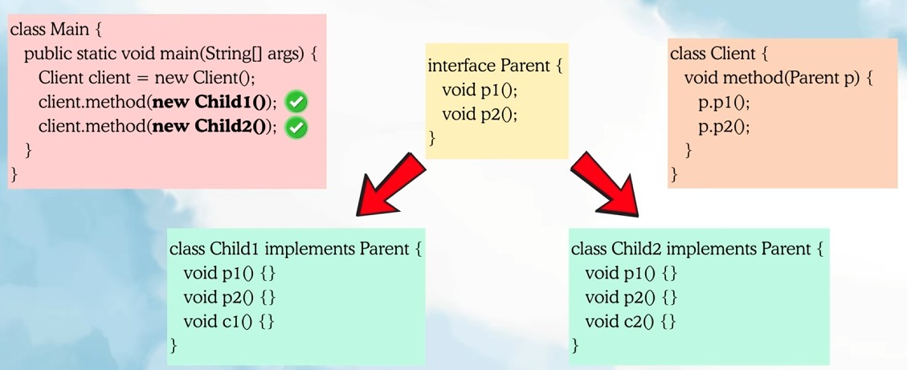
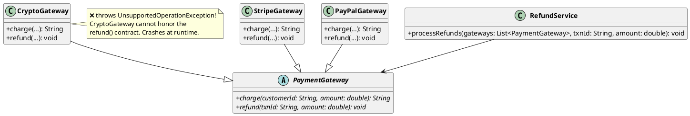
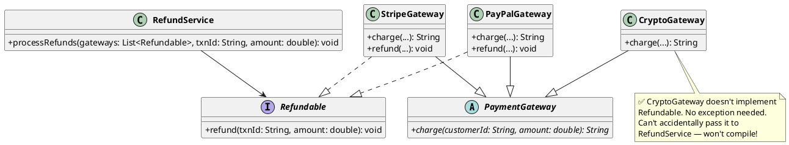

# 3. Liskov Substitution Principle (LSP)

## 1. What is it?

"Objects of a base class shall be replaceable with objects of its derived class without breaking the application."

In simpler terms: If you have a base class and a child class, you should be able to swap out the base class for the child class anywhere in your code, and the program should still behave perfectly normally.


Even though inheritance allows substitution, there are certain scenarios where substituting the child object actually breaks the expected behaviour of the program.

## 2. Why is it needed?

- **Predictability**: When a developer writes a method that accepts a base class (like `Employee`), they expect any child class (like `FullTimeEmployee` or `Contractor`) to honor the rules of `Employee`. If passing a `Contractor` makes the payroll calculation crash, the hierarchy is broken.
- **Avoiding Type Checking**: If you constantly have to write `if (obj instanceof Contractor) { // do something else }` to prevent crashes, you are violating LSP and defeating the entire purpose of Polymorphism.
- **Interface Reliability**: It ensures that interfaces and base classes are actually trustworthy contracts.

## 3. Code Example in Java (The Violation)

Continuing our payment system: thanks to OCP, we have multiple `PaymentGateway` implementations. Now the business wants to add refund support. A developer adds `refund()` to the base class, assuming all gateways can refund. But `CryptoGateway` can't — crypto transactions are irreversible on-chain.

```java
import java.util.List;

// Base class now forces ALL gateways to support refunds
public abstract class PaymentGateway {
    public abstract String charge(String customerId, double amount);
    public abstract void refund(String txnId, double amount);  // ← Added for refunds
}

public class StripeGateway extends PaymentGateway {
    @Override
    public String charge(String customerId, double amount) {
        System.out.println("Stripe: Charging $" + amount);
        return "TXN-STRIPE-" + System.currentTimeMillis();
    }

    @Override
    public void refund(String txnId, double amount) {
        System.out.println("Stripe: Refunding $" + amount + " for " + txnId);
    }
}

public class PayPalGateway extends PaymentGateway {
    @Override
    public String charge(String customerId, double amount) {
        System.out.println("PayPal: Charging $" + amount);
        return "TXN-PAYPAL-" + System.currentTimeMillis();
    }

    @Override
    public void refund(String txnId, double amount) {
        System.out.println("PayPal: Refunding $" + amount + " for " + txnId);
    }
}

public class CryptoGateway extends PaymentGateway {
    @Override
    public String charge(String customerId, double amount) {
        System.out.println("Crypto: Transferring " + amount + " USDT");
        return "TXN-CRYPTO-" + System.currentTimeMillis();
    }

    @Override
    public void refund(String txnId, double amount) {
        // VIOLATION! Crypto payments cannot be refunded on-chain!
        throw new UnsupportedOperationException("Crypto transactions are irreversible!");
    }
}

public class RefundService {
    public void processRefunds(List<PaymentGateway> gateways, String txnId, double amount) {
        for (PaymentGateway gateway : gateways) {
            // If CryptoGateway is in this list, the application CRASHES!
            gateway.refund(txnId, amount);
        }
    }
}
```

**The Problem**: `CryptoGateway` IS-A `PaymentGateway`, but it cannot be substituted when refunds are involved. The `RefundService` assumes all gateways can refund. We violated the Liskov contract.

### UML Diagram (Violation)



## 4. Code Example in Java (The Fix & Java Benefits)

We fix this by separating `refund()` into its own `Refundable` interface. Only gateways that truly support refunds implement it. The `CryptoGateway` simply doesn't — no exceptions, no lies.

```java
import java.util.List;

// 1. Base class with ONLY what ALL gateways can do
public abstract class PaymentGateway {
    public abstract String charge(String customerId, double amount);
}

// 2. A specific interface ONLY for gateways that support refunds
public interface Refundable {
    void refund(String txnId, double amount);
}

// 3. StripeGateway IS a PaymentGateway AND supports refunds
public class StripeGateway extends PaymentGateway implements Refundable {
    @Override
    public String charge(String customerId, double amount) {
        System.out.println("Stripe: Charging $" + amount);
        return "TXN-STRIPE-" + System.currentTimeMillis();
    }

    @Override
    public void refund(String txnId, double amount) {
        System.out.println("Stripe: Refunding $" + amount + " for " + txnId);
    }
}

// 4. PayPalGateway IS a PaymentGateway AND supports refunds
public class PayPalGateway extends PaymentGateway implements Refundable {
    @Override
    public String charge(String customerId, double amount) {
        System.out.println("PayPal: Charging $" + amount);
        return "TXN-PAYPAL-" + System.currentTimeMillis();
    }

    @Override
    public void refund(String txnId, double amount) {
        System.out.println("PayPal: Refunding $" + amount + " for " + txnId);
    }
}

// 5. CryptoGateway IS a PaymentGateway, but CANNOT refund. Doesn't implement Refundable.
public class CryptoGateway extends PaymentGateway {
    @Override
    public String charge(String customerId, double amount) {
        System.out.println("Crypto: Transferring " + amount + " USDT");
        return "TXN-CRYPTO-" + System.currentTimeMillis();
    }
    // No refund(). No exception. No violation.
}

// 6. RefundService explicitly asks for Refundable — impossible to pass CryptoGateway!
public class RefundService {
    public void processRefunds(List<Refundable> refundableGateways, String txnId, double amount) {
        for (Refundable gateway : refundableGateways) {
            gateway.refund(txnId, amount); // 100% safe. No exceptions thrown.
        }
    }
}
```

**Java Specific Benefits Here**:

- **Compile-Time Safety**: If you try to pass `CryptoGateway` into `RefundService.processRefunds()`, the Java compiler instantly rejects it. You catch the bug while coding, not in production.
- **Clean Hierarchy**: Java's ability to do `extends PaymentGateway implements Refundable` makes this separation seamless. Each gateway only carries capabilities it can genuinely fulfill.

### UML Diagram (Fix)



## 5. Implementation Guidelines

- No new exceptions should be thrown by the subclass for methods defined in the base class.
- Clients should not know which specific subtype they are calling.
- New derived classes just extend without replacing the functionality of old classes.

---

## 6. How to Identify LSP Violations — Red Flags

Any time you see these patterns, you likely have an LSP violation:

1. **`throw new UnsupportedOperationException()`** in an overridden method — the subclass can't honor the parent's contract
2. **`instanceof` checks in client code** — the caller has to check the concrete type to avoid crashes
3. **Empty or no-op overrides** — a method that does nothing because it "doesn't apply" to this subclass
4. **Overriding a method to restrict behavior** — e.g., making a setter throw an exception in a "read-only" subclass
5. **Strengthening preconditions** — the subclass demands more than the parent (extra validation the parent didn't require)
6. **Weakening postconditions** — the subclass returns less or different results than the parent promises
7. **Violating invariants** — the subclass allows a state the parent guarantees can never happen

---

## 7. All Variations to Fix LSP Violations

### Variation 1: Segregate with Interfaces (Most Common)

The subclass can't do something the parent promises? Split the capability into a separate interface.

```java
// BAD: Bird base class forces all birds to fly
public abstract class Bird {
    public abstract void fly();
}

public class Penguin extends Bird {
    public void fly() { throw new UnsupportedOperationException("Penguins can't fly!"); }
}

// GOOD: Separate the capability into an interface
public abstract class Bird {
    public abstract void eat();
}

public interface Flyable {
    void fly();
}

public class Sparrow extends Bird implements Flyable {
    public void eat() { System.out.println("Eating seeds..."); }
    public void fly() { System.out.println("Flying high!"); }
}

public class Penguin extends Bird {
    public void eat() { System.out.println("Eating fish..."); }
    // No fly() method. No exception. No violation.
}
```

**When to use**: A subclass cannot logically perform an action that the parent defines. Extract that action into an interface that only capable classes implement.

---

### Variation 2: Refactor the Hierarchy (Flatten & Re-model)

The inheritance tree itself is wrong. The "IS-A" relationship doesn't actually hold.

```java
// BAD: Square IS-A Rectangle? Mathematically yes. Behaviorally NO.
public class Rectangle {
    protected int width;
    protected int height;

    public void setWidth(int width) { this.width = width; }
    public void setHeight(int height) { this.height = height; }
    public int getArea() { return width * height; }
}

public class Square extends Rectangle {
    // Violates LSP: overriding to enforce width == height breaks Rectangle's contract
    @Override
    public void setWidth(int width) { this.width = width; this.height = width; }
    @Override
    public void setHeight(int height) { this.width = height; this.height = height; }
}

// Client code breaks:
Rectangle rect = new Square();
rect.setWidth(5);
rect.setHeight(3);
// Expected area: 15. Actual area: 9. LSP VIOLATED.

// GOOD: Don't force an IS-A relationship. Use a common interface instead.
public interface Shape {
    int getArea();
}

public class Rectangle implements Shape {
    private final int width;
    private final int height;

    public Rectangle(int width, int height) { this.width = width; this.height = height; }
    public int getArea() { return width * height; }
}

public class Square implements Shape {
    private final int side;

    public Square(int side) { this.side = side; }
    public int getArea() { return side * side; }
}
```

**When to use**: The IS-A inheritance is conceptually wrong. The subclass fundamentally changes behavior. Break the hierarchy and use composition or a shared interface instead.

---

### Variation 3: Use Composition Over Inheritance

Instead of inheriting from a class and overriding methods with exceptions, contain it and expose only what makes sense.

```java
// BAD: ReadOnlyList extends ArrayList but throws on mutation methods
public class ReadOnlyList<T> extends ArrayList<T> {
    @Override
    public boolean add(T item) { throw new UnsupportedOperationException(); }
    @Override
    public T remove(int index) { throw new UnsupportedOperationException(); }
    // Dozens more overrides...
}

// GOOD: Compose instead of inherit. Expose only what you support.
public class ReadOnlyList<T> {
    private final List<T> inner;

    public ReadOnlyList(List<T> source) { this.inner = List.copyOf(source); }

    public T get(int index) { return inner.get(index); }
    public int size() { return inner.size(); }
    public boolean contains(T item) { return inner.contains(item); }
    // No add(), no remove(). Can't violate a contract that doesn't exist.
}
```

**When to use**: You want to reuse behavior from a class but can't honor all of its methods. Wrap it instead of extending it.

---

### Variation 4: Introduce Abstract Base with Weaker Contract

If the parent's contract is too strong, create a more general abstraction that all subtypes can truthfully implement.

```java
// BAD: All accounts forced to implement withdraw()
public abstract class BankAccount {
    protected double balance;
    public abstract void withdraw(double amount);
    public abstract void deposit(double amount);
}

public class FixedDepositAccount extends BankAccount {
    public void withdraw(double amount) {
        throw new UnsupportedOperationException("Cannot withdraw from FD before maturity!");
    }
    public void deposit(double amount) { this.balance += amount; }
}

// GOOD: Split into a weaker base + capability interface
public abstract class BankAccount {
    protected double balance;
    public abstract void deposit(double amount);
    public double getBalance() { return balance; }
}

public interface Withdrawable {
    void withdraw(double amount);
}

public class SavingsAccount extends BankAccount implements Withdrawable {
    public void deposit(double amount) { balance += amount; }
    public void withdraw(double amount) { balance -= amount; }
}

public class FixedDepositAccount extends BankAccount {
    public void deposit(double amount) { balance += amount; }
    // No withdraw. No exception. No violation.
}
```

**When to use**: Some subclasses can't fulfill part of the parent's contract. Weaken the base class and push specific capabilities into interfaces.

---

### Variation 5: Design by Contract (Preconditions / Postconditions)

Ensure subclasses follow the "rules of substitution" explicitly:
- **Preconditions cannot be strengthened** (subclass can't demand more)
- **Postconditions cannot be weakened** (subclass can't deliver less)

```java
// BAD: Subclass strengthens precondition
public class Discount {
    public double apply(double amount) {
        return amount * 0.9; // Works for any positive amount
    }
}

public class PremiumDiscount extends Discount {
    @Override
    public double apply(double amount) {
        if (amount < 100) throw new IllegalArgumentException("Minimum $100 for premium!");
        // VIOLATION: Parent accepts any amount, child rejects small amounts
        return amount * 0.7;
    }
}

// GOOD: Subclass is equally permissive (or more)
public class PremiumDiscount extends Discount {
    @Override
    public double apply(double amount) {
        if (amount >= 100) return amount * 0.7; // Better discount for big orders
        return amount * 0.9; // Fallback to standard for small orders
    }
}
```

**When to use**: The inheritance is correct, but the subclass is being too restrictive or too lenient. Fix the method logic to honor the parent's contract boundaries.

---

### Variation 6: Null Object Pattern

Instead of throwing an exception for "not applicable" behavior, provide a safe no-op implementation.

```java
// BAD: A "Guest" user throws on getProfile()
public abstract class User {
    public abstract String getName();
    public abstract UserProfile getProfile();
}

public class Guest extends User {
    public String getName() { return "Guest"; }
    public UserProfile getProfile() {
        throw new UnsupportedOperationException("Guests don't have profiles!");
    }
}

// GOOD: Return a safe default instead of throwing
public class Guest extends User {
    public String getName() { return "Guest"; }
    public UserProfile getProfile() {
        return UserProfile.empty(); // Null Object - safe, predictable, no crash
    }
}

public class UserProfile {
    private static final UserProfile EMPTY = new UserProfile("N/A", "N/A");

    public static UserProfile empty() { return EMPTY; }

    private String bio;
    private String avatar;

    public UserProfile(String bio, String avatar) { this.bio = bio; this.avatar = avatar; }
}
```

**When to use**: The subclass *can* technically have the method, but doesn't have meaningful data. Return a safe default instead of throwing.

---

## 8. Quick Reference Table

| Violation Pattern | Fix |
|---|---|
| Throws `UnsupportedOperationException` in override | Segregate with Interfaces (Variation 1) |
| IS-A relationship is conceptually wrong (Square/Rectangle) | Refactor the Hierarchy (Variation 2) |
| Subclass can't honor most of the parent's methods | Composition over Inheritance (Variation 3) |
| Parent contract is too strong for some subtypes | Weaker Abstract Base + Interfaces (Variation 4) |
| Subclass adds extra validation / restrictions | Honor Design by Contract rules (Variation 5) |
| Method "not applicable" but hierarchy is otherwise fine | Null Object Pattern (Variation 6) |

The core rule: **if you can't swap a subclass for its parent without the program behaving incorrectly, your inheritance is lying.** Fix the lie.

---

## 9. LSP vs OCP — The Core Difference

**LSP Fix**: When a subclass *can't honor* the parent's contract, you **break the inheritance** and extract that capability into a separate interface. Only classes that can genuinely fulfill the contract implement it.

→ "Don't force a class into a contract it can't keep. Split it out." (Diverge)

| Principle | Problem | Fix Direction |
|---|---|---|
| OCP | Adding a new behavior forces editing existing code | **Merge** — bring similar behaviors under one abstraction |
| LSP | A subclass breaks because it can't do what the parent promises | **Split** — pull the problematic capability into its own interface |

LSP is about **fixing broken hierarchies** — these things don't belong together, break them apart.
