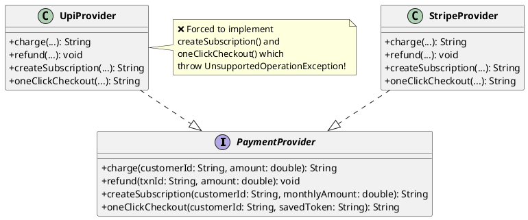
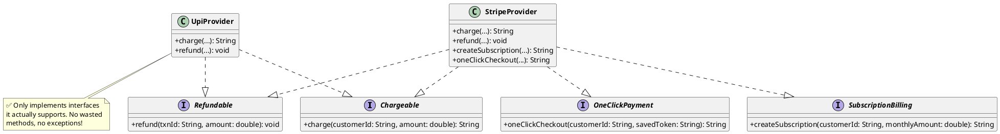

# 4. Interface Segregation Principle (ISP)

## 1. What is it?

"Clients should not be forced to depend upon interfaces that they do not use."

In simpler terms: Do not create massive, "fat" interfaces that contain a dozen different methods if a class only needs to use one or two of them. Instead, break that large interface down into smaller, highly cohesive, specific interfaces.

## 2. Why is it needed?

- **Reduces Code Bloat**: If a class is forced to implement a giant interface, the developer has to write empty methods or throw exceptions for the methods they don't care about.
- **Reduces Coupling**: If an interface has 10 methods, and you change the signature of just one method, every single class that implements that interface must be recompiled and updated, even if they never use that specific method.
- **Better Intent**: Smaller interfaces clearly communicate what a class is capable of doing.

## 3. Code Example in Java (The Violation)

Continuing our payment system: we've separated gateways nicely (OCP) and split refund capability (LSP). Now a developer decides to create a single "all-in-one" `PaymentProvider` interface to standardize everything. Every gateway must implement charge, refund, subscription billing, and one-click checkout — even if they don't support all of these.

```java
// The "Fat" Interface — forces ALL providers to support everything
public interface PaymentProvider {
    String charge(String customerId, double amount);
    void refund(String txnId, double amount);
    String createSubscription(String customerId, double monthlyAmount);
    String oneClickCheckout(String customerId, String savedToken);
}

// Stripe supports everything perfectly.
public class StripeProvider implements PaymentProvider {
    @Override
    public String charge(String customerId, double amount) {
        System.out.println("Stripe: Charging $" + amount);
        return "TXN-" + System.currentTimeMillis();
    }

    @Override
    public void refund(String txnId, double amount) {
        System.out.println("Stripe: Refunding $" + amount);
    }

    @Override
    public String createSubscription(String customerId, double monthlyAmount) {
        System.out.println("Stripe: Creating subscription of $" + monthlyAmount + "/mo");
        return "SUB-" + System.currentTimeMillis();
    }

    @Override
    public String oneClickCheckout(String customerId, String savedToken) {
        System.out.println("Stripe: One-click charge using token " + savedToken);
        return "TXN-1CLICK-" + System.currentTimeMillis();
    }
}

// The Violation: UPI doesn't support subscriptions or one-click!
public class UpiProvider implements PaymentProvider {
    @Override
    public String charge(String customerId, double amount) {
        System.out.println("UPI: Collecting ₹" + amount);
        return "TXN-UPI-" + System.currentTimeMillis();
    }

    @Override
    public void refund(String txnId, double amount) {
        System.out.println("UPI: Refunding ₹" + amount);
    }

    @Override
    public String createSubscription(String customerId, double monthlyAmount) {
        // Forced to implement! UPI has no native subscription support.
        throw new UnsupportedOperationException("UPI does not support subscriptions.");
    }

    @Override
    public String oneClickCheckout(String customerId, String savedToken) {
        // Forced to implement! UPI doesn't store tokens for one-click.
        throw new UnsupportedOperationException("UPI does not support one-click checkout.");
    }
}
```

**The Problem**: `UpiProvider` is forced to carry around `createSubscription()` and `oneClickCheckout()` that it can never fulfill. Any service that calls these methods on a `UpiProvider` will crash. This also violates LSP, because a `UpiProvider` cannot be substituted anywhere a `PaymentProvider` is expected.

### UML Diagram (Violation)



## 4. Code Example in Java (The Fix & Java Benefits)

We break the fat interface into small, role-specific interfaces. Each provider only implements the interfaces that match its actual capabilities.

```java
// 1. Segregated interfaces — each represents one capability
public interface Chargeable {
    String charge(String customerId, double amount);
}

public interface Refundable {
    void refund(String txnId, double amount);
}

public interface SubscriptionBilling {
    String createSubscription(String customerId, double monthlyAmount);
}

public interface OneClickPayment {
    String oneClickCheckout(String customerId, String savedToken);
}

// 2. Stripe implements ALL capabilities because it supports them all
public class StripeProvider implements Chargeable, Refundable, SubscriptionBilling, OneClickPayment {
    @Override
    public String charge(String customerId, double amount) {
        System.out.println("Stripe: Charging $" + amount);
        return "TXN-" + System.currentTimeMillis();
    }

    @Override
    public void refund(String txnId, double amount) {
        System.out.println("Stripe: Refunding $" + amount);
    }

    @Override
    public String createSubscription(String customerId, double monthlyAmount) {
        System.out.println("Stripe: Creating subscription of $" + monthlyAmount + "/mo");
        return "SUB-" + System.currentTimeMillis();
    }

    @Override
    public String oneClickCheckout(String customerId, String savedToken) {
        System.out.println("Stripe: One-click charge using token " + savedToken);
        return "TXN-1CLICK-" + System.currentTimeMillis();
    }
}

// 3. UPI ONLY implements what it actually supports!
public class UpiProvider implements Chargeable, Refundable {
    @Override
    public String charge(String customerId, double amount) {
        System.out.println("UPI: Collecting ₹" + amount);
        return "TXN-UPI-" + System.currentTimeMillis();
    }

    @Override
    public void refund(String txnId, double amount) {
        System.out.println("UPI: Refunding ₹" + amount);
    }

    // No subscription. No one-click. No exceptions!
}

// 4. A SubscriptionService only asks for what it needs
public class SubscriptionService {
    private final SubscriptionBilling billingProvider;

    public SubscriptionService(SubscriptionBilling billingProvider) {
        this.billingProvider = billingProvider;
    }

    public String subscribe(String customerId, double monthlyAmount) {
        return billingProvider.createSubscription(customerId, monthlyAmount);
    }
}
```

### UML Diagram (Fix)



**Java Specific Benefits Here**:

- **Multiple Interface Implementation**: Java allows `class StripeProvider implements Chargeable, Refundable, SubscriptionBilling, OneClickPayment`. Each provider picks only the interfaces it can fulfill.
- **Granular Dependency Injection**: The `SubscriptionService` only depends on `SubscriptionBilling`. It's impossible to accidentally inject a `UpiProvider` here — it simply doesn't implement that interface. The compiler catches the mistake.

## 5. Implementation Guidelines

- **The `UnsupportedOperationException` Red Flag**: Just like with LSP, if you find yourself writing `throw new UnsupportedOperationException()` inside an interface implementation, you have almost certainly violated ISP.
- **Client-Specific Interfaces**: Interfaces should be designed based on what the client (the code calling the methods) needs, not based on what the class implementing it happens to have.
- **Keep them small**: An interface with 1 to 3 methods is usually a good sign. An interface with 15 methods is a giant red flag.
