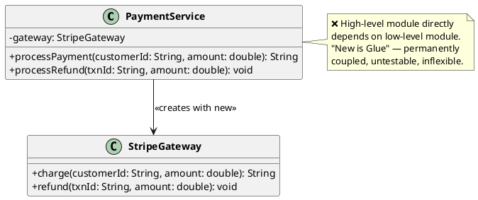
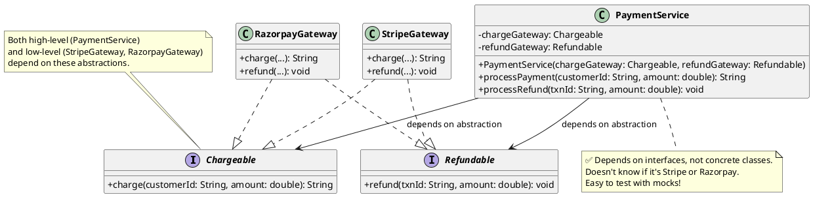

# 5. Dependency Inversion Principle (DIP)

## 1. What is it?

The Dependency Inversion Principle states two things:

- High-level modules should not depend on low-level modules. Both should depend on abstractions.
- Abstractions should not depend on details. Details should depend on abstractions.

In simpler terms: Your core business logic (high-level) shouldn't care about the nitty-gritty details of how data is saved to a database or how an email is formatted (low-level). Instead, both should rely on an Interface (abstraction) that dictates a contract.

## 2. Why is it needed?

- **Decoupling**: If your core application is tightly glued to MySQL, migrating to PostgreSQL or MongoDB requires rewriting your core business logic. DIP prevents this.
- **Testability**: You cannot easily write automated unit tests if your class insists on sending real emails or hitting a real database. DIP allows you to inject "Fake" or "Mock" interfaces during testing.
- **Flexibility**: It allows you to swap out components on the fly without touching the most critical and sensitive parts of your application.

## 3. Code Example in Java (The Violation)

Continuing our payment system: we have nice segregated interfaces (ISP), but a new developer writes the `PaymentService` by directly creating a `StripeGateway` inside it. The high-level orchestrator is now permanently glued to a specific low-level payment provider.

```java
// Low-Level Module (concrete implementation)
public class StripeGateway {
    public String charge(String customerId, double amount) {
        System.out.println("Stripe: Charging $" + amount + " for " + customerId);
        return "TXN-STRIPE-" + System.currentTimeMillis();
    }

    public void refund(String txnId, double amount) {
        System.out.println("Stripe: Refunding $" + amount + " for " + txnId);
    }
}

// High-Level Module — tightly coupled!
public class PaymentService {
    // VIOLATION: Directly instantiates the low-level module
    private StripeGateway gateway = new StripeGateway();

    public String processPayment(String customerId, double amount) {
        System.out.println("Processing payment...");
        return gateway.charge(customerId, amount);
    }

    public void processRefund(String txnId, double amount) {
        gateway.refund(txnId, amount);
    }
}
```

**The Problem**: The `PaymentService` is completely dependent on `StripeGateway`.

- **"New is Glue"**: Because it uses the `new` keyword to create the gateway, they are permanently glued together.
- **Hard to Test**: If we write a unit test for `processPayment`, it will actually try to hit the Stripe API!
- **Not Flexible**: If the business wants to switch to Razorpay for Indian customers or PayPal for international ones, we have to modify our critical payment orchestration code.

### UML Diagram (Violation)



## 4. Code Example in Java (The Fix & Java Benefits)

We fix this by introducing abstractions (interfaces from our ISP work!) between the high-level and low-level modules. The `PaymentService` depends on interfaces, and the concrete gateways are injected via the constructor.

```java
// 1. The Abstractions (from our ISP work)
public interface Chargeable {
    String charge(String customerId, double amount);
}

public interface Refundable {
    void refund(String txnId, double amount);
}

// 2. Low-Level Module A (depends on abstraction)
public class StripeGateway implements Chargeable, Refundable {
    @Override
    public String charge(String customerId, double amount) {
        System.out.println("Stripe: Charging $" + amount);
        return "TXN-STRIPE-" + System.currentTimeMillis();
    }

    @Override
    public void refund(String txnId, double amount) {
        System.out.println("Stripe: Refunding $" + amount + " for " + txnId);
    }
}

// 3. Low-Level Module B (add new gateways freely!)
public class RazorpayGateway implements Chargeable, Refundable {
    @Override
    public String charge(String customerId, double amount) {
        System.out.println("Razorpay: Charging ₹" + amount);
        return "TXN-RZRPY-" + System.currentTimeMillis();
    }

    @Override
    public void refund(String txnId, double amount) {
        System.out.println("Razorpay: Refunding ₹" + amount + " for " + txnId);
    }
}

// 4. High-Level Module (depends on abstractions, NOT details)
public class PaymentService {
    private final Chargeable chargeGateway;
    private final Refundable refundGateway;

    // DIP FIX: Dependencies are injected via constructor.
    // PaymentService has no idea if it's Stripe, Razorpay, or a mock!
    public PaymentService(Chargeable chargeGateway, Refundable refundGateway) {
        this.chargeGateway = chargeGateway;
        this.refundGateway = refundGateway;
    }

    public String processPayment(String customerId, double amount) {
        System.out.println("Processing payment...");
        return chargeGateway.charge(customerId, amount);
    }

    public void processRefund(String txnId, double amount) {
        refundGateway.refund(txnId, amount);
    }
}
```

**Java Specific Benefits Here**:

- **Spring IoC Container**: In Spring Boot, annotate `@Service` on `RazorpayGateway` and the framework injects it automatically. Switching from Stripe to Razorpay is a one-line configuration change — the `PaymentService` never knows the difference.
- **Mocking Libraries**: In tests, use Mockito: `Chargeable mockGateway = Mockito.mock(Chargeable.class);` then `PaymentService service = new PaymentService(mockGateway, mockRefund);`. Tests run instantly without hitting any real payment API.

### UML Diagram (Fix)



## 5. Implementation Guidelines

- **Remember "New is Glue"**: If you are writing `new SomeService()` inside a business logic class, you are likely violating DIP. Dependencies should be passed in, not created internally.
- **Constructor Injection is King**: Always prefer injecting dependencies through the constructor. It explicitly declares what the class needs to function.
- **Inversion of Control (IoC)**: DIP is the principle, but IoC (using a Dependency Injection container like Spring) is the tool we use in Java to achieve it automatically.
- **Follow the Direction of Dependencies**: Arrows in your architecture diagrams should point inward toward your core domain logic. Your core logic shouldn't point outward to databases or web APIs.
