# SOLID in the Real World: The Complete Picture

Let's look at an E-Commerce Order Processing System that perfectly balances all five principles.

## 1. The Interfaces (ISP & DIP)

Instead of one massive `OrderManager` interface that forces classes to do everything, we segregate our interfaces based on specific roles (`ISP`). Furthermore, our core business logic will depend entirely on these abstractions, not concrete implementations (`DIP`).

```java
// ISP: Small, focused role interfaces
public interface PaymentProcessor {
    boolean processPayment(Order order, PaymentDetails payment);
}

public interface InventoryManager {
    void reserveStock(Order order);
}

public interface OrderNotifier {
    void sendConfirmation(Order order);
}

// OCP: An interface that allows us to add endless discount rules
public interface DiscountPolicy {
    double calculateDiscount(Order order);
}
```

## 2. The Concrete Implementations (LSP & OCP)

Now we create the classes that do the actual work.

Notice how `CreditCardProcessor` and `PayPalProcessor` can be perfectly substituted for one another without crashing the application (`LSP`). Also, if we want to add a `CryptoProcessor` tomorrow, we just create a new file; we don't have to touch existing code (`OCP`).

```java
public class CreditCardProcessor implements PaymentProcessor {
    @Override
    public boolean processPayment(Order order, PaymentDetails payment) {
        // Safe, specific credit card logic
        System.out.println("Charging credit card...");
        return true;
    }
}

public class PayPalProcessor implements PaymentProcessor {
    @Override
    public boolean processPayment(Order order, PaymentDetails payment) {
        // Safe, specific PayPal logic
        System.out.println("Redirecting to PayPal...");
        return true;
    }
}

public class BlackFridayDiscount implements DiscountPolicy {
    @Override
    public double calculateDiscount(Order order) {
        return order.getTotalAmount() * 0.30; // 30% off
    }
}
```

## 3. The Core Business Logic (SRP & DIP)

Here is the heart of the application: The `OrderProcessor`.

Its `Single Responsibility (SRP)` is orchestration. It doesn't know how to charge a credit card, it doesn't know how to send an email, and it doesn't know the rules for Black Friday. It simply coordinates the workflow by delegating tasks to its dependencies.

Because it relies purely on interfaces passed into its constructor (DIP), it is completely decoupled from the infrastructure.

```java
public class OrderProcessor {

    // High-level module depending on abstractions (DIP)
    private final PaymentProcessor paymentProcessor;
    private final InventoryManager inventoryManager;
    private final OrderNotifier notifier;
    private final DiscountPolicy discountPolicy;

    public OrderProcessor(
            PaymentProcessor paymentProcessor,
            InventoryManager inventoryManager,
            OrderNotifier notifier,
            DiscountPolicy discountPolicy) {
        this.paymentProcessor = paymentProcessor;
        this.inventoryManager = inventoryManager;
        this.notifier = notifier;
        this.discountPolicy = discountPolicy;
    }

    public void process(Order order, PaymentDetails payment) {
        // 1. Apply Discounts (OCP in action)
        double discount = discountPolicy.calculateDiscount(order);
        order.applyDiscount(discount);

        // 2. Process Payment (LSP in action - it doesn't care if it's CC or PayPal)
        if (paymentProcessor.processPayment(order, payment)) {
            // 3. Update Inventory
            inventoryManager.reserveStock(order);

            // 4. Notify User
            notifier.sendConfirmation(order);
        }
    }
}
```

## 4. Tying It All Together (Spring Boot Dependency Injection)

In a modern Java application using Spring Boot, you wire all of this together using annotations and the IoC container. The framework handles building the `OrderProcessor` and handing it the correct tools.

```java
import org.springframework.context.annotation.Bean;
import org.springframework.context.annotation.Configuration;

@Configuration
public class AppConfig {

    @Bean
    public PaymentProcessor paymentProcessor() {
        return new CreditCardProcessor(); // Swap this to PayPalProcessor instantly!
    }

    @Bean
    public InventoryManager inventoryManager() {
        return new SqlInventoryManager();
    }

    @Bean
    public OrderNotifier orderNotifier() {
        return new EmailNotifier();
    }

    @Bean
    public DiscountPolicy discountPolicy() {
        return new BlackFridayDiscount();
    }

    @Bean
    public OrderProcessor orderProcessor(
            PaymentProcessor paymentProcessor,
            InventoryManager inventoryManager,
            OrderNotifier orderNotifier,
            DiscountPolicy discountPolicy) {
        return new OrderProcessor(paymentProcessor, inventoryManager, orderNotifier, discountPolicy);
    }
}
```

## Summary of the SOLID Victory

### UML Diagram (Complete Architecture)

```plantuml
@startuml RealWorld_SOLID
skinparam classAttributeIconSize 0
skinparam classFontStyle bold
skinparam packageStyle rectangle

package "Abstractions (ISP)" {
    interface PaymentProcessor {
        + processPayment(order: Order, payment: PaymentDetails): boolean
    }

    interface InventoryManager {
        + reserveStock(order: Order): void
    }

    interface OrderNotifier {
        + sendConfirmation(order: Order): void
    }

    interface DiscountPolicy {
        + calculateDiscount(order: Order): double
    }
}

package "Implementations (OCP + LSP)" {
    class CreditCardProcessor {
        + processPayment(order: Order, payment: PaymentDetails): boolean
    }

    class PayPalProcessor {
        + processPayment(order: Order, payment: PaymentDetails): boolean
    }

    class SqlInventoryManager {
        + reserveStock(order: Order): void
    }

    class EmailOrderNotifier {
        + sendConfirmation(order: Order): void
    }

    class BlackFridayDiscount {
        + calculateDiscount(order: Order): double
    }
}

package "Core Business Logic (SRP + DIP)" {
    class OrderProcessor {
        - paymentProcessor: PaymentProcessor
        - inventoryManager: InventoryManager
        - notifier: OrderNotifier
        - discountPolicy: DiscountPolicy
        + process(order: Order, payment: PaymentDetails): void
    }
}

OrderProcessor --> PaymentProcessor
OrderProcessor --> InventoryManager
OrderProcessor --> OrderNotifier
OrderProcessor --> DiscountPolicy

CreditCardProcessor ..|> PaymentProcessor
PayPalProcessor ..|> PaymentProcessor
SqlInventoryManager ..|> InventoryManager
EmailOrderNotifier ..|> OrderNotifier
BlackFridayDiscount ..|> DiscountPolicy

note bottom of OrderProcessor
  SRP: Only orchestrates.
  DIP: Depends on interfaces, not concrete classes.
end note

note bottom of PayPalProcessor
  LSP: Perfectly substitutable for CreditCardProcessor.
  OCP: Add CryptoProcessor without touching existing code.
end note

@enduml
```



**SRP**: The `OrderProcessor` orchestrates. The `EmailNotifier` emails. The `CreditCardProcessor` charges.

**OCP**: Marketing wants a new "Summer Sale" discount? Just write a `SummerSaleDiscount.java` class and change one bean definition in `AppConfig`.

**LSP**: The system confidently passes an `Order` object around knowing that the `PaymentProcessor` won't randomly throw an `UnsupportedOperationException`.

**ISP**: The inventory system isn't forced to implement email notification methods because the interfaces are separated.

**DIP**: Everything relies on interfaces. You can easily pass a `Mockito.mock(PaymentProcessor.class)` into the `OrderProcessor` to write lightning-fast, highly reliable unit tests without hitting a real bank API!
