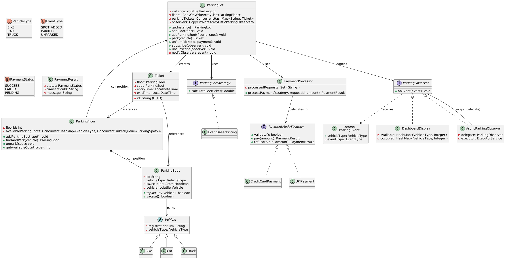

# Parking Lot — Low-Level Design

## Table of Contents
- [Problem Statement](#problem-statement)
- [Functional Requirements](#functional-requirements)
- [Non-Functional Requirements](#non-functional-requirements)
- [Domain Notes](#domain-notes)
- [Interview Flow](#interview-flow)
- [Core Entities](#core-entities)
- [Entity Details](#entity-details)
- [PlantUML Class Diagram](#plantuml-class-diagram)
- [Interaction Flows](#interaction-flows)
- [Design Patterns Used](#design-patterns-used)
- [Thread Safety Design](#thread-safety-design)
- [Sync → Async Transition (Step by Step)](#sync--async-transition-step-by-step)
- [Project Structure](#project-structure)
- [Quick Interview Cheat Sheet](#quick-interview-cheat-sheet)

## Problem Statement

Design a multi-storey parking lot system where vehicles arrive at an entrance, receive a ticket, park in a spot matched to their size, and pay a fee on exit. The system must handle concurrent vehicles safely — two cars must never be assigned the same spot.

---

## Functional Requirements

1. The parking lot has multiple floors, each with spots typed by vehicle size (BIKE, CAR, TRUCK)
2. On entry, assign a spot matching the vehicle type and issue a ticket
3. On exit, calculate fee based on duration and vehicle type, process payment, free the spot
4. Reject parking if no spot is available for the vehicle type
5. Display real-time available/occupied count per vehicle type (dashboard)

## Non-Functional Requirements

1. Thread-safe — concurrent park/unpark must not corrupt state or double-assign a spot
2. Lock-free where possible — high throughput under contention
3. Observer notifications must not block the park/unpark caller
4. Extensible — adding new payment modes, pricing strategies, or observers requires no changes to existing code

---

## Domain Notes

```
A ParkingLot has multiple ParkingFloors.
A ParkingFloor has ParkingSpots grouped by VehicleType in concurrent queues.
A ParkingSpot is the smallest unit — tracks occupancy via AtomicBoolean (CAS).
A Vehicle is an abstract base with a registration number and type.
  Concrete: Bike, Car, Truck — each hardcodes its VehicleType in the constructor.
A Ticket is issued on park, linking a floor and spot with entry/exit timestamps.
  exitTime is set on unpark, used by PricingStrategy to calculate fee.
Parking flow: poll spot from queue → CAS occupy → issue ticket.
  If CAS fails (another thread took it), the spot is legitimately occupied — don't re-add to queue.
Unpark flow: atomic remove of ticket from map → calculate fee → pay → vacate spot → return to queue.
  If payment fails, clear exitTime and put ticket back in the map.
PricingStrategy calculates fee per hour per vehicle type (sub-hour rounded up via Math.ceil).
PaymentProcessor delegates to PaymentModeStrategy — idempotency via processed request set.
Observers receive lightweight ParkingEvent (vehicleType + eventType) on park/unpark/spot-add.
  Async observers use single-thread executor for FIFO ordering without blocking callers.
```

---

## Interview Flow

```
1. Clarify requirements
2. Identify core entities
3. Start simple — single-threaded, no patterns
4. Add Strategy Pattern (pricing, payment)
5. Add Observer Pattern (dashboard)
6. Make it thread-safe (CAS, ConcurrentHashMap)
7. Make observers async (SingleThreadExecutor wrapper)
```

---

## Core Entities

| Entity | Responsibility |
|--------|---------------|
| ParkingLot | Entry point (Singleton). Manages floors, tickets, observers. |
| ParkingFloor | Collection of spots. Finds and books available spot for a vehicle. |
| ParkingSpot | Atomic unit. Tracks occupied state via CAS. |
| Vehicle | Abstract base. Holds registration number and type. |
| VehicleType | Enum. BIKE, CAR, TRUCK. |
| Ticket | Issued on entry. Captures floor, spot, entry/exit time. |
| ParkingFeeStrategy | Interface. Calculates fee given a ticket. |
| EventBasedPricing | Concrete strategy. Flat rate per hour per vehicle type. |
| PaymentModeStrategy | Interface. Validates and processes payment. |
| CreditCardPayment | Concrete strategy. Card-based payment. |
| UPIPayment | Concrete strategy. UPI-based payment. |
| PaymentProcessor | Orchestrates validation + payment. Takes a PaymentModeStrategy and calls strategy.pay(). |
| ParkingObserver | Interface. Receives lightweight events on state change. |
| ParkingEvent | Immutable record. Carries vehicleType + eventType. |
| EventType | Enum. SPOT_ADDED, PARKED, UNPARKED. |
| DashboardDisplay | Concrete observer. Maintains its own available/occupied counts. |
| AsyncParkingObserver | Decorator. Wraps any observer to make it async + ordered. |


BINDING ENTITY : TICKET -> BINDS FLOOR + SPOT (VEHICLE IS STORED IN SPOT) WITH A TICKET ID.
---

## Entity Details

### ParkingLot (Singleton)

| Field/Method | Description |
|---|---|
| `instance` | `volatile` — double-checked locking singleton |
| `floors` | `CopyOnWriteArrayList<ParkingFloor>` |
| `parkingTickets` | `ConcurrentHashMap<String, Ticket>` — active tickets |
| `observers` | `CopyOnWriteArrayList<ParkingObserver>` |
| `addFloor(floor)` | Register a new floor |
| `addParkingSpot(floorId, spot)` | Add spot to floor + fire SPOT_ADDED event |
| `park(vehicle)` | Find spot across floors → issue ticket → fire PARKED event |
| `unPark(ticketId, payment)` | Calculate fee → process payment → free spot → fire UNPARKED |
| `subscribe(observer)` | Register observer |
| `unsubscribe(observer)` | Remove observer |
| `notifyObservers(event)` | O(1) — fires lightweight event to all observers |

---

### ParkingFloor

| Field/Method | Description |
|---|---|
| `floorId` | Floor identifier |
| `availableParkingSpots` | `ConcurrentHashMap<VehicleType, ConcurrentLinkedQueue<ParkingSpot>>` |
| `addParkingSpot(spot)` | Adds spot to the appropriate queue by type |
| `findAndPark(vehicle)` | Polls queue, CAS occupy. Returns spot or null. |
| `unpark(spot)` | Vacates spot, returns it to the queue |
| `getAvailableCount(type)` | Returns queue size for a vehicle type |

---

### ParkingSpot

| Field/Method | Description |
|---|---|
| `id` | Spot identifier (e.g., "1A") |
| `vehicleType` | What size vehicle this spot accepts |
| `isOccupied` | `AtomicBoolean` — enables lock-free CAS |
| `vehicle` | `volatile` reference to parked vehicle (visibility across threads) |
| `tryOccupy(vehicle)` | CAS `false→true`. Returns true if this thread won the spot. |
| `vacate()` | CAS `true→false`. Frees the spot. |

---

### Vehicle (abstract)

| Field/Method | Description |
|---|---|
| `registrationNum` | Unique vehicle identifier |
| `vehicleType` | Enum: BIKE, CAR, TRUCK |

Concrete: `Bike`, `Car`, `Truck` — each passes its type to `super()`.

---

### VehicleType (enum)

```java
public enum VehicleType {
    BIKE, CAR, TRUCK
}
```

---

### Ticket

| Field/Method | Description |
|---|---|
| `id` | UUID — unique ticket ID |
| `floor` | Which floor the vehicle is on |
| `spot` | Which spot is assigned |
| `entryTime` | `LocalDateTime.now()` at park time |
| `exitTime` | Set at unpark time |

---

### ParkingFeeStrategy (interface)

| Method | Description |
|---|---|
| `calculateFee(ticket)` | Returns fee as double. Uses duration + vehicle type. |

---

### EventBasedPricing (concrete strategy)

Flat rate per hour per vehicle type. Sub-hour rounded up to 1 hour.

---

### PaymentModeStrategy (interface)

| Method | Description |
|---|---|
| `validate()` | Validate payment details (card number, UPI format, etc.) |
| `pay(amount)` | Process the payment, return PaymentResult |
| `refund(txnId, amount)` | Process refund |

Concrete: `CreditCardPayment`, `UPIPayment`

---

### PaymentProcessor

Takes a `PaymentModeStrategy` and orchestrates the flow: idempotency check → `strategy.validate()` → `strategy.pay()`.

| Method | Description |
|---|---|
| `processPayment(strategy, requestId, amount)` | Idempotency check → validate → strategy.pay(amount) |
| `processRefund(strategy, txnId, amount)` | Delegates to strategy.refund() |

Uses `ConcurrentHashMap.newKeySet()` to track processed request IDs (idempotency).

---

### ParkingObserver (interface)

| Method | Description |
|---|---|
| `onEvent(ParkingEvent)` | Receives a lightweight immutable event |

---

### ParkingEvent (record)

| Field | Description |
|---|---|
| `vehicleType` | Which type of vehicle/spot is affected |
| `eventType` | SPOT_ADDED, PARKED, or UNPARKED |

---

### EventType (enum)

```java
public enum EventType {
    SPOT_ADDED, PARKED, UNPARKED
}
```

---

### DashboardDisplay (concrete observer)

| Field/Method | Description |
|---|---|
| `available` | `HashMap<VehicleType, Integer>` — available counts per type |
| `occupied` | `HashMap<VehicleType, Integer>` — booked counts per type |
| `onEvent(event)` | Updates counts based on event type, then prints dashboard |

Subscribe/unsubscribe on `ParkingLot`:
```java
lot.subscribe(observer);    // adds to CopyOnWriteArrayList
lot.unsubscribe(observer);  // removes from list
```

---

### AsyncParkingObserver (decorator)

| Field/Method | Description |
|---|---|
| `delegate` | The actual observer to wrap |
| `executor` | `Executors.newSingleThreadExecutor()` — ordered async queue |
| `onEvent(event)` | Submits to executor (non-blocking). Delegate processes in FIFO order. |
| `shutdown()` | Gracefully shuts down the executor |

---

## PlantUML Class Diagram


---

## Interaction Flows

### Park Vehicle

```
1. Client calls lot.park(vehicle)
2. ParkingLot iterates floors
3. ParkingFloor.findAndPark(vehicle):
   a. Gets queue for vehicle's type
   b. Polls next available spot from queue
   c. Calls spot.tryOccupy(vehicle) — CAS
   d. If CAS succeeds → return spot
   e. If CAS fails (race) → poll next spot
4. Create Ticket, store in ConcurrentHashMap
5. Fire ParkingEvent(type, PARKED) to all observers
6. Return ticket
```

```java
ParkingLot.java :
public Ticket park(Vehicle vehicle){
    ParkingSpot spot;
    for(ParkingFloor floor : floors){   // for each floor,
        spot = floor.findAndPark(vehicle);  // try to park on this floor
        if(spot!=null){
            Ticket ticket= new Ticket(floor, spot);     // generate ticket
            parkingTickets.put(ticket.getId(), ticket); // store ticket
            notifyObservers(new ParkingEvent(vehicle.getVehicleType(), EventType.PARKED));
            return ticket;  // return ticket
        }
    }
    throw new RuntimeException("Parking is Full");
}

ParkingFloor.java :
public ParkingSpot findAndPark(Vehicle vehicle){
    Queue<ParkingSpot> parkingSpots = availableParkingSpots.get(vehicle.getVehicleType());
    if(parkingSpots == null)
        return null;

    ParkingSpot spot;
    while((spot = parkingSpots.poll())!=null){
        if(spot.tryOccupy(vehicle))
            return spot;
    }
    return null;
}

ParkingSpot.java :
public boolean tryOccupy(Vehicle vehicle){
    if(isOccupied.compareAndSet(false, true) == true){
        this.vehicle = vehicle;
        return true;
    }
    return false;
}
```

### Unpark Vehicle

```
1. Client calls lot.unPark(ticketId, paymentStrategy)
2. ConcurrentHashMap.remove(ticketId) — atomic, only one thread wins
3. Set exit time on ticket
4. PricingStrategy.calculateFee(ticket)
5. PaymentProcessor.processPayment(strategy, ticketId, fee)
6. If payment SUCCESS:
   a. ParkingFloor.unpark(spot) — vacate + return to queue
   b. Fire ParkingEvent(type, UNPARKED)
7. If payment FAILED:
   a. Clear exit time
   b. Put ticket back in map
```

```java
ParkingLot.java : 
public void unPark(String ticketId, PaymentModeStrategy paymentModeStrategy){
    Ticket ticket = parkingTickets.remove(ticketId);
    if(ticket == null)
        throw new RuntimeException("Invalid Ticket Exception");
    ticket.setExitTime(LocalDateTime.now());    // set the exit time

    double fee = parkingFeeStrategy.calculateFee(ticket);   // calculate the parking fee
    PaymentResult result = paymentProcessor.processPayment(paymentModeStrategy, ticketId, fee); //process payment
    if(result.getStatus().equals(PaymentStatus.SUCCESS)){   // if payment is successful
        VehicleType type = ticket.getSpot().getVehicleType();   // get the vehicle type from ticket
        ticket.getFloor().unpark(ticket.getSpot());             // call floor.unpark(spot) from ticket
        notifyObservers(new ParkingEvent(type, EventType.UNPARKED));    // fire event
    }
    else{
        ticket.setExitTime(null);       // payment not successful. nullify exit time.
        parkingTickets.put(ticketId, ticket);  // put it back on failure
    }
}

ParkingFloor.java : 
public void unpark(ParkingSpot parkingSpot){
    parkingSpot.vacate();
    availableParkingSpots
            .get(parkingSpot.getVehicleType())
            .offer(parkingSpot);
}

ParkingSpot.java : 
public boolean vacate(){
    if(isOccupied.compareAndSet(true, false) == true){
        this.vehicle = null;
        return true;
    }
    return false;
}
```
---

## Design Patterns Used

### 1. Strategy Pattern — Pricing

**Problem:** Fee calculation logic varies (flat rate, time-based, event-based, surge pricing).

**Solution:** `ParkingFeeStrategy` interface. ParkingLot delegates fee calculation without knowing which strategy is active.

**Extensibility:** New pricing? → new class implementing `ParkingFeeStrategy`. Zero changes to ParkingLot.

```java
// Interface
public interface ParkingFeeStrategy {
    double calculateFee(Ticket ticket);
}

// Concrete strategy
public class EventBasedPricing implements ParkingFeeStrategy {
    @Override
    public double calculateFee(Ticket ticket) {
        // logic here
    }
}

// Usage — ParkingLot doesn't know which strategy it's using
double fee = parkingFeeStrategy.calculateFee(ticket);
```

---

### 2. Strategy Pattern — Payment

**Problem:** Multiple payment modes (card, UPI, cash). Each has different validation and processing.

**Solution:** `PaymentModeStrategy` interface. `PaymentProcessor` orchestrates validation + payment without knowing the mode.

**Extensibility:** New mode (e.g., Wallet)? → new class implementing `PaymentModeStrategy`. Zero changes to existing code.

```java
// Interface
public interface PaymentModeStrategy {
    boolean validate();
    PaymentResult pay(double amount);
    PaymentResult refund(String transactionId, double amount);
}

// Concrete strategies
public class CreditCardPayment implements PaymentModeStrategy { ... }
public class UPIPayment implements PaymentModeStrategy { ... }

// Processor delegates to whatever strategy is passed in
public class PaymentProcessor {
    public PaymentResult processPayment(PaymentModeStrategy strategy, String requestId, double amount) {
        if (!strategy.validate()) return failed();
        return strategy.pay(amount);
    }
}
```

---

### 3. Observer Pattern — Dashboard/Notifications

**Problem:** Multiple consumers (display boards, mobile apps, analytics) need real-time updates on parking state.

**Solution:** `ParkingObserver` interface. ParkingLot fires lightweight events. Observers maintain their own state.

**Key design choice:** Push delta events (SPOT_ADDED/PARKED/UNPARKED) not full state. The subject does O(1) work per notification.

**Extensibility:** New observer (e.g., MobileApp, SlackNotifier)? → new class implementing `ParkingObserver`. Subscribe it. Done.

```java
// Event — immutable record, O(1) to create
public record ParkingEvent(VehicleType vehicleType, EventType eventType) {}

// Interface
public interface ParkingObserver {
    void onEvent(ParkingEvent event);
}

// Concrete observer — maintains its own state
public class DashboardDisplay implements ParkingObserver {
    private final Map<VehicleType, Integer> available = new HashMap<>();
    private final Map<VehicleType, Integer> occupied = new HashMap<>();

    @Override
    public void onEvent(ParkingEvent event) {
        // update available/occupied based on event type
    }
}

// Subject (ParkingLot) fires event
private void notifyObservers(ParkingEvent event) {
    for (ParkingObserver observer : observers) {
        observer.onEvent(event);
    }
}
```

---

### 4. Singleton — ParkingLot

**Problem:** Only one parking lot instance should exist.

**Solution:** Double-checked locking with `volatile` instance.

```java
public class ParkingLot {
    private static volatile ParkingLot instance;

    private ParkingLot(/* deps */) { }

    public static ParkingLot getInstance(/* deps */) {
        if (instance == null) {
            synchronized (ParkingLot.class) {
                if (instance == null) {
                    instance = new ParkingLot(/* deps */);
                }
            }
        }
        return instance;
    }
}
```

---

### 5. Decorator Pattern — AsyncParkingObserver

**Problem:** Synchronous observer notification blocks the park/unpark caller if an observer is slow.

**Solution:** Wrap any `ParkingObserver` in `AsyncParkingObserver`. Same interface, different execution model.

```java
public class AsyncParkingObserver implements ParkingObserver {
    private final ParkingObserver delegate;
    private final ExecutorService executor = Executors.newSingleThreadExecutor();

    public AsyncParkingObserver(ParkingObserver delegate) {
        this.delegate = delegate;
    }

    @Override
    public void onEvent(ParkingEvent event) {
        executor.submit(() -> delegate.onEvent(event));  // non-blocking, ordered
    }
}

// Usage — same subscribe call, just wrapped
lot.subscribe(new AsyncParkingObserver(new DashboardDisplay("Entrance-1")));
```

---

## Thread Safety Design

| Component | Mechanism | Why |
|---|---|---|
| `ParkingSpot.tryOccupy()` | `AtomicBoolean.compareAndSet(false, true)` | Two threads can't take same spot |
| `ParkingSpot.vehicle` | `volatile` | Visibility across threads |
| Available spots per floor | `ConcurrentLinkedQueue` | Thread-safe poll — each thread gets a different spot |
| Active tickets | `ConcurrentHashMap` | Concurrent park/unpark on different tickets |
| `ConcurrentHashMap.remove()` | Atomic remove | Two threads racing to unpark same ticket — only one wins |
| Observer list | `CopyOnWriteArrayList` | Safe iteration during notification while subscribe/unsubscribe may happen |
| Payment idempotency | `ConcurrentHashMap.newKeySet()` | Thread-safe set to track processed requests |
| Singleton | `volatile` + double-checked locking | Safe lazy initialization |

---

## Sync → Async Transition (Step by Step)

This is the progression you'd explain/build in an interview:

### Step 1: Simple Synchronous Design (Start Here)

```
park() → find spot → issue ticket → return
unpark() → calculate fee → pay → free spot → return
```
- Single-threaded. No concurrent access.
- `HashMap`, `ArrayList`, regular `boolean`.
- No design patterns. Just the core flow.

### Step 2: Add Strategy Pattern

```
park() → find spot → issue ticket → return
unpark() → [PricingStrategy].calculateFee() → [PaymentStrategy].pay() → free spot
```
- Decouples pricing and payment from ParkingLot.
- Mention extensibility: "new pricing? new class, no changes to ParkingLot."

### Step 3: Make It Thread-Safe

Replace data structures for concurrent access:

| Before | After | Why |
|---|---|---|
| `boolean isOccupied` | `AtomicBoolean` | CAS — only one thread wins the spot |
| `ArrayList<ParkingSpot>` | `ConcurrentLinkedQueue<ParkingSpot>` | Thread-safe poll |
| `HashMap<String, Ticket>` | `ConcurrentHashMap<String, Ticket>` | Concurrent reads/writes |
| `ArrayList<ParkingFloor>` | `CopyOnWriteArrayList<ParkingFloor>` | Safe iteration |

Key code:
```java
// Only one thread wins — no lock needed
if (isOccupied.compareAndSet(false, true)) {
    this.vehicle = vehicle;
    return true;
}
return false;
```

### Step 4: Add Observer Pattern (Synchronous)

```
park() → ... → notifyObservers(PARKED event)
unpark() → ... → notifyObservers(UNPARKED event)
addParkingSpot() → ... → notifyObservers(SPOT_ADDED event)
```
- Observer interface: `void onEvent(ParkingEvent event)`
- `ParkingEvent` is an immutable record — O(1) to create, safe to share
- Each observer maintains its own state (available/occupied maps)
- Notification is O(observers) — just passes an immutable event, no computation in subject

### Step 5: Make Observers Async (Decorator)

**Problem:** If a slow observer (email sender, HTTP call) is synchronous, it blocks the caller.

**Solution:** Wrap with `AsyncParkingObserver`:

```java
// Before (synchronous — blocks park/unpark)
lot.subscribe(new DashboardDisplay("Entrance-1"));

// After (async — non-blocking, ordered)
lot.subscribe(new AsyncParkingObserver(new DashboardDisplay("Entrance-1")));
```

**How it works:**
```
park() thread                    Observer's SingleThreadExecutor
────────────                     ─────────────────────────────────
notifyObservers(event)
  → observer.onEvent(event)
    → executor.submit(...)       Queue: [event]     ← enqueued instantly
  → returns immediately          Single thread:
                                   processes event   ← async, in order
```

**Why `newSingleThreadExecutor`?**
- 1 thread + unbounded FIFO queue = events processed in order
- Caller never blocks (submit returns immediately)
- Each observer gets its own queue — slow observer doesn't affect others

**Why not `new Thread()` per event?**
- Expensive (thread creation overhead)
- Unbounded (could spawn thousands)
- No ordering guarantee

**Why not shared thread pool?**
- Events could be reordered across threads
- Observer state depends on order (PARKED before UNPARKED)

---

## Project Structure

```
_1_ParkingLot/
├── enums/
│   ├── VehicleType.java
│   └── PaymentStatus.java
├── models/
│   ├── Vehicle.java (abstract)
│   ├── Bike.java, Car.java, Truck.java
│   ├── ParkingSpot.java
│   ├── ParkingFloor.java
│   ├── ParkingLot.java (singleton, subject)
│   ├── Ticket.java
│   └── payment/
│       └── PaymentResult.java
├── strategies/
│   ├── pricing/
│   │   ├── ParkingFeeStrategy.java (interface)
│   │   └── EventBasedPricing.java
│   └── payment/
│       ├── PaymentModeStrategy.java (interface)
│       ├── PaymentProcessor.java
│       ├── CreditCardPayment.java
│       └── UPIPayment.java
├── observer/
│   ├── ParkingObserver.java (interface)
│   ├── ParkingEvent.java (record)
│   ├── EventType.java (enum)
│   ├── DashboardDisplay.java (stateful observer)
│   └── AsyncParkingObserver.java (decorator)
├── Main.java
└── ParkingLot_Design.md (this file)
```

---

## Quick Interview Cheat Sheet

```
Start simple → Strategy for pricing/payment → Observer for dashboard → CAS for thread safety → Async decorator for non-blocking observers
```

| When interviewer says... | You respond with... |
|---|---|
| "What if pricing logic changes?" | Strategy Pattern — ParkingFeeStrategy interface |
| "What about thread safety?" | AtomicBoolean CAS on ParkingSpot, ConcurrentLinkedQueue for available spots |
| "How do you show real-time availability?" | Observer Pattern — push lightweight events, observers maintain own state |
| "Won't observers block park/unpark?" | AsyncParkingObserver — decorator with SingleThreadExecutor |
| "How do you prevent same spot assigned twice?" | `compareAndSet(false, true)` — only one thread returns true |
| "What if two threads unpark same ticket?" | `ConcurrentHashMap.remove()` is atomic — first caller gets the ticket, second gets null |
