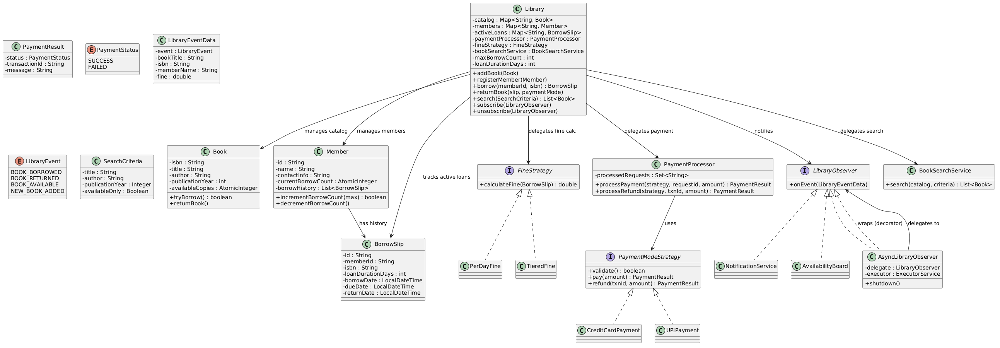

# Library Management System — LLD

## Table of Contents
- [1. Problem Statement](#1-problem-statement)
- [2. Requirements](#2-requirements)
- [3. Domain Notes](#3-domain-notes)
- [4. Core Entities (Top-Down)](#4-core-entities-top-down)
- [5. Entity Details](#5-entity-details)
- [6. PlantUML Class Diagram](#6-plantuml-class-diagram)
- [7. Interaction Flows](#7-interaction-flows)
- [8. Strategies](#8-strategies)
- [9. Search](#9-search)
- [10. Design Patterns](#10-design-patterns)
- [11. Making It Async & Concurrent — Step by Step](#11-making-it-async--concurrent--step-by-step)
- [12. Quick Reference — Interview Flow](#12-quick-reference--interview-flow)
- [13. Comparison with Parking Lot](#13-comparison-with-parking-lot)

---

## 1. Problem Statement

Design a Library Management System that allows librarians to manage books, members, and borrowing activities. The system should support:
- Adding and removing books from the catalog
- Registering members
- Borrowing and returning books with enforced limits (max books, loan duration)
- Late fine calculation with pluggable strategies
- Payment processing with different payment modes
- Book search with various filters
- Notifications on library events
- Thread-safe concurrent access

---

## 2. Requirements

### Functional
- Add/remove books from catalog (each book can have multiple copies)
- Register members with contact details
- Borrow: member borrows a book → gets a BorrowSlip
- Return: member returns a book → fine calculated if overdue → payment processed
- Enforce max borrow limit per member
- Enforce loan duration
- Search books by title, author, year, availability
- Notify observers on borrow/return/availability events

### Non-Functional
- Thread-safe: multiple members can borrow/return concurrently
- Lock-free where possible (CAS over synchronized)
- Extensible: new fine strategies, payment modes, search filters without modifying core
- Idempotent payments (no double-charge on retry)

---

## 3. Domain Notes

```
A Library has a catalog of Books (indexed by ISBN).
A Library has registered Members (indexed by memberId).
A Library tracks active BorrowSlips (loans in progress).
A Book can have multiple copies — availability is tracked as a count, not a boolean.
A Member has a borrowing history and a current borrow count (enforced limit).
A BorrowSlip ties a Member to a Book with timestamps (borrow date, due date, return date).
Borrowing a book is a two-resource operation: 
    increment member currentBorrowCount and decrement book's availableCopies.
    If the second CAS fails, rollback the first (compensation pattern).
Returning a book reverses both and calculates fine if overdue.
  activeLoans.remove() is used as an atomic gate — only one thread can return a given slip.
  If payment fails, the slip is put back and returnDate is cleared.
Fine calculation varies by policy — Strategy pattern makes it swappable.
Payment is processed via PaymentProcessor which delegates to a PaymentModeStrategy.
  Idempotency is enforced via a set of processed request IDs.
Search is a filter-chain across the catalog — title, author, year, availability.
  Null fields in SearchCriteria are ignored (match-all).
Observers are notified on addBook, borrow, and returnBook.
  Async observers use a single-thread executor for FIFO ordering without blocking callers.
```

```
Why in Borrow() first decrement member currentBorrowCount and then increment book's availableCopies?
The reasoning is about rollback cost. 
If the book check (tryBorrow) comes first and succeeds, but then the member check fails, 
you'd have to roll back the book's available copy count. That rollback is more "expensive" in 
terms of correctness risk because other threads might have seen the temporarily decremented copy 
count and made decisions based on it (like seeing 0 copies and giving up).

With our current order:
1. member.incrementBorrowCount() — lightweight, only affects this member
2. book.tryBorrow() — if this fails, you just member.decrementBorrowCount() to rollback

The member's borrow count rollback is simpler and lower-contention since it only affects 
one member's state, whereas a book's availability affects all concurrent borrowers trying 
to get that same book. You want to minimize the window where a shared, high-contention 
resource (the book) is in an inconsistent state.

So your instinct was right — check the cheaper/lower-contention resource first.
```
---

## 4. Core Entities (Top-Down)

```
Library (top-level, orchestrator)
  ├── manages a Catalog of Books (Map<ISBN, Book>)
  ├── manages registered Members (Map<memberId, Member>)
  ├── tracks active BorrowSlips (Map<slipId, BorrowSlip>)
  │
  ├── Book (a title in the catalog, multiple copies tracked via AtomicInteger)
  ├── Member (a registered user, borrow count enforced via CAS)
  └── BorrowSlip (receipt linking member to book with timestamps)
```

```
BINDING ENTITY : BORROW SLIP -> BINDS MEMBER WITH BOOK.
```

---

## 5. Entity Details

### Library
The top-level entity. Manages catalog, members, and coordinates borrow/return with concurrency safety.

| Field/Method | Description |
|---|---|
| `Map<String, Book> catalog` | All books indexed by ISBN |
| `Map<String, Member> members` | All members indexed by memberId |
| `Map<String, BorrowSlip> activeLoans` | Currently active borrow slips |
| `PaymentProcessor paymentProcessor` | Processes fine payments via strategies |
| `FineStrategy fineStrategy` | Calculates overdue fines (pluggable) |
| `BookSearchService bookSearchService` | Handles search with filter chain |
| `int maxBorrowCount` | Max books a member can borrow at once |
| `int loanDurationDays` | Default loan duration in days |
| `List<LibraryObserver> observers` | Registered observers notified on library events (CopyOnWriteArrayList) |
| `subscribe(LibraryObserver)` | Register an observer for event notifications |
| `unsubscribe(LibraryObserver)` | Remove an observer |
| `addBook(Book)` | Adds a book to the catalog, notifies observers |
| `registerMember(Member)` | Registers a new member (idempotent via putIfAbsent) |
| `borrow(memberId, isbn) → BorrowSlip` | Two-phase CAS: increment member count, then decrement book copies. Rollback if second fails. |
| `returnBook(slip, paymentMode)` | Atomic remove of slip → calculate fine → pay if needed → release book + decrement member count |
| `search(SearchCriteria) → List<Book>` | Delegates to BookSearchService |

### Book
Represents a title in the catalog. Multiple copies tracked via AtomicInteger.

| Field/Method | Description |
|---|---|
| `String isbn` | Unique identifier for the book |
| `String title` | Title of the book |
| `String author` | Author name |
| `int publicationYear` | Year of publication |
| `AtomicInteger availableCopies` | Number of copies currently available (CAS-safe) |
| `tryBorrow() → boolean` | CAS loop: decrement availableCopies if > 0, return true; else false |
| `returnBook()` | Atomically increment availableCopies |

### Member
A registered user who can borrow books. Borrow limit enforced via CAS.

| Field/Method | Description |
|---|---|
| `String id` | Unique member identifier |
| `String name` | Member's name |
| `String contactInfo` | Email/phone for notifications |
| `AtomicInteger currentBorrowCount` | Number of books currently borrowed (CAS-safe) |
| `List<BorrowSlip> borrowHistory` | All past and current borrows (CopyOnWriteArrayList) |
| `incrementBorrowCount(max) → boolean` | CAS loop: increment if < max, return true; else false |
| `decrementBorrowCount()` | Atomically decrement current borrow count |
| `addToborrowHistory(slip)` | Appends slip to history |

### BorrowSlip
The receipt of a borrow transaction. Links a member to a book with time boundaries.

| Field/Method | Description |
|---|---|
| `String id` | UUID — unique slip identifier |
| `String memberId` | Who borrowed it |
| `String isbn` | What was borrowed |
| `int loanDurationDays` | How long the loan is for |
| `LocalDateTime borrowDate` | When the book was borrowed |
| `LocalDateTime dueDate` | borrowDate + loanDurationDays |
| `volatile LocalDateTime returnDate` | When the book was returned (null if still active) |

---
## 6. PlantUML Class Diagram


---

## 7. Interaction Flows

### Borrow Book

```
1. Client calls library.borrow(memberId, isbn)
2. Validate member and book exist in their respective maps
3. CAS: member.incrementBorrowCount(maxBorrowCount)
   — CAS loop: increment if < max, return true; else false
   — If false → throw "Borrow Limit Reached"
4. CAS: book.tryBorrow()
   — CAS loop: decrement availableCopies if > 0, return true; else false
   — If false → rollback: member.decrementBorrowCount() → throw "No copies left"
5. Create BorrowSlip (id=UUID, borrowDate=now, dueDate=now+loanDays)
6. Store in activeLoans map
7. Add to member's borrowHistory
8. notifyObservers(BOOK_BORROWED)
9. Return BorrowSlip
```

```java
Library.java :
public BorrowSlip borrow(String memberId, String isbn) {
    // validate inputs
    Book book = catalog.get(isbn);
    Member member = members.get(memberId);
    if (book == null) throw new RuntimeException("Book not found: " + isbn);
    if (member == null) throw new RuntimeException("Member not found: " + memberId);

    // CAS: check if member can borrow
    if (!member.incrementBorrowCount(maxBorrowCount)) {
        throw new RuntimeException("Borrow Limit Reached for Member: " + memberId);
    }

    // CAS: check book availability
    if (!book.tryBorrow()) {
        member.decrementBorrowCount(); // rollback
        throw new RuntimeException("No more copies left of book: " + isbn);
    }

    BorrowSlip borrowSlip = new BorrowSlip(memberId, isbn, loanDurationDays);
    activeLoans.put(borrowSlip.getId(), borrowSlip);
    member.addToborrowHistory(borrowSlip);

    notifyObservers(new LibraryEventData(LibraryEvent.BOOK_BORROWED, book.getTitle(), isbn, member.getName(), 0));
    return borrowSlip;
}

Member.java :
public boolean incrementBorrowCount(int maxBorrowCount){
    // CAS Loop!
    while(true){
        int current = currentBorrowCount.get();
        if(current >= maxBorrowCount) return false;
        if(currentBorrowCount.compareAndSet(current, current + 1)) return true;
    }
}
public void decrementBorrowCount(){
    currentBorrowCount.decrementAndGet();
}

Book.java: 
public boolean tryBorrow() {
    // CAS Loop!
    while (true) {
        int current = availableCopies.get();
        if (current <= 0) return false;
        if (availableCopies.compareAndSet(current, current - 1)) return true;
    }
}
```

### Return Book

```
1. Client calls library.returnBook(slip, paymentMode)
2. activeLoans.remove(slip.getId()) — atomic gate, only one thread wins
   — If null → throw "Invalid borrow slip"
3. Look up Book and Member from the slip's isbn and memberId
4. Set returnDate = now on the slip
5. Calculate fine via fineStrategy.calculateFine(slip)
   — Compares dueDate vs returnDate, returns 0 if not late
6. If fine > 0:
   a. If paymentMode is null → rollback (clear returnDate, put slip back) → throw "Payment required"
   b. paymentProcessor.processPayment(paymentMode, slipId, fine)
   c. If FAILED → rollback (clear returnDate, put slip back) → return
7. If fine == 0 OR payment SUCCESS:
   a. book.returnBook() — atomically increment availableCopies
   b. member.decrementBorrowCount()
   c. notifyObservers(BOOK_RETURNED)
   d. If book was previously at 0 copies → notifyObservers(BOOK_AVAILABLE)
```

```java
Library.java :
public void returnBook(BorrowSlip slip, PaymentModeStrategy paymentMode) {
    // basic validation
    BorrowSlip borrowSlip = activeLoans.remove(slip.getId());
    if (borrowSlip == null) throw new RuntimeException("Invalid borrow slip: " + slip.getId());
    Book book = catalog.get(borrowSlip.getIsbn());
    if (book == null) throw new RuntimeException("Invalid Book: " + borrowSlip.getIsbn());
    
    Member member = members.get(borrowSlip.getMemberId());
    // set the return date and calculate fine
    borrowSlip.setReturnDate(LocalDateTime.now());
    double fine = fineStrategy.calculateFine(borrowSlip);
    
    // payment and book return flow
    if (fine > 0.00) {
        // if no member needs to pay fine but no payment mode provided, throw exception
        if (paymentMode == null) {
            borrowSlip.setReturnDate(null);
            activeLoans.put(borrowSlip.getId(), borrowSlip);
            throw new RuntimeException("Fine of Rs." + fine + " due, payment required");
        }
        // make the payment
        PaymentResult result = paymentProcessor.processPayment(paymentMode, borrowSlip.getId(), fine);
        // if payment failed, make return date = null in slip and put back the slip into active loans
        if (result.getStatus() == PaymentStatus.FAILED) {
            borrowSlip.setReturnDate(null);
            activeLoans.put(borrowSlip.getId(), borrowSlip);
            return;
        }
    }
    
    // No fine OR payment succeeded — release resources
    boolean wasUnavailable = book.getAvailableCopies() == 0;
    book.returnBook();
    member.decrementBorrowCount();
    
    notifyObservers(new LibraryEventData(LibraryEvent.BOOK_RETURNED, book.getTitle(), book.getIsbn(), member.getName(), fine));
    if (wasUnavailable) {
        notifyObservers(new LibraryEventData(LibraryEvent.BOOK_AVAILABLE, book.getTitle(), book.getIsbn(), null, 0));
    }
}

Book.java : 
public void returnBook() { 
    availableCopies.incrementAndGet(); 
}

Member.java : 
public void decrementBorrowCount(){
    currentBorrowCount.decrementAndGet();
}
```
### Search Books

```
1. Client calls library.search(criteria)
2. Library delegates to bookSearchService.search(catalog.values(), criteria)
3. Stream over all books in catalog
4. For each non-null field in criteria, add a .filter():
   — title: partial match, case-insensitive
   — author: partial match, case-insensitive
   — publicationYear: exact match
   — availableOnly: filter where availableCopies > 0
5. Collect and return matching books
```

```java
Main.java :
List<Book> byAuthor = library.search(new SearchCriteria().setAuthor("martin"));


Library.java :
public List<Book> search(SearchCriteria criteria) {
    return bookSearchService.search(catalog.values(), criteria);
}

SearchCriteria.java :
public class SearchCriteria {
    private String title;
    private String author;
    private Integer publicationYear;
    private Boolean availableOnly;

    public SearchCriteria(){ }

    public SearchCriteria setTitle(String title) { this.title = title; return this; }
    public SearchCriteria setAuthor(String author) { this.author = author; return this; }
    public SearchCriteria setPublicationYear(Integer year) { this.publicationYear = year; return this; }
    public SearchCriteria setAvailableOnly(Boolean availableOnly) { this.availableOnly = availableOnly; return this; }

    public String getTitle() { return title; }
    public String getAuthor() { return author; }
    public Integer getPublicationYear() { return publicationYear; }
    public Boolean getAvailableOnly() { return availableOnly; }
}

SearchService.java : 
public class BookSearchService {
    public List<Book> search(Collection<Book> catalog, SearchCriteria criteria){
        return catalog.stream()
                .filter(b -> criteria.getAuthor() == null ||
                        b.getAuthor().toLowerCase().contains(criteria.getAuthor().toLowerCase()))
                .filter(b->criteria.getTitle() == null ||
                        b.getTitle().toLowerCase().contains(criteria.getTitle().toLowerCase()))
                .filter(b->criteria.getPublicationYear() == null ||
                        b.getPublicationYear() == criteria.getPublicationYear())
                .filter(b->criteria.getAvailableOnly()==null ||
                        criteria.getAvailableOnly() == false ||
                        b.getAvailableCopies() > 0)
                .collect(Collectors.toList());
    }
}
```

---

## 8. Strategies

### Fine Calculation
```
FineStrategy (interface)
├── calculateFine(BorrowSlip) → double
│
├── PerDayFine          — flat ₹X per day late
└── TieredFine          — ₹5/day first week, ₹10/day after
```

`FineStrategy.calculateFine()` compares `dueDate` vs `returnDate`. If `returnDate > dueDate`, days late × rate.
Library holds a FineStrategy reference — swappable without changing Library code.

### Payment
```
PaymentModeStrategy (interface)
├── validate() → boolean
├── pay(amount) → PaymentResult
├── refund(txnId, amount) → PaymentResult
│
├── CreditCardPayment    — validates card number (Luhn), expiry, CVV
├── UPIPayment           — validates UPI ID format
└── WalletPayment        — validates phone + checks balance

PaymentProcessor (orchestrator)
├── processPayment(strategy, requestId, amount) → PaymentResult
│   1. Idempotency check (Set<String> processedRequests)
│   2. strategy.validate()
│   3. strategy.pay(amount)
│   4. Track successful requestIds
└── processRefund(strategy, txnId, amount) → PaymentResult
```

PaymentProcessor is stateless per-strategy (strategy passed as param). Idempotency via `ConcurrentHashMap.newKeySet()`.

### Notification (Observer Pattern)
```
LibraryObserver (interface)
├── onEvent(LibraryEventData data)

LibraryEventData (immutable class — data carrier for events)
├── LibraryEvent event       — what happened
├── String bookTitle         — which book
├── String isbn              — book identifier
├── String memberName        — who (null for book-only events)
├── double fine              — fine amount (0 if no fine)
│   One constructor: new LibraryEventData(event, bookTitle, isbn, memberName, fine)
│   Pass null/0 for fields that don't apply.

LibraryEvent (enum)
├── BOOK_BORROWED
├── BOOK_RETURNED
├── BOOK_AVAILABLE
├── NEW_BOOK_ADDED

Concrete Sync Observers:
├── NotificationService   — logs borrow/return/fine/availability per event type
├── AvailabilityBoard     — logs availability changes on borrow/return

Async Observer:
├── AsyncLibraryObserver  — wraps any LibraryObserver with Executors.newSingleThreadExecutor()
│   Each async observer gets its own single-thread executor + unbounded queue.
│   Events processed in FIFO order without blocking the caller (borrow/return thread).
│   shutdown() to clean up the executor.

Library (as subject)
├── List<LibraryObserver> observers   (CopyOnWriteArrayList)
├── subscribe(observer)               — add sync or async observer
├── unsubscribe(observer)             — remove observer
├── notifyObservers(LibraryEventData) — called inside addBook(), borrow(), returnBook()
```

---

## 9. Search

```
SearchCriteria (value object, fluent setters)
├── String title          — partial match, case-insensitive
├── String author         — partial match, case-insensitive
├── Integer year          — exact match
├── Boolean availableOnly — filter by copies > 0
│   Null fields are ignored (match-all).

BookSearchService
├── search(catalog.values(), criteria) → List<Book>
│   Stream-based filter chain:
│   catalog.stream()
│       .filter(title match OR null)
│       .filter(author match OR null)
│       .filter(year match OR null)
│       .filter(available OR null)
│       .collect()
```

Each non-null field in SearchCriteria adds a filter. Extensible — adding a new filter (genre, rating) means one field + one `.filter()` line.

---

## 10. Design Patterns

| Pattern | Where | Why |
|---------|-------|-----|
| **Strategy** | FineStrategy, PaymentModeStrategy | Pluggable fine calculation and payment modes without modifying Library |
| **Observer** | LibraryObserver, subscribe/unsubscribe | Decouple notifications from core logic. Add new observers without changing Library |
| **Decorator** | AsyncLibraryObserver wraps any LibraryObserver | Adds async behavior to any observer without modifying it. Single-thread executor ensures FIFO ordering. |
| **Singleton** | Library (DCL with volatile + private lock) | Single instance manages all state. Private lock object prevents external interference. |
| **Filter/Criteria** | SearchCriteria + BookSearchService | Composable search filters via stream chain |
| **CAS (Compare-And-Swap)** | Book.tryBorrow(), Member.incrementBorrowCount() | Lock-free thread safety on hot paths |
| **Compensation/Rollback** | borrow() — decrementBorrowCount if tryBorrow fails | Two-phase CAS without locks; rollback first if second fails |

---

## 11. Making It Async & Concurrent — Step by Step

### Step 1: Start Synchronous
Write the entire system single-threaded first. No AtomicInteger, no ConcurrentHashMap. Just HashMap, int, ArrayList. Get the logic right.

```java
class Book {
    private int availableCopies;
    public boolean tryBorrow() {
        if (availableCopies <= 0) return false;
        availableCopies--;
        return true;
    }
}
```

### Step 2: Identify Shared Mutable State
Ask: "What fields can two threads read/write at the same time?"

| Field | Shared? | Concurrent access pattern |
|-------|---------|--------------------------|
| `catalog` | Yes | Read often, write rarely (add/remove book) |
| `members` | Yes | Read often, write rarely (register) |
| `activeLoans` | Yes | Read + write on every borrow/return |
| `Book.availableCopies` | Yes | Decremented on borrow, incremented on return |
| `Member.currentBorrowCount` | Yes | Incremented on borrow, decremented on return |
| `Member.borrowHistory` | Yes | Appended on borrow, read for display |

### Step 3: Replace Collections with Concurrent Variants
```
HashMap           → ConcurrentHashMap      (lock-free reads, segment-level write locks)
ArrayList         → CopyOnWriteArrayList   (for rare writes: borrowHistory, observers)
HashSet           → ConcurrentHashMap.newKeySet()  (for processedRequests)
```

### Step 4: Replace Primitives with Atomics
```
int availableCopies       → AtomicInteger   (CAS for tryBorrow/returnBook)
int currentBorrowCount    → AtomicInteger   (CAS for increment/decrement)
```

Write CAS loops for conditional updates:
```java
// Before (not thread-safe)
if (availableCopies > 0) { availableCopies--; return true; }

// After (CAS loop — thread-safe, lock-free)
while (true) {
    int current = availableCopies.get();
    if (current <= 0) return false;
    if (availableCopies.compareAndSet(current, current - 1)) return true;
}
```

### Step 5: Use Atomic Operations as Gates
For operations where only one thread should proceed (e.g., returning a book):
```java
// get() + later remove() → race condition (two threads pass the null check)
BorrowSlip slip = activeLoans.get(id);

// remove() as atomic gate → only one thread gets the slip
BorrowSlip slip = activeLoans.remove(id);
if (slip == null) throw new RuntimeException("Invalid slip");
```

### Step 6: Handle Multi-Resource Coordination
Borrow requires two CAS operations (member count + book copies). Without locks, use compensation:
```
1. CAS: member.incrementBorrowCount() → success
2. CAS: book.tryBorrow()              → fails
3. Rollback: member.decrementBorrowCount()
```
This is not 2PC — it's a best-effort compensation pattern. Acceptable for in-memory systems.

### Step 7: Make Fields Visible Across Threads
```
LocalDateTime returnDate → volatile LocalDateTime returnDate
```
`volatile` ensures writes are visible to all threads immediately (no CPU cache staleness).

### Step 8: Protect Against Rollback Gaps
If payment fails during return, rollback the slip:
```java
if (result.getStatus() == PaymentStatus.FAILED) {
    borrowSlip.setReturnDate(null);
    activeLoans.put(borrowSlip.getId(), borrowSlip);  // put it back
}
```

### Step 9: Make Observers Async (Decorator Pattern)
Wrap any sync observer with `AsyncLibraryObserver`:
```java
// Sync observer
NotificationService sms = new NotificationService("sms");

// Wrap it async — single-thread executor, FIFO ordering, non-blocking
AsyncLibraryObserver asyncSms = new AsyncLibraryObserver(sms);
library.subscribe(asyncSms);

// borrow/return threads submit events to asyncSms's queue and return immediately
// asyncSms processes them in order on its own thread
```
Why single-thread executor?
- FIFO ordering guaranteed (events processed in submission order)
- Non-blocking for the caller (park/borrow thread returns immediately)
- Each observer has its own queue — slow observer doesn't block others
- `shutdown()` to clean up when observer is removed

---

## 12. Quick Reference — Interview Flow

```
1. State the problem → "Library with books, members, borrow/return"
2. Identify entities → Library, Book, Member, BorrowSlip
3. Define relationships → Library manages catalog + members, BorrowSlip links them
4. Add properties + methods → CAS-based tryBorrow, incrementBorrowCount
5. Add strategies → FineStrategy, PaymentModeStrategy, PaymentProcessor
6. Add search → SearchCriteria + BookSearchService (filter chain)
7. Add observer → LibraryObserver, LibraryEventData, subscribe/unsubscribe, notifyObservers
8. Add async observer → AsyncLibraryObserver (decorator, single-thread executor, FIFO)
9. Discuss concurrency → CAS, AtomicInteger, ConcurrentHashMap, volatile, atomic remove as gate
10. Discuss edge cases → rollback on CAS failure, payment failure rollback, idempotent payments
```

---

## 13. Comparison with Parking Lot

| Concept | Parking Lot | Library |
|---------|-------------|---------|
| Top entity | ParkingLot | Library |
| Container | ParkingFloor | Catalog (Map) |
| Resource | ParkingSpot (boolean) | Book (AtomicInteger copies) |
| User | Vehicle | Member |
| Receipt | Ticket | BorrowSlip |
| Limit per user | N/A | maxBorrowCount (CAS) |
| Pricing | ParkingFeeStrategy | FineStrategy |
| Payment | PaymentModeStrategy + PaymentProcessor | Same pattern, reusable |
| Notification | Observer (optional) | Observer |
| Search | N/A | BookSearchService + SearchCriteria |
| Rollback | exitTime reset on payment fail | returnDate reset + slip re-inserted |
| Multi-resource CAS | N/A | member count + book copies with compensation |
