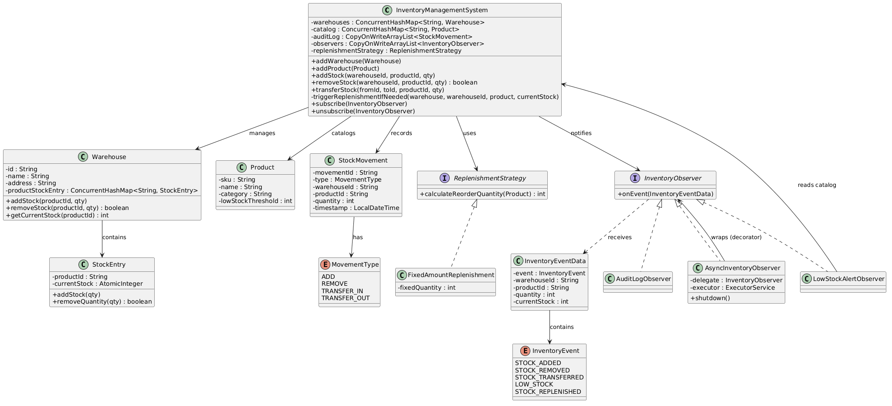

# Inventory Management System — LLD

## Table of Contents
- [1. Problem Statement](#1-problem-statement)
- [2. Requirements](#2-requirements)
- [3. Domain Notes](#3-domain-notes)
- [4. Core Entities (Top-Down)](#4-core-entities-top-down)
- [5. Entity Details](#5-entity-details)
- [6. PlantUML Class Diagram](#6-plantuml-class-diagram)
- [7. Interaction Flows](#7-interaction-flows)
- [8. Strategies](#8-strategies)
- [9. Notification (Observer Pattern)](#9-notification-observer-pattern)
- [10. Design Patterns](#10-design-patterns)
- [11. Concurrency Design](#11-concurrency-design)
- [12. Quick Reference — Interview Flow](#12-quick-reference--interview-flow)
- [13. Comparison with Previous Systems](#13-comparison-with-previous-systems)

---

## 1. Problem Statement

Design a multi-warehouse inventory management system that tracks product stock levels across locations, supports receiving shipments, fulfilling orders, transferring stock between warehouses, and provides low-stock alerting with automated replenishment — all in a thread-safe manner.

---

## 2. Requirements

### Functional
1. Track inventory for products across multiple warehouses
2. Add stock to a specific warehouse (receiving shipments)
3. Remove stock from a specific warehouse (fulfilling orders)
4. Transfer stock between warehouses
5. Record every stock movement with a timestamp for audit
6. Low-stock alerts when inventory drops below a configured threshold
7. Auto-replenishment when stock is low
8. Reject operations that would result in negative inventory

### Non-Functional
1. Thread-safe — concurrent add/remove from multiple threads
2. Deadlock-free cross-warehouse transfers
3. Audit log must be consistent with actual stock state
4. Alert evaluation must not block stock operations
5. Extensible — new replenishment strategies or alert channels without modifying core

---

## 3. Domain Notes

```
An InventoryManagementSystem manages multiple Warehouses.
A Warehouse stores Products with stock quantities.
A Product is a catalog entry (SKU, name, category) — stock is tracked per warehouse, not on the product.
A StockEntry is the per-warehouse stock for a product (quantity via AtomicInteger).
A StockMovement is an audit record of every add/remove/transfer with timestamp.
Adding stock is a simple atomic increment on StockEntry.
Removing stock uses a CAS loop — reject if insufficient (no negative inventory).
Transfers move stock between two warehouses atomically.
  Ordered locking by warehouse ID prevents deadlock.
  first/second are for lock ordering, from/to are for the actual operation.
Replenishment is inline — triggerReplenishmentIfNeeded() checks threshold after remove/transfer.
  Can be extracted to an observer if multiple reactions are needed.
Observers are notified after every operation (STOCK_ADDED, STOCK_REMOVED, STOCK_TRANSFERRED, STOCK_REPLENISHED).
  Async observers use single-thread executor for FIFO ordering without blocking callers.
Audit log is append-only (CopyOnWriteArrayList) — every stock movement is recorded.
```

---

## 4. Core Entities (Top-Down)

```
InventoryManagementSystem (top-level, orchestrator)
  ├── manages Warehouses (Map<warehouseId, Warehouse>)
  ├── manages Product catalog (Map<SKU, Product>)
  ├── records StockMovements (audit log)
  ├── coordinates transfers between warehouses
  │
  ├── Warehouse (holds stock for products)
  │     └── Map<productId, StockEntry>
  │
  ├── Product (catalog entry — SKU, name, category, threshold)
  │
  ├── StockEntry (per-warehouse stock: quantity via AtomicInteger)
  │
  └── StockMovement (audit record: type, warehouse, product, qty, timestamp)
```

---

## 5. Entity Details

### InventoryManagementSystem
The top-level entity. Coordinates all operations across warehouses.

| Field/Method | Description |
|---|---|
| `Map<String, Warehouse> warehouses` | All warehouses indexed by id |
| `Map<String, Product> catalog` | All products indexed by SKU |
| `List<StockMovement> auditLog` | Append-only audit trail (CopyOnWriteArrayList) |
| `List<InventoryObserver> observers` | Registered observers (CopyOnWriteArrayList) |
| `ReplenishmentStrategy replenishmentStrategy` | Decides reorder quantity when stock is low |
| `addWarehouse(Warehouse)` | Register a warehouse |
| `addProduct(Product)` | Add a product to catalog |
| `addStock(warehouseId, productId, qty)` | Receive shipment — atomic increment at warehouse |
| `removeStock(warehouseId, productId, qty) → boolean` | Fulfill order — CAS decrement, reject if insufficient |
| `transferStock(fromId, toId, productId, qty)` | Ordered locking on warehouses, decrement source, increment dest |
| `triggerReplenishmentIfNeeded(warehouse, warehouseId, product, currentStock)` | Checks threshold, reorders if low, logs audit + notifies |
| `subscribe(InventoryObserver)` | Register an observer |
| `unsubscribe(InventoryObserver)` | Remove an observer |
| `notifyObservers(InventoryEventData)` | Fire event to all observers |

### Warehouse
Holds stock for products. Each product's stock tracked independently.

| Field/Method | Description |
|---|---|
| `String id` | Unique warehouse identifier |
| `String name` | Warehouse name |
| `String address` | Warehouse location |
| `Map<String, StockEntry> productStockEntry` | ConcurrentHashMap — productId → StockEntry |
| `addStock(productId, qty)` | computeIfAbsent + atomic addAndGet |
| `removeStock(productId, qty) → boolean` | CAS loop: decrement if sufficient, reject if not |
| `getCurrentStock(productId) → int` | Current quantity for a product |

### Product
Catalog entry. Does not hold stock — stock is per-warehouse.

| Field/Method | Description |
|---|---|
| `String sku` | Unique product identifier |
| `String name` | Product name |
| `String category` | Product category |
| `int lowStockThreshold` | Below this → trigger replenishment + alert |

### StockEntry
Per-warehouse stock for a single product.

| Field/Method | Description |
|---|---|
| `String productId` | Which product |
| `AtomicInteger currentStock` | Current stock count (CAS-safe) |
| `addStock(qty)` | Atomically increment via addAndGet |
| `removeQuantity(qty) → boolean` | CAS loop: decrement if >= qty, return false if insufficient |

### StockMovement (Audit Record)
Immutable record of every stock operation.

| Field/Method | Description |
|---|---|
| `String movementId` | UUID |
| `MovementType type` | ADD, REMOVE, TRANSFER_IN, TRANSFER_OUT |
| `String warehouseId` | Which warehouse was affected |
| `String productId` | Which product |
| `int quantity` | How much was moved |
| `LocalDateTime timestamp` | When it happened |

### MovementType (Enum)
```
ADD, REMOVE, TRANSFER_IN, TRANSFER_OUT
```

---

## 6. PlantUML Class Diagram


---

## 7. Interaction Flows

### Add Stock (Receive Shipment)

```
1. Validate warehouse and product exist
2. warehouse.addStock(productId, qty) — atomic increment via addAndGet
3. Record StockMovement(ADD) in audit log
4. notifyObservers(STOCK_ADDED)
```

```java
public void addStock(String warehouseId, String productId, int quantity) {
    // validate inputs
    Warehouse warehouse = warehouses.get(warehouseId);
    Product product = catalog.get(productId);
    if (warehouse == null) throw new RuntimeException("Invalid Warehouse: " + warehouseId);
    if (product == null) throw new RuntimeException("Invalid Product SKU: " + productId);
    
    warehouse.addStock(productId, quantity);    // add stock to warehouse
    
    int currentStock = warehouse.getCurrentStock(productId);
    auditLog.add(new StockMovement(MovementType.ADD, warehouseId, productId, quantity));
    notifyObservers(new InventoryEventData(InventoryEvent.STOCK_ADDED, warehouseId, productId, quantity, currentStock));
}
```

### Remove Stock (Fulfill Order)

```
1. Validate warehouse and product exist
2. CAS: warehouse.removeStock(productId, qty)
   — CAS loop: decrement if >= qty, return false if insufficient
   — If false → return false (reject, no negative inventory)
3. Record StockMovement(REMOVE) in audit log
4. notifyObservers(STOCK_REMOVED)
5. triggerReplenishmentIfNeeded():
   a. If currentStock < product.lowStockThreshold:
      - Calculate reorderQty via replenishmentStrategy
      - warehouse.addStock(productId, reorderQty)
      - Record StockMovement(ADD) for the replenishment
      - notifyObservers(STOCK_REPLENISHED)
```

```java
public boolean removeStock(String warehouseId, String productId, int quantity) {
    Warehouse warehouse = warehouses.get(warehouseId);
    Product product = catalog.get(productId);
    if (warehouse == null) throw new RuntimeException("Invalid Warehouse: " + warehouseId);
    if (product == null) throw new RuntimeException("Invalid Product SKU: " + productId);
    
    boolean success = warehouse.removeStock(productId, quantity);   // remove the stock if product exists
    if (!success) return false;

    int currentStock = warehouse.getCurrentStock(productId);
    auditLog.add(new StockMovement(MovementType.REMOVE, warehouseId, productId, quantity));
    notifyObservers(new InventoryEventData(InventoryEvent.STOCK_REMOVED, warehouseId, productId, quantity, currentStock));

    triggerReplenishmentIfNeeded(warehouse, warehouseId, product, currentStock);
    return true;
}
```
### Transfer Stock

```
1. Validate both warehouses and product exist
2. Order warehouses by ID for lock ordering:
   — if fromId < toId: first=from, second=to
   — else: first=to, second=from
3. synchronized(first) { synchronized(second) {
   a. from.removeStock(productId, qty) — CAS, throw if insufficient
   b. to.addStock(productId, qty) — atomic increment
   c. Record StockMovement(TRANSFER_OUT) + StockMovement(TRANSFER_IN)
   d. notifyObservers(STOCK_TRANSFERRED)
   e. triggerReplenishmentIfNeeded() on source warehouse
}}
```

Key: `first`/`second` are for lock ordering only. `from`/`to` are for the actual operation.

```java
public void transferStock(String fromId, String toId, String productId, int quantity) {
    Warehouse from = warehouses.get(fromId);
    Warehouse to = warehouses.get(toId);
    if (from == null) throw new RuntimeException("Warehouse not found: " + fromId);
    if (to == null) throw new RuntimeException("Warehouse not found: " + toId);

    // Order locks by warehouse ID to prevent deadlock
    Warehouse first, second;
    if (fromId.compareTo(toId) < 0) {
        first = from; second = to;
    } else {
        first = to; second = from;
    }

    synchronized (first) {
        synchronized (second) {
            boolean removed = from.removeStock(productId, quantity);
            if (!removed) throw new RuntimeException("Cannot transfer stock");
            to.addStock(productId, quantity);

            int sourceStock = from.getCurrentStock(productId);
            auditLog.add(new StockMovement(MovementType.TRANSFER_OUT, fromId, productId, quantity));
            auditLog.add(new StockMovement(MovementType.TRANSFER_IN, toId, productId, quantity));
            notifyObservers(new InventoryEventData(InventoryEvent.STOCK_TRANSFERRED, fromId, productId, quantity, sourceStock));

            triggerReplenishmentIfNeeded(from, fromId, catalog.get(productId), sourceStock); // trigger replenishment from 'from' warehouse.
        }
    }
}
```
### Replenishment

```java
private void triggerReplenishmentIfNeeded(Warehouse warehouse, String warehouseId, Product product, int currentStock) {     
    if (product == null || currentStock >= product.getLowStockThreshold()) return;  // return if no replenishment needed or product is null
    int reorderQty = replenishmentStrategy.calculateReorderQuantity(product);   // calculate the quantity to replenish

    warehouse.addStock(product.getSku(), reorderQty);

    auditLog.add(new StockMovement(MovementType.ADD, warehouseId, product.getSku(), reorderQty));
    notifyObservers(new InventoryEventData(InventoryEvent.STOCK_REPLENISHED, warehouseId, product.getSku(), reorderQty, warehouse.getCurrentStock(product.getSku())));
}
```
---

## 8. Strategies

### Replenishment Strategy
```
ReplenishmentStrategy (interface)
├── calculateReorderQuantity(Product) → int
│
├── FixedAmountReplenishment     — always reorder a fixed amount (e.g., 100 units)
├── PercentageReplenishment      — reorder to fill up to X% of a max capacity (extensible)
```

Called by `triggerReplenishmentIfNeeded()` when stock drops below the product's threshold.
The strategy is injected into InventoryManagementSystem — swappable without changing core.

---

## 9. Notification (Observer Pattern)

```
InventoryObserver (interface)
├── onEvent(InventoryEventData data)

InventoryEventData (immutable class — data carrier for events)
├── InventoryEvent event       — what happened
├── String warehouseId         — where
├── String productId           — which product
├── int quantity               — how much
├── int currentStock           — stock level after operation
│   One constructor: new InventoryEventData(event, warehouseId, productId, qty, currentStock)

InventoryEvent (enum)
├── STOCK_ADDED
├── STOCK_REMOVED
├── STOCK_TRANSFERRED
├── LOW_STOCK
├── STOCK_REPLENISHED

Concrete Sync Observers:
├── AuditLogObserver           — prints every event to console
├── LowStockAlertObserver      — alerts when stock < threshold on STOCK_REMOVED/STOCK_TRANSFERRED

Async Observer:
├── AsyncInventoryObserver     — wraps any observer with Executors.newSingleThreadExecutor()
│   FIFO ordering, non-blocking for the caller.

InventoryManagementSystem (as subject)
├── List<InventoryObserver> observers   (CopyOnWriteArrayList)
├── subscribe(observer)
├── unsubscribe(observer)
├── notifyObservers(InventoryEventData) — called after addStock, removeStock, transferStock, replenishment
```

### Replenishment: Inline vs Observer

Replenishment is done inline in `triggerReplenishmentIfNeeded()`. This is simpler for a single reaction.
If the interviewer asks "what if we need multiple reactions to low stock?" → extract to observer pattern:
- `AutoReplenishmentObserver` listens for STOCK_REMOVED/STOCK_TRANSFERRED, checks threshold, calls `system.addStock()`
- `SlackNotifier`, `EmailAlertObserver`, etc. — each a separate observer class

---

## 10. Design Patterns

| Pattern | Where | Why |
|---------|-------|-----|
| **Strategy** | ReplenishmentStrategy | Pluggable reorder logic without modifying core |
| **Observer** | InventoryObserver, subscribe/unsubscribe | Decouple alerts and audit from stock operations |
| **Decorator** | AsyncInventoryObserver wraps sync observer | Async + FIFO without modifying observer code |
| **CAS (Compare-And-Swap)** | StockEntry.removeQuantity() | Lock-free for single-warehouse operations |
| **Ordered Locking** | transferStock — lock by warehouse ID order | Deadlock-free cross-warehouse transfers |

---

## 11. Concurrency Design

| Component | Mechanism | Why |
|---|---|---|
| `StockEntry.addStock()` | `addAndGet()` — atomic | Safe concurrent increments |
| `StockEntry.removeQuantity()` | CAS loop on AtomicInteger | Reject if insufficient, lock-free |
| `Warehouse.addStock()` | `computeIfAbsent()` on ConcurrentHashMap | Thread-safe get-or-create |
| `warehouses`, `catalog` | ConcurrentHashMap | Concurrent reads/writes |
| `auditLog` | CopyOnWriteArrayList | Append-only, safe iteration |
| `observers` | CopyOnWriteArrayList | Safe iteration during notification |
| `transferStock` | `synchronized` with ordered locking | Two warehouses locked in deterministic order |
| Async observers | SingleThreadExecutor per observer | Non-blocking, FIFO ordering |

### Why CAS for add/remove but synchronized for transfer?
- Add/remove affect a single AtomicInteger — CAS is sufficient
- Transfer involves two warehouses (decrement one + increment another) — can't span two AtomicIntegers with CAS
- Ordered locking prevents deadlock: always acquire locks in warehouse ID order

### Why CopyOnWriteArrayList for audit log?
- Append-only (no removals, no updates)
- Reads (for display/export) are frequent and don't need locking
- Writes (new movements) copy the array — acceptable since movements are less frequent than reads

### What is Ordered Locking?

A deadlock prevention technique. When you need to lock multiple objects, always acquire them in the same consistent order.

**The Problem:**
```
Thread 1: transfer(A → B)         Thread 2: transfer(B → A)
  lock(A)                           lock(B)
  lock(B) ← BLOCKED (T2 has B)     lock(A) ← BLOCKED (T1 has A)

  DEADLOCK — both waiting for each other forever
```

**The Fix:** Always lock the one with the smaller ID first, regardless of transfer direction:

```java
public void transferStock(String fromId, String toId, String productId, int qty) {
    Warehouse from = warehouses.get(fromId);
    Warehouse to = warehouses.get(toId);

    // Always lock in consistent order by ID
    Warehouse first = fromId.compareTo(toId) < 0 ? from : to;
    Warehouse second = fromId.compareTo(toId) < 0 ? to : from;

    synchronized (first) {
        synchronized (second) {
            from.removeStock(productId, qty);
            to.addStock(productId, qty);
        }
    }
}
```

**Now both threads agree on the order:**
```
Thread 1: transfer(A → B)         Thread 2: transfer(B → A)
  A < B, so lock(A) first           B > A, so lock(A) first
  lock(A) ✅                         lock(A) ← BLOCKED (waits for T1)
  lock(B) ✅
  do work
  unlock(B)
  unlock(A)
                                    lock(A) ✅ (T1 released it)
                                    lock(B) ✅
                                    do work
                                    NO DEADLOCK ✅
```

**Key:** `first`/`second` determine lock order. `from`/`to` determine the actual operation. The ordering key can be anything deterministic — string ID, integer ID, `System.identityHashCode()`. Just has to be consistent across all threads.


---

## 12. Quick Reference — Interview Flow

```
1. State the problem → "Multi-warehouse inventory with stock tracking"
2. Identify entities → InventorySystem, Warehouse, Product, StockEntry, StockMovement
3. Define relationships → System manages warehouses, each warehouse has stock entries per product
4. Add methods → addStock (atomic), removeStock (CAS), transferStock (ordered locking)
5. Add audit → StockMovement with MovementType enum, append after every operation
6. Add replenishment → ReplenishmentStrategy (inline check via triggerReplenishmentIfNeeded)
7. Add observer → InventoryObserver for alerts/audit, AsyncInventoryObserver for non-blocking
8. Discuss concurrency → CAS for add/remove, ordered locking for transfers, async observers
9. Discuss edge cases → negative stock rejection, deadlock prevention, audit consistency
```

---

## 13. Comparison with Previous Systems

| Concept | Parking Lot | Library | Inventory |
|---------|-------------|---------|-----------|
| Top entity | ParkingLot | Library | InventoryManagementSystem |
| Container | ParkingFloor | Catalog (Map) | Warehouse |
| Resource | ParkingSpot (boolean) | Book (AtomicInteger copies) | StockEntry (AtomicInteger qty) |
| Multi-resource op | N/A | member + book (CAS + rollback) | transfer (ordered locking) |
| Audit | N/A | N/A | StockMovement log |
| Alert | Observer | Observer | Observer + inline replenishment |
| Strategy | PricingStrategy | FineStrategy | ReplenishmentStrategy |
| Deadlock concern | N/A | N/A | Transfer — solved with ordered locking |
| Async | AsyncParkingObserver | AsyncLibraryObserver | AsyncInventoryObserver |

### New concepts introduced in Inventory:
1. Multi-warehouse architecture (stock per warehouse, not global)
2. Ordered locking for deadlock-free transfers (first time using `synchronized`)
3. Audit log — append-only CopyOnWriteArrayList
4. CAS for single-warehouse ops + `synchronized` for cross-warehouse — hybrid concurrency
5. Inline replenishment with extracted helper method (extensible to observer if needed)
