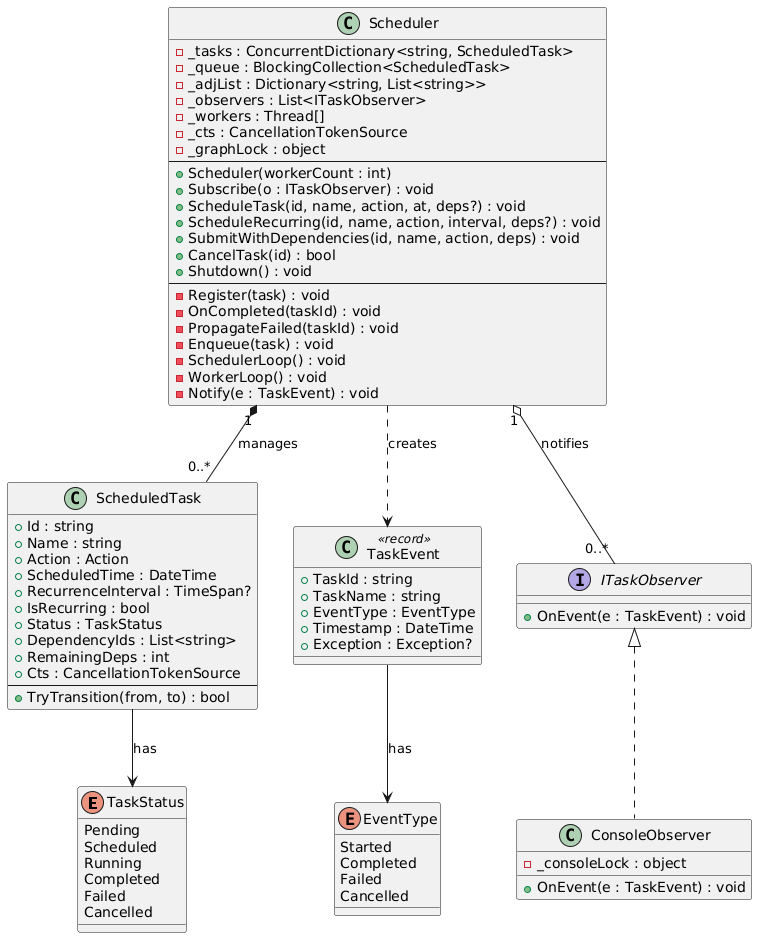

# Task Scheduler — Low-Level Design

## Problem Statement

Design a **Task Scheduler** that can schedule, execute, and manage tasks with support for:
- One-time and recurring execution
- Task dependencies (DAG-based ordering)
- Lifecycle notifications (Observer pattern)
- Cancellation
- Concurrent execution with thread safety

The system evolves across three versions, progressively adding complexity.

---

## Functional Requirements

1. **Schedule tasks** to run at a specific future time
2. **Schedule recurring tasks** that repeat at a fixed interval
3. **Cancel** pending tasks before execution
4. **Observe** task lifecycle events (Started, Completed, Failed, Cancelled)
5. **Declare dependencies** between tasks — a task only runs after all its dependencies complete
6. **Propagate failures** — if a task fails, all transitive dependents are marked failed
7. **Execute tasks concurrently** using a configurable worker thread pool
8. **Graceful shutdown** — drain in-progress work before stopping

---

## Non-Functional Requirements

1. **Correctness** — Tasks must not execute before their scheduled time or before dependencies are met
2. **Thread Safety** — Concurrent access must not corrupt state (V3)
3. **Scalability** — Worker pool should handle parallel independent tasks efficiently
4. **Fault Isolation** — A failing task or observer must not crash the scheduler
5. **Low Latency** — Polling interval of 100ms keeps scheduling overhead minimal
6. **Graceful Degradation** — Failure propagation prevents zombie chains of waiting tasks

---

## Core Entities

### TaskStatus (Enum)

| Value | Description |
|-------|-------------|
| `Pending` | Awaiting scheduled time / dependency resolution |
| `Scheduled` | (V3 only) Enqueued for worker pickup |
| `Running` | Currently executing |
| `Completed` | Finished successfully |
| `Failed` | Threw an exception or dependency failed |
| `Cancelled` | Cancelled by user before execution |

### EventType (Enum)

| Value | Description |
|-------|-------------|
| `Started` | Task began execution |
| `Completed` | Task finished successfully |
| `Failed` | Task failed |
| `Cancelled` | Task was cancelled |

### ScheduledTask

| Property / Field | Type | Description |
|------------------|------|-------------|
| `Id` | `string` | Unique identifier |
| `Name` | `string` | Human-readable name |
| `Action` | `Action` | The work to execute |
| `ScheduledTime` | `DateTime` | Earliest time the task can run |
| `RecurrenceInterval` | `TimeSpan?` | If set, task repeats at this interval |
| `IsRecurring` | `bool` | Derived from RecurrenceInterval |
| `Status` | `TaskStatus` | Current lifecycle state |
| `DependencyIds` | `List<string>` | IDs of tasks this depends on (V2+) |
| `RemainingDeps` | `int` | Kahn's in-degree counter (V2+) |
| `Cts` | `CancellationTokenSource` | Per-task cancellation (V3) |

| Method | Description |
|--------|-------------|
| `TryTransition(from, to)` | (V3) CAS-based atomic state transition. Returns true if this thread won. |

### Scheduler

| Method | Description |
|--------|-------------|
| `Subscribe(ITaskObserver)` | Add a lifecycle event listener |
| `ScheduleTask(id, name, action, at, deps?)` | Register a one-time task |
| `ScheduleRecurring(id, name, action, interval, deps?)` | Register a repeating task |
| `SubmitWithDependencies(id, name, action, deps)` | Shorthand: schedule at now with dependencies (V2+) |
| `CancelTask(id)` | Cancel a pending task; propagates failure to dependents (V2+) |
| `Run()` | (V1/V2) Blocking single-threaded scheduler loop |
| `Shutdown()` | Signal the scheduler to stop |

| Internal Method | Description |
|-----------------|-------------|
| `Register(task)` | Build adjacency list, compute in-degree (V2+) |
| `OnCompleted(taskId)` | Kahn's step: decrement in-degree of dependents (V2+) |
| `PropagateFailed(taskId)` | BFS: mark all transitive dependents as Failed (V2+) |
| `Execute(task)` | Run the task action, update status, notify observers |
| `Enqueue(task)` | (V3) CAS Pending→Scheduled, add to BlockingCollection |
| `SchedulerLoop()` | (V3) Background thread polling for time-ready tasks |
| `WorkerLoop()` | (V3) Consumer loop: dequeue, CAS→Running, execute |

### ITaskObserver (Interface)

| Method | Description |
|--------|-------------|
| `OnEvent(TaskEvent)` | Called on every task lifecycle transition |

### ConsoleObserver

| Method | Description |
|--------|-------------|
| `OnEvent(TaskEvent)` | Prints colored event to console (V3: thread-safe with lock, includes thread name) |

### TaskEvent (Record)

| Property | Type | Description |
|----------|------|-------------|
| `TaskId` | `string` | ID of the task |
| `TaskName` | `string` | Name of the task |
| `EventType` | `EventType` | What happened |
| `Timestamp` | `DateTime` | When it happened |
| `Exception` | `Exception?` | Error details (if Failed) |

---

## Class Diagram 

---

## Upgrading from V1 to V2

### What Changed

| Aspect | V1 | V2 |
|--------|----|----|
| Dependencies | None | Tasks can declare `DependencyIds` |
| Data Structure | Flat dictionary | + Adjacency list (`_adjList`) |
| Execution Guard | Time check only | Time check + `RemainingDeps > 0` |
| Failure Handling | Individual task only | BFS propagation to all dependents |
| Cancellation | Marks task cancelled | + Propagates failure to dependents |
| Registration | Direct dictionary insert | `Register()` builds graph, computes in-degree |

### New Concepts Introduced

1. **Kahn's Algorithm** — Each task has an in-degree (`RemainingDeps`) representing unfinished dependencies. When a dependency completes, it decrements the in-degree of its dependents. A task becomes executable when its in-degree hits 0.

2. **Adjacency List** — `_adjList[depId]` stores the list of task IDs that depend on `depId`. This is the forward-edge representation enabling efficient unlocking.

3. **BFS Failure Propagation** — When a task fails or is cancelled, a BFS traversal walks all transitive dependents and marks them Failed, preventing orphaned waiting tasks.

### New API

- `SubmitWithDependencies(id, name, action, deps)` — convenience method for dependent tasks
- `ScheduleTask` and `ScheduleRecurring` now accept optional `deps` parameter

### Migration Steps

1. Add `DependencyIds` and `RemainingDeps` fields to `ScheduledTask`.
2. Add adjacency list (`_adjList`) to `Scheduler`.
3. Replace direct dictionary insert with `Register()` method.
4. Add `RemainingDeps > 0` guard to the scheduler loop.
5. Call `OnCompleted()` after successful execution.
6. Call `PropagateFailed()` after failure or cancellation.

---

## Upgrading from V2 to V3

### What Changed

| Aspect | V2 | V3 |
|--------|----|----|
| Threading | Single-threaded loop | Worker thread pool + scheduler loop thread |
| Task Storage | `Dictionary` | `ConcurrentDictionary` |
| Work Queue | None (inline execution) | `BlockingCollection<ScheduledTask>` |
| Status Transitions | Direct property set | CAS via `TryTransition()` |
| In-Degree Decrement | Simple `--` | `Interlocked.Decrement` |
| TaskStatus Enum | 5 values | 6 values (added `Scheduled`) |
| Recurring Tasks | Mutate same instance | Create new instance per occurrence |
| Cancellation | Flag-based | Per-task `CancellationTokenSource` |
| Shutdown | Set `_running = false` | `CompleteAdding()` + `Cancel()` + `Join()` |
| Console Observer | Direct write | Lock-protected, includes thread name |
| Graph Protection | None needed | `lock (_graphLock)` |

### New Concepts Introduced

1. **Producer-Consumer Pattern** — `BlockingCollection` decouples scheduling from execution. Workers block on `GetConsumingEnumerable()` instead of busy-waiting.

2. **CAS (Compare-And-Swap)** — `Interlocked.CompareExchange` ensures only ONE thread can win a status transition. Eliminates race conditions where multiple workers could grab the same task.

3. **Scheduled State** — New intermediate state between Pending and Running. A task is `Scheduled` once enqueued but before a worker picks it up. This prevents double-enqueue.

4. **Atomic In-Degree** — `Interlocked.Decrement` ensures correctness when two dependencies complete simultaneously on different threads.

5. **Graceful Shutdown** — `CompleteAdding()` signals no new work; workers drain remaining items. `CancellationToken` exits the scheduler loop. `Join()` waits for workers to finish.

6. **Per-Task CancellationTokenSource** — Enables cooperative cancellation; workers check the token before executing.

### New API

- `Scheduler(workerCount: int)` — constructor now accepts pool size
- `Run()` removed — scheduler starts automatically on construction

### Migration Steps

1. Replace `Dictionary<string, ScheduledTask>` with `ConcurrentDictionary`.
2. Add `BlockingCollection<ScheduledTask>` as work queue.
3. Replace `Status` property setter with `TryTransition()` using CAS.
4. Replace `RemainingDeps--` with `Interlocked.Decrement`.
5. Add `Scheduled` to `TaskStatus` enum.
6. Spawn worker threads in constructor; move execution logic to `WorkerLoop()`.
7. Move time-polling to a separate `SchedulerLoop()` thread.
8. Wrap adjacency list mutations with `lock (_graphLock)`.
9. Add per-task `CancellationTokenSource`.
10. Implement graceful `Shutdown()` with `CompleteAdding()` + `Join()`.
11. For recurring tasks, create new instances instead of mutating the original.
12. Add thread-safe locking to `ConsoleObserver`.
