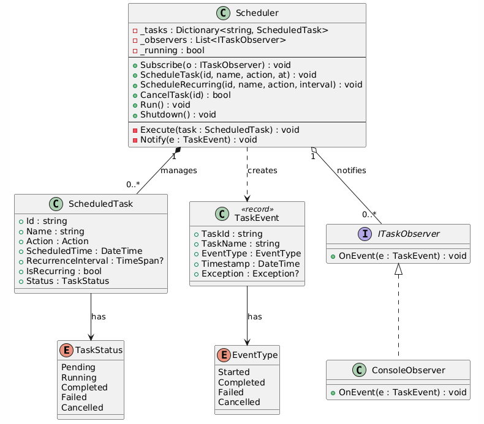

# V1 — Single-Threaded Task Scheduler

## Overview

A basic single-threaded task scheduler supporting one-time and recurring tasks, cancellation, and observer-based event notifications.

## Features

- Schedule one-time tasks at a future time
- Schedule recurring tasks with a fixed interval
- Cancel pending tasks
- Observer pattern for lifecycle event notifications (Started, Completed, Failed, Cancelled)
- Single-threaded polling loop (100ms tick)

---

## Core Entities

### TaskStatus (Enum)

Represents the lifecycle state of a task.

| Value | Description |
|-------|-------------|
| `Pending` | Task is waiting for its scheduled time |
| `Running` | Task is currently executing |
| `Completed` | Task finished successfully |
| `Failed` | Task threw an exception during execution |
| `Cancelled` | Task was cancelled before execution |

```csharp
enum TaskStatus { Pending, Running, Completed, Failed, Cancelled }
```

---

### EventType (Enum)

Categorizes lifecycle events emitted by the scheduler.

| Value | Description |
|-------|-------------|
| `Started` | Task began execution |
| `Completed` | Task finished successfully |
| `Failed` | Task failed with an exception |
| `Cancelled` | Task was cancelled |

```csharp
enum EventType { Started, Completed, Failed, Cancelled }
```

---

### ScheduledTask

The core unit of work. Encapsulates the action to execute, when to execute it, and whether it should recur.

| Property | Type | Description |
|----------|------|-------------|
| `Id` | `string` | Unique identifier for the task |
| `Name` | `string` | Human-readable display name |
| `Action` | `Action` | The delegate to execute |
| `ScheduledTime` | `DateTime` | Earliest UTC time the task can run (mutable for recurring reschedule) |
| `RecurrenceInterval` | `TimeSpan?` | If set, the task repeats at this interval after each completion |
| `IsRecurring` | `bool` | Derived property — true if `RecurrenceInterval` has a value |
| `Status` | `TaskStatus` | Current lifecycle state |

```csharp
class ScheduledTask
{
    public string     Id                 { get; }
    public string     Name               { get; }
    public Action     Action             { get; }
    public DateTime   ScheduledTime      { get; set; }
    public TimeSpan?  RecurrenceInterval { get; }
    public bool       IsRecurring        => RecurrenceInterval.HasValue;
    public TaskStatus Status             { get; set; } = TaskStatus.Pending;

    public ScheduledTask(string id, string name, Action action,
        DateTime scheduledTime, TimeSpan? recurrenceInterval = null)
    {
        Id = id; Name = name; Action = action;
        ScheduledTime = scheduledTime;
        RecurrenceInterval = recurrenceInterval;
    }
}
```

---

### TaskEvent (Record)

Immutable event object created on every lifecycle transition and passed to observers.

| Property | Type | Description |
|----------|------|-------------|
| `TaskId` | `string` | ID of the task that triggered the event |
| `TaskName` | `string` | Name of the task |
| `EventType` | `EventType` | What lifecycle transition occurred |
| `Timestamp` | `DateTime` | When the event was created |
| `Exception` | `Exception?` | Error details (only populated for `Failed` events) |

```csharp
record TaskEvent(string TaskId, string TaskName, EventType EventType,
    DateTime Timestamp, Exception? Exception = null);
```

---

### ITaskObserver (Interface)

Contract for receiving task lifecycle notifications. Implements the Observer pattern.

| Method | Description |
|--------|-------------|
| `OnEvent(TaskEvent e)` | Invoked by the scheduler on every status transition |

```csharp
interface ITaskObserver { void OnEvent(TaskEvent e); }
```

---

### ConsoleObserver

Concrete observer that prints color-coded lifecycle events to the console.

- `Started` → Cyan
- `Completed` → Green
- `Failed` → Red (includes exception message)
- `Cancelled` → Yellow

```csharp
class ConsoleObserver : ITaskObserver
{
    public void OnEvent(TaskEvent e)
    {
        Console.ForegroundColor = e.EventType switch
        {
            EventType.Started   => ConsoleColor.Cyan,
            EventType.Completed => ConsoleColor.Green,
            EventType.Failed    => ConsoleColor.Red,
            EventType.Cancelled => ConsoleColor.Yellow,
            _                   => ConsoleColor.White
        };
        var msg = e.Exception != null ? $" — {e.Exception.Message}" : "";
        Console.WriteLine($"[{e.EventType,-10}] {e.TaskName}{msg}");
        Console.ResetColor();
    }
}
```

---

### Scheduler

The orchestrator. Manages task registration, the single-threaded polling loop, execution, and observer notifications.

| Property / Field | Type | Description |
|------------------|------|-------------|
| `_tasks` | `Dictionary<string, ScheduledTask>` | Task registry keyed by ID |
| `_observers` | `List<ITaskObserver>` | Registered lifecycle observers |
| `_running` | `bool` | Flag controlling the scheduler loop |

| Method | Signature | Description |
|--------|-----------|-------------|
| `Subscribe` | `void Subscribe(ITaskObserver o)` | Add a lifecycle event listener |
| `ScheduleTask` | `void ScheduleTask(string id, string name, Action action, DateTime at)` | Register a one-time task |
| `ScheduleRecurring` | `void ScheduleRecurring(string id, string name, Action action, TimeSpan interval)` | Register a repeating task starting now |
| `CancelTask` | `bool CancelTask(string id)` | Cancel a pending task; returns false if not found or not pending |
| `Run` | `void Run()` | Blocking scheduler loop — polls every 100ms |
| `Shutdown` | `void Shutdown()` | Sets `_running = false` to exit the loop |
| `Execute` | `void Execute(ScheduledTask task)` | (private) Runs the action, updates status, notifies observers |
| `Notify` | `void Notify(TaskEvent e)` | (private) Broadcasts event to all observers (swallows observer exceptions) |

```csharp
class Scheduler
{
    private readonly Dictionary<string, ScheduledTask> _tasks = new();
    private readonly List<ITaskObserver> _observers = new();
    private bool _running = true;

    public void Subscribe(ITaskObserver o) => _observers.Add(o);

    public void ScheduleTask(string id, string name, Action action, DateTime at)
        => _tasks[id] = new ScheduledTask(id, name, action, at);

    public void ScheduleRecurring(string id, string name, Action action, TimeSpan interval)
        => _tasks[id] = new ScheduledTask(id, name, action, DateTime.UtcNow, interval);

    public bool CancelTask(string id)
    {
        if (!_tasks.TryGetValue(id, out var task)) return false;
        if (task.Status != TaskStatus.Pending) return false;
        task.Status = TaskStatus.Cancelled;
        Notify(new TaskEvent(task.Id, task.Name, EventType.Cancelled, DateTime.UtcNow));
        return true;
    }

    public void Run()
    {
        while (_running)
        {
            foreach (var task in _tasks.Values.ToList())
            {
                if (task.Status != TaskStatus.Pending) continue;
                if (DateTime.UtcNow < task.ScheduledTime) continue;
                Execute(task);
                if (task.IsRecurring && task.Status == TaskStatus.Completed)
                {
                    task.ScheduledTime = DateTime.UtcNow.Add(task.RecurrenceInterval!.Value);
                    task.Status = TaskStatus.Pending;
                }
            }
            Thread.Sleep(100);
        }
    }

    public void Shutdown() => _running = false;

    private void Execute(ScheduledTask task)
    {
        task.Status = TaskStatus.Running;
        Notify(new TaskEvent(task.Id, task.Name, EventType.Started, DateTime.UtcNow));
        try
        {
            task.Action();
            task.Status = TaskStatus.Completed;
            Notify(new TaskEvent(task.Id, task.Name, EventType.Completed, DateTime.UtcNow));
        }
        catch (Exception ex)
        {
            task.Status = TaskStatus.Failed;
            Notify(new TaskEvent(task.Id, task.Name, EventType.Failed, DateTime.UtcNow, ex));
        }
    }

    private void Notify(TaskEvent e)
    {
        foreach (var o in _observers)
            try { o.OnEvent(e); } catch { }
    }
}
```

---

## Class Diagram 


---

## Client Code (Demo)

```csharp
var scheduler = new Scheduler();
scheduler.Subscribe(new ConsoleObserver());

Console.WriteLine("=== V1: Single-threaded Scheduler ===\n");

// One-time task: runs after 1 second
scheduler.ScheduleTask("t1", "One-Time Report", () =>
{
    Console.WriteLine("  → Generating report...");
    Thread.Sleep(200);
}, DateTime.UtcNow.AddSeconds(1));

// Recurring task: runs every 2 seconds
scheduler.ScheduleRecurring("hb", "Heartbeat",
    () => Console.WriteLine("  → ♥ ping"), TimeSpan.FromSeconds(2));

// Task that will be cancelled before it runs
scheduler.ScheduleTask("t2", "Cancelled Task",
    () => Console.WriteLine("  → Should never run"), DateTime.UtcNow.AddSeconds(5));

// Task that will fail
scheduler.ScheduleTask("t3", "Failing Task",
    () => throw new Exception("Boom!"), DateTime.UtcNow.AddSeconds(1.5));

// Cancel t2 before it runs
Task.Delay(500).ContinueWith(_ => scheduler.CancelTask("t2"));

// Shutdown after 7 seconds
Task.Delay(7000).ContinueWith(_ => scheduler.Shutdown());

scheduler.Run(); // blocks until Shutdown() is called

Console.WriteLine("\n=== Shutdown complete ===");
```

---

## How It Works — Detailed Function Walkthrough

### `ScheduleTask(id, name, action, at)`

Adds a one-time task to the internal dictionary.

**Example:**
```
scheduler.ScheduleTask("t1", "Report", () => GenerateReport(), DateTime.UtcNow.AddSeconds(5));
```

**What happens internally:**
```
_tasks["t1"] = new ScheduledTask("t1", "Report", action, UtcNow+5s)
```
The task sits in the dictionary with `Status = Pending` until the loop picks it up.

---

### `ScheduleRecurring(id, name, action, interval)`

Same as `ScheduleTask` but sets `RecurrenceInterval`, which causes the task to be re-scheduled after each successful execution.

**Example:**
```
scheduler.ScheduleRecurring("hb", "Heartbeat", () => Ping(), TimeSpan.FromSeconds(2));
```

**What happens internally:**
```
_tasks["hb"] = new ScheduledTask("hb", "Heartbeat", action, UtcNow, interval: 2s)
```
Since `ScheduledTime = UtcNow`, it's immediately eligible on the next loop tick.

---

### `Run()`

The main scheduler loop. Blocks the calling thread and polls every 100ms.

**Example execution timeline:**

Given these tasks registered:
```
t1: ScheduledTime = UtcNow + 1s    (one-time)
hb: ScheduledTime = UtcNow         (recurring, interval = 2s)
t2: ScheduledTime = UtcNow + 5s    (will be cancelled at 500ms)
```

```
Time 0ms    → Loop starts. hb is ready (UtcNow >= ScheduledTime). Execute hb.
               hb completes → reschedule: hb.ScheduledTime = UtcNow + 2s, Status = Pending
Time 100ms  → t1 not ready, hb not ready (next at ~2s), t2 not ready. Sleep.
Time 500ms  → CancelTask("t2") called externally. t2.Status = Cancelled.
Time 1000ms → t1 is ready. Execute t1. t1 completes.
Time 2000ms → hb is ready again. Execute hb. Reschedule to UtcNow + 2s.
Time 4000ms → hb fires again.
...
Time 7000ms → Shutdown() called. _running = false. Loop exits.
```

**Key logic per iteration:**
1. Skip if `Status != Pending` (already ran, failed, or cancelled)
2. Skip if `DateTime.UtcNow < task.ScheduledTime` (not time yet)
3. Call `Execute(task)`
4. If recurring and completed → reset `ScheduledTime` and `Status = Pending`
5. `Thread.Sleep(100)` → 100ms polling interval

---

### `Execute(task)`

Runs the task's action delegate synchronously and manages status transitions + observer notifications.

**Example — Successful execution:**
```
Input: task = { Id: "t1", Name: "Report", Status: Pending }

Step 1: task.Status = Running
Step 2: Notify(Started) → observers see "[Started   ] Report"
Step 3: task.Action() → runs GenerateReport()
Step 4: task.Status = Completed
Step 5: Notify(Completed) → observers see "[Completed ] Report"
```

**Example — Failed execution:**
```
Input: task = { Id: "t3", Name: "Failing Task", Action: throw new Exception("Boom!") }

Step 1: task.Status = Running
Step 2: Notify(Started) → observers see "[Started   ] Failing Task"
Step 3: task.Action() → throws Exception("Boom!")
Step 4: (catch) task.Status = Failed
Step 5: Notify(Failed) → observers see "[Failed    ] Failing Task — Boom!"
```

---

### `CancelTask(id)`

Marks a pending task as cancelled and notifies observers.

**Example:**
```
scheduler.CancelTask("t2")

Step 1: Look up _tasks["t2"] → found
Step 2: Check task.Status == Pending → yes
Step 3: task.Status = Cancelled
Step 4: Notify(Cancelled) → observers see "[Cancelled ] Cancelled Task"
Step 5: return true
```

If the task is already Running or Completed, returns `false` — can't cancel what's already done.

---

### `Notify(event)`

Broadcasts the event to all registered observers. Swallows any exception thrown by an observer to prevent one bad observer from crashing the scheduler.

```
foreach observer in _observers:
    try { observer.OnEvent(event) } catch { /* silently ignore */ }
```

---

## Limitations

- Single-threaded: all tasks execute sequentially on the calling thread.
- No dependency support between tasks.
- No thread safety considerations.
