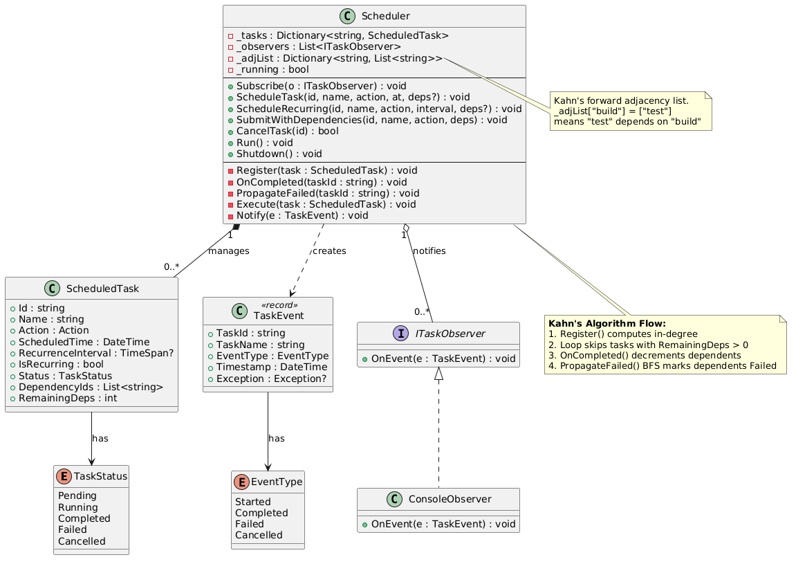

# V2 — Single-Threaded Task Scheduler + Dependency Tracking

## Overview

Extends V1 with task dependency support using Kahn's Algorithm for topological ordering and BFS-based failure propagation.

## Features

- Everything from V1 (one-time, recurring, cancel, observer)
- Declare dependencies between tasks
- Kahn's Algorithm: in-degree tracking to determine execution readiness
- Adjacency list for forward edge relationships
- BFS failure propagation: if a task fails, all transitive dependents are marked Failed
- Cancellation also propagates failure to dependents

---

## Core Entities

### TaskStatus (Enum)

Same as V1 — represents the lifecycle state of a task.

```csharp
enum TaskStatus { Pending, Running, Completed, Failed, Cancelled }
```

---

### EventType (Enum)

Same as V1 — categorizes lifecycle events.

```csharp
enum EventType { Started, Completed, Failed, Cancelled }
```

---

### ScheduledTask

Extended from V1 with dependency tracking fields.

| Property | Type | Description |
|----------|------|-------------|
| `Id` | `string` | Unique identifier |
| `Name` | `string` | Human-readable name |
| `Action` | `Action` | The delegate to execute |
| `ScheduledTime` | `DateTime` | Earliest UTC time to run |
| `RecurrenceInterval` | `TimeSpan?` | Repeat interval (null for one-time) |
| `IsRecurring` | `bool` | Derived from RecurrenceInterval |
| `Status` | `TaskStatus` | Current lifecycle state |
| `DependencyIds` | `List<string>` | **NEW** — IDs of tasks this task depends on |
| `RemainingDeps` | `int` | **NEW** — Kahn's in-degree counter; task is ready when this reaches 0 |

```csharp
class ScheduledTask
{
    public string     Id                 { get; }
    public string     Name               { get; }
    public Action     Action             { get; }
    public DateTime   ScheduledTime      { get; set; }
    public TimeSpan?  RecurrenceInterval { get; }
    public bool       IsRecurring        => RecurrenceInterval.HasValue;
    public TaskStatus Status             { get; set; } = TaskStatus.Pending;
    public List<string> DependencyIds    { get; }                //new — list of dependency task IDs
    public int RemainingDeps { get; set; }                       //new — Kahn's in-degree counter

    public ScheduledTask(string id, string name, Action action,
        DateTime? scheduledTime = null, TimeSpan? recurrenceInterval = null,
        List<string>? deps = null)                                //new — optional deps parameter
    {
        Id = id; Name = name; Action = action;
        ScheduledTime = scheduledTime ?? DateTime.UtcNow;
        RecurrenceInterval = recurrenceInterval;
        DependencyIds = deps ?? new();                           //new — store dependencies
    }
}
```

---

### TaskEvent (Record)

Same as V1 — immutable event object passed to observers.

```csharp
record TaskEvent(string TaskId, string TaskName, EventType EventType,
    DateTime Timestamp, Exception? Exception = null);
```

---

### ITaskObserver (Interface)

Same as V1.

```csharp
interface ITaskObserver { void OnEvent(TaskEvent e); }
```

---

### ConsoleObserver

Same as V1 — color-coded console output.

```csharp
class ConsoleObserver : ITaskObserver
{
    public void OnEvent(TaskEvent e)
    {
        Console.ForegroundColor = e.EventType switch
        {
            EventType.Started   => ConsoleColor.Cyan,
            EventType.Completed => ConsoleColor.Green,
            EventType.Failed    => ConsoleColor.Red,
            EventType.Cancelled => ConsoleColor.Yellow,
            _                   => ConsoleColor.White
        };
        var msg = e.Exception != null ? $" — {e.Exception.Message}" : "";
        Console.WriteLine($"[{e.EventType,-10}] {e.TaskName}{msg}");
        Console.ResetColor();
    }
}
```

---

### Scheduler

Extended with Kahn's Algorithm for dependency resolution and BFS failure propagation.

| Property / Field | Type | Description |
|------------------|------|-------------|
| `_tasks` | `Dictionary<string, ScheduledTask>` | Task registry |
| `_observers` | `List<ITaskObserver>` | Event listeners |
| `_running` | `bool` | Loop control flag |
| `_adjList` | `Dictionary<string, List<string>>` | **NEW** — Forward adjacency list. `_adjList[id]` = list of tasks waiting on `id` |

| Method | Signature | Description |
|--------|-----------|-------------|
| `Subscribe` | `void Subscribe(ITaskObserver o)` | Add observer |
| `ScheduleTask` | `void ScheduleTask(string id, string name, Action action, DateTime at, List<string>? deps = null)` | Register task (now accepts deps) |
| `ScheduleRecurring` | `void ScheduleRecurring(string id, string name, Action action, TimeSpan interval, List<string>? deps = null)` | Register recurring (now accepts deps) |
| `SubmitWithDependencies` | `void SubmitWithDependencies(string id, string name, Action action, List<string> deps)` | **NEW** — Shorthand: schedule at now with dependencies |
| `CancelTask` | `bool CancelTask(string id)` | Cancel + propagate failure to dependents |
| `Run` | `void Run()` | Blocking loop — now checks `RemainingDeps > 0` |
| `Shutdown` | `void Shutdown()` | Stop the loop |
| `Register` | `void Register(ScheduledTask task)` | **NEW** (private) — Build adjacency list, compute in-degree |
| `OnCompleted` | `void OnCompleted(string taskId)` | **NEW** (private) — Kahn's step: decrement in-degree of dependents |
| `PropagateFailed` | `void PropagateFailed(string taskId)` | **NEW** (private) — BFS: mark all transitive dependents as Failed |
| `Execute` | `void Execute(ScheduledTask task)` | Run action, call `OnCompleted` or `PropagateFailed` |
| `Notify` | `void Notify(TaskEvent e)` | Broadcast to observers |

```csharp
class Scheduler
{
    private readonly Dictionary<string, ScheduledTask> _tasks = new();
    private readonly List<ITaskObserver> _observers = new();
    private bool _running = true;

    //new — Kahn's: forward adjacency list — _adjList[id] = tasks waiting on id
    private readonly Dictionary<string, List<string>> _adjList = new();

    public void Subscribe(ITaskObserver o) => _observers.Add(o);

    public void ScheduleTask(string id, string name, Action action,
        DateTime at, List<string>? deps = null)                   //new — optional deps param
        => Register(new ScheduledTask(id, name, action, at, deps: deps));  //new — calls Register()

    public void ScheduleRecurring(string id, string name, Action action,
        TimeSpan interval, List<string>? deps = null)            //new — optional deps param
        => Register(new ScheduledTask(id, name, action, DateTime.UtcNow, interval, deps));

    //new — convenience method for scheduling with dependencies
    public void SubmitWithDependencies(string id, string name, Action action, List<string> deps)
        => ScheduleTask(id, name, action, DateTime.UtcNow, deps);

    public bool CancelTask(string id)
    {
        if (!_tasks.TryGetValue(id, out var task)) return false;
        if (task.Status != TaskStatus.Pending) return false;
        task.Status = TaskStatus.Cancelled;
        Notify(new TaskEvent(task.Id, task.Name, EventType.Cancelled, DateTime.UtcNow));
        PropagateFailed(id);    //new — cancelled = will never complete → fail dependents
        return true;
    }

    public void Run()
    {
        while (_running)
        {
            foreach (var task in _tasks.Values.ToList())
            {
                if (task.Status != TaskStatus.Pending) continue;
                if (task.RemainingDeps > 0) continue;           //new — skip if waiting on deps
                if (DateTime.UtcNow < task.ScheduledTime) continue;
                Execute(task);
                if (task.IsRecurring && task.Status == TaskStatus.Completed)
                {
                    task.ScheduledTime = DateTime.UtcNow.Add(task.RecurrenceInterval!.Value);
                    task.Status = TaskStatus.Pending;
                }
            }
            Thread.Sleep(100);
        }
    }

    public void Shutdown() => _running = false;

    // ── Kahn's Algorithm ──────────────────────────────────────────────────  //new — entire section

    //new — Wire edges and compute initial in-degree for the task
    private void Register(ScheduledTask task)
    {
        _tasks[task.Id] = task;
        if (!_adjList.ContainsKey(task.Id))
            _adjList[task.Id] = new();

        int inDegree = 0;
        foreach (var depId in task.DependencyIds)
        {
            if (!_adjList.ContainsKey(depId))
                _adjList[depId] = new();
            _adjList[depId].Add(task.Id);    // forward edge
            if (!(_tasks.TryGetValue(depId, out var dep) && dep.Status == TaskStatus.Completed))
                inDegree++;
        }
        task.RemainingDeps = inDegree;
    }

    //new — Kahn's step: decrement in-degree of all dependents
    private void OnCompleted(string taskId)
    {
        if (!_adjList.TryGetValue(taskId, out var deps)) return;
        foreach (var depId in deps)
            if (_tasks.TryGetValue(depId, out var dep))
                dep.RemainingDeps--;
    }

    //new — BFS failure propagation: mark all transitive dependents as Failed
    private void PropagateFailed(string taskId)
    {
        var queue = new Queue<string>();
        queue.Enqueue(taskId);
        while (queue.Count > 0)
        {
            var current = queue.Dequeue();
            if (!_adjList.TryGetValue(current, out var deps)) continue;
            foreach (var depId in deps)
            {
                if (!_tasks.TryGetValue(depId, out var dep)) continue;
                if (dep.Status != TaskStatus.Pending) continue;
                dep.Status = TaskStatus.Failed;
                Notify(new TaskEvent(dep.Id, dep.Name, EventType.Failed, DateTime.UtcNow,
                    new Exception("Dependency failed")));
                queue.Enqueue(depId);
            }
        }
    }

    private void Execute(ScheduledTask task)
    {
        task.Status = TaskStatus.Running;
        Notify(new TaskEvent(task.Id, task.Name, EventType.Started, DateTime.UtcNow));
        try
        {
            task.Action();
            task.Status = TaskStatus.Completed;
            Notify(new TaskEvent(task.Id, task.Name, EventType.Completed, DateTime.UtcNow));
            OnCompleted(task.Id);   //new — Kahn's: unlock dependents
        }
        catch (Exception ex)
        {
            task.Status = TaskStatus.Failed;
            Notify(new TaskEvent(task.Id, task.Name, EventType.Failed, DateTime.UtcNow, ex));
            PropagateFailed(task.Id);  //new — BFS: fail all transitive dependents
        }
    }

    private void Notify(TaskEvent e)
    {
        foreach (var o in _observers)
            try { o.OnEvent(e); } catch { }
    }
}
```

---

## Class Diagram


---

## Client Code (Demo)

```csharp
var scheduler = new Scheduler();
scheduler.Subscribe(new ConsoleObserver());

Console.WriteLine("=== V2: Single-threaded Scheduler + Dependencies ===\n");

// --- Scenario 1: Linear chain  build → test → deploy
scheduler.ScheduleTask("build",  "Build",  () => Console.WriteLine("  → Building..."),  DateTime.UtcNow);
scheduler.SubmitWithDependencies("test",   "Test",   () => Console.WriteLine("  → Testing..."),   new() { "build" });
scheduler.SubmitWithDependencies("deploy", "Deploy", () => Console.WriteLine("  → Deploying..."), new() { "test" });

// --- Scenario 2: Diamond  A → B, A → C, B+C → D
scheduler.ScheduleTask("A", "Task-A", () => Console.WriteLine("  → A"), DateTime.UtcNow.AddSeconds(1));
scheduler.SubmitWithDependencies("B", "Task-B", () => Console.WriteLine("  → B"), new() { "A" });
scheduler.SubmitWithDependencies("C", "Task-C", () => Console.WriteLine("  → C"), new() { "A" });
scheduler.SubmitWithDependencies("D", "Task-D", () => Console.WriteLine("  → D"), new() { "B", "C" });

// --- Scenario 3: Failure propagation  fail → dep1 → dep2
scheduler.ScheduleTask("fail", "Failing Task",
    () => throw new Exception("Boom!"), DateTime.UtcNow.AddSeconds(2));
scheduler.SubmitWithDependencies("dep1", "Dep-1", () => Console.WriteLine("  → dep1"), new() { "fail" });
scheduler.SubmitWithDependencies("dep2", "Dep-2", () => Console.WriteLine("  → dep2"), new() { "dep1" });

// --- Scenario 4: Recurring
scheduler.ScheduleRecurring("hb", "Heartbeat",
    () => Console.WriteLine("  → ♥ ping"), TimeSpan.FromSeconds(2));

// Shutdown after 8 seconds
Task.Delay(8000).ContinueWith(_ => scheduler.Shutdown());

scheduler.Run();

Console.WriteLine("\n=== Shutdown complete ===");
```

---

## How It Works — Detailed Function Walkthrough

### Kahn's Algorithm — Explained with Example

**Concept:** Kahn's algorithm processes a DAG (Directed Acyclic Graph) by tracking how many unresolved dependencies each node has (its "in-degree"). A node with in-degree 0 is ready to execute. When a node completes, it decrements the in-degree of all nodes that depend on it.

**Example: Linear chain `build → test → deploy`**

After all three tasks are registered:

```
Adjacency List (_adjList):
  "build"  → ["test"]
  "test"   → ["deploy"]
  "deploy" → []

In-Degree (RemainingDeps):
  "build"  = 0    ← ready to execute immediately
  "test"   = 1    ← waiting on "build"
  "deploy" = 1    ← waiting on "test"
```

Execution flow:
```
1. Loop finds "build" (RemainingDeps == 0, time ready) → Execute
2. "build" completes → OnCompleted("build")
   → _adjList["build"] = ["test"]
   → test.RemainingDeps-- → becomes 0
3. Next loop tick: "test" (RemainingDeps == 0) → Execute
4. "test" completes → OnCompleted("test")
   → _adjList["test"] = ["deploy"]
   → deploy.RemainingDeps-- → becomes 0
5. Next loop tick: "deploy" executes
```

**Example: Diamond `A → B, A → C, B+C → D`**

After registration:
```
Adjacency List:
  "A" → ["B", "C"]
  "B" → ["D"]
  "C" → ["D"]
  "D" → []

In-Degree:
  "A" = 0    ← ready
  "B" = 1    ← waiting on A
  "C" = 1    ← waiting on A
  "D" = 2    ← waiting on B AND C
```

Execution flow:
```
1. "A" executes → OnCompleted("A")
   → B.RemainingDeps-- → 0 (ready!)
   → C.RemainingDeps-- → 0 (ready!)
2. Next tick: "B" executes → OnCompleted("B")
   → D.RemainingDeps-- → 1 (still waiting on C)
3. Next tick: "C" executes → OnCompleted("C")
   → D.RemainingDeps-- → 0 (ready!)
4. Next tick: "D" executes
```

---

### `Register(task)`

Builds the forward adjacency list and computes the initial in-degree for the task.

**Example: Registering "test" with deps = ["build"]**

```
Step 1: _tasks["test"] = task
Step 2: _adjList["test"] = []              (create entry if not exists)
Step 3: For each dep in DependencyIds:
         dep = "build"
         _adjList["build"] = ["test"]      (forward edge: build → test)
         Is "build" completed? No → inDegree++
Step 4: task.RemainingDeps = 1
```

**Example: Registering "D" with deps = ["B", "C"]**
```
Step 1: _tasks["D"] = task
Step 2: _adjList["D"] = []
Step 3: For "B": _adjList["B"].Add("D"), "B" not completed → inDegree = 1
        For "C": _adjList["C"].Add("D"), "C" not completed → inDegree = 2
Step 4: task.RemainingDeps = 2
```

---

### `Run()`

Same polling loop as V1, but with an additional guard: `task.RemainingDeps > 0` skips tasks still waiting on dependencies.

**Loop condition per task:**
```
if (task.Status != Pending) continue;       ← already processed
if (task.RemainingDeps > 0) continue;       ← NEW: waiting on deps
if (DateTime.UtcNow < task.ScheduledTime) continue;  ← not time yet
Execute(task);
```

---

### `Execute(task)`

Same as V1 but now calls `OnCompleted()` on success or `PropagateFailed()` on failure.

**Example — Successful:**
```
Execute("build"):
  Status = Running → Notify(Started)
  Action() → success
  Status = Completed → Notify(Completed)
  OnCompleted("build") → unlocks "test"
```

**Example — Failed:**
```
Execute("fail"):
  Status = Running → Notify(Started)
  Action() → throws Exception("Boom!")
  Status = Failed → Notify(Failed)
  PropagateFailed("fail") → marks dep1 and dep2 as Failed
```

---

### `OnCompleted(taskId)`

Kahn's step: decrements the in-degree of all tasks that depend on the completed task.

**Example: OnCompleted("A") in Diamond scenario**
```
_adjList["A"] = ["B", "C"]

For "B": _tasks["B"].RemainingDeps-- → 1-1 = 0  (B is now ready!)
For "C": _tasks["C"].RemainingDeps-- → 1-1 = 0  (C is now ready!)
```

Next loop tick will find both B and C with `RemainingDeps == 0` and execute them.

---

### `PropagateFailed(taskId)`

BFS traversal starting from the failed task. Marks all reachable pending dependents as Failed.

**Example: "fail" fails, chain is fail → dep1 → dep2**

```
Adjacency List:
  "fail" → ["dep1"]
  "dep1" → ["dep2"]
  "dep2" → []

BFS Queue: ["fail"]

Iteration 1: current = "fail"
  _adjList["fail"] = ["dep1"]
  dep1.Status == Pending → set to Failed, Notify(Failed, "Dependency failed")
  Queue: ["dep1"]

Iteration 2: current = "dep1"
  _adjList["dep1"] = ["dep2"]
  dep2.Status == Pending → set to Failed, Notify(Failed, "Dependency failed")
  Queue: ["dep2"]

Iteration 3: current = "dep2"
  _adjList["dep2"] = []
  No more dependents. Done.
```

Result: Both dep1 and dep2 are marked Failed without ever executing.

---

### `CancelTask(id)`

Same as V1 but now also calls `PropagateFailed(id)` since a cancelled task will never complete, meaning its dependents can never run.

**Example:**
```
CancelTask("build"):
  build.Status = Cancelled
  Notify(Cancelled)
  PropagateFailed("build") → BFS marks "test" and "deploy" as Failed
```

---

## Dependency Scenarios Demonstrated

- **Linear chain**: build → test → deploy
- **Diamond**: A → B, A → C, B+C → D
- **Failure propagation**: fail → dep1 → dep2

## Limitations

- Still single-threaded: tasks with no dependency relationship still execute sequentially.
- No thread safety (not needed in single-threaded context).
