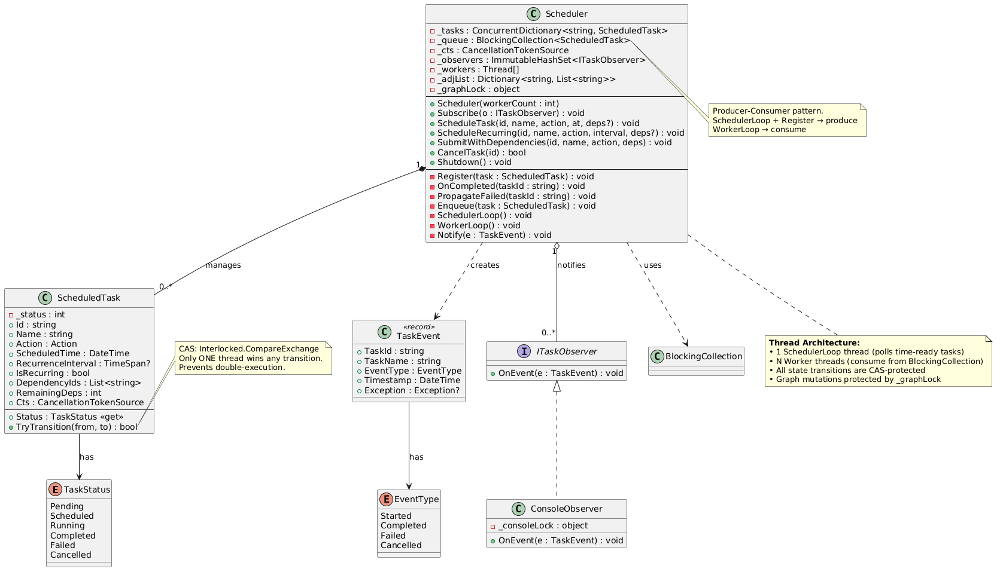

# V3 — Multi-Threaded Task Scheduler

## Overview

Extends V2 with a multi-threaded worker pool, CAS-based state transitions, concurrent data structures, and graceful shutdown — enabling true parallel task execution.

## Features

- Everything from V2 (dependencies, Kahn's, failure propagation)
- Configurable worker thread pool
- `BlockingCollection<T>` as a producer-consumer work queue (no busy-wait)
- CAS (Compare-And-Swap) status transitions via `Interlocked.CompareExchange`
- Atomic in-degree decrement with `Interlocked.Decrement`
- `ConcurrentDictionary` for thread-safe task registry
- Separate scheduler loop thread for time-based polling
- Per-task `CancellationTokenSource` for cooperative cancellation
- Graceful shutdown with `CompleteAdding()` + worker `Join()`
- Thread-safe console observer with locking

---

## Core Entities

### TaskStatus (Enum)

Extended from V2 with a new `Scheduled` state representing tasks enqueued but not yet picked up by a worker.

| Value | Description |
|-------|-------------|
| `Pending` | Awaiting scheduled time or dependency resolution |
| `Scheduled` | **NEW** — Enqueued in the work queue, awaiting worker pickup |
| `Running` | Currently executing on a worker thread |
| `Completed` | Finished successfully |
| `Failed` | Exception or dependency failure |
| `Cancelled` | Cancelled before execution |

```csharp
enum TaskStatus { Pending, Scheduled, Running, Completed, Failed, Cancelled }  //new — added Scheduled state
```

---

### EventType (Enum)

Same as V1/V2.

```csharp
enum EventType { Started, Completed, Failed, Cancelled }
```

---

### ScheduledTask

Significantly reworked for thread safety. Status is stored as an `int` field and mutated exclusively through CAS operations. In-degree is decremented atomically. Each task carries its own `CancellationTokenSource`.

| Property / Field | Type | Description |
|------------------|------|-------------|
| `Id` | `string` | Unique identifier |
| `Name` | `string` | Human-readable name |
| `Action` | `Action` | The delegate to execute |
| `ScheduledTime` | `DateTime` | Earliest UTC time to run (now immutable) |
| `RecurrenceInterval` | `TimeSpan?` | Repeat interval |
| `IsRecurring` | `bool` | Derived from RecurrenceInterval |
| `DependencyIds` | `List<string>` | Tasks this depends on |
| `RemainingDeps` | `int` | Kahn's in-degree — decremented atomically via `Interlocked.Decrement` |
| `Cts` | `CancellationTokenSource` | **NEW** — Per-task cancellation token |
| `_status` | `int` | Private backing field for CAS-based status |

| Method | Signature | Description |
|--------|-----------|-------------|
| `Status` | `TaskStatus` (get) | Reads current status via `Volatile.Read` |
| `TryTransition` | `bool TryTransition(TaskStatus from, TaskStatus to)` | **NEW** — CAS: atomically transitions state only if current value equals `from`. Returns true if this thread won the race. |

```csharp
class ScheduledTask
{
    private int _status = (int)TaskStatus.Pending;  //new — int backing field for CAS

    public string    Id                 { get; }
    public string    Name               { get; }
    public Action    Action             { get; }
    public DateTime  ScheduledTime      { get; }    //new — now immutable (no setter)
    public TimeSpan? RecurrenceInterval { get; }
    public bool      IsRecurring        => RecurrenceInterval.HasValue;
    public List<string> DependencyIds   { get; }
    public CancellationTokenSource Cts  { get; } = new();  //new — per-task cancellation token

    public int RemainingDeps;   //new — public field (not property) for Interlocked operations

    //new — thread-safe status read via Volatile.Read
    public TaskStatus Status => (TaskStatus)Volatile.Read(ref _status);

    //new — CAS: only ONE thread can win any given transition
    public bool TryTransition(TaskStatus from, TaskStatus to)
        => Interlocked.CompareExchange(ref _status, (int)to, (int)from) == (int)from;

    public ScheduledTask(string id, string name, Action action,
        DateTime? scheduledTime = null, TimeSpan? recurrenceInterval = null,
        List<string>? deps = null)
    {
        Id = id; Name = name; Action = action;
        ScheduledTime = scheduledTime ?? DateTime.UtcNow;
        RecurrenceInterval = recurrenceInterval;
        DependencyIds = deps ?? new();
    }
}
```

---

### TaskEvent (Record)

Same as V1/V2 — immutable event object.

```csharp
record TaskEvent(string TaskId, string TaskName, EventType EventType,
    DateTime Timestamp, Exception? Exception = null);
```

---

### ITaskObserver (Interface)

Same as V1/V2.

```csharp
interface ITaskObserver { void OnEvent(TaskEvent e); }
```

---

### ConsoleObserver

Extended for thread safety — uses a lock to prevent interleaved output from multiple worker threads. Now includes the executing thread name in output.

```csharp
class ConsoleObserver : ITaskObserver
{
    private readonly object _consoleLock = new();  //new — lock for thread-safe console output
    public void OnEvent(TaskEvent e)
    {
        lock (_consoleLock)  //new — prevent interleaved output from multiple workers
        {
            Console.ForegroundColor = e.EventType switch
            {
                EventType.Started   => ConsoleColor.Cyan,
                EventType.Completed => ConsoleColor.Green,
                EventType.Failed    => ConsoleColor.Red,
                EventType.Cancelled => ConsoleColor.Yellow,
                _                   => ConsoleColor.White
            };
            var thread = Thread.CurrentThread.Name ?? "?";  //new — show which thread executed
            var msg = e.Exception != null ? $" — {e.Exception.Message}" : "";
            Console.WriteLine($"[{e.EventType,-10}] [{thread,-12}] {e.TaskName}{msg}");  //new — includes thread name
            Console.ResetColor();
        }
    }
}
```

---

### Scheduler

Fully rewritten for multi-threaded execution. Manages a pool of worker threads consuming from a `BlockingCollection`, a dedicated scheduler loop thread for time-based polling, and Kahn's dependency graph protected by a lock.

| Property / Field | Type | Description |
|------------------|------|-------------|
| `_tasks` | `ConcurrentDictionary<string, ScheduledTask>` | Thread-safe task registry |
| `_queue` | `BlockingCollection<ScheduledTask>` | Producer-consumer work queue |
| `_cts` | `CancellationTokenSource` | Global shutdown signal |
| `_observers` | `ImmutableHashSet<ITaskObserver>` | Event listeners (lock-free via ImmutableInterlocked) |
| `_workers` | `Thread[]` | Worker thread pool |
| `_adjList` | `Dictionary<string, List<string>>` | Kahn's forward adjacency list (protected by `_graphLock`) |
| `_graphLock` | `object` | Lock protecting adjacency list mutations |

| Method | Signature | Description |
|--------|-----------|-------------|
| `Constructor` | `Scheduler(int workerCount = 4)` | Spawns worker threads and scheduler loop thread |
| `Subscribe` | `void Subscribe(ITaskObserver o)` | Add observer (lock-free via ImmutableInterlocked) |
| `ScheduleTask` | `void ScheduleTask(string id, string name, Action action, DateTime at, List<string>? deps)` | Register one-time task |
| `ScheduleRecurring` | `void ScheduleRecurring(string id, string name, Action action, TimeSpan interval, List<string>? deps)` | Register recurring task |
| `SubmitWithDependencies` | `void SubmitWithDependencies(string id, string name, Action action, List<string> deps)` | Shorthand for dependent tasks |
| `CancelTask` | `bool CancelTask(string id)` | CAS-based cancel + propagate failure |
| `Shutdown` | `void Shutdown()` | `CompleteAdding()` + `Cancel()` + `Join()` workers |
| `Register` | `void Register(ScheduledTask task)` | (private) Build graph, compute in-degree, enqueue if ready |
| `OnCompleted` | `void OnCompleted(string taskId)` | (private) Atomic decrement dependents; enqueue those hitting 0 |
| `PropagateFailed` | `void PropagateFailed(string taskId)` | (private) BFS under `_graphLock` |
| `Enqueue` | `void Enqueue(ScheduledTask task)` | (private) CAS Pending→Scheduled, add to queue |
| `SchedulerLoop` | `void SchedulerLoop()` | (private) Background thread: polls time-ready tasks every 100ms |
| `WorkerLoop` | `void WorkerLoop()` | (private) Consumer: dequeue → CAS Scheduled→Running → execute |
| `Notify` | `void Notify(TaskEvent e)` | (private) Broadcast to observers |

```csharp
class Scheduler
{
    //new — Thread-safe task registry (was Dictionary)
    private readonly ConcurrentDictionary<string, ScheduledTask> _tasks = new();

    //new — Producer-consumer work queue — workers block here (no busy-wait)
    private readonly BlockingCollection<ScheduledTask> _queue = new();

    //new — global cancellation for shutdown
    private readonly CancellationTokenSource _cts = new();
    //new — ImmutableHashSet + ImmutableInterlocked for lock-free observer management
    private ImmutableHashSet<ITaskObserver> _observers = ImmutableHashSet<ITaskObserver>.Empty;
    //new — worker thread pool
    private readonly Thread[] _workers;

    //new — Kahn's graph protected by lock (was unprotected _adjList)
    private readonly Dictionary<string, List<string>> _adjList = new();
    //new — lock protecting adjacency list for thread safety
    private readonly object _graphLock = new();

    //new — constructor spawns workers and scheduler loop (replaces Run())
    public Scheduler(int workerCount = 4)
    {
        _workers = new Thread[workerCount];
        for (int i = 0; i < workerCount; i++)
        {
            _workers[i] = new Thread(WorkerLoop)  //new — worker threads
                { IsBackground = true, Name = $"Worker-{i}" };
            _workers[i].Start();
        }
        //new — dedicated scheduler loop thread
        new Thread(SchedulerLoop) { IsBackground = true, Name = "SchedulerLoop" }.Start();
    }

    //new — lock-free observer subscription via ImmutableInterlocked
    public void Subscribe(ITaskObserver o) => ImmutableInterlocked.Update(ref _observers, set => set.Add(o));

    public void ScheduleTask(string id, string name, Action action,
        DateTime at, List<string>? deps = null)
        => Register(new ScheduledTask(id, name, action, at, deps: deps));

    public void ScheduleRecurring(string id, string name, Action action,
        TimeSpan interval, List<string>? deps = null)
        => Register(new ScheduledTask(id, name, action, DateTime.UtcNow, interval, deps));

    public void SubmitWithDependencies(string id, string name, Action action, List<string> deps)
        => ScheduleTask(id, name, action, DateTime.UtcNow, deps);

    //new — CAS-based cancellation (was simple property set)
    public bool CancelTask(string id)
    {
        if (!_tasks.TryGetValue(id, out var task)) return false;
        //new — try CAS from Pending OR Scheduled to Cancelled
        if (task.TryTransition(TaskStatus.Pending, TaskStatus.Cancelled) ||
            task.TryTransition(TaskStatus.Scheduled, TaskStatus.Cancelled))
        {
            task.Cts.Cancel();  //new — signal per-task cancellation token
            Notify(new TaskEvent(task.Id, task.Name, EventType.Cancelled, DateTime.UtcNow));
            PropagateFailed(id);
            return true;
        }
        return false;
    }

    //new — graceful shutdown (was just _running = false)
    public void Shutdown()
    {
        _queue.CompleteAdding();    //new — no new items accepted
        _cts.Cancel();              //new — signal loops to stop
        foreach (var w in _workers)
            w.Join(TimeSpan.FromSeconds(10));   //new — wait for workers to drain
    }
```

```csharp
    // ── Kahn's Algorithm ──────────────────────────────────────────────────

    private void Register(ScheduledTask task)
    {
        //new — TryAdd for thread safety + duplicate detection (was _tasks[id] = task)
        if (!_tasks.TryAdd(task.Id, task))
            throw new InvalidOperationException($"Duplicate task id: {task.Id}");

        lock (_graphLock)  //new — lock protects graph mutations
        {
            if (!_adjList.ContainsKey(task.Id))
                _adjList[task.Id] = new();

            int inDegree = 0;
            foreach (var depId in task.DependencyIds)
            {
                if (!_adjList.ContainsKey(depId))
                    _adjList[depId] = new();
                _adjList[depId].Add(task.Id);
                if (!(_tasks.TryGetValue(depId, out var dep) &&
                      dep.Status == TaskStatus.Completed))
                    inDegree++;
            }
            //new — atomic exchange for thread visibility (was simple assignment)
            Interlocked.Exchange(ref task.RemainingDeps, inDegree);
        }
        //new — in-degree == 0 → enqueue immediately (was handled by Run() loop)
        if (task.RemainingDeps == 0) Enqueue(task);
    }

    //new — Kahn's step now uses atomic decrement + auto-enqueue (was simple --)
    private void OnCompleted(string taskId)
    {
        List<string> deps;
        lock (_graphLock)  //new — lock for reading graph
        {
            if (!_adjList.TryGetValue(taskId, out deps!)) return;
        }
        foreach (var depId in deps)
        {
            if (!_tasks.TryGetValue(depId, out var dep)) continue;
            //new — Atomic decrement — safe when multiple deps complete concurrently
            if (Interlocked.Decrement(ref dep.RemainingDeps) == 0)
                Enqueue(dep);  //new — immediately enqueue when ready
        }
    }

    //new — BFS now uses CAS to fail tasks + lock (was simple property set)
    private void PropagateFailed(string taskId)
    {
        lock (_graphLock)  //new — lock protects BFS traversal
        {
            var queue = new Queue<string>();
            queue.Enqueue(taskId);
            while (queue.Count > 0)
            {
                var current = queue.Dequeue();
                if (!_adjList.TryGetValue(current, out var deps)) continue;
                foreach (var depId in deps)
                {
                    if (!_tasks.TryGetValue(depId, out var dep)) continue;
                    //new — TryTransition ensures each task is only failed once
                    if (dep.TryTransition(TaskStatus.Pending, TaskStatus.Failed) ||
                        dep.TryTransition(TaskStatus.Scheduled, TaskStatus.Failed))  //new — handle Scheduled
                    {
                        Notify(new TaskEvent(dep.Id, dep.Name, EventType.Failed,
                            DateTime.UtcNow, new Exception("Dependency failed")));
                        queue.Enqueue(depId);
                    }
                }
            }
        }
    }

    //new — entire method: CAS Pending → Scheduled, add to BlockingCollection
    private void Enqueue(ScheduledTask task)
    {
        if (task.TryTransition(TaskStatus.Pending, TaskStatus.Scheduled))
            _queue.TryAdd(task);
    }
```

```csharp
    //new — entire method: replaces inline polling in Run()
    //new — runs on dedicated background thread, polls every 100ms
    private void SchedulerLoop()
    {
        //new — WaitOne(100) = sleep 100ms OR wake early on cancellation
        while (!_cts.Token.WaitHandle.WaitOne(100))
        {
            foreach (var task in _tasks.Values)
            {
                if (task.Status != TaskStatus.Pending) continue;
                if (task.RemainingDeps > 0) continue;
                if (DateTime.UtcNow < task.ScheduledTime) continue;
                Enqueue(task);  // CAS inside — safe if another thread already enqueued it
            }
        }
    }

    //new — entire method: consumer loop on worker threads (replaces Execute() called from Run())
    private void WorkerLoop()
    {
        try
        {
            //new — GetConsumingEnumerable blocks until item available (no busy-wait)
            foreach (var task in _queue.GetConsumingEnumerable(_cts.Token))
            {
                //new — check per-task cancellation token
                if (task.Cts.Token.IsCancellationRequested) continue;
                //new — CAS: Scheduled → Running — only ONE worker wins this per task
                if (!task.TryTransition(TaskStatus.Scheduled, TaskStatus.Running)) continue;

                Notify(new TaskEvent(task.Id, task.Name, EventType.Started, DateTime.UtcNow));
                try
                {
                    task.Action();
                    //new — CAS transition (was direct property set)
                    task.TryTransition(TaskStatus.Running, TaskStatus.Completed);
                    Notify(new TaskEvent(task.Id, task.Name, EventType.Completed, DateTime.UtcNow));
                    OnCompleted(task.Id);

                    //new — Recurring: create NEW task instance (was mutating same instance)
                    if (task.IsRecurring && !task.Cts.Token.IsCancellationRequested)
                    {
                        var next = new ScheduledTask(
                            task.Id + "_" + DateTime.UtcNow.Ticks,  //new — unique ID per recurrence
                            task.Name, task.Action,
                            DateTime.UtcNow.Add(task.RecurrenceInterval!.Value),
                            task.RecurrenceInterval);
                        Register(next);
                    }
                }
                catch (Exception ex)
                {
                    //new — CAS transition (was direct property set)
                    task.TryTransition(TaskStatus.Running, TaskStatus.Failed);
                    Notify(new TaskEvent(task.Id, task.Name, EventType.Failed, DateTime.UtcNow, ex));
                    PropagateFailed(task.Id);
                }
            }
        }
        catch (OperationCanceledException) { /* shutdown signal — exit cleanly */ }
    }

    private void Notify(TaskEvent e)
    {
        foreach (var o in _observers)
            try { o.OnEvent(e); } catch { }
    }
}
```

---

## Class Diagram 

---

## Client Code (Demo)

```csharp
using System.Collections.Concurrent;

var scheduler = new Scheduler(workerCount: 4);
scheduler.Subscribe(new ConsoleObserver());

Console.WriteLine("=== V3: Multi-threaded Scheduler ===\n");

// --- Scenario 1: Diamond DAG  A → B, A → C, B+C → D (B and C run in parallel)
scheduler.ScheduleTask("A", "Task-A", () =>
{
    Thread.Sleep(200);
    Console.WriteLine("  → A done");
}, DateTime.UtcNow);

scheduler.SubmitWithDependencies("B", "Task-B", () =>
{
    Thread.Sleep(300);
    Console.WriteLine("  → B done");
}, new() { "A" });

scheduler.SubmitWithDependencies("C", "Task-C", () =>
{
    Thread.Sleep(100);
    Console.WriteLine("  → C done");
}, new() { "A" });

scheduler.SubmitWithDependencies("D", "Task-D", () =>
    Console.WriteLine("  → D done (after B and C)"), new() { "B", "C" });

// --- Scenario 2: Failure propagation
scheduler.ScheduleTask("fail", "Failing Task",
    () => throw new Exception("Boom!"), DateTime.UtcNow.AddSeconds(1));
scheduler.SubmitWithDependencies("dep1", "Dep-1",
    () => Console.WriteLine("  → dep1 (should not run)"), new() { "fail" });
scheduler.SubmitWithDependencies("dep2", "Dep-2",
    () => Console.WriteLine("  → dep2 (should not run)"), new() { "dep1" });

// --- Scenario 3: Recurring task
scheduler.ScheduleRecurring("hb", "Heartbeat",
    () => Console.WriteLine("  → ♥ ping"), TimeSpan.FromSeconds(2));

// --- Scenario 4: Cancellation
scheduler.ScheduleTask("cancel-me", "Cancelled Task",
    () => Console.WriteLine("  → should not run"), DateTime.UtcNow.AddSeconds(5));
Task.Delay(500).ContinueWith(_ => scheduler.CancelTask("cancel-me"));

// Shutdown after 8 seconds
Task.Delay(8000).ContinueWith(_ =>
{
    Console.WriteLine("\n=== Initiating shutdown... ===");
    scheduler.Shutdown();
});

Thread.Sleep(9000);
Console.WriteLine("\n=== Shutdown complete ===");
```

---

## Thread Safety Mechanisms

| Mechanism | Purpose |
|-----------|---------|
| `ConcurrentDictionary` | Thread-safe task storage |
| `BlockingCollection` | Lock-free producer-consumer queue |
| `Interlocked.CompareExchange` | CAS for state transitions (only one thread wins) |
| `Interlocked.Decrement` | Atomic in-degree decrement |
| `lock (_graphLock)` | Protects adjacency list mutations |
| `lock (_consoleLock)` | Prevents interleaved console output |
| `CancellationTokenSource` | Cooperative cancellation per task |

---

## How It Works — Detailed Function Walkthrough

### Multi-Threading Architecture (ASCII Diagram)

```
┌─────────────────────────────────────────────────────────────────────────────┐
│                           SCHEDULER SYSTEM                                   │
├─────────────────────────────────────────────────────────────────────────────┤
│                                                                              │
│  ┌──────────────────────┐        ┌──────────────────────────────────────┐   │
│  │    MAIN THREAD       │        │       ConcurrentDictionary           │   │
│  │                      │        │            _tasks                     │   │
│  │  • Register(task)    │───────▶│  ┌──────┬──────┬──────┬──────────┐   │   │
│  │  • CancelTask(id)    │        │  │  A   │  B   │  C   │  D       │   │   │
│  │  • Shutdown()        │        │  │ P→S  │ P    │ P    │  P       │   │   │
│  └──────────────────────┘        │  └──────┴──────┴──────┴──────────┘   │   │
│            │                     └──────────────────────────────────────┘   │
│            │ Register() with                     ▲                           │
│            │ inDegree == 0                       │ TryGetValue               │
│            ▼                                     │                           │
│  ┌──────────────────────────────────────────────────────────────────────┐   │
│  │                    BlockingCollection (_queue)                         │   │
│  │                     Producer-Consumer Queue                           │   │
│  │                                                                       │   │
│  │   ┌─────┐  ┌─────┐  ┌─────┐  ┌─────┐                               │   │
│  │   │  A  │  │ hb  │  │  B  │  │  C  │  ◀── Enqueue (CAS: P → S)    │   │
│  │   └─────┘  └─────┘  └─────┘  └─────┘                               │   │
│  │                                                                       │   │
│  └─────────┬────────────┬────────────┬────────────┬─────────────────────┘   │
│            │            │            │            │                           │
│            ▼            ▼            ▼            ▼                           │
│  ┌──────────┐  ┌──────────┐  ┌──────────┐  ┌──────────┐                    │
│  │ Worker-0 │  │ Worker-1 │  │ Worker-2 │  │ Worker-3 │                    │
│  │          │  │          │  │          │  │          │                    │
│  │ Dequeue  │  │ Dequeue  │  │ Dequeue  │  │ Dequeue  │                    │
│  │ CAS S→R  │  │ CAS S→R  │  │ CAS S→R  │  │ CAS S→R  │                    │
│  │ Execute  │  │ Execute  │  │ Execute  │  │ Execute  │                    │
│  │ CAS R→C  │  │ CAS R→C  │  │ CAS R→C  │  │ CAS R→C  │                    │
│  │OnComplete│  │OnComplete│  │OnComplete│  │OnComplete│                    │
│  └──────────┘  └──────────┘  └──────────┘  └──────────┘                    │
│       │              │              │              │                          │
│       └──────────────┴──────┬───────┴──────────────┘                         │
│                             │                                                │
│                             ▼                                                │
│                    OnCompleted(taskId)                                        │
│                    Interlocked.Decrement                                      │
│                    → if RemainingDeps == 0                                    │
│                      → Enqueue(dependent)                                    │
│                                                                              │
├──────────────────────────────────────────────────────────────────────────────┤
│                                                                              │
│  ┌────────────────────────────────────────────┐                              │
│  │         SCHEDULER LOOP THREAD              │                              │
│  │                                            │                              │
│  │  Every 100ms:                              │                              │
│  │    for each task in _tasks:                │                              │
│  │      if Status == Pending                  │                              │
│  │         && RemainingDeps == 0              │──── Enqueue() ──▶ _queue     │
│  │         && UtcNow >= ScheduledTime         │                              │
│  │      then Enqueue(task)                    │                              │
│  │                                            │                              │
│  │  (Handles future-scheduled tasks that      │                              │
│  │   Register() couldn't enqueue immediately) │                              │
│  └────────────────────────────────────────────┘                              │
│                                                                              │
├──────────────────────────────────────────────────────────────────────────────┤
│                                                                              │
│  ┌────────────────────────────────────────────┐                              │
│  │         DEPENDENCY GRAPH (_adjList)      │                              │
│  │         Protected by _graphLock             │                              │
│  │                                            │                              │
│  │    "A" ──→ ["B", "C"]                      │                              │
│  │    "B" ──→ ["D"]                           │                              │
│  │    "C" ──→ ["D"]                           │                              │
│  │    "D" ──→ []                              │                              │
│  └────────────────────────────────────────────┘                              │
│                                                                              │
├──────────────────────────────────────────────────────────────────────────────┤
│                         STATE TRANSITIONS (CAS)                              │
│                                                                              │
│    Pending ──────▶ Scheduled ──────▶ Running ──────▶ Completed               │
│       │              │                  │                                     │
│       │              │                  └──────────▶ Failed                   │
│       │              │                                                       │
│       ├──────────────┴──────────────────────────▶ Cancelled                  │
│       │                                                                      │
│       └─────────────────────────────────────────▶ Failed (propagated)        │
│                                                                              │
│    Only ONE thread can win each CAS transition                               │
└──────────────────────────────────────────────────────────────────────────────┘
```

---

### `Register(task)` — with Kahn's Algorithm

Builds the dependency graph, computes in-degree, and immediately enqueues tasks with no dependencies.

**Example: Registering Diamond DAG (A → B, A → C, B+C → D)**

```
Register("A", deps=[]):
  _tasks.TryAdd("A", task)          ← ConcurrentDictionary
  lock(_graphLock):
    _adjList["A"] = []
    No deps → inDegree = 0
    Interlocked.Exchange(A.RemainingDeps, 0)
  A.RemainingDeps == 0 → Enqueue(A)  ← immediately goes to queue

Register("B", deps=["A"]):
  _tasks.TryAdd("B", task)
  lock(_graphLock):
    _adjList["B"] = []
    For "A": _adjList["A"].Add("B")  → _adjList["A"] = ["B"]
             "A" not Completed → inDegree = 1
    Interlocked.Exchange(B.RemainingDeps, 1)
  B.RemainingDeps == 1 → NOT enqueued (waiting on A)

Register("C", deps=["A"]):
  _tasks.TryAdd("C", task)
  lock(_graphLock):
    _adjList["C"] = []
    For "A": _adjList["A"].Add("C")  → _adjList["A"] = ["B", "C"]
             "A" not Completed → inDegree = 1
    Interlocked.Exchange(C.RemainingDeps, 1)
  C.RemainingDeps == 1 → NOT enqueued

Register("D", deps=["B", "C"]):
  _tasks.TryAdd("D", task)
  lock(_graphLock):
    _adjList["D"] = []
    For "B": _adjList["B"].Add("D")  → _adjList["B"] = ["D"]
             "B" not Completed → inDegree = 1
    For "C": _adjList["C"].Add("D")  → _adjList["C"] = ["D"]
             "C" not Completed → inDegree = 2
    Interlocked.Exchange(D.RemainingDeps, 2)
  D.RemainingDeps == 2 → NOT enqueued

Final State:
  _adjList = { "A": ["B","C"], "B": ["D"], "C": ["D"], "D": [] }
  Queue = [A]  (only A is ready)
  RemainingDeps: A=0, B=1, C=1, D=2
```

---

### `Enqueue(task)`

CAS transition from Pending → Scheduled. Only one thread can win this, preventing double-enqueue.

**Example:**
```
Enqueue(A):
  TryTransition(Pending, Scheduled) → CAS succeeds (returns true)
  _queue.TryAdd(A) → A enters the BlockingCollection

Enqueue(A) again (race condition):
  TryTransition(Pending, Scheduled) → CAS fails (status is already Scheduled)
  → nothing happens. No duplicate.
```

---

### `SchedulerLoop()`

Background thread that polls every 100ms for tasks whose `ScheduledTime` has arrived. Handles future-scheduled tasks that `Register()` couldn't enqueue immediately.

**Example: Task scheduled for UtcNow + 5 seconds**
```
Register("cancel-me", scheduledTime = UtcNow + 5s, deps=[]):
  RemainingDeps = 0 → Enqueue("cancel-me")
  But wait — Enqueue checks CAS only, not time!
  Actually: Register enqueues immediately if inDegree == 0.
  SchedulerLoop handles the case where time hasn't arrived yet
  AND the task is still Pending (e.g., wasn't enqueued by Register).

SchedulerLoop tick at T+5s:
  task.Status == Pending? Yes
  task.RemainingDeps == 0? Yes
  UtcNow >= task.ScheduledTime? Yes (finally!)
  → Enqueue(task)
```

---

### `WorkerLoop()` — The Consumer

Each worker thread runs this loop, blocking on `GetConsumingEnumerable` until a task is available.

**Example: Worker-0 picks up Task A**
```
Worker-0: Dequeue A from _queue.GetConsumingEnumerable()
  1. Check A.Cts.Token.IsCancellationRequested → false (not cancelled)
  2. TryTransition(Scheduled, Running) → CAS succeeds! Worker-0 wins.
     (If Worker-1 also dequeued it somehow, their CAS would fail here)
  3. Notify(Started, "Task-A")
  4. A.Action() → Thread.Sleep(200); print "A done"
  5. TryTransition(Running, Completed) → success
  6. Notify(Completed, "Task-A")
  7. OnCompleted("A") → unlocks B and C
  8. IsRecurring? No → done.
```

**Example: Worker-2 picks up failing task**
```
Worker-2: Dequeue "fail" from queue
  1. CAS Scheduled → Running → success
  2. Notify(Started)
  3. Action() → throws Exception("Boom!")
  4. (catch) TryTransition(Running, Failed) → success
  5. Notify(Failed, "Boom!")
  6. PropagateFailed("fail") → BFS marks dep1, dep2 as Failed
```

---

### `OnCompleted(taskId)` — Kahn's Step (Thread-Safe)

Atomically decrements in-degree of all dependents. When a dependent hits 0, it's enqueued.

**Example: A completes, B and C are waiting**
```
OnCompleted("A"):
  lock(_graphLock): deps = _adjList["A"] = ["B", "C"]

  For "B":
    Interlocked.Decrement(ref B.RemainingDeps) → 1 → 0
    Result == 0 → Enqueue(B)  ← B is now ready!

  For "C":
    Interlocked.Decrement(ref C.RemainingDeps) → 1 → 0
    Result == 0 → Enqueue(C)  ← C is now ready!

Both B and C are now in the queue.
Worker-0 picks up B, Worker-1 picks up C → PARALLEL EXECUTION!
```

**Example: B completes, D is waiting on B AND C**
```
OnCompleted("B"):
  deps = _adjList["B"] = ["D"]

  For "D":
    Interlocked.Decrement(ref D.RemainingDeps) → 2 → 1
    Result == 1 (not 0) → D stays waiting.

Later, OnCompleted("C"):
  deps = _adjList["C"] = ["D"]

  For "D":
    Interlocked.Decrement(ref D.RemainingDeps) → 1 → 0
    Result == 0 → Enqueue(D)  ← D is now ready!
```

The atomic decrement ensures correctness even when B and C complete on different threads simultaneously.

---

### `PropagateFailed(taskId)` — BFS Failure Propagation

Uses BFS under `_graphLock` to mark all reachable pending/scheduled dependents as Failed. Uses CAS to ensure each task is only failed once.

**Example: "fail" fails, chain is fail → dep1 → dep2**
```
PropagateFailed("fail"):
  lock(_graphLock):
    BFS Queue: ["fail"]

    Dequeue "fail":
      _adjList["fail"] = ["dep1"]
      dep1: TryTransition(Pending, Failed) → CAS succeeds
            Notify(Failed, "Dependency failed")
            BFS Queue: ["dep1"]

    Dequeue "dep1":
      _adjList["dep1"] = ["dep2"]
      dep2: TryTransition(Pending, Failed) → CAS succeeds
            Notify(Failed, "Dependency failed")
            BFS Queue: ["dep2"]

    Dequeue "dep2":
      _adjList["dep2"] = []
      No more dependents. Done.

Result: dep1 and dep2 are both Failed. Neither will ever execute.
```

**Why CAS matters here:** If another thread already transitioned dep1 to `Running`, the CAS `TryTransition(Pending, Failed)` would fail, and dep1 would NOT be marked failed (it's already executing — too late to cancel).

---

### `CancelTask(id)` — CAS-Based Cancel

Attempts CAS from Pending → Cancelled or Scheduled → Cancelled. If successful, triggers per-task cancellation token and failure propagation.

**Example:**
```
CancelTask("cancel-me"):
  _tasks.TryGetValue("cancel-me") → found
  TryTransition(Pending, Cancelled) → CAS succeeds!
  task.Cts.Cancel() → sets cancellation token
  Notify(Cancelled)
  PropagateFailed("cancel-me") → BFS (no dependents in this case)
  return true
```

If a worker already picked it up (status = Running), both CAS attempts fail → returns false.

---

### `Shutdown()`

Graceful shutdown sequence:
```
Step 1: _queue.CompleteAdding()
        → No new tasks can be enqueued
        → Workers finish current item then exit GetConsumingEnumerable

Step 2: _cts.Cancel()
        → SchedulerLoop exits (WaitHandle is signaled)
        → Workers see OperationCanceledException if blocked

Step 3: foreach worker: worker.Join(10s)
        → Wait up to 10s for each worker to finish current task and exit
```

---

### Recurring Tasks in V3

Unlike V1/V2 which mutate the same task instance, V3 creates a NEW task for each recurrence (since the original is now in `Completed` state and immutable via CAS).

```
Worker completes "hb" (recurring, interval=2s):
  task.IsRecurring && !Cts.IsCancellationRequested → true
  Create new ScheduledTask:
    Id = "hb_638573..." (unique tick-based suffix)
    Name = "Heartbeat"
    Action = same delegate
    ScheduledTime = UtcNow + 2s
    RecurrenceInterval = 2s
  Register(new task) → goes through normal registration
```

---

## Limitations

- Recurring tasks create new task instances (unique IDs with tick suffix) — original ID is not reused.
- No task priority or weighted scheduling.
- No retry mechanism for failed tasks.
