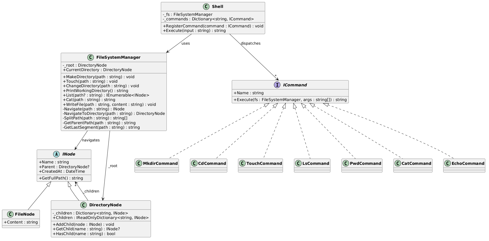
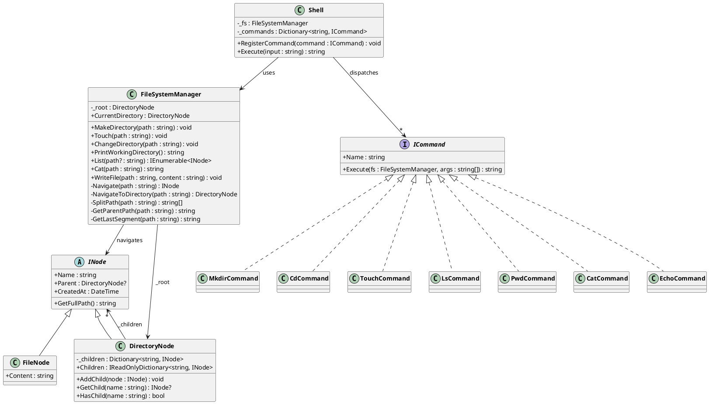

# In-Memory File System

A C# / .NET 8 implementation of an in-memory file system with an interactive shell. The entire file system state (files, directories, content) lives in memory — no disk I/O.

The solution is split into two projects:
- **FileSystemV1** — Absolute paths only. Simple and minimal.
- **FileSystemV2** — Adds relative paths, `cd`, `pwd`, and `..` traversal on top of V1.

---

## Contents

- [Functional Requirements](#functional-requirements)
- [Non-Functional Requirements](#non-functional-requirements)
- [Core Entities](#core-entities)
  - [INode](#inode-abstract-base)
  - [FileNode](#filenode)
  - [DirectoryNode](#directorynode)
- [Class Diagram](#class-diagram)
- [Shell Architecture](#shell-architecture)
  - [ICommand](#icommand-interface)
  - [Shell](#shell)
  - [Commands](#commands)
- [Supported Commands](#supported-commands)
- [V1: Absolute Path Navigation](#v1-absolute-path-navigation)
  - [How V1 Navigate Works](#how-v1-navigate-works)
  - [V1 Navigate Code](#v1-navigate-code)
  - [V1 Example Walkthrough](#v1-example-walkthrough)
  - [V1 Helper Methods](#v1-helper-methods)
- [V2: Absolute + Relative Path Navigation](#v2-absolute--relative-path-navigation)
  - [What Changes in V2](#what-changes-in-v2)
  - [How V2 Navigate Works](#how-v2-navigate-works)
  - [V2 Navigate Code](#v2-navigate-code)
  - [V2 Example Walkthrough](#v2-example-walkthrough)
  - [V2 Helper Methods](#v2-helper-methods)
- [V1 vs V2 Comparison](#v1-vs-v2-comparison)
- [V3: Thread Safety](#v3-thread-safety)
  - [FileNode: lock for Read/Write](#filenode-lock-for-readwrite)
  - [DirectoryNode: ConcurrentDictionary for _children](#directorynode-concurrentdictionary-for-_children)
  - [Why ConcurrentDictionary over Copy-on-Write](#why-concurrentdictionary-over-copy-on-write)
  - [FileSystemManager: CurrentDirectory lock](#filesystemmanager-currentdirectory-lock)
  - [Thread Safety Summary](#thread-safety-summary)
- [Design Patterns Used](#design-patterns-used)
- [Project Structure](#project-structure)
- [Client Code](#client-code-programcs)
- [Usage](#usage)

---

## Functional Requirements

| # | Requirement |
|---|-------------|
| FR-1 | Support creation of files and directories organized in a hierarchical structure. |
| FR-2 | The entire file system state must be stored in memory. |
| FR-3 | Interaction via a shell that parses and executes string-based commands. |
| FR-4 | Supported commands: `mkdir`, `cd`, `touch`, `ls`, `pwd`, `cat`, `echo`. |
| FR-5 | `ls` supports simple format and detailed (`-l`) format. |
| FR-6 | Handle both absolute (`/home/user`) and relative (`documents`, `../`) paths. |
| FR-7 | Files store simple string-based content. |

## Non-Functional Requirements

| # | Requirement |
|---|-------------|
| NFR-1 | **Modularity** — Clear separation of concerns across components. |
| NFR-2 | **Maintainability** — Clean, testable, easy to extend or debug. |
| NFR-3 | **Extensibility** — Easy to add new commands or listing strategies without modifying core logic. |
| NFR-4 | **Error Handling** — Clear error messages for invalid operations. |
| NFR-5 | **Usability** — Intuitive API for common file system operations. |

---

## Core Entities


### INode (Abstract Base)

The base class for everything in the file system. Every node knows its name, its parent, and can compute its full absolute path.

```csharp
public abstract class INode
{
    public string Name { get; }
    public DirectoryNode? Parent { get; set; }
    public DateTime CreatedAt { get; }

    // Walks up the parent chain to build the full path
    public string GetFullPath()
    {
        if (Parent == null) return "/";

        var parts = new Stack<string>();
        INode current = this;
        while (current.Parent != null)
        {
            parts.Push(current.Name);
            current = current.Parent;
        }
        return "/" + string.Join("/", parts);
    }
}
```

### FileNode

Represents a file. Encapsulates string content behind `Read()` / `Write()` methods.

```csharp
public class FileNode : INode
{
    private string _content;

    public string Read();              // Returns file content
    public void Write(string content); // Overwrites file content
    public int Size { get; }           // Character count of content
}
```

### DirectoryNode

Represents a directory. Uses a `Dictionary<string, INode>` for O(1) child lookup.

```csharp
public class DirectoryNode : INode
{
    private readonly Dictionary<string, INode> _children = new();

    public void AddChild(INode node);      // Throws if name already exists
    public INode? GetChild(string name);   // Returns null if not found
    public bool HasChild(string name);     // O(1) existence check
}
```

---

## Class Diagram

### ASCII

```
                ┌────────────────────────────────┐
                │    FileSystemManager           │
                │────────────────────────────────│
                │ - _root : DirectoryNode        │
                │ + CurrentDirectory : DirectoryNode (V2 only) │
                │────────────────────────────────│
                │ + MakeDirectory(path)          │
                │ + Touch(path)                  │
                │ + ChangeDirectory(path) (V2)   │
                │ + PrintWorkingDirectory() (V2) │
                │ + List(path?)                  │
                │ + Cat(path)                    │
                │ + WriteFile(path, content)     │
                │ - Navigate(path)               │
                │ - NavigateToDirectory(path)    │
                │ - SplitPath(path)              │
                │ - GetParentPath(path)          │
                │ - GetLastSegment(path)         │
                └───────────────┬────────────────┘
                                │ uses
                                ▼
                ┌────────────────────────────────┐
                │       INode (abstract)         │
                │────────────────────────────────│
                │ + Name : string                │
                │ + Parent : DirectoryNode?      │
                │ + CreatedAt : DateTime         │
                │────────────────────────────────│
                │ + GetFullPath() : string       │
                └───────────────┬────────────────┘
                                │ inherits
                ┌───────────────┴───────────────┐
                │                               │
    ┌───────────┴───────────┐     ┌─────────────┴────────────┐
    │      FileNode         │     │     DirectoryNode         │
    │───────────────────────│     │───────────────────────────│
    │ + Content : string    │     │ - _children : Dict<,INode>│
    │                       │     │───────────────────────────│
    │                       │     │ + AddChild(node)          │
    │                       │     │ + GetChild(name) : INode? │
    │                       │     │ + HasChild(name) : bool   │
    └───────────────────────┘     └───────────────────────────┘


    ┌────────────────────────────────┐
    │         «interface»            │
    │          ICommand              │
    │────────────────────────────────│
    │ + Name : string                │
    │ + Execute(fs, args) : string   │
    └───────────────┬────────────────┘
                    │ implements
    ┌───────┬───────┼───────┬────────┬────────┬────────┐
    │       │       │       │        │        │        │
  Mkdir    Cd    Touch     Ls      Pwd      Cat     Echo
 Command Command Command Command Command Command Command


    ┌────────────────────────────────┐
    │            Shell               │
    │────────────────────────────────│
    │ - _fs : FileSystemManager      │
    │ - _commands : Dict<,ICommand>  │
    │────────────────────────────────│
    │ + RegisterCommand(cmd)         │
    │ + Execute(input) : string      │
    └────────────────────────────────┘
```

### PlantUML



---

## Shell Architecture

### ICommand Interface

Every command implements this. Adding a new command requires zero changes to existing code.

```csharp
public interface ICommand
{
    string Name { get; }
    string Execute(FileSystemManager fs, string[] args);
}
```

### Shell

Parses input, looks up the command by name from a registry, dispatches execution.

```csharp
public class Shell
{
    private readonly Dictionary<string, ICommand> _commands = new();

    public void RegisterCommand(ICommand command)
    {
        _commands[command.Name] = command;
    }

    public string Execute(string input)
    {
        // Split input → command name + args
        // Look up command in dictionary
        // Call command.Execute(fs, args)
    }
}
```

### Commands

| Command | Class | Available In |
|---------|-------|--------------|
| `mkdir` | `MkdirCommand` | V1, V2 |
| `cd` | `CdCommand` | V2 only |
| `touch` | `TouchCommand` | V1, V2 |
| `ls` | `LsCommand` | V1, V2 |
| `pwd` | `PwdCommand` | V2 only |
| `cat` | `CatCommand` | V1, V2 |
| `echo` | `EchoCommand` | V1, V2 |

---

## Supported Commands

```bash
mkdir <path>           # Create a directory
cd <path>              # Change directory (V2: supports .., absolute, relative)
touch <path>           # Create an empty file
ls                     # List current directory (V2) or root (V1)
ls <path>              # List specified directory
ls -l                  # Detailed listing (type, size, date, name)
pwd                    # Print current working directory path (V2 only)
cat <path>             # Print file contents
echo "text" > <path>   # Write text to file (creates if doesn't exist)
exit                   # Exit the shell
```

---

## V1: Absolute Path Navigation

### How V1 Navigate Works

V1 only handles absolute paths. Every path must start with `/` and is always resolved from the root.

The algorithm:
1. Split the path by `/` to get segments (e.g., `/home/user/file.txt` → `["home", "user", "file.txt"]`)
2. Start at `_root`
3. For each segment except the last: look up the child by name, confirm it's a directory, move into it
4. For the last segment: look up the child and return it (could be a file or directory)

There is no "current directory" concept. No `.` or `..`. No relative paths.

```
          ┌─────────────────────────────────────────────────┐
          │             V1 Navigation Flow                   │
          │                                                  │
          │  Input: "/home/user/file.txt"                    │
          │                                                  │
          │  1. SplitPath → ["home", "user", "file.txt"]    │
          │  2. current = _root                   (ALWAYS)   │
          │  3. Loop segments:                               │
          │     "home"     → root.GetChild("home") → dir    │
          │     "user"     → home.GetChild("user") → dir    │
          │     "file.txt" → user.GetChild("file.txt") → ✓  │
          │  4. Return the node                              │
          └─────────────────────────────────────────────────┘
```

### V1 Navigate Code

```csharp
private INode Navigate(string path)
{
    // Split the path into segments: "/home/user/file.txt" → ["home", "user", "file.txt"]
    string[] parts = SplitPath(path);

    // Always start from root (V1 has no current directory)
    DirectoryNode current = _root;

    // Traverse all segments except the last one (those must be directories)
    for (int i = 0; i < parts.Length - 1; i++)
    {
        INode? child = current.GetChild(parts[i]);

        if (child == null)
            throw new InvalidOperationException($"Path not found: '{path}'");

        if (child is not DirectoryNode dir)
            throw new InvalidOperationException($"'{parts[i]}' is not a directory");

        current = dir;
    }

    // Handle the last segment — could be a file or directory
    if (parts.Length == 0)
        return _root;

    string lastName = parts[parts.Length - 1];
    INode? target = current.GetChild(lastName);

    if (target == null)
        throw new InvalidOperationException($"Path not found: '{path}'");

    return target;
}
```

### V1 Example Walkthrough

Starting state after `mkdir /home`, `mkdir /home/user`, `touch /home/user/notes.txt`:

```
Tree:
  "/" (root)
   └── "home" (dir)
        └── "user" (dir)
             └── "notes.txt" (file, content="")
```

**Operation: `cat /home/user/notes.txt`**

1. `Cat("/home/user/notes.txt")` calls `Navigate("/home/user/notes.txt")`
2. `SplitPath("/home/user/notes.txt")` → `["home", "user", "notes.txt"]`
3. `current = _root`
4. Loop `i = 0`: `parts[0]` = `"home"`
   - `_root.GetChild("home")` → `DirectoryNode "home"` ✓
   - `current = homeDir`
5. Loop `i = 1`: `parts[1]` = `"user"`
   - `homeDir.GetChild("user")` → `DirectoryNode "user"` ✓
   - `current = userDir`
6. Last segment: `parts[2]` = `"notes.txt"`
   - `userDir.GetChild("notes.txt")` → `FileNode "notes.txt"` ✓
   - Return this node
7. Back in `Cat()`: confirms it's a `FileNode`, returns `file.Content`

**Operation: `mkdir /home/user/docs`**

1. `MakeDirectory("/home/user/docs")` calls:
   - `GetParentPath("/home/user/docs")` → `"/home/user"`
   - `GetLastSegment("/home/user/docs")` → `"docs"`
2. `NavigateToDirectory("/home/user")` calls `Navigate("/home/user")`
   - Splits → `["home", "user"]`
   - `current = _root` → get "home" → get "user" → return userDir
3. `userDir.HasChild("docs")` → `false` (doesn't exist yet)
4. Create `new DirectoryNode("docs", userDir)`
5. `userDir.AddChild(docsDir)`

**Error case: `cat /nonexistent/file.txt`**

1. `Navigate("/nonexistent/file.txt")`
2. Splits → `["nonexistent", "file.txt"]`
3. `current = _root`
4. Loop `i = 0`: `_root.GetChild("nonexistent")` → `null`
5. Throws: `"Path not found: '/nonexistent/file.txt'"`

### V1 Helper Methods

```csharp
/// "/home/user/notes.txt" → "/home/user"
/// "/home" → "/"
private string GetParentPath(string path)
{
    int lastSlash = path.LastIndexOf('/');

    // If last slash is at position 0, parent is root
    if (lastSlash <= 0)
        return "/";

    // Everything before the last slash
    return path.Substring(0, lastSlash);
}

/// "/home/user/notes.txt" → "notes.txt"
/// "/home" → "home"
private string GetLastSegment(string path)
{
    int lastSlash = path.LastIndexOf('/');
    return path.Substring(lastSlash + 1);
}

/// Splits path by "/" and removes empty entries
private string[] SplitPath(string path)
{
    return path.Split('/', StringSplitOptions.RemoveEmptyEntries);
}
```

---

## V2: Absolute + Relative Path Navigation

### What Changes in V2

V2 adds three things on top of V1:

| Feature | V1 | V2 |
|---------|----|----|
| Starting point | Always `_root` | `_root` (absolute) or `CurrentDirectory` (relative) |
| Current directory | No concept | `CurrentDirectory` field, changed via `cd` |
| Special segments | None | `.` (current), `..` (parent) |

The key insight: the `Navigate` method just needs to decide **where to start** and **how to handle `.` / `..`**.

### How V2 Navigate Works

```
          ┌─────────────────────────────────────────────────────┐
          │             V2 Navigation Flow                       │
          │                                                      │
          │  Input: "docs/notes.txt"  (no leading "/")           │
          │                                                      │
          │  1. SplitPath → ["docs", "notes.txt"]               │
          │  2. Starts with "/"? NO → current = CurrentDirectory │
          │  3. Loop segments:                                   │
          │     "docs"      → currentDir.GetChild("docs") → dir │
          │     "notes.txt" → docsDir.GetChild("notes.txt") → ✓ │
          │  4. Return the node                                  │
          └─────────────────────────────────────────────────────┘

          ┌─────────────────────────────────────────────────────┐
          │             V2 Navigation Flow (absolute)            │
          │                                                      │
          │  Input: "/home/user"  (leading "/")                  │
          │                                                      │
          │  1. SplitPath → ["home", "user"]                    │
          │  2. Starts with "/"? YES → current = _root           │
          │  3. Loop segments:                                   │
          │     "home" → root.GetChild("home") → dir            │
          │     "user" → home.GetChild("user") → dir            │
          │  4. Return the node                                  │
          └─────────────────────────────────────────────────────┘

          ┌─────────────────────────────────────────────────────┐
          │             V2 Navigation Flow (with "..")           │
          │                                                      │
          │  Input: "../other"  (CurrentDirectory = /home/user)  │
          │                                                      │
          │  1. SplitPath → ["..", "other"]                     │
          │  2. Starts with "/"? NO → current = /home/user       │
          │  3. Loop segments:                                   │
          │     ".."    → current = current.Parent → /home       │
          │     "other" → home.GetChild("other") → dir          │
          │  4. Return the node                                  │
          └─────────────────────────────────────────────────────┘
```

### V2 Navigate Code

```csharp
public INode Navigate(string path)
{
    string[] parts = SplitPath(path);

    // KEY DIFFERENCE FROM V1:
    // Decide starting point based on whether path is absolute or relative
    DirectoryNode current;
    if (path.StartsWith("/"))
        current = _root;          // Absolute: start from root
    else
        current = CurrentDirectory; // Relative: start from current working dir

    // Traverse each segment
    for (int i = 0; i < parts.Length; i++)
    {
        string part = parts[i];

        // "." means current directory — skip it
        if (part == "." || part == "")
            continue;

        // ".." means go up to parent
        if (part == "..")
        {
            // Can't go above root — stay at root
            if (current.Parent != null)
                current = current.Parent;
            continue;
        }

        // Look up the child by name
        INode? child = current.GetChild(part);
        if (child == null)
            throw new InvalidOperationException($"Path not found: '{path}'");

        // If it's the last segment, return it (could be file or directory)
        if (i == parts.Length - 1)
            return child;

        // Intermediate segments must be directories
        if (child is not DirectoryNode dir)
            throw new InvalidOperationException($"'{part}' is not a directory");

        current = dir;
    }

    return current;
}
```

### V2 Example Walkthrough

Starting state: `CurrentDirectory = /home/user`, tree has `/home/user/docs/notes.txt`

```
Tree:
  "/" (root)
   └── "home" (dir)
        └── "user" (dir)    ← CurrentDirectory
             ├── "docs" (dir)
             │    └── "notes.txt" (file)
             └── "readme.md" (file)
```

**Operation: `cat docs/notes.txt` (relative path)**

1. `Navigate("docs/notes.txt")`
2. `SplitPath` → `["docs", "notes.txt"]`
3. Does `"docs/notes.txt"` start with `/`? NO → `current = CurrentDirectory` (which is `/home/user`)
4. Loop `i = 0`: `part = "docs"`
   - Not `.`, not `..`
   - `userDir.GetChild("docs")` → `DirectoryNode "docs"` ✓
   - Not last segment → `current = docsDir`
5. Loop `i = 1`: `part = "notes.txt"`
   - Not `.`, not `..`
   - `docsDir.GetChild("notes.txt")` → `FileNode "notes.txt"` ✓
   - IS last segment → return this node
6. Back in `Cat()`: returns `file.Content`

**Operation: `cd ..` (parent traversal)**

1. `Navigate("..")`
2. `SplitPath` → `[".."]`
3. Doesn't start with `/` → `current = /home/user`
4. Loop `i = 0`: `part = ".."`
   - It's `..`! → `current = current.Parent` → `current = /home`
5. No more segments → return `current` (which is `/home`)
6. Back in `ChangeDirectory()`: sets `CurrentDirectory = /home`

**Operation: `cat ../user/readme.md` (mixed relative with `..`)**

CurrentDirectory is `/home/user/docs`:

1. `Navigate("../user/readme.md")`
2. `SplitPath` → `["..", "user", "readme.md"]`
3. Doesn't start with `/` → `current = /home/user/docs`
4. Loop `i = 0`: `part = ".."`
   - `current = current.Parent` → `current = /home/user`
5. Loop `i = 1`: `part = "user"`
   - Wait — we're at `/home/user` and looking for child `"user"`. That would fail!
   - Actually the path `../user/readme.md` from `/home/user/docs` goes up to `/home/user`, then looks for child `"user"` which doesn't exist at that level.
   - Correct path would be `../readme.md` or `../../user/readme.md` from `/home/user/docs`

This demonstrates how the path resolution follows the exact same rules as a real Unix shell.

**Operation: `ls /home` (absolute path — same as V1)**

1. `Navigate("/home")`
2. Starts with `/` → `current = _root` (ignores CurrentDirectory entirely)
3. Resolves exactly like V1

### V2 Helper Methods

```csharp
/// For absolute paths:
///   "/home/user/notes.txt" → "/home/user"
///   "/home" → "/"
///
/// For relative paths (NEW in V2):
///   "docs/notes.txt" → "docs"
///   "notes.txt" → "."    ← means current directory
private string GetParentPath(string path)
{
    int lastSlash = path.LastIndexOf('/');

    // No slash — simple name like "notes.txt"
    // Parent is current directory (represented as ".")
    if (lastSlash < 0)
        return ".";

    // Slash at position 0 — parent is root
    if (lastSlash == 0)
        return "/";

    // Everything before the last slash
    return path.Substring(0, lastSlash);
}

/// Works the same as V1 but also handles no-slash case:
///   "/home/user/notes.txt" → "notes.txt"
///   "docs/file.txt" → "file.txt"
///   "notes.txt" → "notes.txt"     ← no slash, return as-is
private string GetLastSegment(string path)
{
    int lastSlash = path.LastIndexOf('/');

    // No slash — entire string is the name
    if (lastSlash < 0)
        return path;

    return path.Substring(lastSlash + 1);
}
```

---

## V1 vs V2 Comparison

| Aspect | V1 | V2 |
|--------|----|----|
| Path types | Absolute only (`/home/user`) | Absolute + Relative (`docs`, `../other`) |
| Starting point in Navigate | Always `_root` | `_root` if starts with `/`, else `CurrentDirectory` |
| Special segments | None | `.` (skip), `..` (go to parent) |
| `cd` / `pwd` commands | Not available | Available |
| `GetParentPath("notes.txt")` | N/A (invalid input) | Returns `"."` (current dir) |
| Example: create file | `touch /home/user/notes.txt` | `cd /home/user` then `touch notes.txt` |
| Error if path doesn't start with `/` | Undefined behavior | Works (resolves from current dir) |

The core `Navigate` difference is just 3 additions:
1. Check `path.StartsWith("/")` to decide starting point
2. Handle `"."` → skip (continue)
3. Handle `".."` → move to parent

Everything else (splitting, child lookup, error handling) is identical.

---

## V3: Thread Safety

V3 makes the file system safe for concurrent access from multiple threads. Here's what changed and why.

### FileNode: lock for Read/Write

```csharp
public class FileNode : INode
{
    private readonly object _lock = new();
    private string _content;

    public string Read()
    {
        lock (_lock) { return _content; }
    }

    public void Write(string content)
    {
        lock (_lock) { _content = content; }
    }

    public int Size
    {
        get { lock (_lock) { return _content.Length; } }
    }
}
```

Why `lock` instead of `volatile`?

- `volatile` would technically work for simple get/set of a string reference (reference assignment is atomic in .NET)
- But `lock` is future-proof: if we later add append, truncate, or read-modify-write operations, `volatile` won't protect those compound operations
- `lock` gives both atomicity and memory visibility in one mechanism
- The overhead is negligible for a file system — the bottleneck is never the lock acquisition

### DirectoryNode: ConcurrentDictionary for _children

```csharp
public class DirectoryNode : INode
{
    private readonly ConcurrentDictionary<string, INode> _children = new();

    public void AddChild(INode node)
    {
        // TryAdd is atomic: checks existence AND inserts in one operation.
        // Eliminates the TOCTOU race from V1/V2's separate HasChild + AddChild.
        if (!_children.TryAdd(node.Name, node))
            throw new InvalidOperationException($"'{node.Name}' already exists");
    }

    public INode? GetChild(string name)
    {
        _children.TryGetValue(name, out var node);
        return node;
    }
}
```

Key benefits:
- `TryAdd` makes check-and-insert atomic (no TOCTOU race between two threads calling `mkdir`)
- `TryGetValue` is lock-free (readers never block each other or writers)
- Enumeration (for `ls`) returns a moment-in-time snapshot — safe even if other threads are adding files

### Why ConcurrentDictionary over Copy-on-Write

For `_children`, there are two viable thread-safe approaches:

#### Option A: ConcurrentDictionary (chosen)

```csharp
private readonly ConcurrentDictionary<string, INode> _children = new();

public void AddChild(INode node)
{
    if (!_children.TryAdd(node.Name, node))
        throw new InvalidOperationException(...);
}
```

#### Option B: Copy-on-Write with ImmutableDictionary

```csharp
private volatile ImmutableDictionary<string, INode> _children 
    = ImmutableDictionary<string, INode>.Empty;

public void AddChild(INode node)
{
    ImmutableDictionary<string, INode> original, updated;
    do
    {
        original = _children;
        if (original.ContainsKey(node.Name))
            throw new InvalidOperationException(...);
        updated = original.Add(node.Name, node);
    } while (Interlocked.CompareExchange(ref _children, updated, original) != original);
}
```

#### Comparison

| Aspect | ConcurrentDictionary | Copy-on-Write (ImmutableDictionary) |
|--------|---------------------|-------------------------------------|
| Read cost | Lock-free (very low) | Lock-free (very low) |
| Write cost | Low (fine-grained striped locks) | High (copies entire dictionary) |
| Atomicity | `TryAdd` = atomic check+insert | CAS loop = atomic swap |
| Memory per write | None (in-place) | O(n) — new dictionary allocated |
| Best for | Balanced read/write | Read-heavy, write-rare |

#### Why ConcurrentDictionary wins here

In a file system, directories get new files added **throughout the session** — not just at startup. Consider:

```
Thread 1: touch /data/log_001.txt
Thread 2: touch /data/log_002.txt
Thread 3: touch /data/log_003.txt
... hundreds of files over time
```

With Copy-on-Write, each `touch` would allocate a new `ImmutableDictionary` containing all existing entries plus the new one. For a directory with 1000 files, that's copying 1000 entries on every single add. GC pressure grows linearly with directory size.

With `ConcurrentDictionary`, each `TryAdd` is O(1) with no allocations beyond the entry itself.

#### When Copy-on-Write would be better

Copy-on-Write wins when the structure is built once and read millions of times — like the logging framework's appender list:

```csharp
// Configured once at startup
logger.AddAppender(new ConsoleAppender());
logger.AddAppender(new FileAppender());

// Read millions of times per second on the hot path
foreach (var appender in _appenders)  // zero-cost snapshot read
    appender.Append(msg);
```

Here, reads vastly outnumber writes (2 adds vs millions of reads). The zero-cost read on the hot path justifies the expensive copy on the rare write.

For a file system directory, the ratio isn't that extreme. Files get added regularly, not just at "startup". `ConcurrentDictionary` gives consistently good performance for both operations.

### FileSystemManager: CurrentDirectory lock

```csharp
private readonly object _currentDirLock = new();
private DirectoryNode _currentDirectory;

public DirectoryNode CurrentDirectory
{
    get { lock (_currentDirLock) { return _currentDirectory; } }
    private set { lock (_currentDirLock) { _currentDirectory = value; } }
}
```

This ensures that a `cd` on one thread is immediately visible to reads on other threads. Without the lock (or `volatile`), a stale cached value could be read due to CPU caching.

Note: In a real multi-user system, `CurrentDirectory` would be per-session/per-thread, not shared. The lock here protects a single shared instance for simplicity.

### Thread Safety Summary

| Component | V1/V2 | V3 | Why |
|-----------|-------|----|----|
| `FileNode._content` | Unprotected `string` property | `lock` around read/write | Mutual exclusion + visibility |
| `DirectoryNode._children` | `Dictionary<string, INode>` | `ConcurrentDictionary<string, INode>` | Atomic TryAdd, lock-free reads |
| `FileSystemManager.CurrentDirectory` | Plain property | `lock` on get/set | Cross-thread visibility |
| `Navigate()` | Unsafe under concurrent adds | Safe (ConcurrentDictionary reads are lock-free) | No data structure corruption |
| `MakeDirectory()` / `Touch()` | TOCTOU race (HasChild → AddChild) | Atomic via TryAdd | No duplicate creation |

---

## Design Patterns Used

### 1. Composite — `INode` / `DirectoryNode` / `FileNode`

The file system is a tree structure where directories (composites) contain both files (leaves) and other directories. `INode` provides the uniform interface.

### 2. Command — `ICommand` implementations

Each shell command is encapsulated as an object with a uniform `Execute` interface. The shell doesn't know the details of any specific command — it just dispatches by name.

### 3. Registry — `Shell` command map

Commands are registered at startup into a dictionary. Adding a new command is a one-line addition with zero modifications to existing code (Open/Closed principle).

---

## Project Structure

```
InMemoryFileSystem/
├── InMemoryFileSystem.sln
├── FileSystemV1/                    ← Absolute paths only
│   ├── FileSystemV1.csproj
│   ├── Program.cs
│   ├── FileSystem/
│   │   ├── INode.cs
│   │   ├── FileNode.cs
│   │   ├── DirectoryNode.cs
│   │   └── FileSystemManager.cs
│   └── Shell/
│       ├── ICommand.cs
│       ├── Shell.cs
│       └── Commands/
│           ├── MkdirCommand.cs
│           ├── TouchCommand.cs
│           ├── LsCommand.cs
│           ├── CatCommand.cs
│           └── EchoCommand.cs
│
├── FileSystemV2/                    ← Absolute + Relative paths
│   ├── FileSystemV2.csproj
│   ├── Program.cs
│   ├── FileSystem/
│   │   ├── INode.cs
│   │   ├── FileNode.cs
│   │   ├── DirectoryNode.cs
│   │   └── FileSystemManager.cs
│   └── Shell/
│       ├── ICommand.cs
│       ├── Shell.cs
│       └── Commands/
│           ├── MkdirCommand.cs
│           ├── CdCommand.cs
│           ├── TouchCommand.cs
│           ├── LsCommand.cs
│           ├── PwdCommand.cs
│           ├── CatCommand.cs
│           └── EchoCommand.cs
│
└── FileSystemV3/                    ← Thread-safe (ConcurrentDictionary + locks)
    ├── FileSystemV3.csproj
    ├── Program.cs
    ├── FileSystem/
    │   ├── INode.cs
    │   ├── FileNode.cs             ← lock for Read/Write
    │   ├── DirectoryNode.cs        ← ConcurrentDictionary
    │   └── FileSystemManager.cs    ← lock for CurrentDirectory
    └── Shell/
        ├── ICommand.cs
        ├── Shell.cs
        └── Commands/
            ├── MkdirCommand.cs
            ├── CdCommand.cs
            ├── TouchCommand.cs
            ├── LsCommand.cs
            ├── PwdCommand.cs
            ├── CatCommand.cs
            └── EchoCommand.cs
```

---

## Client Code (Program.cs)

### V1 Client

```csharp
var fs = new FileSystemManager();
var shell = new Shell(fs);

// Register commands (no cd/pwd in V1)
shell.RegisterCommand(new MkdirCommand());
shell.RegisterCommand(new TouchCommand());
shell.RegisterCommand(new LsCommand());
shell.RegisterCommand(new CatCommand());
shell.RegisterCommand(new EchoCommand());

// All paths must be absolute
RunCommand("mkdir /home");
RunCommand("mkdir /home/user");
RunCommand("touch /home/user/notes.txt");
RunCommand("echo \"hello\" > /home/user/notes.txt");
RunCommand("cat /home/user/notes.txt");
RunCommand("ls -l /home/user");
```

### V2 Client

```csharp
var fs = new FileSystemManager();
var shell = new Shell(fs);

// Register all commands including cd and pwd
shell.RegisterCommand(new MkdirCommand());
shell.RegisterCommand(new CdCommand());
shell.RegisterCommand(new TouchCommand());
shell.RegisterCommand(new LsCommand());
shell.RegisterCommand(new PwdCommand());
shell.RegisterCommand(new CatCommand());
shell.RegisterCommand(new EchoCommand());

// Can use absolute paths
RunCommand("mkdir /home");
RunCommand("mkdir /home/user");

// Can use relative paths after cd
RunCommand("cd /home/user");
RunCommand("pwd");                        // → /home/user
RunCommand("mkdir docs");                 // creates /home/user/docs
RunCommand("touch notes.txt");            // creates /home/user/notes.txt
RunCommand("echo \"hello\" > notes.txt");
RunCommand("cat notes.txt");              // → hello
RunCommand("cd ..");                      // now at /home
RunCommand("pwd");                        // → /home
RunCommand("ls");                         // → user
```

---

## Usage

```bash
# Run V1 (absolute paths only)
dotnet run --project InMemoryFileSystem/FileSystemV1

# Run V2 (absolute + relative paths)
dotnet run --project InMemoryFileSystem/FileSystemV2

# Run V3 (thread-safe, with concurrent demo)
dotnet run --project InMemoryFileSystem/FileSystemV3
```
