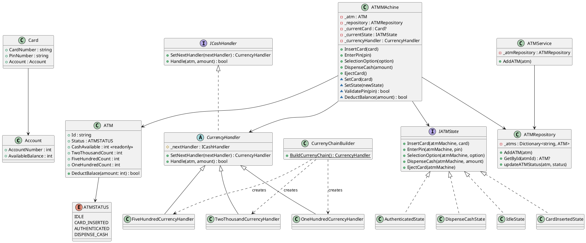

# ATM System - State Machine & Chain of Responsibility

## Problem Statement

Design an ATM system that manages various states of an ATM transaction (Idle, Card Inserted, Authenticated, Dispensing Cash) while handling cash dispensing with multiple currency denominations. The system must:

- Enforce valid state transitions (e.g., cannot dispense cash before authentication)
- Dispense cash using available denominations (₹2000, ₹500, ₹100) via a greedy approach
- Validate user PIN before allowing transactions
- Track ATM cash inventory and account balances
- Prevent invalid operations by responding with appropriate error messages based on current state

---

## Core Entities

| Entity | Responsibility |
|--------|---------------|
| `Account` | Holds account number and available balance |
| `Card` | Links a card number and PIN to an Account |
| `ATM` | Represents physical ATM with cash inventory (denominations) and status |
| `ATMMAchine` | Context class that delegates user actions to the current state |
| `IATMState` | Interface for all ATM states |
| `IdleState` | State when no card is inserted |
| `CardInsertedState` | State after card insertion, awaiting PIN |
| `AuthenticatedState` | State after successful PIN validation |
| `DispenseCashState` | State for cash withdrawal |
| `ICashHandler` | Interface for Chain of Responsibility handlers |
| `CurrencyHandler` | Abstract base for denomination handlers |
| `TwoThousandCurrencyHandler` | Handles ₹2000 note dispensing |
| `FiveHundredCurrencyHandler` | Handles ₹500 note dispensing |
| `OneHundredCurrencyHandler` | Handles ₹100 note dispensing |
| `CurrenyChainBuilder` | Builds the currency dispensing chain |
| `ATMRepository` | In-memory store for ATM instances |
| `ATMService` | Admin service to register ATMs |

---

## Class Diagram (PlantUML)



---

## Classes with Code

### Account & Card

```csharp
public class Account
{
    public int AccountNumber { get; set; }
    public int AvailableBalance { get; set; }
}

public class Card
{
    public string CardNumber { get; set; }
    public string PinNumber { get; set; }
    public Account Account { get; set; }
}
```

### ATM & ATMSTATUS

```csharp
public enum ATMSTATUS
{
    IDLE,
    CARD_INSERTED,
    AUTHENTICATED,
    DISPENSE_CASH
}

public class ATM
{
    public string Id { get; set; }
    public ATMSTATUS Status { get; set; }
    public int CashAvailable => (TwoThousandCount * 2000) + (FiveHundredCount * 500) + (OneHundredCount * 100);
    public int TwoThousandCount { get; set; }
    public int FiveHundredCount { get; set; }
    public int OneHundredCount { get; set; }

    public bool DeductBalace(int amount) { /* Greedy denomination dispense */ }
}
```

### State Pattern - IATMState & Concrete States

```csharp
public interface IATMState
{
    void InsertCard(ATMMAchine atmMachine, Card card);
    void EnterPin(ATMMAchine atmMachine, string pin);
    void SelectionOption(ATMMAchine atmMachine, string option);
    void DispenseCash(ATMMAchine atmMachine, int amount);
    void EjectCard(ATMMAchine atmMachine);
}

// IdleState         → allows: InsertCard
// CardInsertedState → allows: EnterPin, EjectCard
// AuthenticatedState → allows: SelectionOption, EjectCard
// DispenseCashState  → allows: DispenseCash, EjectCard
```

### Chain of Responsibility - Currency Handlers

```csharp
public interface ICashHandler
{
    CurrencyHandler SetNextHandler(ICashHandler nextHandler);
    bool Handle(ATM atm, int amount);
}

public abstract class CurrencyHandler : ICashHandler
{
    protected ICashHandler _nextHandler;
    public CurrencyHandler SetNextHandler(ICashHandler nextHandler) { _nextHandler = nextHandler; return this; }
    public abstract bool Handle(ATM atm, int amount);
}

// Chain: TwoThousandCurrencyHandler → FiveHundredCurrencyHandler → OneHundredCurrencyHandler
```

### ATMMAchine (Context)

```csharp
public class ATMMAchine
{
    private readonly ATM _atm;
    private readonly ATMRepository _repository;
    private Card? _currentCard;
    private IATMState _currentState;
    private CurrencyHandler _currencyHandler;

    // Delegates all user actions to _currentState
    public void InsertCard(Card card) => _currentState.InsertCard(this, card);
    public void EnterPin(string pin) => _currentState.EnterPin(this, pin);
    public void SelectionOption(string option) => _currentState.SelectionOption(this, option);
    public void DispenseCash(int amount) => _currentState.DispenseCash(this, amount);
    public void EjectCard() => _currentState.EjectCard(this);
}
```

---

## Design Patterns Used and Why

### 1. State Pattern

**Why:** The ATM has distinct behavioral states (Idle, Card Inserted, Authenticated, Dispensing Cash). Each state allows only specific operations and rejects others. Without the State pattern, the code would be littered with `if/else` or `switch` blocks checking the current status before every action.

**How it helps:**
- Each state is encapsulated in its own class with clearly defined allowed/disallowed operations
- State transitions are explicit (`SetState(new CardInsertedState())`)
- Adding new states (e.g., `MaintenanceState`) requires no modification of existing state classes (Open/Closed Principle)
- Eliminates complex conditional logic in the `ATMMAchine` context class

### 2. Chain of Responsibility (COR)

**Why:** Cash dispensing requires trying multiple denominations in sequence (₹2000 → ₹500 → ₹100). Each handler attempts to fulfill as much of the amount as possible, then passes the remainder to the next handler in the chain.

**How it helps:**
- Each denomination handler is independent and reusable
- The chain order can be reconfigured without changing handler logic
- Adding new denominations (e.g., ₹200) means adding a new handler and inserting it into the chain
- Separation of concerns: each handler only knows about its own denomination

### 3. Repository Pattern

**Why:** `ATMRepository` abstracts the data storage of ATM instances, decoupling the domain logic from persistence concerns. This makes it straightforward to swap from an in-memory dictionary to a database later.

---

## State Transition Diagram

```
[IDLE] --(InsertCard)--> [CARD_INSERTED]
[CARD_INSERTED] --(EnterPin ✓)--> [AUTHENTICATED]
[CARD_INSERTED] --(EnterPin ✗)--> [IDLE] (eject)
[CARD_INSERTED] --(EjectCard)--> [IDLE]
[AUTHENTICATED] --(SelectOption "WITHDRAW")--> [DISPENSE_CASH]
[AUTHENTICATED] --(EjectCard)--> [IDLE]
[DISPENSE_CASH] --(DispenseCash)--> [IDLE] (eject after dispensing)
[DISPENSE_CASH] --(EjectCard)--> [IDLE]
```
