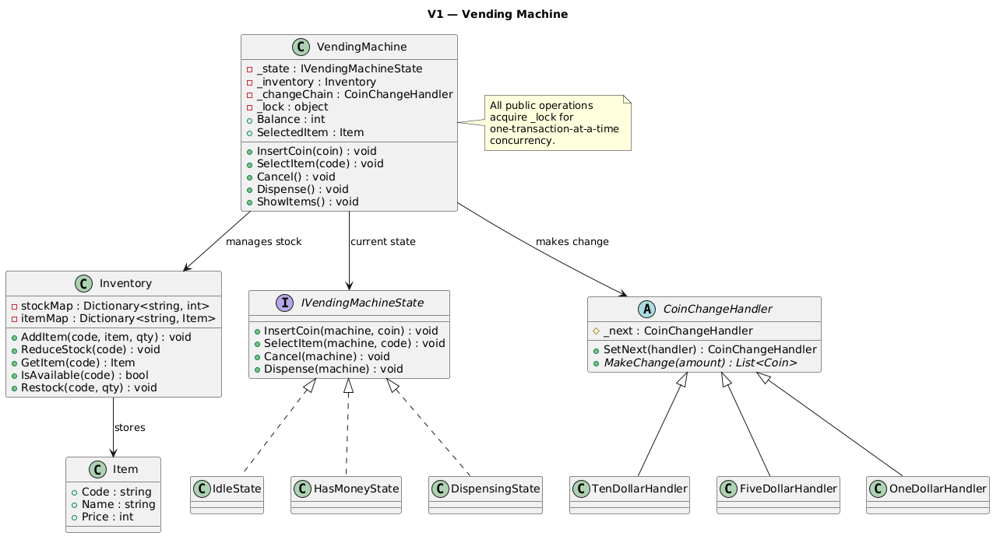
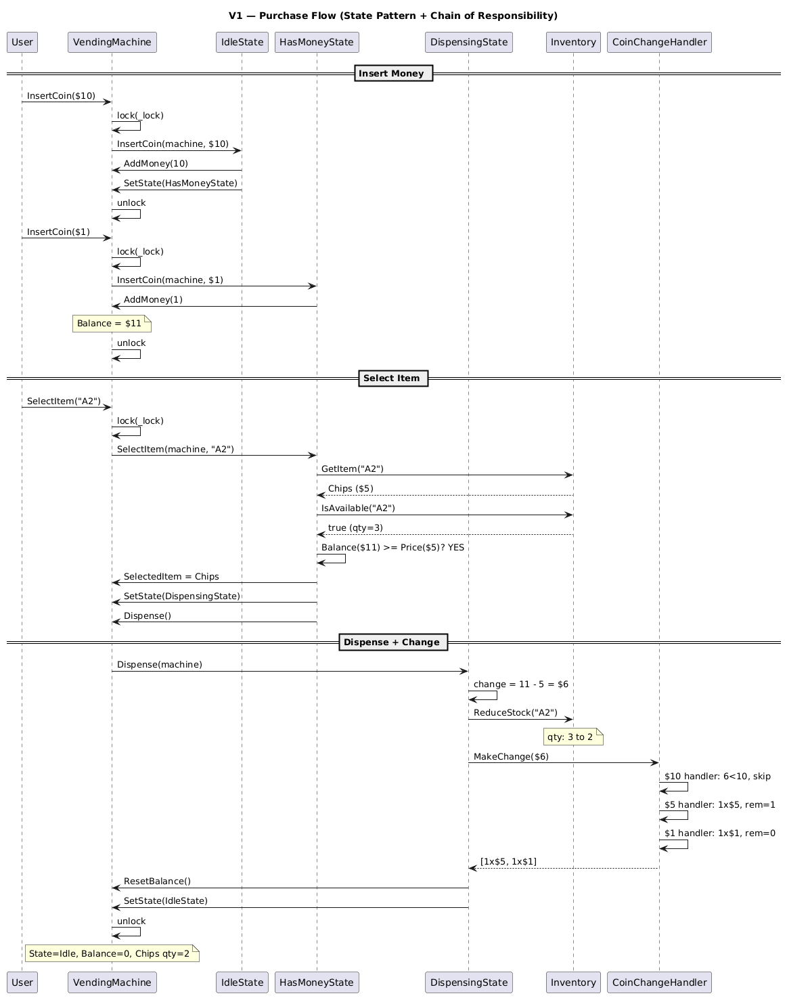
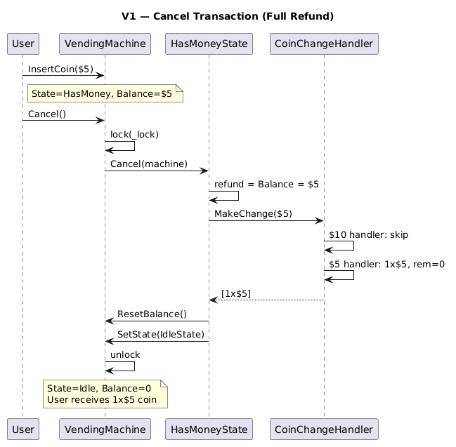

# Vending Machine System

## Table of Contents

- [Problem Statement](#problem-statement)
- [Functional Requirements](#functional-requirements)
- [Non-Functional Requirements](#non-functional-requirements)
- [Core Entities](#core-entities)
- [Design Patterns](#design-patterns)
- [Relationships Between Entities](#relationships-between-entities)
- [V1 — State Pattern + Chain of Responsibility](#v1--state-pattern--chain-of-responsibility)

---

## Problem Statement

A vending machine is a self-service automated device that dispenses items to users without human assistance. Users select an item, insert payment, and receive the product with correct change.

---

## Functional Requirements

- Accept coin-based payments using fixed denominations ($1, $5, $10)
- Allow adding new items or restocking existing items
- Allow users to view available items with prices
- Users select items by entering item code
- Dispense selected item if sufficient money inserted
- Return change if inserted amount exceeds item price
- Allow users to cancel a transaction and receive a full refund
- Display intermediate states (balance, selected item, refund)

---

## Non-Functional Requirements

- **Maintainability**: OO principles, modularity, testability
- **Atomicity**: Purchase is all-or-nothing (item + change, or full refund)
- **Concurrency Control**: One transaction at a time (locked during operation)
- **Extensibility**: Future payment methods (digital wallets) addable with minimal changes

---

## Core Entities

| Entity | Responsibility |
|--------|---------------|
| **Item** | Product definition: code, name, price (immutable) |
| **Inventory** | Stock management: stockMap + itemMap, addItem/reduceStock/isAvailable |
| **VendingMachine** | Context for State Pattern, owns Inventory + balance + state |
| **IVendingMachineState** | State interface: InsertCoin, SelectItem, Cancel, Dispense |
| **IdleState** | Waiting for money — only InsertCoin valid |
| **HasMoneyState** | Money inserted — InsertCoin, SelectItem, Cancel valid |
| **DispensingState** | Item selected — dispenses item + returns change |
| **CoinChangeHandler** | Chain of Responsibility base for change calculation |
| **TenDollarHandler / FiveDollarHandler / OneDollarHandler** | Concrete handlers |

---

## Design Patterns

### 1. State Pattern (Machine Operations)

Controls which operations are valid at any point in the transaction lifecycle.

```
┌───────────┐  InsertCoin   ┌──────────────┐  SelectItem   ┌───────────────┐
│   Idle    │──────────────►│  HasMoney    │──────────────►│  Dispensing   │
│           │               │              │               │               │
│ InsertCoin│               │ InsertCoin   │               │ Dispense()    │
│ (valid)   │               │ SelectItem   │               │ → item + change│
│ SelectItem│               │ Cancel       │               │ → reset to Idle│
│ (error)   │               │ (refund)     │               │               │
│ Cancel    │               │              │               │ All other ops │
│ (error)   │               │              │               │ (error)       │
└───────────┘               └──────┬───────┘               └───────┬───────┘
      ▲                            │ Cancel                         │ After dispense
      │                            ▼                                │
      │                     Refund all money                        │
      └────────────────────── back to Idle ◄────────────────────────┘
```

### 2. Chain of Responsibility (Coin Change)

Each handler tries its denomination, passes remainder to the next.

```
Amount: $9

$10 Handler: 9 < 10, skip → pass to next
$5 Handler:  9 >= 5, dispense 1×$5, remainder = 4 → pass to next
$1 Handler:  4 >= 1, dispense 4×$1, remainder = 0 → done

Result: [1×$5, 4×$1]
```

---

## Relationships Between Entities

```
VendingMachine (Context)
    ├─► IVendingMachineState (current state — Idle/HasMoney/Dispensing)
    ├─► Inventory
    │       ├─► itemMap: code → Item (product definitions)
    │       └─► stockMap: code → int (quantities)
    ├─► CoinChangeHandler (chain: $10 → $5 → $1)
    └─► _lock (one transaction at a time)

State transitions:
    Idle ──[InsertCoin]──► HasMoney
    HasMoney ──[SelectItem]──► Dispensing ──[auto]──► Idle
    HasMoney ──[Cancel]──► Idle (with refund)
```

---

## V1 — State Pattern + Chain of Responsibility

### V1 Class Diagram 


### V1 Sequence Diagram — Purchase Flow 


### V1 Sequence Diagram — Cancel Flow

### V1 Code Snippets

#### Item + Inventory (separated concerns)

```csharp
// Item is immutable — product definition only (no quantity)
public class Item
{
    public string Code { get; }
    public string Name { get; }
    public int Price { get; }
}

// Inventory manages stock separately from product definition
public class Inventory
{
    private readonly Dictionary<string, int> _stockMap = new();     // code → quantity
    private readonly Dictionary<string, Item> _itemMap = new();     // code → item

    public void AddItem(string code, Item item, int quantity)
    {
        _itemMap[code] = item;
        _stockMap[code] = quantity;
    }

    public void ReduceStock(string code)
    {
        if (_stockMap.ContainsKey(code) && _stockMap[code] > 0)
            _stockMap[code]--;
    }

    public bool IsAvailable(string code) =>
        _stockMap.TryGetValue(code, out var qty) && qty > 0;
}
```

#### State Pattern (state classes)

```csharp
// IdleState: only InsertCoin is valid
public class IdleState : IVendingMachineState
{
    public void InsertCoin(VendingMachine machine, Coin coin)
    {
        machine.AddMoney((int)coin);
        machine.SetState(new HasMoneyState()); // Idle → HasMoney
    }

    public void SelectItem(...) => "Please insert money first.";
    public void Cancel(...) => "No transaction to cancel.";
}

// HasMoneyState: InsertCoin, SelectItem, Cancel all valid
public class HasMoneyState : IVendingMachineState
{
    public void SelectItem(VendingMachine machine, string code)
    {
        var item = machine.GetItem(code);
        if (item == null) { "Not found"; return; }
        if (!machine.IsItemAvailable(code)) { "Out of stock"; return; }
        if (machine.Balance < item.Price) { "Insufficient funds"; return; }

        machine.SelectedItem = item;
        machine.SetState(new DispensingState()); // HasMoney → Dispensing
        machine.Dispense(); // immediately dispense
    }

    public void Cancel(VendingMachine machine)
    {
        var coins = machine.MakeChange(machine.Balance); // full refund via chain
        machine.ResetBalance();
        machine.SetState(new IdleState()); // HasMoney → Idle
    }
}

// DispensingState: dispenses item + change, then resets to Idle
public class DispensingState : IVendingMachineState
{
    public void Dispense(VendingMachine machine)
    {
        var item = machine.SelectedItem!;
        int change = machine.Balance - item.Price;
        machine.ReduceStock(item.Code);

        if (change > 0)
        {
            var coins = machine.MakeChange(change); // Chain of Responsibility
        }

        machine.ResetBalance();
        machine.SelectedItem = null;
        machine.SetState(new IdleState()); // Dispensing → Idle
    }
}
```

#### Chain of Responsibility (coin change)

```csharp
public abstract class CoinChangeHandler
{
    protected CoinChangeHandler? _next;

    public CoinChangeHandler SetNext(CoinChangeHandler next)
    {
        _next = next;
        return next; // enables chaining
    }

    public abstract List<Coin> MakeChange(int amount);
}

public class TenDollarHandler : CoinChangeHandler
{
    public override List<Coin> MakeChange(int amount)
    {
        var coins = new List<Coin>();
        while (amount >= 10) { coins.Add(Coin.Dollar10); amount -= 10; }
        if (amount > 0 && _next != null) coins.AddRange(_next.MakeChange(amount));
        return coins;
    }
}

// Chain factory: $10 → $5 → $1
public static class CoinChangeChainFactory
{
    public static CoinChangeHandler CreateChain()
    {
        var ten = new TenDollarHandler();
        var five = new FiveDollarHandler();
        var one = new OneDollarHandler();
        ten.SetNext(five).SetNext(one);
        return ten; // head of chain
    }
}
```

#### VendingMachine (context + concurrency lock)

```csharp
public class VendingMachine
{
    private IVendingMachineState _state;
    private readonly Inventory _inventory = new();
    private readonly CoinChangeHandler _changeChain;
    private readonly object _lock = new(); // one transaction at a time

    // All public ops acquire the lock — serializes transactions
    public void InsertCoin(Coin coin) { lock (_lock) { _state.InsertCoin(this, coin); } }
    public void SelectItem(string code) { lock (_lock) { _state.SelectItem(this, code); } }
    public void Cancel() { lock (_lock) { _state.Cancel(this); } }
    public void Dispense() { lock (_lock) { _state.Dispense(this); } }
}
```

### Purchase Flow (Example: Buy Chips $5 with $10+$1=$11)

```
Initial state: IdleState, Balance=0

Step 1: machine.InsertCoin($10)
  → lock acquired
  → IdleState.InsertCoin(): Balance = 0 + 10 = 10
  → SetState(HasMoneyState)
  → lock released
  State: HasMoneyState, Balance=$10

Step 2: machine.InsertCoin($1)
  → lock acquired
  → HasMoneyState.InsertCoin(): Balance = 10 + 1 = 11
  → (stay in HasMoneyState)
  → lock released
  State: HasMoneyState, Balance=$11

Step 3: machine.SelectItem("A2")  [Chips, $5]
  → lock acquired
  → HasMoneyState.SelectItem():
      item = Inventory.GetItem("A2") → Chips($5)
      IsAvailable("A2") → true (qty=3)
      Balance($11) >= Price($5) → true ✓
      SelectedItem = Chips
      SetState(DispensingState)
      call Dispense()
  → DispensingState.Dispense():
      change = 11 - 5 = $6
      Inventory.ReduceStock("A2") → qty: 3→2
      "[Machine] Dispensing: Chips"
      MakeChange($6) via chain:
        $10 handler: 6 < 10, skip → next
        $5 handler: 6 >= 5, 1×$5, remainder=1 → next
        $1 handler: 1 >= 1, 1×$1, remainder=0 → done
      "[Machine] Change: $6 (1×$5, 1×$1)"
      ResetBalance() → Balance=0
      SelectedItem = null
      SetState(IdleState)
  → lock released
  State: IdleState, Balance=$0, Chips qty=2
```

### Cancel Flow (Example: $5 inserted, cancel)

```
State: HasMoneyState, Balance=$5

machine.Cancel()
  → lock acquired
  → HasMoneyState.Cancel():
      refund = Balance = $5
      MakeChange($5) via chain:
        $10 handler: 5 < 10, skip → next
        $5 handler: 5 >= 5, 1×$5, remainder=0 → done
      ResetBalance() → Balance=0
      "[Machine] Transaction cancelled. Refund: $5 (1×$5)"
      SetState(IdleState)
  → lock released
  State: IdleState, Balance=$0
```

### Error Handling Flows

```
Insufficient funds:
  State: HasMoneyState, Balance=$5
  SelectItem("C1") → Energy Drink costs $7
    Balance($5) < Price($7) → "[Machine] Insufficient funds"
    Stay in HasMoneyState (user can add more money or cancel)

Out of stock:
  State: HasMoneyState, Balance=$1
  SelectItem("D1") → qty=0
    IsAvailable("D1") → false
    "[Machine] Limited Edition is out of stock."
    Stay in HasMoneyState (user can pick different item or cancel)

Wrong state operations:
  State: IdleState
  SelectItem("A1") → "[Machine] Please insert money first."
  Cancel() → "[Machine] No transaction to cancel."

  State: DispensingState
  InsertCoin($1) → "[Machine] Please wait, dispensing in progress."
  Cancel() → "[Machine] Cannot cancel, dispensing in progress."
```

### Chain of Responsibility — Change Examples

```
Change $9:  $10→skip, $5→1×$5(rem=4), $1→4×$1(rem=0)  → [1×$5, 4×$1]
Change $6:  $10→skip, $5→1×$5(rem=1), $1→1×$1(rem=0)  → [1×$5, 1×$1]
Change $23: $10→2×$10(rem=3), $5→skip, $1→3×$1(rem=0) → [2×$10, 3×$1]
Change $5:  $10→skip, $5→1×$5(rem=0)                   → [1×$5]
Change $1:  $10→skip, $5→skip, $1→1×$1(rem=0)          → [1×$1]
```

### Thread-Safety Analysis

```
Why one global lock is correct for a vending machine:

Physical constraint: A real vending machine serves ONE user at a time.
  - You can't have two people pressing buttons simultaneously.
  - The lock models this physical reality.

What the lock protects:
  - State transitions (Idle → HasMoney → Dispensing → Idle)
  - Balance modifications (insert, deduct, reset)
  - Inventory changes (reduce stock)
  - The check-then-act pattern (check balance ≥ price → dispense)

All in ONE lock → the entire transaction is atomic.
No TOCTOU: check and act happen in the same lock acquisition.

Why NOT per-item locks (like Movie Booking):
  - Only one user interacts with the machine at a time
  - No need for parallel item reservations
  - Per-item locks would be over-engineering

Why NOT ConcurrentDictionary for inventory:
  - All inventory access already happens under _lock
  - Adding ConcurrentDictionary would be redundant (and misleading)
```

### State Transition Diagram

```
         ┌─────────────────────────────────────────────────────────┐
         │                                                         │
         ▼                                                         │
    ┌──────────┐  InsertCoin   ┌──────────────┐  SelectItem   ┌──────────────┐
    │          │──────────────►│              │──────────────►│              │
    │  IDLE    │               │  HAS_MONEY   │               │ DISPENSING   │
    │          │◄──────────────│              │               │              │
    │          │    Cancel     │              │               │              │──┐
    └──────────┘   (refund)    └──────────────┘               └──────────────┘  │
         ▲                           │                                          │
         │                           │ InsertCoin                               │
         │                           └──────┐                                   │
         │                                  │ (add more money,                  │
         │                                  │  stay in HasMoney)                │
         │                                  └──────────────────►(self)          │
         │                                                                      │
         └──────────────────── Dispense complete ◄──────────────────────────────┘

Valid operations per state:
  IDLE:        InsertCoin ✓ | SelectItem ✗ | Cancel ✗ | Dispense ✗
  HAS_MONEY:   InsertCoin ✓ | SelectItem ✓ | Cancel ✓ | Dispense ✗
  DISPENSING:  InsertCoin ✗ | SelectItem ✗ | Cancel ✗ | Dispense ✓ (internal)
```
