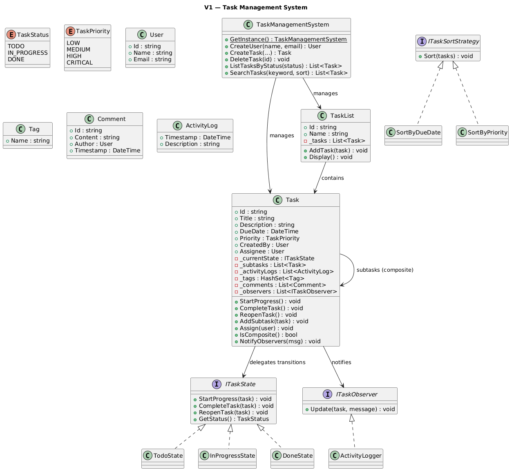
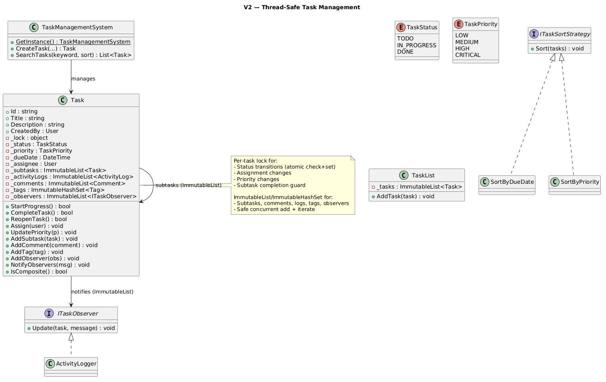

# Task Management System

## Table of Contents

- [Problem Statement](#problem-statement)
- [Functional Requirements](#functional-requirements)
- [Non-Functional Requirements](#non-functional-requirements)
- [Core Entities](#core-entities)
- [Design Patterns](#design-patterns)
- [V1 — State + Observer + Strategy + Composite](#v1--state--observer--strategy--composite)
- [V1 to V2](#v1-to-v2)
- [V2 — Fully Thread-Safe](#v2--fully-thread-safe)

---

## Problem Statement

A task management system helps individuals and teams plan, organize, assign, and track tasks. It improves productivity, accountability, and collaboration in team-driven environments.

---

## Functional Requirements

- Users can create, update, and delete tasks
- Tasks have title, description, due date, priority, and status
- Tasks can have subtasks; parent completes only when all subtasks are done
- Status changes follow valid transition rules (TODO cannot go directly to DONE)
- Tasks can be assigned to users
- Tasks support tags for categorization
- Tasks can have comments
- System tracks activity history (creation, status changes, assignments)
- Users can filter tasks by status, priority, and assignee
- Tasks belong to task lists

---

## Non-Functional Requirements

- **Modularity**: OO principles with clear separation of concerns
- **Extensibility**: Support future features
- **Thread-safety**: Safe for concurrent access
- **Testability**: Components testable in isolation

---

## Core Entities

| Entity | Responsibility |
|--------|---------------|
| **User** | id, name, email |
| **Task** | title, description, dueDate, priority, status, subtasks, tags, comments, logs |
| **TaskList** | Named collection of tasks |
| **Tag** | Categorization label |
| **Comment** | Text by a user on a task |
| **ActivityLog** | Timestamped record of a change |
| **ITaskState** (V1) | State Pattern interface for status transitions |
| **ITaskObserver** | Observer interface — notified on task changes |
| **ActivityLogger** | Concrete observer — logs to console |
| **ITaskSortStrategy** | Strategy for sorting tasks (ByDueDate, ByPriority) |
| **TaskManagementSystem** | Singleton facade |

---

## Design Patterns

| Pattern | Usage |
|---------|-------|
| **State** (V1) | TodoState/InProgressState/DoneState control valid transitions |
| **Observer** | ActivityLogger notified on status/assignment/priority changes |
| **Strategy** | SortByDueDate/SortByPriority for task list sorting |
| **Composite** | Tasks have subtasks; parent completes only when all children done |
| **Singleton** | TaskManagementSystem (single coordination point) |

---

## V1 — State + Observer + Strategy + Composite

### V1 Class Diagram 


### V1 Status Transitions (State Pattern)

```
┌────────┐  StartProgress   ┌─────────────┐  CompleteTask   ┌────────┐
│  TODO  │─────────────────►│ IN_PROGRESS │────────────────►│  DONE  │
│        │                  │             │                  │        │
│        │                  │  ReopenTask │                  │Reopen  │
│        │◄─────────────────│      ↓      │                  │  ↓     │
└────────┘                  │   → TODO    │                  │ → TODO │
                            └─────────────┘                  └────────┘

Invalid transitions (rejected with error):
  TODO → DONE (must go through IN_PROGRESS)
  TODO → TODO (already there)
  DONE → DONE (already there)
  DONE → IN_PROGRESS (must reopen to TODO first)
```

### V1 Code Snippets

#### State Pattern (transition logic in state classes)

```csharp
public class TodoState : ITaskState
{
    public void StartProgress(Task task)
    {
        task.SetState(new InProgressState()); // TODO → IN_PROGRESS
        task.NotifyObservers("Status changed to IN_PROGRESS");
    }

    public void CompleteTask(Task task)
    {
        // BLOCKED: Cannot skip IN_PROGRESS
        Console.WriteLine("[Error] Cannot complete directly from TODO.");
    }
}

public class InProgressState : ITaskState
{
    public void CompleteTask(Task task)
    {
        // Composite guard: parent can't complete if subtasks aren't done
        if (task.IsComposite() && task.Subtasks.Any(s => s.GetStatus() != TaskStatus.DONE))
        {
            Console.WriteLine("[Error] Subtasks not all done.");
            return;
        }
        task.SetState(new DoneState()); // IN_PROGRESS → DONE
    }
}
```

#### Composite (subtask enforcement)

```csharp
// Parent task with subtasks:
task1.AddSubtask(sub1);  // sub1: TODO
task1.AddSubtask(sub2);  // sub2: TODO

task1.StartProgress();
task1.CompleteTask();  // FAILS: "subtasks not all done"

sub1.StartProgress(); sub1.CompleteTask();  // sub1: DONE
sub2.StartProgress(); sub2.CompleteTask();  // sub2: DONE

task1.CompleteTask();  // NOW succeeds — all subtasks DONE
```

### V1 Limitations (Thread-Safety Issues with Examples)

#### Issue 1: State Transition Race (TOCTOU)

```csharp
// V1: _currentState is unprotected
public void StartProgress() => _currentState.StartProgress(this);
public void SetState(ITaskState state) => _currentState = state;
```

```
Two threads call StartProgress() on a TODO task simultaneously:

Thread A: _currentState is TodoState
  → TodoState.StartProgress():
    → task.SetState(new InProgressState())  ← writes state

Thread B: _currentState is TodoState (read BEFORE A's write visible!)
  → TodoState.StartProgress():
    → task.SetState(new InProgressState())  ← writes state AGAIN

Result: Both threads think they transitioned from TODO.
  StartProgress fires TWICE, two log entries, two observer notifications.
  Should only happen once.
```

#### Issue 2: Subtask Guard Race

```
Parent task: IN_PROGRESS, subtasks: [sub1(DONE), sub2(IN_PROGRESS)]

Thread A: sub2.CompleteTask() → sub2 becomes DONE
Thread B: parent.CompleteTask() → checks subtasks...

If Thread B reads sub2's state BEFORE Thread A's SetState completes:
  sub2.GetStatus() returns IN_PROGRESS (stale)
  → "subtasks not all done" error
  Even though sub2 was completing at the same instant.

Worse: Thread B reads sub2 as DONE (after A), starts completing parent.
  Thread C: sub2.ReopenTask() → sub2 goes back to TODO
  Thread B: parent.SetState(DoneState) ← parent now DONE but sub2 is TODO!
  INCONSISTENT STATE.
```

#### Issue 3: List Concurrent Modification

```csharp
// V1: plain List<Task> _subtasks
public void AddSubtask(Task t) => _subtasks.Add(t);
```

```
Thread A: task.CompleteTask() → iterates _subtasks (foreach to check all DONE)
Thread B: task.AddSubtask(newSubtask) → _subtasks.Add(...)

Result: Thread A throws InvalidOperationException
  "Collection was modified during enumeration"
```

#### Issue 4: Observer List Race

```
Thread A: task.NotifyObservers("...") → iterates _observers list
Thread B: task.AddObserver(newLogger) → _observers.Add(...)

Result: Same crash — "Collection was modified during enumeration"
```

#### Issue 5: Assignment Race

```
Thread A: task.Assign(alice) → Assignee = alice
Thread B: task.Assign(bob) → Assignee = bob

Both succeed, no error. Last write wins.
Activity log shows both assignments but final state is ambiguous
depending on which thread wrote last.
```

---

## V1 to V2

### What Changed

| Aspect | V1 | V2 |
|--------|----|----|
| State transitions | External state classes, unprotected | Per-task lock, inline check+set atomic |
| State representation | `ITaskState` classes | `TaskStatus` enum (logic in Task methods) |
| Subtask guard | Checked then set separately (TOCTOU) | Check + set in one `lock` block |
| Lists (subtasks, comments, logs) | `List` (crash) | `ImmutableList` + `ImmutableInterlocked` |
| Tags | `HashSet` (not thread-safe) | `ImmutableHashSet` + `ImmutableInterlocked` |
| Observers | `List` (crash) | `ImmutableList` (snapshot iteration) |
| Assignment/Priority | Plain setters (race) | Under per-task `lock` |
| TaskList._tasks | `List` | `ImmutableList` |

### Why State Pattern Classes Were Removed in V2

V1 used separate `TodoState`/`InProgressState`/`DoneState` classes. V2 inlines the logic because:

1. The state check + transition MUST be atomic under one lock
2. External state classes would need the lock reference (re-entrancy or passing)
3. The check (`if _status != TODO`) and the set (`_status = IN_PROGRESS`) happen in ONE lock block
4. A `TaskStatus` enum still represents the state — behavior is just in Task's locked methods

```
V1: task.StartProgress()
      → _currentState.StartProgress(this)  // delegates to external class
        → task.SetState(new InProgressState())  // UNPROTECTED write

V2: task.StartProgress()
      → lock(_lock) {
           if (_status != TODO) return false;  // check
           _status = IN_PROGRESS;              // set (atomic with check)
         }
```

---

## V2 — Fully Thread-Safe

### V2 Class Diagram


### V2 Code Snippets

#### Atomic State Transitions (per-task lock)

```csharp
public class Task
{
    private readonly object _lock = new();
    private TaskStatus _status;

    // TODO → IN_PROGRESS (atomic check+set)
    public bool StartProgress()
    {
        lock (_lock)
        {
            if (_status != TaskStatus.TODO) return false; // reject invalid
            _status = TaskStatus.IN_PROGRESS;
        }
        NotifyObservers("Status changed to IN_PROGRESS");
        return true;
    }

    // IN_PROGRESS → DONE (subtask guard under same lock)
    public bool CompleteTask()
    {
        lock (_lock)
        {
            if (_status != TaskStatus.IN_PROGRESS) return false;
            // Subtask check + status change are ATOMIC
            if (_subtasks.Any(s => s.GetStatus() != TaskStatus.DONE)) return false;
            _status = TaskStatus.DONE;
        }
        NotifyObservers("Status changed to DONE");
        return true;
    }
}
```

#### ImmutableList for Collections

```csharp
// V2: Add subtask without crashing concurrent iterators
private ImmutableList<Task> _subtasks = ImmutableList<Task>.Empty;

public void AddSubtask(Task subtask)
{
    ImmutableInterlocked.Update(ref _subtasks, list => list.Add(subtask));
}

// V2: Observers — safe to add during notification
private ImmutableList<ITaskObserver> _observers = ImmutableList<ITaskObserver>.Empty;

public void NotifyObservers(string message)
{
    var snapshot = _observers; // immutable snapshot
    foreach (var obs in snapshot) obs.Update(this, message);
}
```

### V2 Concurrent Race Example: StartProgress

```
Task status = TODO
Thread A: task.StartProgress()
Thread B: task.StartProgress()

T1  Thread A: lock(_lock) ← ACQUIRED
    Thread B: lock(_lock) ← BLOCKED

T2  Thread A (inside lock):
      _status == TODO ✓
      _status = IN_PROGRESS
    EXIT lock
    NotifyObservers → "[Log] Status changed to IN_PROGRESS"
    return true

T3  Thread B: lock(_lock) ← ACQUIRED
      _status == TODO? NO (it's IN_PROGRESS now!)
      return false
    EXIT lock
    Console: "[Error] Cannot start — status is IN_PROGRESS"

Result:
  Thread A: SUCCESS (transitioned)
  Thread B: FAILED (rejected — status already changed)
  Exactly one wins. No double-transition. No duplicate logs.
```

### V2 Subtask Guard — Atomic

```
Parent: IN_PROGRESS, subtasks: [sub1(DONE), sub2(completing...)]

Thread A: sub2.CompleteTask()
  lock(sub2._lock): sub2._status = DONE ✓

Thread B: parent.CompleteTask()
  lock(parent._lock):
    _status == IN_PROGRESS ✓
    _subtasks.Any(s => s.GetStatus() != DONE)?
      → calls sub2.GetStatus() which acquires sub2._lock
      → if sub2 is DONE → all done → parent completes ✓
      → if sub2 is still IN_PROGRESS → "subtasks not done" ✗

No TOCTOU: the check and the parent's state change happen
in parent's lock. Sub2's state is read via its own lock (GetStatus).
Even if sub2 completes between parent's check and parent's set,
the parent either sees DONE (and completes) or not (and fails cleanly).
```

### V2 Design Decisions

```
Why per-task lock (not global):
  - Different tasks can be modified in parallel (no contention)
  - Only same-task operations serialize against each other
  - Scales to thousands of tasks without a bottleneck

Why ImmutableList (not lock for lists):
  - Subtask iteration during CompleteTask reads ImmutableList
  - Another thread can AddSubtask concurrently (creates new list)
  - No crash — old iteration continues on old snapshot
  - Simpler than ReaderWriterLockSlim for this use case

Why status logic inlined (not State classes):
  - Check + set MUST be in one lock block
  - External state classes accessing the lock = complex re-entrancy
  - TaskStatus enum is simpler, still enforces transition rules
  - Same guarantees (TODO cannot skip to DONE) without extra classes
```
