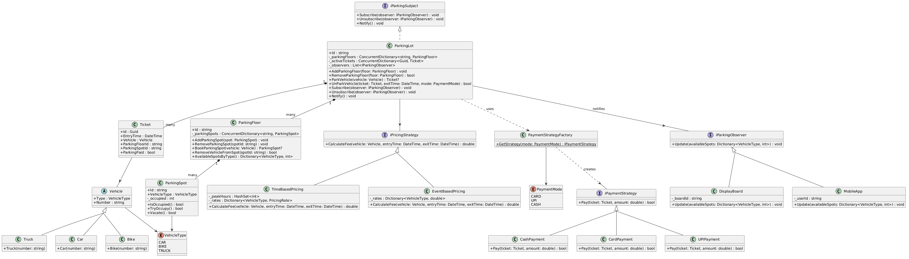

# Design Parking Lot

## Problem Statement
Imagine you're arriving at a busy parking lot, eager to park your car. At the entrance, you're issued a ticket. You then drive in, find a spot suited to your vehicle's size, and park. Later, when you prepare to leave, you present your ticket at the exit, the system calculates your fee, and the spot is freed up for the next vehicle. Behind the scenes, the parking lot is assigning spots based on vehicle size, recording entry and exit times, and updating availability for new arrivals. Now, let's design a parking lot system that handles all this.

---

## Interview Flow
1. Clarify Requirements
2. Core Entities
3. Class Diagram
4. Interactions
5. Extensibility + Dynamic + High Traffic
6. Implementation 1 → Satisfy the requirements
7. Implementation 2 → Satisfy Extensibility + Dynamic + High Traffic

---

## Clarify Requirements

### Functional Requirements
- The parking lot has multiple floors, each with parking spots typed by vehicle size: compact (Bike), regular (Car), and oversized (Truck).
- Customers park their vehicle in a spot matched to their vehicle type.
- On entry, the customer receives a ticket capturing vehicle details, entry time, floor, and spot.
- On exit, the customer submits the ticket, pays a fee based on duration, vehicle type, and time of day, and the spot is freed.

### Non-Functional Requirements
- The system must scale to support large parking lots with many floors, spots, and concurrent vehicles.
- Spot assignment must be thread-safe — two vehicles must never be assigned the same spot.
- Spot availability must be broadcast in real time to display boards and mobile apps.

---

## Core Entities

| Entity | Responsibility |
|---|---|
| `Vehicle` | Abstract base. Holds vehicle number and type. Concrete types: `Car`, `Bike`, `Truck`. |
| `ParkingSpot` | Atomic unit. Typed to one `VehicleType`. Tracks occupied state via a CAS lock. |
| `ParkingFloor` | A collection of `ParkingSpot`s. Finds and books an available spot for a vehicle. |
| `ParkingLot` | Top-level entry point. Manages floors, issues tickets, processes exits, and notifies observers. |
| `Ticket` | Issued on entry. Captures entry time, vehicle, floor ID, and spot ID. |
| `IPricingStrategy` | Calculates the parking fee given a vehicle, entry time, and exit time. |
| `IPaymentStrategy` | Processes payment for a given ticket and amount. |
| `PaymentStrategyFactory` | Returns the correct `IPaymentStrategy` for a given `PaymentMode`. |
| `IParkingObserver` | Observer interface. Receives a per-type available spot count on every park/unpark. |
| `IParkingSubject` | Subject interface. Manages observer subscriptions and triggers notifications. |

---

## Class Diagram

```
ParkingLot  ──composition──▶  ParkingFloor  ──composition──▶  ParkingSpot
ParkingLot  ──────────────▶  Ticket  ──────────────────────▶  Vehicle
ParkingLot  ──uses──────────▶  IPricingStrategy
ParkingLot  ──uses──────────▶  PaymentStrategyFactory  ──creates──▶  IPaymentStrategy
ParkingLot  ──implements────▶  IParkingSubject
ParkingLot  ──notifies──────▶  IParkingObserver  ◁──  DisplayBoard, MobileApp
```



---

## Interactions

### Park Vehicle
1. Client calls `ParkingLot.ParkVehicle(vehicle)`.
2. `ParkingLot` iterates floors and calls `ParkingFloor.BookParkingSpot(vehicle)`.
3. `ParkingFloor` iterates spots, finds one matching `VehicleType` and calls `ParkingSpot.TryOccupy()`.
4. `TryOccupy()` uses a CAS loop — atomically sets `_occupied` from `0 → 1`. Only one thread wins.
5. On success, a `Ticket` is created and stored. `Notify()` is called — all observers receive the updated available count per vehicle type.
6. If no spot is found, returns `null`.

### Unpark Vehicle
1. Client calls `ParkingLot.UnParkVehicle(ticket, exitTime, paymentMode)`.
2. Ticket is validated against active tickets.
3. Fee is calculated via `IPricingStrategy.CalculateFee(vehicle, entryTime, exitTime)`.
4. Payment is processed via `IPaymentStrategy.Pay(ticket, fee)` — obtained from `PaymentStrategyFactory`.
5. `ParkingSpot.Vacate()` uses a CAS loop — atomically sets `_occupied` from `1 → 0`.
6. Ticket is removed from active tickets. `Notify()` is called.

---

## Design Patterns Used

### Strategy Pattern — Pricing
`IPricingStrategy` decouples fee calculation from `ParkingLot`. Swap strategies without changing any other class.

| Strategy | Behaviour |
|---|---|
| `TimeBasedPricing` | Charges per hour at a peak or non-peak rate depending on the hour of day. Sub-hour stays are rounded up to 1 hour. Rates are configurable per `VehicleType`. |
| `EventBasedPricing` | Flat per-hour rate regardless of time of day. Used during special events. |

```csharp
// Configuring TimeBasedPricing
var peakHours = new HashSet<int> { 8, 9, 17, 18, 19 };
var rates = new Dictionary<VehicleType, PricingRate>
{
    { VehicleType.CAR,   new PricingRate(PeakRate: 20, NonPeakRate: 10) },
    { VehicleType.BIKE,  new PricingRate(PeakRate: 10, NonPeakRate:  5) },
    { VehicleType.TRUCK, new PricingRate(PeakRate: 40, NonPeakRate: 20) }
};
IPricingStrategy pricing = new TimeBasedPricing(peakHours, rates);
```

### Strategy Pattern — Payment
`IPaymentStrategy` decouples payment processing from `ParkingLot`. New payment modes require only a new class implementing `IPaymentStrategy` and a new case in `PaymentStrategyFactory`.

| Strategy | Behaviour |
|---|---|
| `CashPayment` | Processes cash payment. |
| `CardPayment` | Processes card payment. |
| `UPIPayment` | Processes UPI payment. |

### Factory Pattern — Payment
`PaymentStrategyFactory.GetStrategy(PaymentMode)` centralises creation of payment strategies. `ParkingLot` never instantiates a payment class directly.

### Observer Pattern — Availability Updates
`ParkingLot` implements `IParkingSubject`. After every `ParkVehicle` and `UnParkVehicle`, it calls `Notify()`, which aggregates available spots per `VehicleType` across all floors and pushes the result to all registered `IParkingObserver`s.

| Observer | Behaviour |
|---|---|
| `DisplayBoard` | Prints the latest available count per vehicle type to the console, simulating a physical entrance board. |
| `MobileApp` | Prints a push notification with the latest count, simulating a customer-facing app. |

```csharp
var lot = new ParkingLot("PL001", pricing);
lot.Subscribe(new DisplayBoard("Entrance-1"));
lot.Subscribe(new MobileApp("user-42"));
// Every ParkVehicle / UnParkVehicle automatically triggers both observers
```

---

## Thread Safety

The system is designed for high-concurrency environments.

| Mechanism | Where used | Why |
|---|---|---|
| `ConcurrentDictionary` | `ParkingLot._parkingFloors`, `ParkingLot._activeTickets`, `ParkingFloor._parkingSpots` | Lock-free thread-safe reads and writes for collections. |
| CAS loop (`Interlocked.CompareExchange`) | `ParkingSpot.TryOccupy()`, `ParkingSpot.Vacate()` | Atomically flips `_occupied` between `0` and `1`. Guarantees exactly one thread wins the spot — no `lock` needed. |
| `Volatile.Read` | `ParkingSpot.IsOccupied()` | Ensures the freshest value of `_occupied` is read without CPU cache staleness. |
| `lock (_observerLock)` | `ParkingLot.Subscribe`, `Unsubscribe`, `Notify` | Protects the observer list from concurrent modification. `Notify` takes a snapshot before iterating so the lock is held only briefly. |

---

## Project Structure

```
ParkingLot/
├── Entities/
│   ├── Vehicle.cs           # Abstract base class
│   ├── Car.cs
│   ├── Bike.cs
│   ├── Truck.cs
│   ├── ParkingSpot.cs       # CAS-based atomic spot
│   ├── ParkingFloor.cs      # Manages spots on one floor
│   ├── ParkingLot.cs        # Entry point, implements IParkingSubject
│   └── Ticket.cs
├── Enums/
│   ├── VehicleType.cs
│   └── PaymentMode.cs
├── Strategies/
│   ├── PricingStrategy/
│   │   ├── IPricingStrategy.cs
│   │   ├── TimeBasedPricing.cs
│   │   └── EventBasedPricing.cs
│   └── PaymentStrategy/
│       ├── IPaymentStrategy.cs
│       ├── CashPayment.cs
│       ├── CardPayment.cs
│       └── UPIPayment.cs
├── Factories/
│   └── PaymentStrategyFactory.cs
├── Observers/
│   ├── IParkingObserver.cs
│   ├── IParkingSubject.cs
│   ├── DisplayBoard.cs
│   └── MobileApp.cs
├── ClassDiagram1.puml
└── Program.cs               # Test scenarios
```
