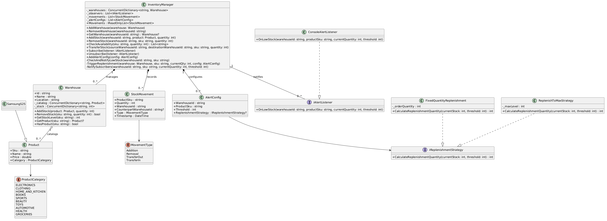

# Inventory Management System

## Problem Statement

Design a multi-warehouse inventory management system that tracks product stock levels across locations, supports receiving shipments, fulfilling orders, transferring stock between warehouses, and provides low-stock alerting with automated replenishment — all in a thread-safe manner suitable for concurrent operations.

---

## Interview Flow

1. Clarify Requirements
2. Core Entities
3. Class Diagram
4. Interactions
5. Extensibility + Dynamic + High Traffic
6. Implementation 1 → Satisfy the requirements
7. Implementation 2 → Satisfy Extensibility + Dynamic + High Traffic

---

## Clarify Requirements

### Functional Requirements

1. Track inventory for products across multiple warehouses
2. Add stock to a specific warehouse (receiving shipments)
3. Remove stock from a specific warehouse (fulfilling orders)
4. Check availability: given a product and quantity, return which warehouses can fulfill it
5. Transfer stock between warehouses
6. Record every stock movement with a timestamp for audit purposes
7. Low-stock alerts when inventory drops below a configured threshold
8. Reject operations that would result in negative inventory

### Non-Functional Requirements

1. Thread-safe to handle concurrent operations (multiple threads adding/removing stock simultaneously)
2. Deadlock-free cross-warehouse transfers
3. Audit log must be consistent with actual stock state
4. Alert evaluation must not block stock operations
5. System should be extensible — adding new replenishment strategies or alert channels should not require modifying existing code

---

## Core Entities

| Entity | Responsibility |
|--------|---------------|
| `Product` | Immutable catalog entry (SKU, name, price, category). Holds no quantity. |
| `Warehouse` | Physical location. Owns stock levels per product independently. |
| `InventoryManager` | Central orchestrator. Coordinates stock ops, transfers, alerts, and audit logging. |
| `StockMovement` | Immutable audit record (product, quantity, warehouse, type, timestamp). |
| `AlertConfig` | Per-warehouse, per-product threshold + optional replenishment strategy. |
| `IAlertListener` | Observer interface for low-stock notifications. |
| `IReplenishmentStrategy` | Strategy interface for automated stock replenishment. |

---

## Class Diagram



```
┌─────────────────────────────────────────────────────────────────────┐
│                        InventoryManager                             │
├─────────────────────────────────────────────────────────────────────┤
│ - _warehouses: ConcurrentDictionary<string, Warehouse>              │
│ - _observers: List<IAlertListener>                                  │
│ - _movements: List<StockMovement>                                   │
│ - _alertConfigs: List<AlertConfig>                                  │
│ - _observerLock: object                                             │
│ - _movementLock: object                                             │
├─────────────────────────────────────────────────────────────────────┤
│ + AddWarehouse(warehouse)                                           │
│ + RemoveWarehouse(warehouseId)                                      │
│ + GetWarehouse(warehouseId): Warehouse?                             │
│ + AddStock(warehouseId, product, quantity)                          │
│ + RemoveStock(warehouseId, sku, quantity)                           │
│ + CheckAvailability(sku, quantity): List<string>                    │
│ + TransferStock(sourceId, destId, sku, quantity)                    │
│ + Subscribe(listener) / Unsubscribe(listener)                       │
│ + AddAlertConfig(config)                                            │
│ - CheckAndNotifyLowStock(warehouseId, sku)                          │
│ - TriggerReplenishment(warehouse, sku, currentQty, config)          │
│ - RecordMovement(movement)                                          │
└─────────────────────────────────────────────────────────────────────┘
            │ has many                    │ notifies
            ▼                             ▼
┌───────────────────────────┐   ┌─────────────────────┐
│        Warehouse          │   │   <<interface>>     │
├───────────────────────────┤   │   IAlertListener    │
│ + Id: string              │   ├─────────────────────┤
│ + Name: string            │   │ + OnLowStock(...)   │
│ + Location: string        │   └─────────────────────┘
│ - _lock: object           │             ▲
│ - _catalog: ConcDict      │             │ implements
│ - _stock: ConcDict        │   ┌─────────────────────┐
├───────────────────────────┤   │ ConsoleAlertListener│
│ + AddStock(product, qty)  │   └─────────────────────┘
│ + RemoveStock(sku, qty)   │
│ + GetStockLevel(sku)      │
│ + GetProduct(sku)         │
└───────────────────────────┘
            │ references
            ▼
┌───────────────────────────┐   ┌─────────────────────────────┐
│        Product            │   │        AlertConfig          │
├───────────────────────────┤   ├─────────────────────────────┤
│ + Sku: string             │   │ + WarehouseId: string       │
│ + Name: string            │   │ + ProductSku: string        │
│ + Price: double           │   │ + Threshold: int            │
│ + Category:ProductCategory│   │ + ReplenishmentStrategy?    │
└───────────────────────────┘   └─────────────────────────────┘
                                            │ uses
                                            ▼
┌───────────────────────────┐   ┌──────────────────────────────┐
│      StockMovement        │   │    <<interface>>             │
├───────────────────────────┤   │  IReplenishmentStrategy      │
│ + ProductSku: string      │   ├──────────────────────────────┤
│ + Quantity: int           │   │ + CalculateReplenishment-    │
│ + WarehouseId: string     │   │   Quantity(current, thresh)  │
│ + CounterpartId?: string  │   └──────────────────────────────┘
│ + Type: MovementType      │             ▲
│ + Timestamp: DateTime     │             │ implements
└───────────────────────────┘   ┌─────────┴──────────────┐
                                │                        │
                       ┌────────────────┐  ┌─────────────────────┐
                       │ FixedQuantity  │  │ ReplenishToMax      │
                       │ Replenishment  │  │ Strategy            │
                       └────────────────┘  └─────────────────────┘
```

---

## Interactions

### Add Stock (Receiving a Shipment)
```
Client → InventoryManager.AddStock(warehouseId, product, qty)
    → Warehouse.AddStock(product, qty)         // updates catalog + stock level
    → RecordMovement(Addition)                 // audit log
```

### Remove Stock (Fulfilling an Order)
```
Client → InventoryManager.RemoveStock(warehouseId, sku, qty)
    → Warehouse.RemoveStock(sku, qty)          // atomic check + decrement (rejects if insufficient)
    → RecordMovement(Removal)                  // audit log
    → CheckAndNotifyLowStock(warehouseId, sku) // evaluate thresholds
        → NotifySubscribers(...)               // alert observers
        → TriggerReplenishment(...)            // auto-replenish if strategy configured
```

### Transfer Stock
```
Client → InventoryManager.TransferStock(sourceId, destId, sku, qty)
    → Acquire locks in alphabetical order of warehouse IDs (deadlock prevention)
    → source.RemoveStock(sku, qty)             // atomic under lock
    → destination.AddStock(product, qty)       // atomic under lock
    → Release locks
    → RecordMovement(TransferOut + TransferIn) // two audit entries
    → CheckAndNotifyLowStock(sourceId, sku)
```

### Check Availability
```
Client → InventoryManager.CheckAvailability(sku, qty)
    → Iterate all warehouses
    → Return list of warehouse IDs where GetStockLevel(sku) >= qty
    (Point-in-time snapshot — advisory, not a reservation)
```

---

## Design Patterns Used

| Pattern | Where | Why |
|---------|-------|-----|
| **Strategy** | `IReplenishmentStrategy` | Different products/warehouses need different replenishment logic. Adding a new strategy doesn't touch existing code. |
| **Observer** | `IAlertListener` + `Subscribe/Unsubscribe` | Decouples alert generation from alert consumption. Multiple listeners (console, email, Slack) without modifying core logic. |
| **Repository-like** | `InventoryManager` managing warehouses | Central access point with validation, audit, and coordination logic. |

---

## Thread Safety

| Concern | Solution |
|---------|----------|
| Warehouse collection | `ConcurrentDictionary` for lock-free reads/adds |
| Stock operations within a warehouse | Private `object _lock` — atomic check-and-modify |
| Cross-warehouse transfers | Ordered locking by warehouse ID (prevents deadlocks) |
| Observer list | Dedicated `_observerLock` with snapshot iteration |
| Audit log | Dedicated `_movementLock` |
| Negative inventory | Atomic check-then-decrement inside warehouse lock |

### Ordered Locking — Deep Dive

#### The Problem: Deadlock in Concurrent Transfers

Consider two threads running simultaneously:

```
Thread A: TransferStock("WH001", "WH002", sku, 10)
Thread B: TransferStock("WH002", "WH001", sku, 5)
```

With naive locking (lock source first, then destination):

```
Time 1: Thread A locks WH001          Thread B locks WH002
Time 2: Thread A waits for WH002 ←→   Thread B waits for WH001
         (DEADLOCK — circular wait, both threads blocked forever)
```

#### The Solution: Lock Ordering

Instead of locking source-then-destination, we always lock in a deterministic global order — alphabetical by warehouse ID:

```csharp
var firstLock = string.CompareOrdinal(sourceWarehouseId, destinationWarehouseId) < 0 ? source : destination;
var secondLock = firstLock == source ? destination : source;

lock (firstLock)
lock (secondLock)
{
    source.RemoveStock(sku, quantity);
    destination.AddStock(product, quantity);
}
```

Now both threads, regardless of transfer direction, always acquire WH001's lock before WH002's lock:

```
Time 1: Thread A locks WH001          Thread B tries to lock WH001 → BLOCKED
Time 2: Thread A locks WH002
Time 3: Thread A completes, releases both locks
Time 4: Thread B acquires WH001, then WH002, completes
```

No circular wait is possible because every thread acquires locks in the same global order.

#### Why This Works (Coffman Conditions)

A deadlock requires all four conditions simultaneously:
1. **Mutual exclusion** — locks are exclusive (unavoidable)
2. **Hold and wait** — holding one lock while waiting for another (unavoidable with multi-lock operations)
3. **No preemption** — locks can't be forcibly taken (unavoidable with `lock` statement)
4. **Circular wait** — Thread A waits for Thread B, Thread B waits for Thread A

Ordered locking breaks condition #4. If every thread acquires locks in the same order, the wait graph is acyclic — no cycles, no deadlocks.

#### Alternative Approaches Considered

| Approach | Tradeoff |
|----------|----------|
| **Single global lock** | Simple but kills all concurrency — only one transfer at a time system-wide |
| **Try-lock with retry** | No deadlock, but possible livelock and non-deterministic performance |
| **Lock-free with CAS** | Complex, error-prone for multi-step operations involving two data structures |
| **Ordered locking** ✓ | Deterministic, simple, allows concurrent transfers on non-overlapping warehouses |

#### What This Enables

- `TransferStock("WH001", "WH002", ...)` and `TransferStock("WH003", "WH004", ...)` run fully in parallel (no shared locks)
- `TransferStock("WH001", "WH002", ...)` and `TransferStock("WH002", "WH001", ...)` are serialized safely
- No thread can starve because lock ordering is deterministic and `lock` in C# uses a FIFO-like queue

---

## Project Structure

```
├── Entities/
│   ├── Product.cs                 # Immutable catalog entity
│   ├── SamsungS25.cs              # Concrete product example
│   ├── Warehouse.cs               # Stock tracking per location
│   ├── InventoryManager.cs        # Central orchestrator
│   ├── StockMovement.cs           # Audit log entry + MovementType enum
│   ├── AlertConfig.cs             # Threshold + replenishment config
│   ├── AlertListener.cs           # IAlertListener interface + ConsoleAlertListener
│   └── IReplenishmentStrategy.cs  # Strategy interface + implementations
├── Enums/
│   └── ProductCategory.cs         # Product category enum
├── Program.cs                     # Demo entry point
└── InventoryManagementSystem.csproj
```

---

## Running

```bash
dotnet build
dotnet run
```

Requires .NET 8 SDK.
