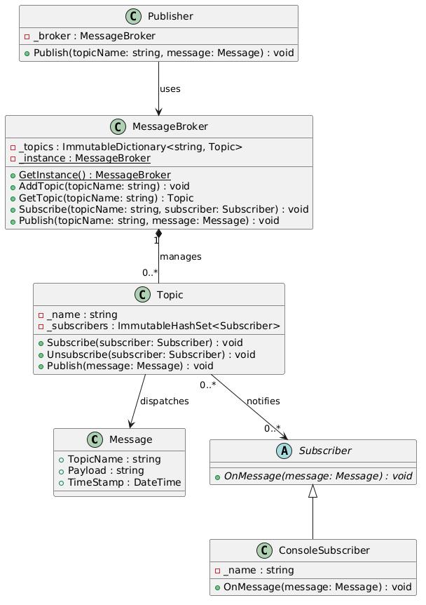
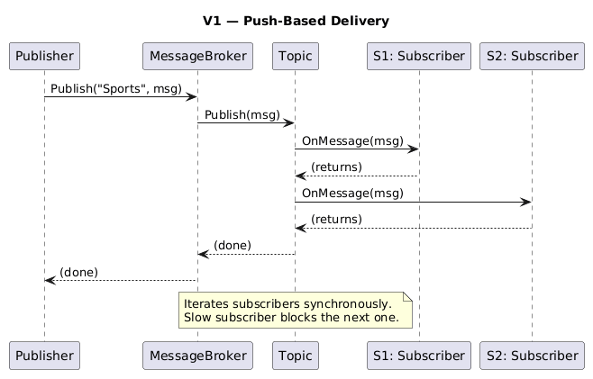
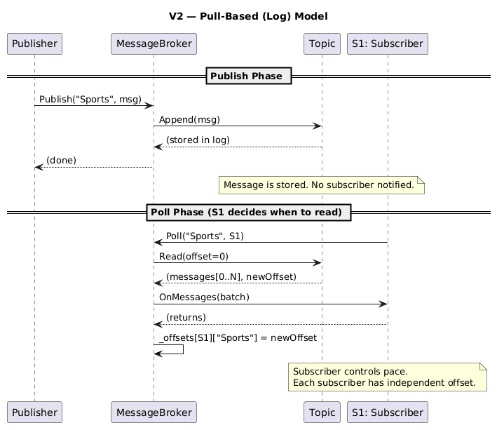
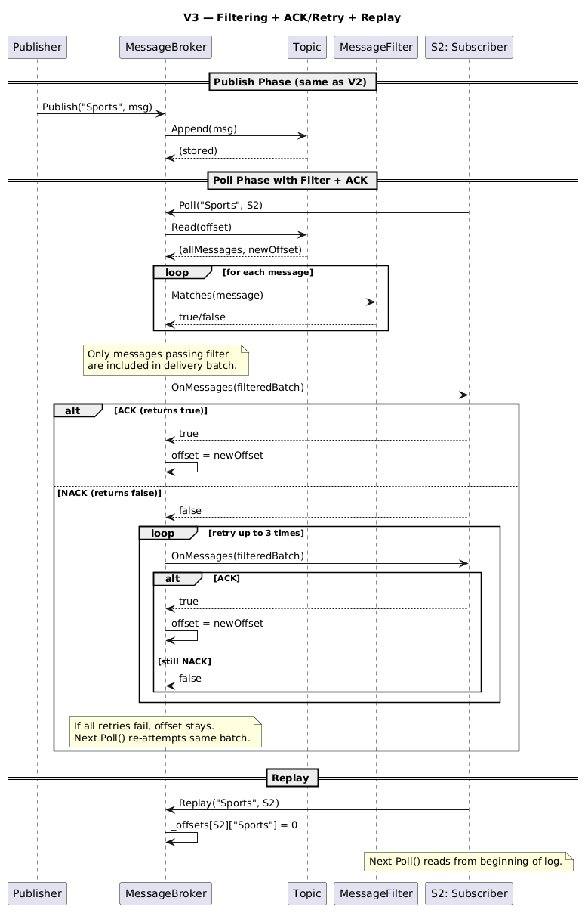

# Publish-Subscribe (Pub-Sub) System

## Table of Contents

- [Problem Statement](#problem-statement)
- [Functional Requirements](#functional-requirements)
- [Non-Functional Requirements](#non-functional-requirements)
- [Core Entities](#core-entities)
- [Relationships Between Entities](#relationships-between-entities)
- [Class Diagram](#class-diagram)
- [Idea of V1](#idea-of-v1)
- [V1 to V2](#v1-to-v2)
- [Full Code Explanation](#full-code-explanation)
- [V3 — Durable Subscriptions, Filtering, and ACK/Retry](#v3--durable-subscriptions-filtering-and-ackretry)

---

## Problem Statement

A Publish-Subscribe (Pub-Sub) system is a messaging pattern where publishers send messages to topics without knowing who will receive them, and subscribers receive messages by subscribing to those topics.

---

## Functional Requirements

- Support creation and management of multiple topics
- Allow multiple publishers to publish messages to a topic
- Allow multiple subscribers to subscribe to one or more topics
- Deliver messages to all active subscribers of a topic in the order they were published
- Isolate delivery failures: an error delivering to one subscriber must not stop delivery to the others
- Follow a "fire-and-forget" delivery model: no retries or acknowledgments

---

## Non-Functional Requirements

- **Modularity**: The system should follow object-oriented principles with clear separation of responsibilities
- **Scalability**: The system should efficiently support many concurrent publishers and subscribers
- **Extensibility**: The design should be flexible enough to support future enhancements such as message persistence, retries, or delivery guarantees
- **Reliability**: While exact delivery guarantees are not required, message ordering and dispatching must remain consistent and predictable within each topic

---

## Core Entities

| Entity | Responsibility |
|--------|---------------|
| **Message** | Carries the payload, topic name, and timestamp |
| **Topic** | Groups messages under a named channel |
| **Subscriber** | Receives/consumes messages from subscribed topics |
| **Publisher** | Produces messages and publishes them to a topic via the broker |
| **MessageBroker** | Central coordinator — manages topics, subscriptions, and message routing |

---

## Relationships Between Entities

```
Publisher ──publishes──► MessageBroker ──routes──► Topic ──delivers──► Subscriber
```

- A **Publisher** holds a reference to the **MessageBroker** and calls `Publish(topic, message)`.
- The **MessageBroker** owns all **Topics** (1-to-many). It manages subscriptions and dispatches messages.
- A **Topic** knows its registered **Subscribers** (many-to-many — a subscriber can subscribe to multiple topics, and a topic can have multiple subscribers).
- A **Subscriber** is an abstract contract — concrete implementations decide *how* to handle messages (console, file, HTTP, etc.).

---

## Class Diagram

### ASCII

```
┌─────────────┐         ┌──────────────────┐         ┌─────────────┐
│  Publisher   │────────►│  MessageBroker   │◄────────│  Subscriber │
│             │         │    (Singleton)    │         │  (abstract) │
│ - _broker   │         │                  │         │             │
│ + Publish() │         │ - _topics        │         │+ OnMessage()│
└─────────────┘         │ + AddTopic()     │         └──────▲──────┘
                        │ + GetTopic()     │                │
                        │ + Subscribe()    │                │
                        │ + Unsubscribe()  │      ┌─────────┴─────────┐
                        │ + Publish()      │      │ConsoleSubscriber   │
                        └────────┬─────────┘      │                   │
                                 │                │ - _name            │
                                 │ 1..*           │ + OnMessage()      │
                                 ▼                └───────────────────┘
                        ┌─────────────────┐
                        │     Topic       │
                        │                 │
                        │ - _name         │
                        │ - _subscribers  │
                        │ + Subscribe()   │
                        │ + Unsubscribe() │
                        │ + Publish()     │
                        └─────────────────┘
                                 │
                                 │ 1..*
                                 ▼
                        ┌─────────────────┐
                        │    Message      │
                        │                 │
                        │ + TopicName     │
                        │ + Payload       │
                        │ + TimeStamp     │
                        └─────────────────┘
```


---

## Idea of V1

V1 implements the classic **push-based** Pub-Sub model:

1. **Publisher** calls `Publish(topic, message)` on the broker.
2. **MessageBroker** looks up the `Topic` and calls `Topic.Publish(message)`.
3. **Topic** iterates over its `ImmutableHashSet<Subscriber>` and calls `subscriber.OnMessage(message)` for each one — delivering immediately.

### Key Design Decisions in V1

| Decision | Rationale |
|----------|-----------|
| `ImmutableHashSet` for subscribers | Snapshot semantics — safe iteration even if a subscriber is added/removed mid-delivery |
| `ImmutableInterlocked.Update` | Lock-free, thread-safe mutations on the subscriber set |
| `ImmutableDictionary` for topics | Thread-safe topic registration without explicit locking |
| Singleton `MessageBroker` | Single coordination point, avoids passing broker references everywhere |
| Abstract `Subscriber` class | Open for extension — any delivery mechanism can be plugged in |

### V1 Flow

```
Publisher.Publish("Sports", msg)
  └─► MessageBroker.Publish("Sports", msg)
        └─► Topic.Publish(msg)
              ├─► s1.OnMessage(msg)  // immediate push
              └─► s2.OnMessage(msg)  // immediate push
```

### V1 Sequence Diagram



### V1 Limitations

- **Tight coupling to delivery speed**: Slow subscribers block subsequent deliveries (synchronous iteration).
- **No replay**: Once a message is delivered, it's gone. Late subscribers miss past messages.
- **No backpressure**: Subscribers can't control the rate at which they consume.

---

## V1 to V2

V2 shifts from a **push model** to a **pull (log-based) model**, inspired by Apache Kafka's design.

### What Changed

| Aspect | V1 (Push) | V2 (Pull / Log-based) |
|--------|-----------|----------------------|
| Delivery trigger | `Publish()` pushes to subscribers immediately | `Publish()` appends to a log; subscriber calls `Poll()` |
| Message storage | None — fire and forget | Append-only `List<Message>` per topic |
| Subscriber pace | Forced by publisher | Self-controlled via offset |
| Replay capability | ❌ | ✅ (reset offset to 0) |
| Offset management | N/A | Broker tracks `subscriber → topic → offset` |
| Subscriber method | `OnMessage(Message)` | `OnMessages(IReadOnlyList<Message>)` — batch |

### Why the Shift

- **Decoupling**: Publishers and subscribers operate at completely independent speeds.
- **Replay**: Subscribers can re-read old messages by resetting their offset.
- **Batch processing**: Subscribers receive a batch of messages per poll, enabling more efficient processing.
- **Scalability**: Adding slow subscribers no longer degrades the system — they just poll less frequently.

### V2 Architecture

```
Publisher.Publish("Sports", msg)
  └─► MessageBroker.Publish("Sports", msg)
        └─► Topic.Append(msg)   // just appends to log

Subscriber calls Poll():
  broker.Poll("Sports", s1)
    └─► Topic.Read(offset=0)
          └─► returns messages[0..N], newOffset
    └─► s1.OnMessages(batch)
    └─► offset updated to newOffset
```

### V2 Sequence Diagram 



## Full Code Explanation

### V1 — Push-Based Model

#### `Message`

```csharp
public class Message
{
    public string TopicName { get; }
    public string Payload { get; }
    public DateTime TimeStamp { get; }
}
```

An immutable data carrier. Once created, the message cannot be modified — safe for concurrent access.

#### `Subscriber` (Abstract) & `ConsoleSubscriber`

```csharp
public abstract class Subscriber
{
    public abstract void OnMessage(Message message);
}

public class ConsoleSubscriber : Subscriber
{
    public override void OnMessage(Message message)
    {
        Console.WriteLine($"[{_name}] received : [{message.Payload}]");
    }
}
```

The abstract class defines the contract. `ConsoleSubscriber` is one concrete implementation that prints to stdout. You could create `FileSubscriber`, `HttpSubscriber`, etc. without touching existing code (Open/Closed Principle).

#### `Topic`

```csharp
public class Topic
{
    private ImmutableHashSet<Subscriber> _subscribers = ImmutableHashSet<Subscriber>.Empty;

    public void Subscribe(Subscriber subscriber)
    {
        ImmutableInterlocked.Update(ref _subscribers, (set) => set.Add(subscriber));
    }

    public void Publish(Message message)
    {
        foreach (var subscriber in _subscribers)
            subscriber.OnMessage(message);
    }
}
```

- `ImmutableHashSet` provides snapshot-safe iteration — if a subscriber is added/removed during `Publish()`, the current iteration sees the original set.
- `ImmutableInterlocked.Update` performs an atomic compare-and-swap on the set reference — no explicit `lock` needed for add/remove.

#### `MessageBroker` (Singleton)

```csharp
public sealed class MessageBroker
{
    private ImmutableDictionary<string, Topic> _topics = ImmutableDictionary<string, Topic>.Empty;
    private static MessageBroker? _instance = null;
    private static readonly object _lock = new object();

    public static MessageBroker GetInstance() { /* double-checked locking */ }

    public void AddTopic(string topicName)
    {
        ImmutableInterlocked.TryAdd(ref _topics, topicName, new Topic(topicName));
    }

    public void Publish(string topicName, Message message)
    {
        _topics[topicName].Publish(message);  // delegates to Topic
    }
}
```

Central coordination point. Uses `ImmutableDictionary` for lock-free topic lookups and `ImmutableInterlocked.TryAdd` for safe topic registration.

#### `Publisher`

```csharp
public class Publisher
{
    private readonly MessageBroker _broker;
    public void Publish(string topicName, Message message) => _broker.Publish(topicName, message);
}
```

A thin wrapper that decouples the publishing code from the broker's internals. Multiple publishers can exist concurrently.

---

### V2 — Pull-Based (Log) Model

#### `Message`

Same as V1, with an added `ToString()` override for cleaner console output.

#### `Topic` (Now a Log)

```csharp
public class Topic
{
    private readonly List<Message> _log = new();
    private readonly object _lock = new();

    public void Append(Message message)
    {
        lock (_lock) { _log.Add(message); }
    }

    public (IReadOnlyList<Message> messages, int newOffset) Read(int offset)
    {
        lock (_lock)
        {
            var slice = _log.Skip(offset).ToList();
            return (slice, offset + slice.Count);
        }
    }
}
```

- `Append()` is the only write operation — the topic is an append-only log.
- `Read(offset)` returns all messages from the given offset onward and the new offset position. The list index *is* the offset.
- A `lock` ensures consistency between concurrent appends and reads.

#### `Subscriber` (Batch Interface)

```csharp
public abstract class Subscriber
{
    public abstract void OnMessages(IReadOnlyList<Message> messages);  // batch
}
```

Changed from `OnMessage(Message)` to `OnMessages(IReadOnlyList<Message>)` — subscribers now process a batch of messages per poll.

#### `MessageBroker` (With Offset Tracking)

```csharp
public sealed class MessageBroker
{
    private ImmutableDictionary<string, Topic> _topics = ...;
    private readonly ConcurrentDictionary<Subscriber, ConcurrentDictionary<string, int>> _offsets = new();

    public void Subscribe(string topicName, Subscriber subscriber)
    {
        _offsets.GetOrAdd(subscriber, _ => {
            var dic = new ConcurrentDictionary<string, int>();
            dic.TryAdd(topicName, 0);  // start at offset 0
            return dic;
        });
    }

    public void Publish(string topicName, Message message)
    {
        GetTopic(topicName).Append(message);  // just append, no push
    }

    public void Poll(string topicName, Subscriber subscriber)
    {
        var topic = GetTopic(topicName);
        var offset = _offsets[subscriber][topicName];
        var (messages, newOffset) = topic.Read(offset);
        _offsets[subscriber][topicName] = newOffset;  // advance

        if (messages.Count > 0)
            subscriber.OnMessages(messages);
    }
}
```

- `_offsets` is a two-level `ConcurrentDictionary`: `subscriber → topic → current offset`.
- `Subscribe()` initializes the offset to 0.
- `Publish()` just appends to the topic log — no subscriber notification.
- `Poll()` reads from the subscriber's current offset, delivers the batch, then advances the offset.

##### How Offset Storage Works

The broker uses a nested dictionary structure to track each subscriber's reading position in every topic:

```
_offsets: ConcurrentDictionary<Subscriber, ConcurrentDictionary<string, int>>

_offsets = {
    S1 → { "Sports" → 3, "News" → 0 },
    S2 → { "Sports" → 4, "News" → 2 },
    S3 → { "News" → 2 }
}
```

**Level 1** — The outer `ConcurrentDictionary` is keyed by the `Subscriber` instance. Each subscriber gets its own entry when it first calls `Subscribe()`.

**Level 2** — The inner `ConcurrentDictionary<string, int>` maps topic names to the subscriber's current offset (i.e., "how far into the log have I read?"). The `int` value is a zero-based index into the topic's `List<Message>`.

**Lifecycle of an offset:**

1. `Subscribe("Sports", s1)` → creates entry `s1 → { "Sports": 0 }` — subscriber starts at the beginning of the log.
2. `Poll("Sports", s1)` → reads `Topic.Read(offset=0)`, which returns messages `[0..N]` and `newOffset = N`. The broker then sets `_offsets[s1]["Sports"] = N`.
3. Next `Poll("Sports", s1)` → reads from offset `N`, only getting messages published *after* the last poll.

**Why `ConcurrentDictionary`?** Multiple subscribers can poll concurrently, and publishers can append at the same time. `ConcurrentDictionary` provides thread-safe reads and writes without explicit locking at the broker level — the lock only lives inside `Topic` for log access.

**Visual example:**

```
Topic "Sports" log:  [0: "Match started"] [1: "Goal!"] [2: "Half time"] [3: "Full time"]
                                                                          ▲
S1 offset = 3  (has read 0,1,2 — next poll returns index 3 onward)  ─────┘
S2 offset = 1  (has read 0 — next poll returns indices 1,2,3)
```

Each subscriber moves through the log independently. They never interfere with each other, and the log is never deleted — enabling replay by simply resetting an offset to 0.

#### `Publisher`

Identical to V1 — still just delegates to `MessageBroker.Publish()`.

---

### V2 Example Output

```
--- S1 polls Sports (reads all 3) ---
[S1] received: [12:00:01] Sports: Match started
[S1] received: [12:00:01] Sports: Goal scored!
[S1] received: [12:00:01] Sports: Half time

--- S2 polls Sports (reads all 3) ---
[S2] received: [12:00:01] Sports: Match started
[S2] received: [12:00:01] Sports: Goal scored!
[S2] received: [12:00:01] Sports: Half time

--- S1 polls Sports again (reads only 'Full time') ---
[S1] received: [12:00:01] Sports: Full time

--- S2 polls Sports again (reads only 'Full time') ---
[S2] received: [12:00:01] Sports: Full time

--- S2 polls News (reads both) ---
[S2] received: [12:00:01] News: Breaking news
[S2] received: [12:00:01] News: Weather update

--- S3 polls News independently (reads both) ---
[S3] received: [12:00:01] News: Breaking news
[S3] received: [12:00:01] News: Weather update
```

Each subscriber reads independently, at their own pace, from their own offset position — demonstrating the decoupled, log-based consumption model.

---

## V3 — Durable Subscriptions, Filtering, and ACK/Retry

V3 builds on V2's pull-based log model and adds three features without introducing partitioning (that's V4). The offset storage stays identical to V2: `_offsets[subscriber][topicName] = int`.

### Idea of V3

V2 gave us decoupled consumption — subscribers pull at their own pace. But V2 has three gaps that V3 addresses:

1. **No replay**: Once a subscriber advances past a message, there's no way to go back. If you want to re-process historical messages (e.g., after a bug fix), you're stuck.
2. **No filtering**: Every subscriber gets every message from the topic. If a subscriber only cares about a subset (e.g., "goal" events in a Sports topic), it has to receive and discard the rest — wasteful.
3. **No delivery guarantees**: V2 is fire-and-forget. If `OnMessages()` throws or fails, the offset still advances and those messages are lost for that subscriber.

V3 solves these by keeping the same V2 architecture (append-only log, offset-based consumption) and layering three capabilities on top:

- **Durable offsets with Replay/Seek** — offsets persist and can be rewound to any position
- **Broker-side keyword filtering** — a `MessageFilter` on the subscriber decides which messages get delivered
- **ACK/NACK with retry** — `OnMessages()` returns a bool; offsets advance only on ACK

### Key Design Decisions in V3

| Decision | Rationale |
|----------|-----------|
| Reuse V2's `_offsets[subscriber][topicName] = int` | No partitioning yet, so the simple flat offset works; Replay/Seek are just assignments to this int |
| `MessageFilter` as a separate class | Keeps filtering logic out of the subscriber — subscriber only handles delivery, filter handles selection |
| Filter at poll time, not at publish time | The log stays universal (all messages stored); each subscriber applies their own filter independently |
| Offset advances past filtered messages | Prevents filtered messages from re-appearing on every poll |
| `bool` return from `OnMessages()` | Minimal contract change — true = ACK, false = NACK; no complex callback or event system |
| Retry loop in broker, not subscriber | Centralizes retry policy; subscribers don't need to implement their own retry logic |
| Offset advances only on ACK | Guarantees at-least-once delivery — failed batches are re-attempted on next `Poll()` |

### V3 Flow

```
Publisher.Publish("Sports", msg)
  └─► MessageBroker.Publish("Sports", msg)
        └─► Topic.Append(msg)   // same as V2 — just appends to log

Subscriber calls Poll():
  broker.Poll("Sports", s2)
    ├─► Topic.Read(offset)
    │     └─► returns all messages from offset onward
    ├─► Apply s2.Filter.Matches() on each message
    │     └─► keep only messages where Payload contains keyword
    ├─► s2.OnMessages(filteredBatch)
    │     ├─► returns true  → offset advances (ACK)
    │     └─► returns false → retry up to 3 times
    │           ├─► eventually ACKs → offset advances
    │           └─► all retries fail → offset stays (re-attempt next Poll)
    └─► done

Replay:
  broker.Replay("Sports", s1)
    └─► _offsets[s1]["Sports"] = 0   // next Poll() re-reads from start

Seek:
  broker.Seek("Sports", s1, offset: 2)
    └─► _offsets[s1]["Sports"] = 2   // next Poll() starts from index 2
```

### V3 Sequence Diagram


### V3 Limitations

- **No partitioning**: A single log per topic means all reads/writes serialize on one lock — throughput bottleneck under high concurrency (addressed in V4).
- **Synchronous retry**: Retries happen inside `Poll()` — a slow/failing subscriber blocks their own poll call. No async or background retry queue.
- **No dead-letter queue**: After max retries, the message is dropped for that subscriber. In a production system, you'd want to move failed messages to a DLQ for investigation.
- **In-memory only**: Offsets and logs live in memory. Process restart loses everything. A production system would persist offsets and logs to disk or a database.

---

### V2 to V3: What Changed

| Aspect | V2 | V3 |
|--------|----|----|
| Offset durability | Exists for the session | Same, but `Replay()` and `Seek()` allow rewinding |
| Filtering | None — subscriber gets everything | `MessageFilter` predicate applied at poll time |
| Delivery guarantee | Fire-and-forget | ACK/NACK with retry (at-least-once) |
| Subscriber contract | `void OnMessages(...)` | `bool OnMessages(...)` — return false to NACK |

---

### Feature 1: Durable Subscriptions & Message Replay

The offset lives in the same V2-style nested dictionary — it naturally persists across polls (the subscriber can "disconnect" and come back, their offset is still there):

```csharp
private readonly ConcurrentDictionary<Subscriber, ConcurrentDictionary<string, int>> _offsets = new();
```

Replay is just setting the offset back to 0:

```csharp
public void Replay(string topicName, Subscriber subscriber)
{
    if (_offsets.TryGetValue(subscriber, out var topicOffsets))
        topicOffsets[topicName] = 0;  // next Poll() re-reads from the start
}
```

Seek jumps to any arbitrary position:

```csharp
public void Seek(string topicName, Subscriber subscriber, int offset)
{
    if (_offsets.TryGetValue(subscriber, out var topicOffsets))
        topicOffsets[topicName] = offset;  // skip messages before this index
}
```

This works because the `Topic` log is append-only — messages are never deleted, so any offset from 0 to current length is always valid.

---

### Feature 2: Content Filtering

`MessageFilter` is a simple class with a single string field — no lambdas, just keyword matching:

```csharp
public class MessageFilter
{
    public string? KeywordFilter { get; init; }   // payload must contain this word

    public bool Matches(Message message)
    {
        if (KeywordFilter != null && !message.Payload.Contains(KeywordFilter, StringComparison.OrdinalIgnoreCase))
            return false;
        return true;
    }
}
```

Note: there's no `TopicPattern` field because `Poll()` already takes an explicit topic name — the subscriber already chooses which topic to read from. A topic pattern would only be useful if there was a `PollAll()` that merged messages from all subscribed topics into one stream.

The subscriber attaches a filter at subscription time:

```csharp
s2.Filter = new MessageFilter { KeywordFilter = "goal" };
```

#### Filtering Flow

Filtering happens inside `Poll()`, between reading from the log and delivering to the subscriber:

```
broker.Poll("Sports", s2)
│
├─ 1. Read ALL messages from topic log starting at s2's offset
│     → ["Match started", "First goal scored!", "Yellow card", "Second goal!"]
│
├─ 2. Run each message through s2.Filter.Matches(message)
│     → "Match started"        → Payload.Contains("goal") → false → SKIP
│     → "First goal scored!"   → Payload.Contains("goal") → true  → KEEP
│     → "Yellow card"          → Payload.Contains("goal") → false → SKIP
│     → "Second goal!"         → Payload.Contains("goal") → true  → KEEP
│
├─ 3. Deliver only the filtered list to subscriber
│     → s2.OnMessages(["First goal scored!", "Second goal!"])
│
└─ 4. Advance offset past ALL 4 messages (not just the 2 delivered)
       → s2's offset moves from 0 → 4
```

Why advance past skipped messages? If the offset only advanced past matched messages, the skipped ones would re-appear on every future poll and get re-evaluated forever. By advancing past everything, the subscriber moves forward cleanly — filtered messages are gone for good.

The code that does steps 2–4:

```csharp
var (messages, newOffset) = topic.Read(offset);          // step 1: read all

var filtered = subscriber.Filter != null                  // step 2: filter
    ? messages.Where(m => subscriber.Filter.Matches(m)).ToList()
    : messages.ToList();

if (filtered.Count == 0)
{
    topicOffsets[topicName] = newOffset;                  // still advance even if nothing matched
    return;
}

bool acked = subscriber.OnMessages(filtered);            // step 3: deliver filtered only

if (acked)
    topicOffsets[topicName] = newOffset;                  // step 4: advance on ACK
```

The filter is purely broker-side. The topic log doesn't know or care about filters — it stores everything. Each subscriber's filter decides what *they* see from that shared log.

---

### Feature 3: Delivery Acknowledgements & Retry

The subscriber contract now returns a `bool`:

```csharp
public abstract bool OnMessages(IReadOnlyList<Message> messages);
// true  = ACK (processed successfully)
// false = NACK (failed, please retry)
```

The broker wraps delivery in a retry loop:

```csharp
bool acked = false;
for (int attempt = 1; attempt <= MaxRetries; attempt++)  // MaxRetries = 3
{
    acked = subscriber.OnMessages(filtered);
    if (acked) break;
    Console.WriteLine($"  [{subscriber}] retry {attempt}/{MaxRetries} for '{topicName}'");
}

if (acked)
{
    topicOffsets[topicName] = newOffset;  // advance only on success
}
else
{
    Console.WriteLine($"  [{subscriber}] DROPPED after {MaxRetries} retries");
    // offset stays put — next Poll() will re-attempt the same batch
}
```

The critical guarantee: **offsets advance only on ACK**. If all retries fail, the offset doesn't move, so the next `Poll()` will try the same messages again. This gives you at-least-once delivery semantics without any external state.

---

### V3 Example Output

```
=== Publishing messages ===

=== S1 polls Sports (no filter) ===
  [S1] received: [07:40:19] Sports: Match started (id:75a5a0cf)
  [S1] received: [07:40:19] Sports: First goal scored! (id:5034dbd5)
  [S1] received: [07:40:19] Sports: Yellow card (id:07d5a248)
  [S1] received: [07:40:19] Sports: Second goal! (id:80a96d25)

=== S2 polls Sports (filter: 'goal' only) ===
  [S2] received: [07:40:19] Sports: First goal scored! (id:5034dbd5)
  [S2] received: [07:40:19] Sports: Second goal! (id:80a96d25)

=== S3-Flaky polls Sports (ACK/Retry) ===
  [S3-Flaky] FAILED to process (will retry)
  [S3-Flaky] retry 1/3 for 'Sports'
  [S3-Flaky] received: [07:40:19] Sports: Match started (id:75a5a0cf)
  [S3-Flaky] received: [07:40:19] Sports: First goal scored! (id:5034dbd5)
  [S3-Flaky] received: [07:40:19] Sports: Yellow card (id:07d5a248)
  [S3-Flaky] received: [07:40:19] Sports: Second goal! (id:80a96d25)

=== S1 replays Sports from beginning ===
  [S1] received: [07:40:19] Sports: Match started (id:75a5a0cf)
  [S1] received: [07:40:19] Sports: First goal scored! (id:5034dbd5)
  [S1] received: [07:40:19] Sports: Yellow card (id:07d5a248)
  [S1] received: [07:40:19] Sports: Second goal! (id:80a96d25)

=== S1 seeks to offset 2 (skips first two) ===
  [S1] received: [07:40:19] Sports: Yellow card (id:07d5a248)
  [S1] received: [07:40:19] Sports: Second goal! (id:80a96d25)

=== S1 polls News ===
  [S1] received: [07:40:19] News: Weather update (id:2edd8523)
```
