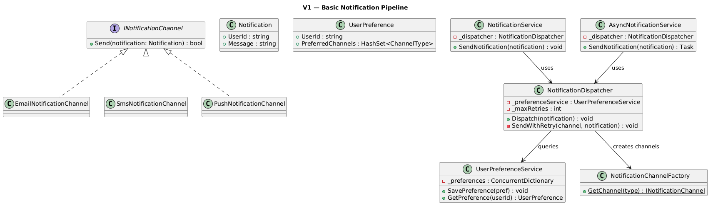
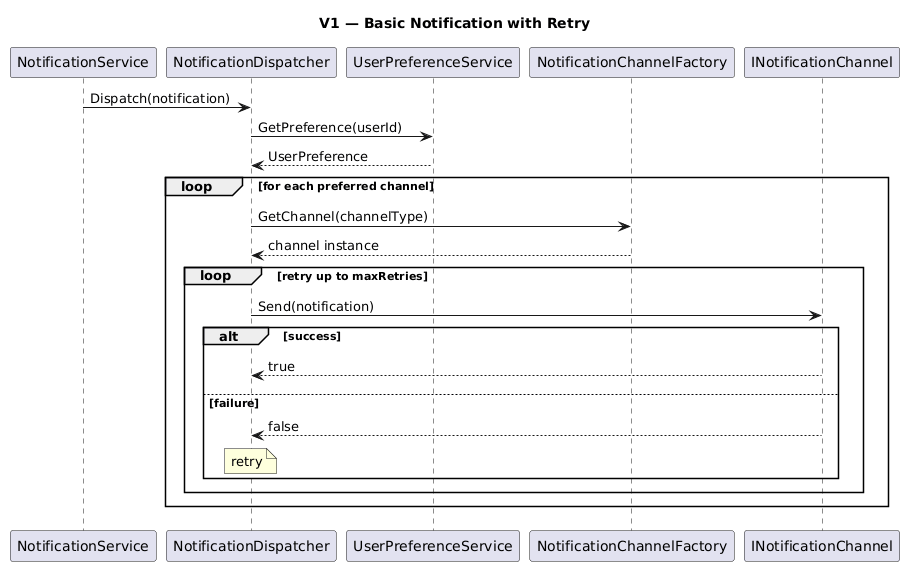
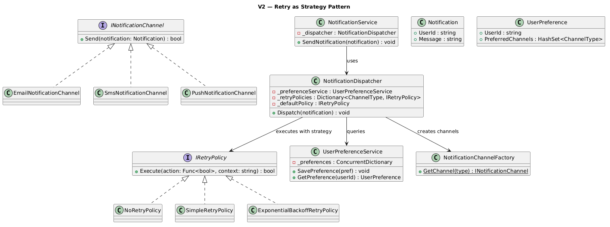
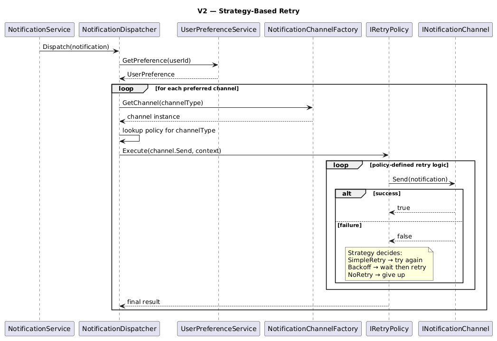
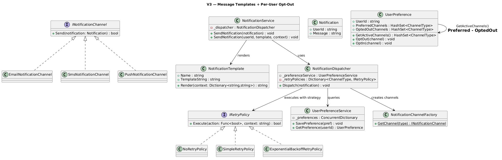
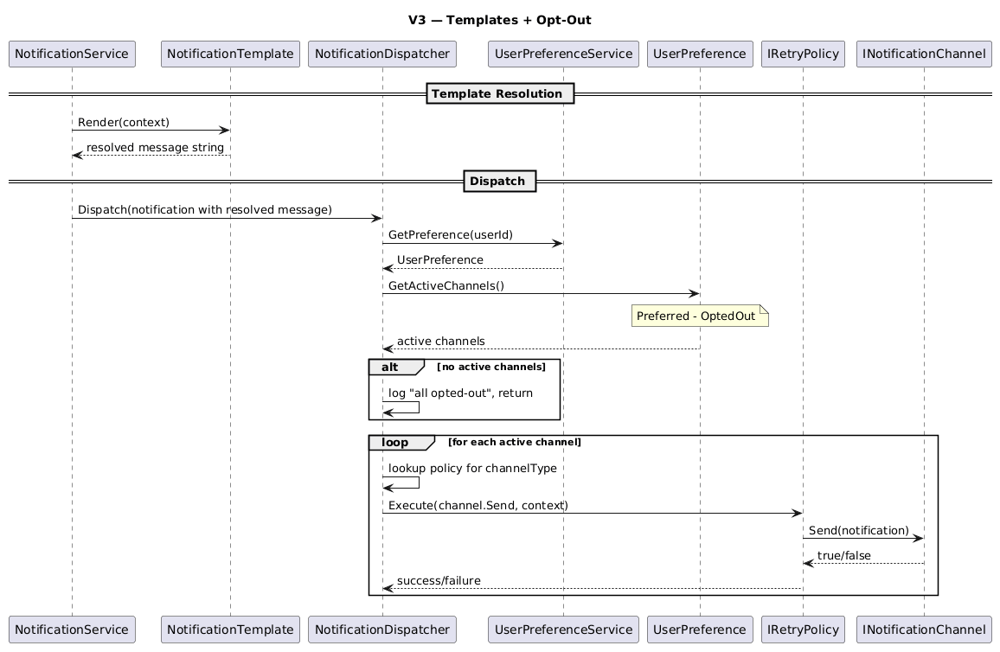

# Notification System

## Table of Contents

- [Problem Statement](#problem-statement)
- [Functional Requirements](#functional-requirements)
- [Non-Functional Requirements](#non-functional-requirements)
- [Core Entities](#core-entities)
- [Relationships Between Entities](#relationships-between-entities)
- [V1 — Basic Pipeline](#v1--basic-pipeline)
- [V1 to V2](#v1-to-v2)
- [V2 — Retry Strategy Pattern](#v2--retry-strategy-pattern)
- [V2 to V3](#v2-to-v3)
- [V3 — Templates and Opt-Out](#v3--templates-and-opt-out)

---

## Problem Statement

A Notification System is a critical component in modern applications used to inform users about events such as new messages, payment updates, reminders, and alerts. The system must deliver notifications across multiple channels while respecting user preferences and handling delivery failures gracefully.

---

## Functional Requirements

- The system should send notifications to users
- Support multiple notification channels:
  - Email
  - SMS
  - Push
- A user can have preferences:
  - Which channels they want
- There should be a retry mechanism

---

## Non-Functional Requirements

- **Extensible**: Add WhatsApp, Slack, etc. tomorrow without modifying existing code
- **Maintainable**: Clear separation of concerns, each class has one job
- **Asynchronous**: Channel dispatches should not block each other
- **Thread-safe**: Concurrent access to preferences and channels must be safe
- **Reliable**: Delivery failures are retried with configurable policies

---

## Core Entities

| Entity | Introduced In | Responsibility |
|--------|:---:|---------------|
| **Notification** | V1 | Carries the userId and message payload |
| **UserPreference** | V1 | Stores which channels a user wants |
| **INotificationChannel** | V1 | Interface for sending via a specific medium |
| **NotificationChannelFactory** | V1 | Creates channel instance from ChannelType enum |
| **UserPreferenceService** | V1 | Thread-safe storage/retrieval of user preferences |
| **NotificationDispatcher** | V1 | Coordinates: prefs → channels → send (with retry) |
| **NotificationService** | V1 | Public API — synchronous |
| **AsyncNotificationService** | V1 | Public API — async via Task.Run |
| **IRetryPolicy** | V2 | Strategy interface for retry logic |
| **NotificationTemplate** | V3 | Template with `{{placeholders}}`, renders with context |

---

## Relationships Between Entities

```
NotificationService
    └─► NotificationDispatcher
            ├─► UserPreferenceService → UserPreference (get channels)
            ├─► NotificationChannelFactory → INotificationChannel (create)
            └─► IRetryPolicy (execute send with retry strategy)       [V2+]

NotificationService
    └─► NotificationTemplate.Render(context) → resolved message       [V3+]
```

---

## V1 — Basic Pipeline

### Idea of V1

V1 implements the basic notification pipeline:

1. **Service** calls `NotificationDispatcher.Dispatch(notification)`
2. **Dispatcher** looks up user's preferred channels from `UserPreferenceService`
3. For each preferred channel, creates the channel via **Factory** and calls `Send()`
4. If `Send()` returns false, retries up to `maxRetries` times (hardcoded in dispatcher)

### V1 Class Diagram 


### V1 Code Snippets

#### Notification

```csharp
public class Notification
{
    public string UserId { get; }
    public string Message { get; }

    public Notification(string userId, string message)
    {
        UserId = userId;
        Message = message;
    }
}
```

#### UserPreference

```csharp
public class UserPreference
{
    public string UserId { get; }
    public HashSet<ChannelType> PreferredChannels { get; }

    public UserPreference(string userId, HashSet<ChannelType> preferredChannels)
    {
        UserId = userId;
        PreferredChannels = preferredChannels;
    }
}
```

#### INotificationChannel + Implementations

```csharp
public interface INotificationChannel
{
    bool Send(Notification notification);
}

public class EmailNotificationChannel : INotificationChannel
{
    public bool Send(Notification notification)
    {
        Console.WriteLine($"    Sending EMAIL to user {notification.UserId}: {notification.Message}");
        return true;
    }
}

public class SmsNotificationChannel : INotificationChannel
{
    public bool Send(Notification notification)
    {
        Console.WriteLine($"    Sending SMS to user {notification.UserId}: {notification.Message}");
        return true;
    }
}

public class PushNotificationChannel : INotificationChannel
{
    public bool Send(Notification notification)
    {
        Console.WriteLine($"    Sending PUSH to user {notification.UserId}: {notification.Message}");
        return true;
    }
}
```

#### NotificationChannelFactory

```csharp
public static class NotificationChannelFactory
{
    public static INotificationChannel GetChannel(ChannelType channelType)
    {
        return channelType switch
        {
            ChannelType.Email => new EmailNotificationChannel(),
            ChannelType.Sms => new SmsNotificationChannel(),
            ChannelType.Push => new PushNotificationChannel(),
            _ => throw new ArgumentException($"Unknown channel type: {channelType}")
        };
    }
}
```

#### UserPreferenceService

```csharp
public class UserPreferenceService
{
    private readonly ConcurrentDictionary<string, UserPreference> _preferences = new();

    public void SavePreference(UserPreference preference)
    {
        _preferences[preference.UserId] = preference;
    }

    public UserPreference GetPreference(string userId)
    {
        return _preferences.GetOrAdd(userId,
            _ => new UserPreference(userId, new HashSet<ChannelType> { ChannelType.Email }));
    }
}
```

#### NotificationDispatcher (V1 — hardcoded retry)

```csharp
public class NotificationDispatcher
{
    private readonly UserPreferenceService _preferenceService;
    private readonly int _maxRetries;

    public NotificationDispatcher(UserPreferenceService preferenceService, int maxRetries = 3)
    {
        _preferenceService = preferenceService;
        _maxRetries = maxRetries;
    }

    public void Dispatch(Notification notification)
    {
        UserPreference preference = _preferenceService.GetPreference(notification.UserId);

        foreach (ChannelType channelType in preference.PreferredChannels)
        {
            INotificationChannel channel = NotificationChannelFactory.GetChannel(channelType);
            SendWithRetry(channel, channelType, notification);
        }
    }

    private void SendWithRetry(INotificationChannel channel, ChannelType type, Notification notification)
    {
        for (int attempt = 1; attempt <= _maxRetries; attempt++)
        {
            bool success = channel.Send(notification);
            if (success) return;
            if (attempt < _maxRetries)
                Console.WriteLine($"    [{type}] Retrying... ({attempt}/{_maxRetries})");
        }
        Console.WriteLine($"    [{type}] FAILED after {_maxRetries} retries for {notification.UserId}");
    }
}
```

#### NotificationService + AsyncNotificationService

```csharp
public class NotificationService
{
    private readonly NotificationDispatcher _dispatcher;

    public NotificationService(NotificationDispatcher dispatcher)
    {
        _dispatcher = dispatcher;
    }

    public void SendNotification(Notification notification)
    {
        _dispatcher.Dispatch(notification);
    }
}

public class AsyncNotificationService
{
    private readonly NotificationDispatcher _dispatcher;

    public AsyncNotificationService(NotificationDispatcher dispatcher)
    {
        _dispatcher = dispatcher;
    }

    public Task SendNotification(Notification notification)
    {
        return Task.Run(() => _dispatcher.Dispatch(notification));
    }
}
```

#### Client Code (V1)

```csharp
public static async Task Main(string[] args)
{
    UserPreferenceService preferenceService = new UserPreferenceService();

    preferenceService.SavePreference(
        new UserPreference("user123", new HashSet<ChannelType> { ChannelType.Email, ChannelType.Sms }));

    NotificationDispatcher dispatcher = new NotificationDispatcher(preferenceService, maxRetries: 3);

    NotificationService service = new NotificationService(dispatcher);
    AsyncNotificationService asyncService = new AsyncNotificationService(dispatcher);

    Notification notification = new Notification("user123", "Your order has been shipped!");

    // Synchronous
    service.SendNotification(notification);

    // Asynchronous
    await asyncService.SendNotification(notification);
}
```

### V1 Sequence Diagram 


### V1 Limitations

- **Hardcoded retry logic**: Same retry count and behavior for all channels
- **No templates**: Messages are raw strings, no reusable patterns
- **No opt-out**: Users can only choose channels, can't temporarily disable one

---

## V1 to V2

V2 extracts retry logic into a **Strategy Pattern** — each channel type gets its own retry policy.

### What Changed

| Aspect | V1 | V2 |
|--------|----|----|
| Retry logic | Hardcoded `for` loop in dispatcher | `IRetryPolicy` strategy per channel |
| Retry behavior | Same for all channels | Email=Backoff, SMS=Simple, Push=NoRetry |
| Adding new retry | Edit dispatcher code | Add new `IRetryPolicy` implementation |
| Dispatcher responsibility | Knows *how* to retry | Only knows to call `policy.Execute()` |

### Why the Shift

- **Email servers** have transient failures — exponential backoff avoids hammering them
- **SMS gateways** are fast — simple retry is enough
- **Push notifications** are real-time — if it fails, a stale push is worse than no push
- The dispatcher shouldn't decide retry behavior — that's the policy's job

---

## V2 — Retry Strategy Pattern

### V2 Class Diagram


### V2 Code Snippets

Everything from V1 stays the same except the retry logic is extracted. New/changed classes only:

#### IRetryPolicy (New)

```csharp
public interface IRetryPolicy
{
    bool Execute(Func<bool> action, string context);
}
```

#### NoRetryPolicy (New)

```csharp
public class NoRetryPolicy : IRetryPolicy
{
    public bool Execute(Func<bool> action, string context)
    {
        bool success = action();
        if (!success)
            Console.WriteLine($"    [{context}] Failed. No retry configured.");
        return success;
    }
}
```

#### SimpleRetryPolicy (New)

```csharp
public class SimpleRetryPolicy : IRetryPolicy
{
    private readonly int _maxRetries;

    public SimpleRetryPolicy(int maxRetries = 3) => _maxRetries = maxRetries;

    public bool Execute(Func<bool> action, string context)
    {
        for (int attempt = 1; attempt <= _maxRetries; attempt++)
        {
            if (action()) return true;
            if (attempt < _maxRetries)
                Console.WriteLine($"    [{context}] Retrying... ({attempt}/{_maxRetries})");
        }
        Console.WriteLine($"    [{context}] FAILED after {_maxRetries} retries.");
        return false;
    }
}
```

#### ExponentialBackoffRetryPolicy (New)

```csharp
public class ExponentialBackoffRetryPolicy : IRetryPolicy
{
    private readonly int _maxRetries;
    private readonly int _baseDelayMs;

    public ExponentialBackoffRetryPolicy(int maxRetries = 3, int baseDelayMs = 50)
    {
        _maxRetries = maxRetries;
        _baseDelayMs = baseDelayMs;
    }

    public bool Execute(Func<bool> action, string context)
    {
        for (int attempt = 1; attempt <= _maxRetries; attempt++)
        {
            if (action()) return true;
            if (attempt < _maxRetries)
            {
                int delay = _baseDelayMs * (int)Math.Pow(2, attempt - 1);
                Console.WriteLine($"    [{context}] Backing off {delay}ms... ({attempt}/{_maxRetries})");
                Thread.Sleep(delay);
            }
        }
        Console.WriteLine($"    [{context}] FAILED after {_maxRetries} retries with backoff.");
        return false;
    }
}
```

#### NotificationDispatcher (Changed — uses strategy)

```csharp
public class NotificationDispatcher
{
    private readonly UserPreferenceService _preferenceService;
    private readonly Dictionary<ChannelType, IRetryPolicy> _retryPolicies;
    private readonly IRetryPolicy _defaultPolicy;

    public NotificationDispatcher(
        UserPreferenceService preferenceService,
        Dictionary<ChannelType, IRetryPolicy> retryPolicies)
    {
        _preferenceService = preferenceService;
        _retryPolicies = retryPolicies;
        _defaultPolicy = new SimpleRetryPolicy(3);
    }

    public void Dispatch(Notification notification)
    {
        UserPreference preference = _preferenceService.GetPreference(notification.UserId);

        foreach (ChannelType channelType in preference.PreferredChannels)
        {
            INotificationChannel channel = NotificationChannelFactory.GetChannel(channelType);

            // Get the retry policy for this channel type (or default)
            IRetryPolicy policy = _retryPolicies.ContainsKey(channelType)
                ? _retryPolicies[channelType]
                : _defaultPolicy;

            policy.Execute(() => channel.Send(notification), channelType.ToString());
        }
    }
}
```

#### Client Code (V2)

```csharp
public static void Main(string[] args)
{
    UserPreferenceService preferenceService = new UserPreferenceService();

    preferenceService.SavePreference(
        new UserPreference("user123",
            new HashSet<ChannelType> { ChannelType.Email, ChannelType.Sms, ChannelType.Push }));

    // Different retry policy per channel
    var retryPolicies = new Dictionary<ChannelType, IRetryPolicy>
    {
        { ChannelType.Email, new ExponentialBackoffRetryPolicy(maxRetries: 4, baseDelayMs: 50) },
        { ChannelType.Sms, new SimpleRetryPolicy(maxRetries: 3) },
        { ChannelType.Push, new NoRetryPolicy() }
    };

    var dispatcher = new NotificationDispatcher(preferenceService, retryPolicies);
    var service = new NotificationService(dispatcher);

    service.SendNotification(new Notification("user123", "Your order shipped!"));
}
```

### V2 Sequence Diagram


### V2 Limitations

- **No templates**: Messages are still raw strings
- **No opt-out**: Users can choose channels but can't temporarily disable one
- **No per-channel message customization**: Same message goes to all channels

---

## V2 to V3

V3 adds two features without changing the core dispatch/retry architecture:

### What Changed

| Aspect | V2 | V3 |
|--------|----|----|
| Messages | Raw strings | Templates with `{{placeholders}}` resolved at send time |
| User preferences | PreferredChannels only | PreferredChannels + OptedOutChannels |
| Channel selection | All preferred channels | `GetActiveChannels()` = Preferred − OptedOut |
| Opt-out/in | Not supported | `OptOut(channel)` / `OptIn(channel)` at runtime |

---

## V3 — Templates and Opt-Out

### V3 Class Diagram


### V3 Code Snippets

New/changed classes only (everything else from V2 carries over):

#### NotificationTemplate (New)

```csharp
public class NotificationTemplate
{
    public string Name { get; }
    public string TemplateString { get; }

    public NotificationTemplate(string name, string templateString)
    {
        Name = name;
        TemplateString = templateString;
    }

    // Replaces {{key}} placeholders with values from context
    public string Render(Dictionary<string, string> context)
    {
        string result = TemplateString;
        foreach (var (key, value) in context)
            result = result.Replace($"{{{{{key}}}}}", value);
        return result;
    }
}
```

#### UserPreference (Changed — added Opt-Out)

```csharp
public class UserPreference
{
    public string UserId { get; }
    public HashSet<ChannelType> PreferredChannels { get; }
    public HashSet<ChannelType> OptedOutChannels { get; }

    public UserPreference(string userId, HashSet<ChannelType> preferredChannels,
        HashSet<ChannelType>? optedOutChannels = null)
    {
        UserId = userId;
        PreferredChannels = preferredChannels;
        OptedOutChannels = optedOutChannels ?? new HashSet<ChannelType>();
    }

    // Returns channels that are preferred AND not opted-out
    public HashSet<ChannelType> GetActiveChannels()
    {
        var active = new HashSet<ChannelType>(PreferredChannels);
        active.ExceptWith(OptedOutChannels);
        return active;
    }

    public void OptOut(ChannelType channel) => OptedOutChannels.Add(channel);
    public void OptIn(ChannelType channel) => OptedOutChannels.Remove(channel);
}
```

#### NotificationDispatcher (Changed — uses GetActiveChannels)

```csharp
public class NotificationDispatcher
{
    private readonly UserPreferenceService _preferenceService;
    private readonly Dictionary<ChannelType, IRetryPolicy> _retryPolicies;
    private readonly IRetryPolicy _defaultPolicy;

    public NotificationDispatcher(
        UserPreferenceService preferenceService,
        Dictionary<ChannelType, IRetryPolicy> retryPolicies)
    {
        _preferenceService = preferenceService;
        _retryPolicies = retryPolicies;
        _defaultPolicy = new SimpleRetryPolicy(3);
    }

    public void Dispatch(Notification notification)
    {
        UserPreference preference = _preferenceService.GetPreference(notification.UserId);

        // V3: uses GetActiveChannels() instead of PreferredChannels directly
        HashSet<ChannelType> activeChannels = preference.GetActiveChannels();

        if (activeChannels.Count == 0)
        {
            Console.WriteLine($"    No active channels for {notification.UserId} (all opted-out)");
            return;
        }

        foreach (ChannelType channelType in activeChannels)
        {
            INotificationChannel channel = NotificationChannelFactory.GetChannel(channelType);
            IRetryPolicy policy = _retryPolicies.ContainsKey(channelType)
                ? _retryPolicies[channelType]
                : _defaultPolicy;

            policy.Execute(() => channel.Send(notification), channelType.ToString());
        }
    }
}
```

#### NotificationService (Changed — template overload)

```csharp
public class NotificationService
{
    private readonly NotificationDispatcher _dispatcher;

    public NotificationService(NotificationDispatcher dispatcher)
    {
        _dispatcher = dispatcher;
    }

    // Send with a raw message
    public void SendNotification(Notification notification)
    {
        _dispatcher.Dispatch(notification);
    }

    // Send with a template + context (resolves placeholders before dispatch)
    public void SendNotification(string userId, NotificationTemplate template, Dictionary<string, string> context)
    {
        string resolvedMessage = template.Render(context);
        _dispatcher.Dispatch(new Notification(userId, resolvedMessage));
    }
}
```

#### Client Code (V3)

```csharp
public static void Main(string[] args)
{
    UserPreferenceService preferenceService = new UserPreferenceService();

    // Bob prefers Email + SMS + Push, but opts out of SMS
    preferenceService.SavePreference(
        new UserPreference("user123",
            new HashSet<ChannelType> { ChannelType.Email, ChannelType.Sms, ChannelType.Push },
            optedOutChannels: new HashSet<ChannelType> { ChannelType.Sms }));

    var retryPolicies = new Dictionary<ChannelType, IRetryPolicy>
    {
        { ChannelType.Email, new ExponentialBackoffRetryPolicy(maxRetries: 3, baseDelayMs: 50) },
        { ChannelType.Sms, new SimpleRetryPolicy(maxRetries: 3) },
        { ChannelType.Push, new NoRetryPolicy() }
    };

    var dispatcher = new NotificationDispatcher(preferenceService, retryPolicies);
    var service = new NotificationService(dispatcher);

    // Define reusable templates
    var orderTemplate = new NotificationTemplate("order_shipped",
        "Hello {{name}}, your order #{{orderId}} has been shipped!");

    // Send using template
    service.SendNotification("user123", orderTemplate, new Dictionary<string, string>
    {
        { "name", "Bob" },
        { "orderId", "ORD-1234" }
    });
    // Output:
    //   [Email] Sent to user123: Hello Bob, your order #ORD-1234 has been shipped!
    //   [Push] Sent to user123: Hello Bob, your order #ORD-1234 has been shipped!
    //   (SMS skipped — user opted out)

    // Bob opts back into SMS
    preferenceService.GetPreference("user123").OptIn(ChannelType.Sms);

    var otpTemplate = new NotificationTemplate("otp",
        "Hi {{name}}, your OTP is {{otp}}. Valid for {{expiry}} minutes.");

    service.SendNotification("user123", otpTemplate, new Dictionary<string, string>
    {
        { "name", "Bob" },
        { "otp", "991122" },
        { "expiry", "3" }
    });
    // Output:
    //   [Email] Sent to user123: Hi Bob, your OTP is 991122. Valid for 3 minutes.
    //   [SMS] Sent to user123: Hi Bob, your OTP is 991122. Valid for 3 minutes.
    //   [Push] Sent to user123: Hi Bob, your OTP is 991122. Valid for 3 minutes.
}
```

### V3 Sequence Diagram


### V3 Limitations

- **No priority/urgency levels**: All notifications treated equally regardless of importance
- **No rate limiting**: A burst of notifications can overwhelm channels
- **No dead-letter queue**: Failed notifications are logged but not stored for later investigation
- **In-memory only**: Preferences and templates live in memory — no persistence
