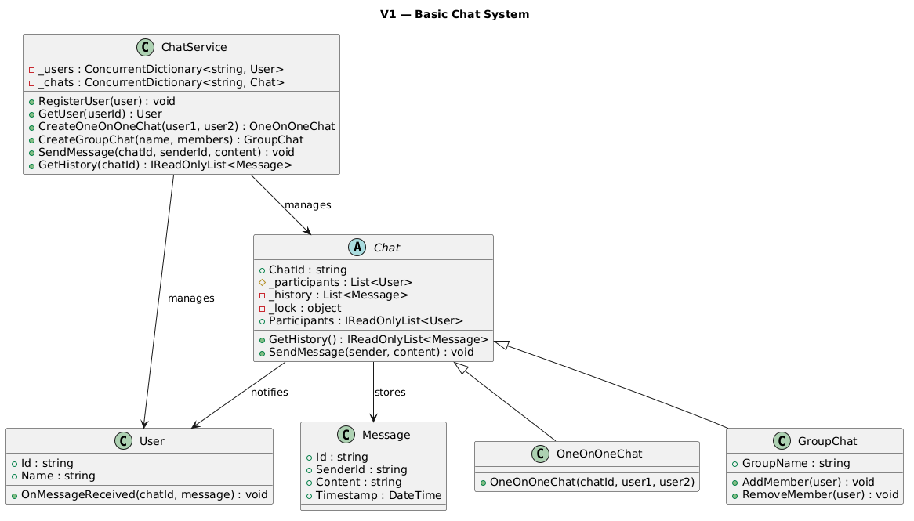
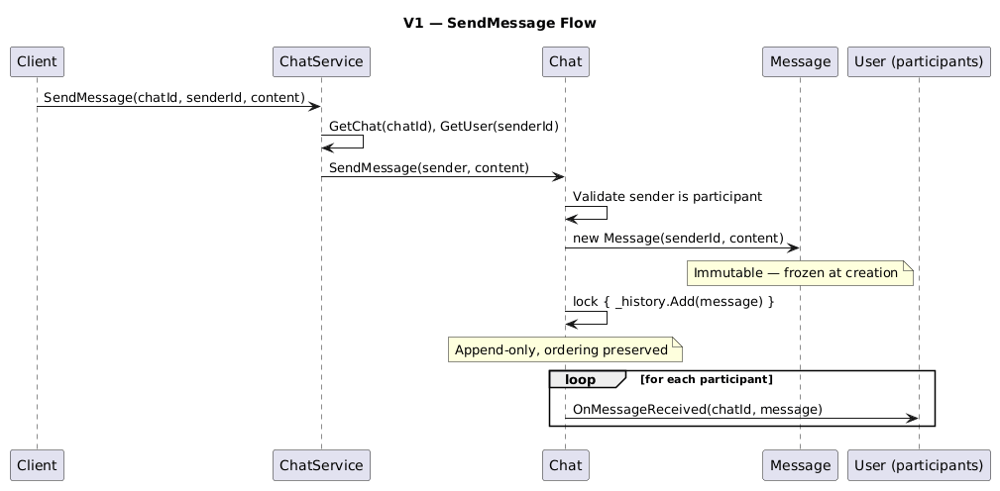
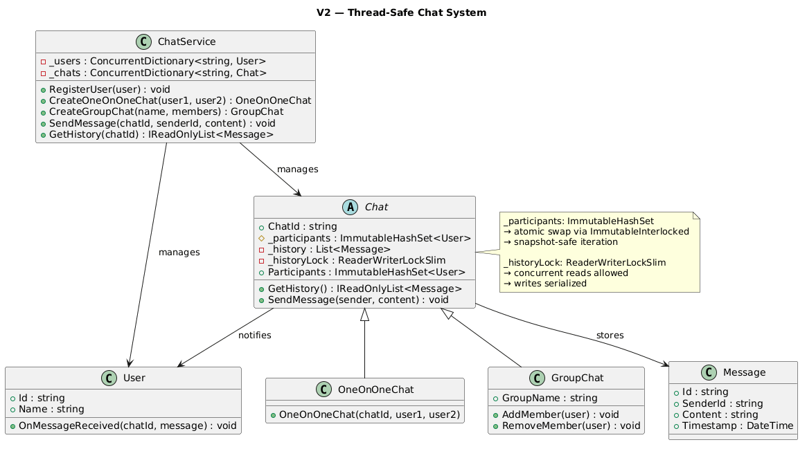
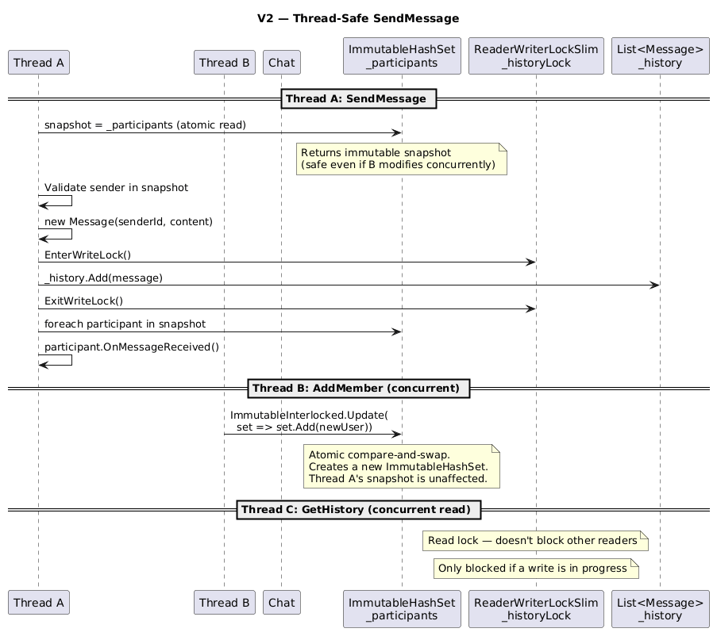

# Chat System

## Table of Contents

- [Problem Statement](#problem-statement)
- [Functional Requirements](#functional-requirements)
- [Non-Functional Requirements](#non-functional-requirements)
- [Core Entities](#core-entities)
- [Relationships Between Entities](#relationships-between-entities)
- [V1 — Basic Pipeline](#v1--basic-pipeline)
- [V1 to V2](#v1-to-v2)
- [V2 — Fully Thread-Safe](#v2--fully-thread-safe)

---

## Problem Statement

A chat application enables real-time communication between users through text-based messages. It is commonly used in personal messaging, customer support, collaboration tools, and social networking platforms.

---

## Functional Requirements

- Support one-on-one and group messaging
- Allow users to view their complete chat history
- Treat messages as immutable — once sent, cannot be edited or deleted
- Ensure message ordering is preserved — messages must be delivered in the order they were sent

---

## Non-Functional Requirements

- **Modularity**: Follow object-oriented design principles with well-defined components
- **Scalability**: Support many concurrent users and deliver messages in real time with minimal latency
- **Extensibility**: Flexible enough to support future features like file sharing, typing indicators, or message reactions
- **Maintainability**: Clean, testable, and easy to update or extend

---

## Core Entities

| Entity | Introduced In | Responsibility |
|--------|:---:|---------------|
| **Message** | V1 | Immutable data unit — carries SenderId, Content, Timestamp |
| **User** | V1 | Participant with a callback for real-time message delivery |
| **Chat** (abstract) | V1 | Base class — holds participants, history, and SendMessage logic |
| **OneOnOneChat** | V1 | DM between exactly 2 users, deterministic chatId |
| **GroupChat** | V1 | Multi-user chat with dynamic membership (add/remove) |
| **ChatService** | V1 | Central coordinator — manages users, chats, and message routing |

---

## Relationships Between Entities

```
ChatService
    ├─► User registry (ConcurrentDictionary<string, User>)
    └─► Chat registry (ConcurrentDictionary<string, Chat>)
            ├─► OneOnOneChat : Chat
            └─► GroupChat : Chat
                    ├─► participants (list of Users)
                    └─► history (append-only list of Messages)

Flow:
  chatService.SendMessage(chatId, senderId, content)
    └─► Chat.SendMessage(sender, content)
          ├─► new Message(senderId, content)      [immutable]
          ├─► history.Add(message)                 [append-only, under lock]
          └─► foreach participant → OnMessageReceived(chatId, message)
```

---

## V1 — Basic Pipeline

### Idea of V1

V1 implements the basic chat pipeline:

1. Users register with `ChatService`
2. A chat is created (DM or group) with initial participants
3. `SendMessage` creates an immutable `Message`, appends it to history, and delivers to all participants
4. History is append-only — messages cannot be edited or deleted
5. Ordering is preserved via a lock on the history list

### V1 Class Diagram


### V1 Code Snippets

#### Message (immutable)

```csharp
public class Message
{
    public string Id { get; }          // Unique identifier
    public string SenderId { get; }    // Who sent this
    public string Content { get; }     // Text content (cannot change)
    public DateTime Timestamp { get; } // When it was created

    public Message(string senderId, string content)
    {
        Id = Guid.NewGuid().ToString("N")[..8];
        SenderId = senderId;
        Content = content;
        Timestamp = DateTime.Now;
        // No setters — object is frozen after construction
    }
}
```

#### User

```csharp
public class User
{
    public string Id { get; }
    public string Name { get; }

    public User(string id, string name)
    {
        Id = id;
        Name = name;
    }

    // Real-time delivery callback. In production: push to WebSocket.
    public void OnMessageReceived(string chatId, Message message)
    {
        if (message.SenderId != Id) // Don't echo own messages
            Console.WriteLine($"    [{Name}] received: {message.Content}");
    }
}
```

#### Chat (abstract)

```csharp
public abstract class Chat
{
    public string ChatId { get; }
    protected readonly List<User> _participants = new();
    private readonly List<Message> _history = new();
    private readonly object _lock = new();

    public IReadOnlyList<Message> GetHistory()
    {
        lock (_lock)
        {
            return _history.ToList().AsReadOnly();
        }
    }

    public void SendMessage(User sender, string content)
    {
        // Validate sender is a participant
        if (!_participants.Contains(sender))
            throw new InvalidOperationException($"{sender.Name} is not in chat {ChatId}");

        var message = new Message(sender.Id, content);

        // Append under lock to preserve ordering
        lock (_lock)
        {
            _history.Add(message);
        }

        // Deliver to all participants
        foreach (var participant in _participants)
        {
            participant.OnMessageReceived(ChatId, message);
        }
    }
}
```

#### OneOnOneChat

```csharp
public class OneOnOneChat : Chat
{
    public OneOnOneChat(string chatId, User user1, User user2) : base(chatId)
    {
        _participants.Add(user1);
        _participants.Add(user2);
        // Fixed at 2 participants, no add/remove
    }
}
```

#### GroupChat

```csharp
public class GroupChat : Chat
{
    public string GroupName { get; }

    public GroupChat(string chatId, string groupName, IEnumerable<User> members) : base(chatId)
    {
        GroupName = groupName;
        _participants.AddRange(members);
    }

    public void AddMember(User user)
    {
        if (!_participants.Contains(user))
            _participants.Add(user);
    }

    public void RemoveMember(User user)
    {
        _participants.Remove(user);
    }
}
```

#### ChatService

```csharp
public class ChatService
{
    private readonly ConcurrentDictionary<string, User> _users = new();
    private readonly ConcurrentDictionary<string, Chat> _chats = new();

    public void RegisterUser(User user) => _users.TryAdd(user.Id, user);

    // Deterministic chatId for DMs: sorted IDs ensure one chat per pair
    public OneOnOneChat CreateOneOnOneChat(User user1, User user2)
    {
        var ids = new[] { user1.Id, user2.Id }.OrderBy(x => x).ToArray();
        string chatId = $"dm:{ids[0]}:{ids[1]}";

        if (_chats.TryGetValue(chatId, out var existing))
            return (OneOnOneChat)existing;

        var chat = new OneOnOneChat(chatId, user1, user2);
        _chats.TryAdd(chatId, chat);
        return chat;
    }

    public GroupChat CreateGroupChat(string groupName, IEnumerable<User> members)
    {
        string chatId = $"group:{Guid.NewGuid().ToString("N")[..6]}";
        var chat = new GroupChat(chatId, groupName, members);
        _chats.TryAdd(chatId, chat);
        return chat;
    }

    // Main entry point for sending messages
    public void SendMessage(string chatId, string senderId, string content)
    {
        var chat = GetChat(chatId);
        var sender = GetUser(senderId);
        chat.SendMessage(sender, content);
    }

    public IReadOnlyList<Message> GetHistory(string chatId) => GetChat(chatId).GetHistory();
}
```

#### Client Code (V1)

```csharp
public static void Main(string[] args)
{
    var chatService = new ChatService();

    var alice = new User("alice", "Alice");
    var bob = new User("bob", "Bob");
    var charlie = new User("charlie", "Charlie");

    chatService.RegisterUser(alice);
    chatService.RegisterUser(bob);
    chatService.RegisterUser(charlie);

    // One-on-One
    var dm = chatService.CreateOneOnOneChat(alice, bob);
    chatService.SendMessage(dm.ChatId, "alice", "Hey Bob!");
    chatService.SendMessage(dm.ChatId, "bob", "Hey Alice!");

    // Group Chat
    var group = chatService.CreateGroupChat("Project Team", new[] { alice, bob });
    chatService.SendMessage(group.ChatId, "alice", "Welcome!");

    // Add member dynamically
    ((GroupChat)chatService.GetChat(group.ChatId)).AddMember(charlie);
    chatService.SendMessage(group.ChatId, "charlie", "Hi everyone!");

    // View history
    var history = chatService.GetHistory(group.ChatId);
    foreach (var msg in history)
        Console.WriteLine(msg);
}
```

### V1 Sequence Diagram


### Key Design Decisions in V1

| Decision | Rationale |
|----------|-----------|
| Immutable `Message` | Thread-safe, satisfies "no edit/delete" requirement |
| Append-only `_history` | Preserves ordering, no accidental deletion |
| `lock` on history append | Serializes concurrent sends to maintain order |
| Abstract `Chat` class | Open for extension — DM, group, future channel types |
| Deterministic DM chatId | Sorted user IDs ensure one DM per pair (idempotent creation) |
| `OnMessageReceived` callback | Push-based real-time delivery (simulates WebSocket) |
| `ConcurrentDictionary` in service | Thread-safe user/chat registration |

### V1 Limitations

- **`_participants` is not thread-safe**: `List<User>` races with concurrent `AddMember` + `SendMessage` iteration
- **Iteration outside lock**: `foreach` over participants can crash if `AddMember`/`RemoveMember` happens concurrently
- **`Contains` check unsynchronized**: Races with membership changes
- **`lock` blocks readers**: `GetHistory` and `SendMessage` cannot proceed concurrently

---

## V1 to V2

V2 makes the system fully thread-safe by replacing unsafe collections with lock-free immutable data structures.

### What Changed

| Aspect | V1 (partially safe) | V2 (fully safe) |
|--------|---------------------|-----------------|
| `_participants` | `List<User>` — races with iteration | `ImmutableHashSet<User>` + `ImmutableInterlocked` |
| Membership changes | Unsynchronized `Add`/`Remove` | Atomic compare-and-swap (lock-free) |
| Iteration during add/remove | `InvalidOperationException` crash | Safe — snapshot semantics |
| Contains check | Unsynchronized read | Reads from immutable snapshot |
| History write | `lock` (blocks readers too) | `ReaderWriterLockSlim` (write lock) |
| History read | `lock` (blocks other readers) | `ReaderWriterLockSlim` (read lock — concurrent reads OK) |

### Why the Shift

- **`List<User>` is not thread-safe** — modifying during iteration throws `InvalidOperationException`
- **`ImmutableHashSet`** gives snapshot semantics for free — any read gets a consistent view, writes create a new set atomically
- **`ReaderWriterLockSlim`** distinguishes read vs write — multiple threads can read history simultaneously, only writes are serialized
- **Lock-free membership** means adding/removing members never blocks message delivery

---

## V2 — Fully Thread-Safe

### V2 Class Diagram


### V2 Code Snippets

Only showing new/changed classes (Message, User, ChatService unchanged from V1):

#### Chat (abstract — thread-safe)

```csharp
public abstract class Chat
{
    public string ChatId { get; }

    // V2: ImmutableHashSet with atomic swap.
    // Any read gets a consistent snapshot — no iteration crash.
    protected ImmutableHashSet<User> _participants = ImmutableHashSet<User>.Empty;

    // ReaderWriterLockSlim: concurrent reads, serialized writes
    private readonly List<Message> _history = new();
    private readonly ReaderWriterLockSlim _historyLock = new();

    protected Chat(string chatId) { ChatId = chatId; }

    public ImmutableHashSet<User> Participants => _participants;

    // Read lock — multiple threads can call this concurrently
    public IReadOnlyList<Message> GetHistory()
    {
        _historyLock.EnterReadLock();
        try
        {
            return _history.ToList().AsReadOnly();
        }
        finally
        {
            _historyLock.ExitReadLock();
        }
    }

    public void SendMessage(User sender, string content)
    {
        // 1. Capture snapshot of participants (immutable — always safe)
        var currentParticipants = _participants;

        // 2. Validate from snapshot (no lock needed)
        if (!currentParticipants.Contains(sender))
            throw new InvalidOperationException($"{sender.Name} not in chat {ChatId}");

        // 3. Create immutable message
        var message = new Message(sender.Id, content);

        // 4. Append under write lock (serializes concurrent sends)
        _historyLock.EnterWriteLock();
        try
        {
            _history.Add(message);
        }
        finally
        {
            _historyLock.ExitWriteLock();
        }

        // 5. Deliver to snapshot participants
        //    Safe: iterating an immutable set, no concurrent modification possible
        foreach (var participant in currentParticipants)
        {
            participant.OnMessageReceived(ChatId, message);
        }
    }
}
```

#### OneOnOneChat

```csharp
public class OneOnOneChat : Chat
{
    public OneOnOneChat(string chatId, User user1, User user2) : base(chatId)
    {
        // Atomic swap: builds the set with both users
        ImmutableInterlocked.Update(ref _participants, set => set.Add(user1).Add(user2));
    }
}
```

#### GroupChat (thread-safe add/remove)

```csharp
public class GroupChat : Chat
{
    public string GroupName { get; }

    public GroupChat(string chatId, string groupName, IEnumerable<User> members) : base(chatId)
    {
        GroupName = groupName;
        ImmutableInterlocked.Update(ref _participants, set => set.Union(members));
    }

    // Atomic compare-and-swap — two threads calling AddMember simultaneously both succeed
    public void AddMember(User user)
    {
        var added = ImmutableInterlocked.Update(ref _participants, set => set.Add(user));
        if (added)
            Console.WriteLine($"    [{user.Name}] joined group '{GroupName}'");
    }

    // Atomic compare-and-swap — safe even during concurrent SendMessage iteration
    public void RemoveMember(User user)
    {
        ImmutableInterlocked.Update(ref _participants, set => set.Remove(user));
        Console.WriteLine($"    [{user.Name}] left group '{GroupName}'");
    }
}
```

#### Client Code (V2 — concurrent demo)

```csharp
public static void Main(string[] args)
{
    var chatService = new ChatService();

    var alice = new User("alice", "Alice");
    var bob = new User("bob", "Bob");
    var charlie = new User("charlie", "Charlie");

    chatService.RegisterUser(alice);
    chatService.RegisterUser(bob);
    chatService.RegisterUser(charlie);

    var group = chatService.CreateGroupChat("Team", new[] { alice, bob, charlie });

    // 10 concurrent sends from multiple threads
    var tasks = new List<Task>();
    for (int i = 0; i < 10; i++)
    {
        int msgNum = i;
        string sender = msgNum % 3 == 0 ? "alice" : msgNum % 3 == 1 ? "bob" : "charlie";
        tasks.Add(Task.Run(() =>
            chatService.SendMessage(group.ChatId, sender, $"Concurrent msg #{msgNum}")
        ));
    }
    Task.WaitAll(tasks.ToArray());

    // Verify all 10 messages preserved, ordered by timestamp
    var history = chatService.GetHistory(group.ChatId);
    Console.WriteLine($"Total: {history.Count} messages, ordering preserved: " +
        (history.Zip(history.Skip(1)).All(p => p.First.Timestamp <= p.Second.Timestamp)));

    // Concurrent AddMember + SendMessage — no crash
    var dave = new User("dave", "Dave");
    chatService.RegisterUser(dave);

    Task.WaitAll(
        Task.Run(() => ((GroupChat)chatService.GetChat(group.ChatId)).AddMember(dave)),
        Task.Run(() => chatService.SendMessage(group.ChatId, "alice", "During add"))
    );
    // No crash — thread-safe!
}
```

### V2 Sequence Diagram



### Key Design Decisions in V2

| Decision | Rationale |
|----------|-----------|
| `ImmutableHashSet<User>` for participants | Snapshot semantics — iteration is always safe, no `Collection was modified` |
| `ImmutableInterlocked.Update` | Lock-free atomic swap — AddMember/RemoveMember never block SendMessage |
| `ReaderWriterLockSlim` for history | Distinguishes read vs write — concurrent `GetHistory` calls don't block each other |
| Snapshot before iteration | SendMessage captures participants *before* delivering — consistent "who was here when sent" |
| Write lock only for append | Minimal lock scope — only the `_history.Add` is serialized, not the delivery loop |

### Thread-Safety Proof

```
Scenario: Thread A sends a message while Thread B adds a member

Timeline:
  T1: Thread A reads snapshot = _participants (contains [alice, bob])
  T2: Thread B calls AddMember(charlie) → new ImmutableHashSet [alice, bob, charlie]
  T3: Thread A appends message to history (write lock)
  T4: Thread A iterates snapshot [alice, bob] — delivers to alice and bob
  T5: Charlie does NOT get this message (wasn't in snapshot)
  T6: Next SendMessage will include charlie (new snapshot includes them)

Result: No crash, consistent delivery, no lost messages.
```

### V2 Limitations

- **No message persistence**: Everything in memory — process restart loses all data
- **Synchronous delivery**: `OnMessageReceived` is called in the sender's thread — a slow receiver blocks delivery to others
- **No read receipts or typing indicators**: Push-only, no feedback channel
- **No message search**: History is a flat list — no indexing for lookups
