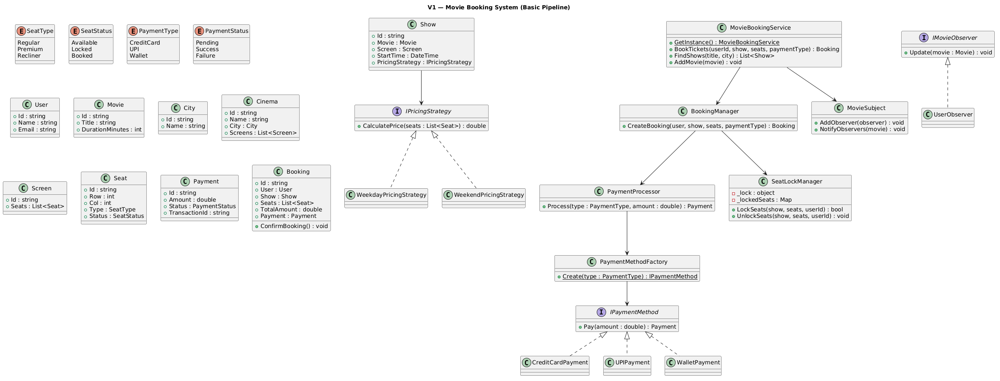
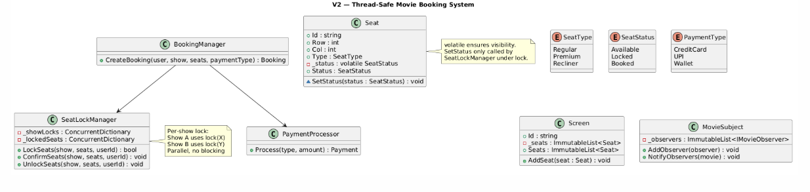
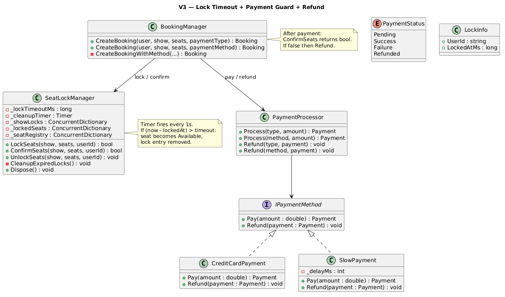

# Movie Ticket Booking System

## Table of Contents

- [Problem Statement](#problem-statement)
- [Functional Requirements](#functional-requirements)
- [Non-Functional Requirements](#non-functional-requirements)
- [Core Entities](#core-entities)
- [Relationships Between Entities](#relationships-between-entities)
- [V1 — Basic Pipeline](#v1--basic-pipeline)
- [V1 to V2](#v1-to-v2)
- [V2 — Fully Thread-Safe](#v2--fully-thread-safe)
- [V2 to V3](#v2-to-v3)
- [V3 — Lock Timeout and Payment Guard](#v3--lock-timeout-and-payment-guard)
- [Payment Design](#payment-design)

---

## Problem Statement

A Movie Ticket Booking System is a software application that enables users to search for movies, view showtimes, select seats, and book tickets at cinemas or multiplexes.

---

## Functional Requirements

- Users can search for shows based on a movie title and a city
- The system should support multiple cities, cinemas, screens, and shows
- Each screen has a defined layout of seats with different types (Regular, Premium, Recliner)
- A user can book one or more available seats for a specific show
- Double booking should be prevented
- The ticket price should be calculated dynamically based on configurable rules
- The system must be flexible to support different payment methods

---

## Non-Functional Requirements

- **Concurrency**: Handle concurrent booking requests, preventing double-booking
- **Extensibility**: Easy to add new pricing strategies or payment methods
- **Modularity**: Clear separation of concerns, OO principles
- **Simplified Interface**: Simple API hiding booking/locking/payment complexity

---

## Core Entities

| Entity | Introduced In | Responsibility |
|--------|:---:|---------------|
| **User** | V1 | Customer — id, name, email |
| **Movie** | V1 | Movie metadata — title, duration |
| **City** | V1 | Groups cinemas geographically |
| **Cinema** | V1 | Venue with multiple screens |
| **Screen** | V1 | Auditorium with seat layout |
| **Seat** | V1 | Individual seat — type, row, col, status |
| **Show** | V1 | Binds movie + screen + time + pricing |
| **Payment** | V1 | Transaction record |
| **Booking** | V1 | Confirmed reservation |
| **IPricingStrategy** | V1 | Strategy for price calculation |
| **PaymentType** | V1 | Enum: CreditCard, UPI, Wallet |
| **IPaymentMethod** | V1 | Interface with `Pay(amount)` |
| **PaymentMethodFactory** | V1 | Maps PaymentType → IPaymentMethod |
| **PaymentProcessor** | V1 | Orchestrator: type → factory → pay |
| **SeatLockManager** | V1 | Prevents double-booking via temp locks |
| **BookingManager** | V1 | Orchestrates: lock → price → pay → confirm |
| **MovieSubject/IMovieObserver** | V1 | Observer for new movie notifications |
| **MovieBookingService** | V1 | Singleton Facade |

---

## Relationships Between Entities

```
MovieBookingService (Singleton Facade)
    ├─► Users, Movies, Cities, Cinemas, Shows (ConcurrentDictionary registries)
    ├─► BookingManager
    │       ├─► SeatLockManager (lock/verify/confirm/unlock seats)
    │       └─► PaymentProcessor
    │               └─► PaymentMethodFactory → IPaymentMethod.Pay()
    ├─► MovieSubject (observer notifications)
    └─► IPricingStrategy (attached to each Show)

Domain Hierarchy:
    City → Cinema → Screen → Seat
    Movie + Screen + Time + PricingStrategy → Show
    User + Show + Seats + Payment → Booking
```

---

## V1 — Basic Pipeline

### Idea of V1

V1 implements the complete booking pipeline: search → lock → price → pay → confirm. Uses a single global lock in SeatLockManager for simplicity.

### V1 Class Diagram


### V1 SeatLockManager

```csharp
public class SeatLockManager
{
    private readonly ConcurrentDictionary<Show, ConcurrentDictionary<Seat, string>> _lockedSeats = new();
    private readonly object _lock = new(); // One global lock for all shows

    // All-or-nothing: either ALL seats lock or NONE do.
    public bool LockSeats(Show show, List<Seat> seats, string userId)
    {
        lock (_lock)
        {
            var showLocks = _lockedSeats.GetOrAdd(show, _ => new ConcurrentDictionary<Seat, string>());

            // First pass: validate ALL seats are available
            foreach (var seat in seats)
            {
                if (seat.Status != SeatStatus.Available) return false;
                if (showLocks.ContainsKey(seat)) return false;
            }

            // Second pass: lock all atomically
            foreach (var seat in seats)
            {
                seat.Status = SeatStatus.Locked;
                showLocks.TryAdd(seat, userId);
            }
            return true;
        }
    }

    public void UnlockSeats(Show show, List<Seat> seats, string userId)
    {
        lock (_lock)
        {
            if (!_lockedSeats.TryGetValue(show, out var showLocks)) return;
            foreach (var seat in seats)
            {
                if (showLocks.TryGetValue(seat, out var lockedBy) && lockedBy == userId)
                {
                    seat.Status = SeatStatus.Available;
                    showLocks.TryRemove(seat, out _);
                }
            }
        }
    }
}
```

### V1 BookingManager

```csharp
public class BookingManager
{
    private readonly SeatLockManager _seatLockManager;

    public Booking? CreateBooking(User user, Show show, List<Seat> seats, PaymentType paymentType)
    {
        // 1. Lock seats
        bool locked = _seatLockManager.LockSeats(show, seats, user.Id);
        if (!locked) return null;

        // 2. Calculate price
        double totalAmount = show.PricingStrategy.CalculatePrice(seats);

        // 3. Process payment via PaymentProcessor
        var processor = new PaymentProcessor();
        Payment payment = processor.Process(paymentType, totalAmount);

        if (payment.Status != PaymentStatus.Success)
        {
            _seatLockManager.UnlockSeats(show, seats, user.Id);
            return null;
        }

        // 4. Confirm seats (Locked → Booked)
        booking.ConfirmBooking();
        return booking;
    }
}
```

### V1 Booking + Seat Locking Flow (Example)

```
Setup:
  Show: "Interstellar 6PM"
  Screen seats: s1(Available), s2(Available), s3(Available), s4(Available)
  Alice wants: s1, s2
  Bob wants: s1, s2 (same seats!)

Timeline (single-threaded in V1, global lock):

  Alice calls BookTickets("u1", show, [s1, s2], PaymentType.CreditCard)
  │
  ├─ SeatLockManager.LockSeats(show, [s1, s2], "u1")
  │   lock(_lock) acquired
  │   Check s1.Status == Available ✓
  │   Check s2.Status == Available ✓
  │   s1.Status = Locked, map["s1"] = "u1"
  │   s2.Status = Locked, map["s2"] = "u1"
  │   return true
  │   lock released
  │
  ├─ CalculatePrice([s1, s2]) → ₹400 (2 × Regular ₹200)
  │
  ├─ PaymentProcessor.Process(CreditCard, ₹400)
  │   → Factory creates CreditCardPayment
  │   → CreditCardPayment.Pay(₹400) → Payment(Success)
  │
  ├─ booking.ConfirmBooking()
  │   s1.Status = Booked
  │   s2.Status = Booked
  │
  └─ return Booking ✅

  Bob calls BookTickets("u2", show, [s1, s2], PaymentType.UPI)
  │
  ├─ SeatLockManager.LockSeats(show, [s1, s2], "u2")
  │   lock(_lock) acquired
  │   Check s1.Status == Booked ✗  ← FAIL!
  │   return false
  │   lock released
  │
  └─ return null ❌ (double-booking prevented)

Final seat state:
  s1: Booked (Alice)
  s2: Booked (Alice)
  s3: Available
  s4: Available
```

### V1 Limitations

- **Global lock**: All shows serialized — booking Show A blocks Show B
- **Seat.Status has public setter**: Any code can change it, bypassing the lock
- **No lock timeout**: Abandoned flows hold seats forever
- **ConfirmBooking outside lock**: Race condition if called concurrently

---

## V1 to V2

V2 makes the system fully thread-safe with per-show locks and centralized state transitions.

### What Changed

| Aspect | V1 | V2 |
|--------|----|----|
| Lock scope | One global lock | Per-show locks (parallel for different shows) |
| Seat.Status | Public setter | `volatile` + `internal SetStatus()` via SeatLockManager only |
| Screen.Seats | `List<Seat>` | `ImmutableList<Seat>` |
| Observers | `List` (unsafe) | `ImmutableList` + `ImmutableInterlocked` |
| Confirm | `Booking.ConfirmBooking()` | `SeatLockManager.ConfirmSeats()` under lock |

---

## V2 — Fully Thread-Safe

### V2 Class Diagram


### V2 SeatLockManager

```csharp
public class SeatLockManager
{
    // Per-show lock objects — different shows don't block each other
    private readonly ConcurrentDictionary<string, object> _showLocks = new();
    private readonly ConcurrentDictionary<string, ConcurrentDictionary<string, string>> _lockedSeats = new();

    private object GetShowLock(Show show) => _showLocks.GetOrAdd(show.Id, _ => new object());

    public bool LockSeats(Show show, List<Seat> seats, string userId)
    {
        var showLock = GetShowLock(show);
        lock (showLock) // Only blocks same-show bookings
        {
            var seatLocks = _lockedSeats.GetOrAdd(show.Id, _ => new ConcurrentDictionary<string, string>());
            foreach (var seat in seats)
            {
                if (seat.Status != SeatStatus.Available) return false;
                if (seatLocks.ContainsKey(seat.Id)) return false;
            }
            foreach (var seat in seats)
            {
                seat.SetStatus(SeatStatus.Locked);
                seatLocks.TryAdd(seat.Id, userId);
            }
            return true;
        }
    }

    // V2: Confirm under per-show lock (replaces Booking.ConfirmBooking)
    public void ConfirmSeats(Show show, List<Seat> seats, string userId)
    {
        var showLock = GetShowLock(show);
        lock (showLock)
        {
            if (!_lockedSeats.TryGetValue(show.Id, out var seatLocks)) return;
            foreach (var seat in seats)
            {
                if (seatLocks.TryGetValue(seat.Id, out var lockedBy) && lockedBy == userId)
                {
                    seat.SetStatus(SeatStatus.Booked);
                    seatLocks.TryRemove(seat.Id, out _);
                }
            }
        }
    }

    public void UnlockSeats(Show show, List<Seat> seats, string userId)
    {
        var showLock = GetShowLock(show);
        lock (showLock)
        {
            if (!_lockedSeats.TryGetValue(show.Id, out var seatLocks)) return;
            foreach (var seat in seats)
            {
                if (seatLocks.TryGetValue(seat.Id, out var lockedBy) && lockedBy == userId)
                {
                    seat.SetStatus(SeatStatus.Available);
                    seatLocks.TryRemove(seat.Id, out _);
                }
            }
        }
    }
}
```

### V2 Booking + Seat Locking Flow (Concurrent Example)

```
Setup:
  Show "sh1": "Interstellar 6PM" → lock object X
  Show "sh2": "Interstellar 9PM" → lock object Y
  Alice wants: s1, s2 on sh1
  Bob wants: s1, s2 on sh1 (SAME show, SAME seats — race!)
  Charlie wants: s3 on sh2 (DIFFERENT show — no conflict)

Timeline (Thread A = Alice, Thread B = Bob, Thread C = Charlie):

T1  Thread A: LockSeats(sh1, [s1,s2], "alice")
    Thread B: LockSeats(sh1, [s1,s2], "bob")
    Thread C: LockSeats(sh2, [s3], "charlie")

T2  Thread A: GetShowLock(sh1) → lock X
    Thread B: GetShowLock(sh1) → same lock X
    Thread C: GetShowLock(sh2) → lock Y (different!)

T3  Thread A: lock(X) ← ACQUIRED
    Thread B: lock(X) ← BLOCKED (waiting for Alice)
    Thread C: lock(Y) ← ACQUIRED (parallel with Alice!)

T4  Thread A (inside lock X):           Thread C (inside lock Y):
    s1.Status == Available ✓             s3.Status == Available ✓
    s2.Status == Available ✓             s3.SetStatus(Locked)
    s1.SetStatus(Locked)                 return true
    s2.SetStatus(Locked)                 EXIT lock(Y)
    return true
    EXIT lock(X)

T5  Thread B: lock(X) ← NOW ACQUIRED (Alice released)
    s1.Status == Locked ✗ ← FAIL!
    return false
    EXIT lock(X)

T6  Thread A: PaymentProcessor.Process(CreditCard, ₹400) → Success
    Thread C: PaymentProcessor.Process(UPI, ₹350) → Success

T7  Thread A: SeatLockManager.ConfirmSeats(sh1, [s1,s2], "alice")
              lock(X): s1→Booked, s2→Booked
    Thread C: SeatLockManager.ConfirmSeats(sh2, [s3], "charlie")
              lock(Y): s3→Booked

Results:
  Alice: SUCCESS (s1, s2 booked on sh1)
  Bob:   FAILED (couldn't lock — seats already taken)
  Charlie: SUCCESS (s3 booked on sh2, ran in PARALLEL with Alice — no blocking)
```

---

## V2 to V3

V3 adds lock timeout with auto-release and a payment guard to handle slow payments.

### What Changed

| Aspect | V2 | V3 |
|--------|----|----|
| Lock duration | Permanent until explicit unlock | Auto-expires after configurable timeout |
| Lock metadata | seatId → userId | seatId → LockInfo(userId, timestamp) |
| Background cleanup | None | Timer scans expired locks every 1 second |
| After payment | Directly confirms | VerifyLock() guard check first |
| Slow payment | Holds lock forever | Lock expires, guard catches, booking fails safely |

---

## V3 — Lock Timeout and Payment Guard

### V3 Class Diagram


### V3 SeatLockManager

```csharp
public class SeatLockManager : IDisposable
{
    private readonly long _lockTimeoutMs;
    private readonly Timer _cleanupTimer;
    private readonly ConcurrentDictionary<string, object> _showLocks = new();
    private readonly ConcurrentDictionary<string, ConcurrentDictionary<string, LockInfo>> _lockedSeats = new();
    private readonly ConcurrentDictionary<string, Seat> _seatRegistry = new();

    public SeatLockManager(long lockTimeoutMs = 5000)
    {
        _lockTimeoutMs = lockTimeoutMs;
        _cleanupTimer = new Timer(CleanupExpiredLocks, null, 1000, 1000);
    }

    // Lock with timestamp — enables expiry detection
    public bool LockSeats(Show show, List<Seat> seats, string userId)
    {
        var showLock = GetShowLock(show.Id);
        lock (showLock)
        {
            var seatLocks = _lockedSeats.GetOrAdd(show.Id, _ => new ConcurrentDictionary<string, LockInfo>());
            foreach (var seat in seats)
            {
                if (seat.Status != SeatStatus.Available) return false;
                if (seatLocks.ContainsKey(seat.Id)) return false;
            }
            var now = DateTimeOffset.UtcNow.ToUnixTimeMilliseconds();
            foreach (var seat in seats)
            {
                seat.SetStatus(SeatStatus.Locked);
                seatLocks.TryAdd(seat.Id, new LockInfo(userId, now));
                _seatRegistry.TryAdd(seat.Id, seat);
            }
            return true;
        }
    }

    // PAYMENT GUARD: Are seats still locked by this user after payment?
    public bool VerifyLock(Show show, List<Seat> seats, string userId)
    {
        var showLock = GetShowLock(show.Id);
        lock (showLock)
        {
            if (!_lockedSeats.TryGetValue(show.Id, out var seatLocks)) return false;
            foreach (var seat in seats)
            {
                if (!seatLocks.TryGetValue(seat.Id, out var info)) return false;
                if (info.UserId != userId) return false;
                if (seat.Status != SeatStatus.Locked) return false;
            }
            return true;
        }
    }

    // Background cleanup: auto-release expired locks
    private void CleanupExpiredLocks(object? state)
    {
        var now = DateTimeOffset.UtcNow.ToUnixTimeMilliseconds();
        foreach (var (showId, seatLocks) in _lockedSeats)
        {
            var showLock = GetShowLock(showId);
            lock (showLock)
            {
                var expired = seatLocks.Where(kv => (now - kv.Value.LockedAtMs) > _lockTimeoutMs).ToList();
                foreach (var (seatId, lockInfo) in expired)
                {
                    if (_seatRegistry.TryGetValue(seatId, out var seat) && seat.Status == SeatStatus.Locked)
                    {
                        seat.SetStatus(SeatStatus.Available);
                        seatLocks.TryRemove(seatId, out _);
                    }
                }
            }
        }
    }

    public void Dispose() => _cleanupTimer.Dispose();
    private record LockInfo(string UserId, long LockedAtMs);
}
```

### V3 Booking + Seat Locking Flow (Slow Payment Example)

```
Setup:
  Lock timeout: 3 seconds
  Bob's payment: takes 5 seconds (slow gateway)
  Alice's payment: instant

Timeline:

T=0   Bob: LockSeats(show, [s3], "bob")
      → s3.Status = Locked
      → LockInfo("bob", T=0) stored
      → return true

T=0   Bob: CalculatePrice() → ₹350

T=0   Bob: PaymentProcessor.Process(slowMethod, ₹350)
      → SlowPayment.Pay() starts... Thread.Sleep(5000)
      │
      │  (Bob's thread is blocked waiting for payment gateway)
      │
T=1   Background Timer fires: CleanupExpiredLocks()
      → Check: (T=1 - T=0) = 1s < 3s timeout → NOT expired. Skip.
      │
T=2   Background Timer fires again.
      → Check: (T=2 - T=0) = 2s < 3s → NOT expired. Skip.
      │
T=3   Background Timer fires.
      → Check: (T=3 - T=0) = 3s ≥ 3s timeout → EXPIRED!
      → lock(showLock): s3.SetStatus(Available), remove lock entry
      → Console: "[LockManager] EXPIRED: Seat s3 released (was locked by bob)"
      │
      │  s3 is now Available again — anyone can book it
      │
T=4   Alice: LockSeats(show, [s3], "alice")
      → s3.Status == Available ✓ (timer already released it)
      → s3.Status = Locked, LockInfo("alice", T=4)
      → return true
      Alice: Pay() → instant → Success
      Alice: VerifyLock() → s3 locked by "alice" ✓
      Alice: ConfirmSeats() → s3.Status = Booked ✅
      │
T=5   Bob: SlowPayment.Pay() finally returns → Payment(Success)
      │
      Bob: VerifyLock(show, [s3], "bob")
      → lock(showLock)
      → seatLocks["s3"] does NOT exist (Alice already confirmed & removed it)
      → return false ← GUARD CATCHES IT!
      │
      Bob: "FAILED: Lock expired during payment. Refund required."
      → return null ❌

Final state:
  s3: Booked (Alice) — not Bob, even though Bob's payment also succeeded
  Bob's payment: needs refund (handled externally in production)
```

### Why the guard is necessary (without it):

```
T=0  Bob locks s3
T=3  Timer releases s3
T=4  Alice locks and books s3
T=5  Bob's payment succeeds
T=5  Bob calls ConfirmSeats() → s3 is already Booked by Alice!
     → CORRUPTION: two users think they own the same seat
```

The guard (`VerifyLock`) between payment and confirmation prevents this entirely.

---

## Payment Design

### Flow

```
User selects: PaymentType.CreditCard (just an enum)
    ↓
PaymentProcessor.Process(PaymentType.CreditCard, amount)
    ↓
PaymentMethodFactory.Create(PaymentType.CreditCard) → new CreditCardPayment()
    ↓
CreditCardPayment.Pay(amount) → Payment
```

### Code

```csharp
public enum PaymentType { CreditCard, UPI, Wallet }

public interface IPaymentMethod
{
    Payment Pay(double amount);
}

public class CreditCardPayment : IPaymentMethod
{
    public Payment Pay(double amount) { /* charge card */ }
}

public static class PaymentMethodFactory
{
    public static IPaymentMethod Create(PaymentType type)
    {
        if (type == PaymentType.CreditCard) return new CreditCardPayment();
        else if (type == PaymentType.UPI) return new UPIPayment();
        else if (type == PaymentType.Wallet) return new WalletPayment();
        else throw new ArgumentException($"Unknown payment type: {type}");
    }
}

public class PaymentProcessor
{
    public Payment Process(PaymentType type, double amount)
    {
        IPaymentMethod method = PaymentMethodFactory.Create(type);
        return method.Pay(amount);
    }
}
```

### Why this design

| Aspect | Passing IPaymentStrategy directly | PaymentType + Factory + Processor |
|--------|----------------------------------|----------------------------------|
| What caller knows | Must construct payment object | Just picks an enum |
| Adding new method | Implement + caller must know about it | Add enum + factory case + implement |
| Configuration | Leaks to caller (card numbers, keys) | Hidden inside Factory |
| BookingManager | Depends on interface | Depends on enum (simpler API) |

### Adding a new payment method

```csharp
// 1. Add enum value
public enum PaymentType { CreditCard, UPI, Wallet, WhatsAppPay }

// 2. Implement IPaymentMethod
public class WhatsAppPayPayment : IPaymentMethod
{
    public Payment Pay(double amount) { /* ... */ }
}

// 3. Add factory case
else if (type == PaymentType.WhatsAppPay) return new WhatsAppPayPayment();

// No changes to BookingManager, MovieBookingService, or any other class.
```

---

## Refund Mechanism (V3)

### Problem

Payment can succeed but booking can still fail — the lock expires during a slow payment. Without a refund, the user loses money for seats they never got.

### Solution

1. `IPaymentMethod` gains a `Refund(Payment payment)` method
2. `ConfirmSeats()` returns `bool` — `false` if lock was already released by the timeout timer
3. `BookingManager`: if `ConfirmSeats` returns `false`, calls `Refund()` on the same payment method

### Code

#### IPaymentMethod (with Refund)

```csharp
public interface IPaymentMethod
{
    Payment Pay(double amount);
    void Refund(Payment payment);  // NEW: reverse a successful payment
}

public class CreditCardPayment : IPaymentMethod
{
    public Payment Pay(double amount)
    {
        var payment = new Payment(...);
        payment.Status = PaymentStatus.Success;
        return payment;
    }

    public void Refund(Payment payment)
    {
        payment.Status = PaymentStatus.Refunded;
        Console.WriteLine($"    [CreditCard] Refunded ₹{payment.Amount}. TXN: {payment.TransactionId}");
    }
}
```

#### ConfirmSeats (returns bool)

```csharp
public bool ConfirmSeats(Show show, List<Seat> seats, string userId)
{
    var showLock = GetShowLock(show.Id);

    lock (showLock)
    {
        if (!_lockedSeats.TryGetValue(show.Id, out var seatLocks)) return false;

        // Verify ALL seats still locked by this user before confirming any
        foreach (var seat in seats)
        {
            if (!seatLocks.TryGetValue(seat.Id, out var lockInfo) || lockInfo.UserId != userId)
                return false;
            if (seat.Status != SeatStatus.Locked)
                return false;
        }

        // All valid — confirm atomically
        foreach (var seat in seats)
        {
            seat.SetStatus(SeatStatus.Booked);
            seatLocks.TryRemove(seat.Id, out _);
        }
        return true;
    }
}
```

#### BookingManager (refund on confirm failure)

```csharp
private Booking? CreateBookingWithMethod(User user, Show show, List<Seat> seats,
    IPaymentMethod method, PaymentProcessor processor)
{
    // 1. Lock seats
    bool locked = _seatLockManager.LockSeats(show, seats, user.Id);
    if (!locked) return null;

    // 2. Calculate price
    double totalAmount = show.PricingStrategy.CalculatePrice(seats);

    // 3. Process payment (may be slow — lock could expire here)
    Payment payment = processor.Process(method, totalAmount);

    if (payment.Status != PaymentStatus.Success)
    {
        _seatLockManager.UnlockSeats(show, seats, user.Id);
        return null;
    }

    // 4. Confirm seats — returns false if lock expired during payment
    bool confirmed = _seatLockManager.ConfirmSeats(show, seats, user.Id);

    if (!confirmed)
    {
        // Lock expired! Payment succeeded but seats are gone → REFUND
        processor.Refund(method, payment);
        return null;
    }

    // 5. All good
    return new Booking(...);
}
```

### Refund Flow (Example)

```
Setup:
  Lock timeout: 3 seconds
  Bob's payment: SlowPayment (5 second delay)

Timeline:

T=0   Bob: LockSeats(show, [s3], "bob") → Locked, timestamp=T=0
T=0   Bob: CalculatePrice() → ₹350
T=0   Bob: processor.Process(slowMethod, ₹350) → starts sleeping...

T=3   Background Timer: (now - T=0) = 3s ≥ timeout
      → s3.SetStatus(Available), lock entry removed
      → "[LockManager] EXPIRED: Seat s3 released"

T=5   Bob: SlowPayment.Pay() returns → Payment(Success, TXN-SLOW-xxx)

T=5   Bob: ConfirmSeats(show, [s3], "bob")
      → lock(showLock)
      → seatLocks.TryGetValue("s3") → NOT FOUND (timer removed it)
      → return false ← CONFIRMATION FAILED

T=5   Bob: confirmed == false
      → processor.Refund(method, payment)
      → "[SlowPayment] Refunded ₹350. TXN: TXN-SLOW-xxx"
      → payment.Status = Refunded
      → return null (booking failed)

Result:
  Bob: Payment refunded, no booking.
  s3: Available (can be booked by someone else).
```

### Why ConfirmSeats returns bool (instead of separate VerifyLock + ConfirmSeats)

In V3's earlier design, the flow was:
```
VerifyLock()  → check lock is still ours (acquires lock, releases it)
ConfirmSeats() → mark as Booked (acquires lock again)
```

Problem: between `VerifyLock` releasing the lock and `ConfirmSeats` acquiring it, the timer could fire and release seats. Tiny window, but still a race.

New design combines both into one atomic operation:
```
ConfirmSeats() → check + confirm in ONE lock acquisition → return bool
```

One lock, one check, one transition. No gap.

### PaymentStatus enum

```csharp
public enum PaymentStatus
{
    Pending,    // Before gateway responds
    Success,    // Payment went through
    Failure,    // Payment rejected
    Refunded    // Was successful, then reversed
}
```
