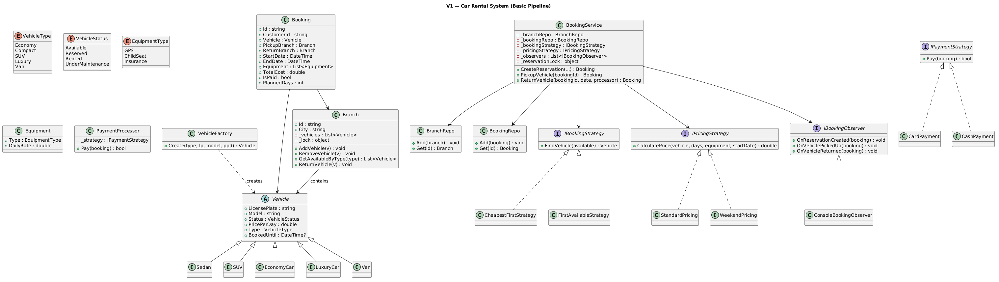
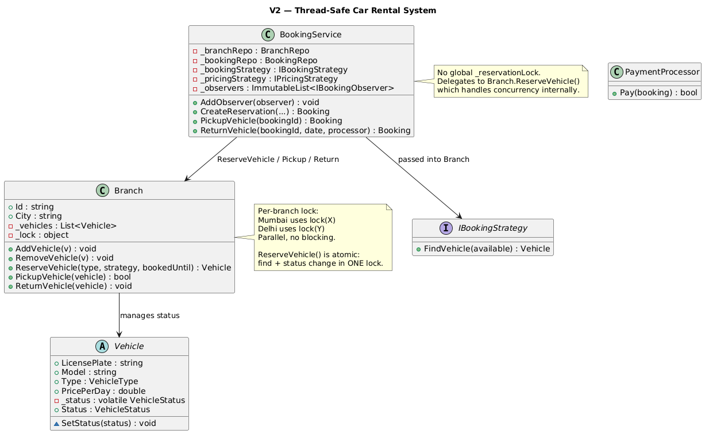

# Car Rental System

## Table of Contents

- [Problem Statement](#problem-statement)
- [Functional Requirements](#functional-requirements)
- [Non-Functional Requirements](#non-functional-requirements)
- [Core Entities](#core-entities)
- [Relationships Between Entities](#relationships-between-entities)
- [V1 — Basic Pipeline](#v1--basic-pipeline)
- [V1 to V2](#v1-to-v2)
- [V2 — Fully Thread-Safe](#v2--fully-thread-safe)
- [Locking Design: Why Branch-Level, Not Centralized](#locking-design-why-branch-level-not-centralized)

---

## Problem Statement

A car rental system is a service or software platform that allows customers to book, use, and return vehicles for a temporary period in exchange for payment. It helps people rent cars for a few hours, days, or weeks without owning them.

---

## Functional Requirements

- Support multiple rental locations where vehicles are stored and managed
- Support different vehicle types (Economy, Compact, SUV, Luxury, Van) with distinct daily rates
- Allow customers to make reservations by vehicle type, pickup location, and date range
- Support different pickup and return locations (one-way rentals)
- Assign a specific vehicle at pickup time based on availability at the location
- Track vehicle status through its lifecycle: Available, Reserved, Rented, Under Maintenance
- Support add-on equipment (GPS, Child Seat, Insurance) with daily rates
- Calculate rental cost based on duration, vehicle type, equipment, and pricing strategy
- Support configurable pricing strategies (standard, weekend)
- Handle late returns with additional fees
- Notify observers when reservations are created, vehicles picked up, and vehicles returned

---

## Non-Functional Requirements

- **Modularity**: Follow object-oriented principles with clear separation of concerns
- **Concurrency**: Handle concurrent reservation requests without double-booking
- **Extensibility**: Support future enhancements (new vehicle types, pricing, payment methods)
- **Thread-safety**: Safe for concurrent access across multiple branches
- **Testability**: Components testable in isolation

---

## Core Entities

| Entity | Introduced In | Responsibility |
|--------|:---:|---------------|
| **Vehicle** (abstract) | V1 | licensePlate, model, status, pricePerDay, type |
| **Sedan, SUV, EconomyCar, LuxuryCar, Van** | V1 | Concrete vehicle types |
| **VehicleFactory** | V1 | Factory: creates vehicles from VehicleType enum |
| **Equipment** | V1 | Add-on items (GPS, ChildSeat, Insurance) with daily rates |
| **Branch** | V1 | Rental location with vehicle inventory |
| **BranchRepo** | V1 | Registry of all branches |
| **Booking** | V1 | Reservation record: customer, vehicle, dates, equipment, cost |
| **BookingRepo** | V1 | Stores all bookings |
| **IBookingStrategy** | V1 | Strategy: how to select a vehicle (CheapestFirst, FirstAvailable) |
| **IPricingStrategy** | V1 | Strategy: how to calculate cost (Standard, Weekend) |
| **IPaymentStrategy** | V1 | Strategy: how to process payment (Card, Cash) |
| **PaymentProcessor** | V1 | Wraps a payment strategy and calls Pay() |
| **BookingService** | V1 | Facade: orchestrates reservation, pickup, return |
| **IBookingObserver** | V1 | Observer: notified on reservation/pickup/return events |

---

## Relationships Between Entities

```
BookingService (Facade)
    ├─► BranchRepo → Branch (lookup pickup/return location)
    ├─► BookingRepo → Booking (store/retrieve reservations)
    ├─► IBookingStrategy (select vehicle from available pool)
    ├─► IPricingStrategy (calculate rental cost)
    ├─► IBookingObserver[] (notify on events)
    └─► PaymentProcessor → IPaymentStrategy (process payment at return)

Domain Hierarchy:
    Branch → Vehicle[] (inventory)
    Vehicle → VehicleType, VehicleStatus
    Booking → Customer + Vehicle + Branch(pickup) + Branch(return) + Equipment[] + Cost

Vehicle Status Lifecycle:
    Available → Reserved → Rented → Available
                   └── (cancel) → Available
    Available → UnderMaintenance → Available

Booking Flow (3 phases):
    CreateReservation: find vehicle → reserve → calculate cost → store booking
    PickupVehicle:     Reserved → Rented
    ReturnVehicle:     late fee? → payment → Rented → Available (return to branch)
```

---

## V1 — Basic Pipeline

### Idea of V1

V1 implements the complete 3-phase booking flow with a global reservation lock for simplicity. All strategies (booking, pricing, payment) are pluggable via interfaces.

### V1 Class Diagram 


### V1 Booking Flow (Example)

```
Setup:
  Mumbai Branch: Swift(₹800, Economy), i20(₹900, Economy), Creta(₹1500, SUV)
  Strategy: CheapestFirstStrategy + StandardPricing
  Alice wants: Economy, Mumbai → Mumbai, Jul 21–24, with GPS(₹100/day)

Phase 1 — CreateReservation("alice", Economy, "br1", "br1", Jul 21, Jul 24, [GPS]):

  Step 1: Validate branches
          pickupBranch = Mumbai ✓, returnBranch = Mumbai ✓

  Step 2: Acquire global lock
          lock(_reservationLock) ← prevents other threads from reserving simultaneously

  Step 3: Get available Economy vehicles at Mumbai
          Branch.GetAvailableByType(Economy) → [Swift(₹800), i20(₹900)]

  Step 4: Strategy selects best vehicle
          CheapestFirstStrategy.FindVehicle([Swift, i20]) → Swift (₹800, cheapest)

  Step 5: Mark vehicle Reserved
          Swift.Status = Available → Reserved
          Swift.BookedUntil = Jul 24

  Step 6: Calculate cost
          StandardPricing.CalculatePrice(Swift, 3 days, [GPS], Jul 21)
            → vehicle: 800 × 3 = ₹2400
            → GPS:     100 × 3 = ₹300
            → total = ₹2700

  Step 7: Store booking in BookingRepo

  Step 8: Notify observers
          "[Observer] Reservation created: Booking(xxx, Economy Swift, 21-Jul to 24-Jul, ₹2700)"

  Step 9: Release lock
          Other threads can now reserve.

Phase 2 — PickupVehicle(bookingId):

  Step 1: Look up booking from BookingRepo
  Step 2: Swift.Status = Reserved → Rented
  Step 3: "[Observer] Vehicle picked up: MH01-1001 by alice"

Phase 3 — ReturnVehicle(bookingId, Jul 24, PaymentProcessor(Card)):

  Step 1: Look up booking
  Step 2: Late check: (Jul 24 - Jul 24).Days = 0 → no penalty
  Step 3: CardPayment.Pay(booking) → "[Card] Charged ₹2700"
  Step 4: Mumbai.ReturnVehicle(Swift) → Swift.Status = Rented → Available
  Step 5: Same branch, no removal needed
  Step 6: "[Observer] Vehicle returned: MH01-1001 at Mumbai"

Final state:
  Swift: Available (back in pool)
  Booking: TotalCost=₹2700, IsPaid=true
```

### Late Return Example

```
Charlie books Jul 25–27, returns Jul 29 (2 days late):

  At return:
    lateDays = max(0, (Jul 29 - Jul 27).Days) = 2
    lateFee = 2 × ₹500 = ₹1000
    TotalCost = ₹1600 + ₹1000 = ₹2600
    "[BookingService] Late return: 2 extra day(s), +₹1000 fee"
    "[Card] Charged ₹2600"
```

### One-Way Rental Example

```
Bob books SUV: pickup Mumbai, return Delhi

  At return:
    delhi.ReturnVehicle(creta) → Creta added to Delhi inventory, Status=Available
    mumbai.RemoveVehicle(creta) → Creta removed from Mumbai

  Result: Creta is now available at Delhi, not Mumbai.
```

### V1 Code Snippets

#### Branch (V1)

```csharp
public class Branch
{
    public string Id { get; }
    public string City { get; }
    private readonly List<Vehicle> _vehicles = new();
    private readonly object _lock = new();

    public void AddVehicle(Vehicle vehicle)
    {
        lock (_lock) { _vehicles.Add(vehicle); }
    }

    public void RemoveVehicle(Vehicle vehicle)
    {
        lock (_lock) { _vehicles.Remove(vehicle); }
    }

    // Returns snapshot of available vehicles (V1 gap: status can change after this returns)
    public List<Vehicle> GetAvailableByType(VehicleType type)
    {
        lock (_lock)
        {
            return _vehicles.Where(v => v.Type == type && v.Status == VehicleStatus.Available).ToList();
        }
    }

    // Return vehicle: add to branch if one-way, reset status
    public void ReturnVehicle(Vehicle vehicle)
    {
        lock (_lock)
        {
            if (!_vehicles.Contains(vehicle))
                _vehicles.Add(vehicle); // one-way: vehicle lands at new branch
            vehicle.Status = VehicleStatus.Available;
            vehicle.BookedUntil = null;
        }
    }
}
```

#### BookingService (V1 — global lock)

```csharp
public class BookingService
{
    private readonly object _reservationLock = new(); // Global lock for ALL branches

    public Booking? CreateReservation(string customerId, VehicleType vehicleType,
        string pickupBranchId, string returnBranchId, DateTime startDate, DateTime endDate,
        List<Equipment>? equipment = null)
    {
        var pickupBranch = _branchRepo.Get(pickupBranchId);
        var returnBranch = _branchRepo.Get(returnBranchId);
        if (pickupBranch == null || returnBranch == null) return null;

        equipment ??= new List<Equipment>();

        // Global lock — prevents double-booking but serializes ALL branches
        lock (_reservationLock)
        {
            var available = pickupBranch.GetAvailableByType(vehicleType);
            var vehicle = _bookingStrategy.FindVehicle(available);
            if (vehicle == null) return null;

            // Reserve: Available → Reserved
            vehicle.Status = VehicleStatus.Reserved;
            vehicle.BookedUntil = endDate;

            var booking = new Booking(customerId, vehicle, pickupBranch, returnBranch, startDate, endDate, equipment);
            booking.TotalCost = _pricingStrategy.CalculatePrice(vehicle, booking.PlannedDays, equipment, startDate);
            _bookingRepo.Add(booking);

            foreach (var obs in _observers) obs.OnReservationCreated(booking);
            return booking;
        }
    }

    // Pickup: Reserved → Rented (V1 gap: no lock here!)
    public Booking? PickupVehicle(string bookingId)
    {
        var booking = _bookingRepo.Get(bookingId);
        if (booking == null) return null;

        booking.Vehicle.Status = VehicleStatus.Rented; // unprotected status change
        foreach (var obs in _observers) obs.OnVehiclePickedUp(booking);
        return booking;
    }

    // Return: calculate late fee, pay, return vehicle to branch
    public Booking? ReturnVehicle(string bookingId, DateTime actualReturnDate, PaymentProcessor processor)
    {
        var booking = _bookingRepo.Get(bookingId);
        if (booking == null) return null;

        booking.ActualReturnDate = actualReturnDate;

        // Late fee: ₹500 per extra day
        int lateDays = Math.Max(0, (actualReturnDate - booking.EndDate).Days);
        if (lateDays > 0)
            booking.TotalCost += lateDays * 500;

        // Payment
        booking.IsPaid = processor.Pay(booking);

        // Return vehicle to the return branch
        booking.ReturnBranch.ReturnVehicle(booking.Vehicle);

        // One-way: remove from pickup branch
        if (booking.PickupBranch.Id != booking.ReturnBranch.Id)
            booking.PickupBranch.RemoveVehicle(booking.Vehicle);

        foreach (var obs in _observers) obs.OnVehicleReturned(booking);
        return booking;
    }
}
```

#### Client Code (V1)

```csharp
// Setup
var service = new BookingService(branchRepo, bookingRepo,
    new CheapestFirstStrategy(), new StandardPricing());
service.AddObserver(new ConsoleBookingObserver());

// Reserve Economy with GPS for 3 days
var booking = service.CreateReservation("alice", VehicleType.Economy,
    "br1", "br1", new DateTime(2025, 7, 21), new DateTime(2025, 7, 24),
    new List<Equipment> { new Equipment(EquipmentType.GPS, 100) });

// Pickup
service.PickupVehicle(booking.Id);

// Return (on-time, pay by card)
service.ReturnVehicle(booking.Id, new DateTime(2025, 7, 24), new PaymentProcessor(new CardPayment()));
```

### V1 Limitations

- **Global `_reservationLock`**: Serializes ALL reservations across all branches — poor throughput
- **`Vehicle.Status` public setter**: Any code can change it, bypassing the lock
- **`_observers` (List)**: AddObserver during notification iteration crashes
- **PickupVehicle/ReturnVehicle**: No lock on status transitions — race conditions
- **TOCTOU in reservation**: `GetAvailableByType` returns a snapshot, then reserve happens separately

### V1 TOCTOU Explained

TOCTOU (Time-Of-Check-To-Time-Of-Use) is a race condition where the state changes between when you check it and when you act on it.

In V1, `CreateReservation` uses TWO different locks that cover different scopes:

```
Branch._lock:       protects the _vehicles list (add/remove/iterate)
_reservationLock:   protects the find→reserve sequence in BookingService
```

The gap:

```
Thread A (CreateReservation, holds _reservationLock):

  pickupBranch.GetAvailableByType(Economy)
    lock(Branch._lock)              ← acquired
      scan: [Swift(Available)]
    unlock(Branch._lock)            ← RELEASED!
    ╔═══════════════════════════════════════════════════════════╗
    ║  GAP: Branch._lock is released.                          ║
    ║  ReturnVehicle or PickupVehicle could run HERE           ║
    ║  and modify Swift's Status — they don't need             ║
    ║  _reservationLock, only Branch._lock.                    ║
    ╚═══════════════════════════════════════════════════════════╝
  vehicle = strategy.FindVehicle([Swift]) → Swift
  vehicle.Status = Reserved           ← changes status WITHOUT Branch._lock
```

Concrete scenario:

```
Thread A: CreateReservation (holds _reservationLock)
  → GetAvailableByType() → [Swift(Available)]
  → Branch._lock released

Thread B: Maintenance triggered (does NOT need _reservationLock)
  → lock(Branch._lock)
  → swift.Status = UnderMaintenance
  → unlock(Branch._lock)

Thread A: (still holds _reservationLock)
  → swift.Status = Reserved  ← overwrites UnderMaintenance!
  → Two threads modified Status without synchronized access
```

The `_reservationLock` protects against two reservations racing, but NOT against reservation vs return/maintenance — because those operations don't acquire `_reservationLock`.

V2 fix: `Branch.ReserveVehicle()` does find + status change in ONE lock:

```csharp
lock (_lock)  // same lock used by Return/Pickup/Maintenance
{
    var available = _vehicles.Where(v => v.Status == Available)...  // check
    vehicle.SetStatus(VehicleStatus.Reserved);                      // use
    // NO GAP — same lock, no interleaving possible
}
```

---

## V1 to V2

V2 makes the system fully thread-safe with per-branch locks and atomic operations.

### What Changed

| Aspect | V1 | V2 |
|--------|----|----|
| Reservation lock | Global `_reservationLock` | Per-branch lock inside `Branch.ReserveVehicle()` |
| Find + Reserve | Two steps (TOCTOU gap) | Atomic in one lock: `ReserveVehicle()` |
| Vehicle.Status | Public setter | `volatile` + `internal SetStatus()` only through Branch |
| Pickup/Return | No lock | Through `Branch.PickupVehicle()` / `ReturnVehicle()` under lock |
| Observers | `List` (crashes) | `ImmutableList` + `ImmutableInterlocked` |
| Throughput | All branches serialized | Different branches run in parallel |

---

## V2 — Fully Thread-Safe

### V2 Class Diagram


### V2 Key Change: Branch.ReserveVehicle (Atomic Find + Reserve)

```csharp
public class Branch
{
    private readonly List<Vehicle> _vehicles = new();
    private readonly object _lock = new(); // Per-branch lock

    // V2: Find + Reserve in ONE lock acquisition (no TOCTOU gap)
    public Vehicle? ReserveVehicle(VehicleType type, IBookingStrategy strategy, DateTime bookedUntil)
    {
        lock (_lock)
        {
            // Find available vehicles of the requested type
            var available = _vehicles.Where(v => v.Type == type && v.Status == VehicleStatus.Available).ToList();

            // Strategy selects the best one
            var vehicle = strategy.FindVehicle(available);
            if (vehicle == null) return null;

            // Reserve atomically — no gap between find and status change
            vehicle.SetStatus(VehicleStatus.Reserved);
            vehicle.BookedUntil = bookedUntil;
            return vehicle;
        }
    }

    // All state transitions go through Branch under per-branch lock
    public bool PickupVehicle(Vehicle vehicle)
    {
        lock (_lock)
        {
            if (vehicle.Status != VehicleStatus.Reserved) return false;
            vehicle.SetStatus(VehicleStatus.Rented);
            return true;
        }
    }

    public void ReturnVehicle(Vehicle vehicle)
    {
        lock (_lock)
        {
            if (!_vehicles.Contains(vehicle))
                _vehicles.Add(vehicle); // one-way: vehicle lands at new branch
            vehicle.SetStatus(VehicleStatus.Available);
            vehicle.BookedUntil = null;
        }
    }
}
```

### V2 Booking Flow (Concurrent Example)

```
Setup:
  Mumbai: ONE Economy car (Swift ₹800)
  Alice and Bob both want Economy in Mumbai simultaneously.

Timeline (Thread A = Alice, Thread B = Bob):

T1  Thread A: service.CreateReservation("alice", Economy, "br1", ...)
    Thread B: service.CreateReservation("bob", Economy, "br1", ...)

T2  Thread A: pickupBranch.ReserveVehicle(Economy, strategy, endDate)
    Thread B: pickupBranch.ReserveVehicle(Economy, strategy, endDate)
    (Both call the same Branch — same per-branch lock)

T3  Thread A: lock(_lock) ← ACQUIRED
    Thread B: lock(_lock) ← BLOCKED (waiting)

T4  Thread A (inside lock):
      available = [Swift(Available)] → found!
      strategy.FindVehicle([Swift]) → Swift
      Swift.SetStatus(Reserved)
      return Swift
    EXIT lock

T5  Thread B: lock(_lock) ← NOW ACQUIRED
      available = [Swift(Reserved)] → filter: Status==Available → []
      strategy.FindVehicle([]) → null
      return null
    EXIT lock

T6  Thread A: booking created, cost calculated, stored → SUCCESS
    Thread B: "No Economy available at Mumbai" → FAILED

═══ Concurrent at DIFFERENT branches (parallel, no blocking) ═══

T1  Thread C: mumbai.ReserveVehicle(SUV, ...) → lock(mumbaiLock) ← ACQUIRED
    Thread D: delhi.ReserveVehicle(Compact, ...) → lock(delhiLock) ← ACQUIRED (different lock!)

T2  Both proceed in parallel — no contention.
    Thread C reserves Creta in Mumbai.
    Thread D reserves City in Delhi.
    Neither waits for the other.

Result:
  Alice: SUCCESS (Swift booked)
  Bob: FAILED (no Economy left — double-booking prevented)
  Charlie: SUCCESS (Creta, parallel with Dave)
  Dave: SUCCESS (City, parallel with Charlie)
```

### V2 BookingService (no global lock)

```csharp
public class BookingService
{
    // V2: ImmutableList for thread-safe observer management
    private ImmutableList<IBookingObserver> _observers = ImmutableList<IBookingObserver>.Empty;

    public void AddObserver(IBookingObserver observer)
    {
        ImmutableInterlocked.Update(ref _observers, list => list.Add(observer));
    }

    // V2: No global _reservationLock. Branch.ReserveVehicle handles concurrency.
    public Booking? CreateReservation(string customerId, VehicleType vehicleType,
        string pickupBranchId, string returnBranchId, DateTime startDate, DateTime endDate,
        List<Equipment>? equipment = null)
    {
        var pickupBranch = _branchRepo.Get(pickupBranchId);
        var returnBranch = _branchRepo.Get(returnBranchId);
        if (pickupBranch == null || returnBranch == null) return null;

        equipment ??= new List<Equipment>();

        // Atomic find+reserve inside Branch (per-branch lock)
        var vehicle = pickupBranch.ReserveVehicle(vehicleType, _bookingStrategy, endDate);
        if (vehicle == null) return null;

        var booking = new Booking(customerId, vehicle, pickupBranch, returnBranch, startDate, endDate, equipment);
        booking.TotalCost = _pricingStrategy.CalculatePrice(vehicle, booking.PlannedDays, equipment, startDate);
        _bookingRepo.Add(booking);

        foreach (var o in _observers) o.OnReservationCreated(booking);
        return booking;
    }

    // V2: Pickup goes through Branch (per-branch lock protects transition)
    public Booking? PickupVehicle(string bookingId)
    {
        var booking = _bookingRepo.Get(bookingId);
        if (booking == null) return null;

        bool success = booking.PickupBranch.PickupVehicle(booking.Vehicle);
        if (!success) return null; // vehicle not in Reserved state

        foreach (var o in _observers) o.OnVehiclePickedUp(booking);
        return booking;
    }

    // V2: Return goes through Branch (per-branch lock protects transition)
    public Booking? ReturnVehicle(string bookingId, DateTime actualReturnDate, PaymentProcessor processor)
    {
        var booking = _bookingRepo.Get(bookingId);
        if (booking == null) return null;

        booking.ActualReturnDate = actualReturnDate;

        // Late fee
        int lateDays = Math.Max(0, (actualReturnDate - booking.EndDate).Days);
        if (lateDays > 0)
            booking.TotalCost += lateDays * 500;

        // Payment
        booking.IsPaid = processor.Pay(booking);

        // Return vehicle to branch (per-branch lock inside)
        booking.ReturnBranch.ReturnVehicle(booking.Vehicle);

        // One-way: remove from pickup branch
        if (booking.PickupBranch.Id != booking.ReturnBranch.Id)
            booking.PickupBranch.RemoveVehicle(booking.Vehicle);

        foreach (var o in _observers) o.OnVehicleReturned(booking);
        return booking;
    }
}
```

#### Client Code (V2 — concurrent)

```csharp
// Both try to reserve the only Economy car in Mumbai simultaneously
var aliceTask = Task.Run(() =>
    service.CreateReservation("alice", VehicleType.Economy, "br1", "br1", start, end));
var bobTask = Task.Run(() =>
    service.CreateReservation("bob", VehicleType.Economy, "br1", "br1", start, end));

Task.WaitAll(aliceTask, bobTask);
// Exactly one succeeds — per-branch lock prevents double-booking.

// Different branches run in parallel (no contention)
var charlieTask = Task.Run(() =>
    service.CreateReservation("charlie", VehicleType.SUV, "br1", "br1", start, end));
var daveTask = Task.Run(() =>
    service.CreateReservation("dave", VehicleType.Compact, "br2", "br2", start, end));

Task.WaitAll(charlieTask, daveTask);
// Both succeed — different branches, different locks.
```

---

## Locking Design: Why Branch-Level, Not Centralized

### Car Rental vs Movie Booking — Different Locking Needs

| Aspect | Movie Booking (SeatLockManager) | Car Rental (Branch lock) |
|--------|-------------------------------|--------------------------|
| Shared resource | A specific seat in a specific show | A vehicle at a specific branch |
| Contention scope | Cross-cutting: many users target same seat | Localized: users only compete within one branch |
| Operation between lock and confirm | Slow payment (network call, seconds) | Nothing — reserve is instant |
| Timeout needed? | Yes — payment can hang, seats must auto-release | No — reservation is atomic, no waiting |
| Lock granularity | Per-show (centralized manager with per-show locks) | Per-branch (lock lives inside Branch itself) |

### Why Centralized Lock Manager for Movie Booking

```
Movie Booking Flow:
  1. LockSeats(show, seats, userId)     ← acquire lock
  2. CalculatePrice()
  3. Pay()                               ← SLOW (2-30 seconds network call)
  4. VerifyLock()                        ← check lock still held (could have expired)
  5. ConfirmSeats()                      ← finalize

Problem: Between step 1 and step 5, seconds pass.
  - User might abandon (close browser)
  - Payment gateway might be slow
  - Lock must auto-expire to prevent seat starvation

Solution: Centralized SeatLockManager with:
  - Per-show lock objects
  - Lock timestamps
  - Background timer for auto-expiry
  - VerifyLock guard after payment
```

### Why Branch-Level Lock for Car Rental

```
Car Rental Flow:
  1. Branch.ReserveVehicle(type, strategy)  ← find + reserve ATOMICALLY in one lock
  2. (Customer drives for days)
  3. ReturnVehicle(booking, date, payment)  ← payment at RETURN, not reservation

Key insight: There's NO slow operation between "find" and "reserve".
  - ReserveVehicle does both in ONE lock acquisition
  - No TOCTOU gap — no time window where another thread could steal the vehicle
  - Payment happens at RETURN time (days later), not during reservation lock
  - No timeout needed — the lock is held for microseconds (just a list scan + status flip)
```

### When Would Car Rental Need a Centralized Lock Manager?

If you added these features:

1. **Prepaid reservations** (pay at booking time):
   - Payment is slow → lock could expire → need timeout + guard

2. **Cross-branch search** ("find me any Economy in Mumbai OR Delhi"):
   - Two branches involved → per-branch lock isn't enough → need coordination

3. **Hold/expire** ("reserve for 10 minutes, then auto-cancel"):
   - Need timestamps + background timer → centralized manager

4. **Dynamic pricing** (price changes during checkout):
   - Need to lock the price → longer lock duration → timeout needed

Without these, the branch lock is simpler, faster, and sufficient.

### Decision Framework

```
Ask yourself:
  1. Is there a SLOW operation between lock and confirm?
     YES → Centralized lock manager with timeout + guard
     NO  → Entity-level lock is fine

  2. Can two entities compete for the same resource?
     YES → Centralized coordination needed
     NO  → Per-entity lock is sufficient

  3. Can locks be abandoned (user walks away)?
     YES → Need auto-expiry timer
     NO  → Simple lock/unlock is enough

Car Rental answers: NO, NO, NO → Branch-level lock.
Movie Booking answers: YES, YES, YES → Centralized SeatLockManager.
```
