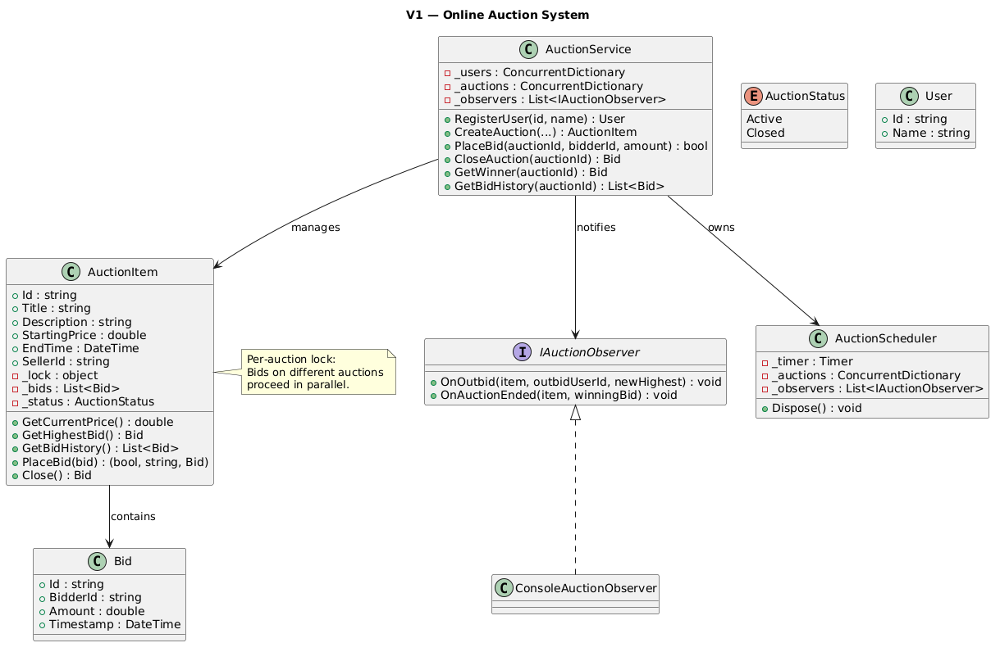
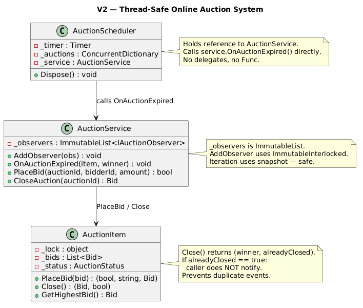

# Online Auction System

## Table of Contents

- [Problem Statement](#problem-statement)
- [Functional Requirements](#functional-requirements)
- [Non-Functional Requirements](#non-functional-requirements)
- [Core Entities](#core-entities)
- [Relationships Between Entities](#relationships-between-entities)
- [V1 — Basic Pipeline](#v1--basic-pipeline)
- [V1 to V2](#v1-to-v2)
- [V2 — Fully Thread-Safe](#v2--fully-thread-safe)

---

## Problem Statement

An Online Auction System is a digital platform that facilitates the buying and selling of items through competitive bidding, typically over a fixed time window. Sellers can list products for auction, and buyers can place incremental bids to compete for ownership.

---

## Functional Requirements

- Allow users to create and list auction items with a title, description, starting price, and end time
- Allow users to place bids on active auctions
- Support concurrent bidding on multiple items by the same or different users
- Determine the winner based on the highest bid at auction end; resolve ties by earliest bid
- Notify users when they are outbid or when the auction ends
- Prevent bids once the auction has ended
- Maintain a complete bid history for each auction item

---

## Non-Functional Requirements

- **Concurrency**: Thread-safe for multiple simultaneous bids on the same auction
- **Modularity**: OO design with clear separation of concerns
- **Reliability**: Auto-close auctions at their specified end time
- **Maintainability**: Clean, testable, easy to enhance
- **Extensibility**: Easy to add auction types, user roles, etc.
- **Simplified Interface**: Simple high-level API for clients

---

## Core Entities

| Entity | Introduced In | Responsibility |
|--------|:---:|---------------|
| **User** | V1 | Identity for sellers and bidders |
| **Bid** | V1 | Immutable record: bidderId, amount, timestamp |
| **AuctionItem** | V1 | Auction state: bids, status, per-item lock |
| **IAuctionObserver** | V1 | Observer: outbid + auction-end notifications |
| **AuctionScheduler** | V1 | Background timer: auto-closes expired auctions |
| **AuctionService** | V1 | Facade: create/bid/close/getWinner |

---

## Relationships Between Entities

```
AuctionService (Facade)
    ├─► Users registry (ConcurrentDictionary)
    ├─► Auctions registry (ConcurrentDictionary)
    ├─► IAuctionObserver[] (notifications)
    └─► AuctionScheduler (background timer)
            └─► calls service.OnAuctionExpired() on close [V2]

AuctionItem (per-auction lock)
    ├─► List<Bid> (bid history, guarded by lock)
    └─► AuctionStatus (Active → Closed, one-way transition)

Bidding Flow:
    service.PlaceBid(auctionId, bidderId, amount)
      └─► AuctionItem.PlaceBid(bid)  [under per-auction lock]
            ├─► validate: status, seller, amount
            ├─► add bid
            └─► return previousHighest (for outbid notification)

Auto-Close Flow:
    Timer fires every 1s → scan all auctions
      → if Active && now >= endTime → item.Close()
      → notify observers of auction end
```

---

## V1 — Basic Pipeline

### Idea of V1

V1 implements the full auction lifecycle with per-auction locks for bid concurrency and a background scheduler for auto-closing auctions.

### V1 Class Diagram 


### V1 Code Snippets

#### AuctionItem.PlaceBid (per-auction lock)

```csharp
public (bool success, string reason, Bid? previousHighest) PlaceBid(Bid bid)
{
    lock (_lock) // Per-auction lock — other auctions not blocked
    {
        if (_status == AuctionStatus.Closed)
            return (false, "Auction has ended", null);

        if (bid.BidderId == SellerId)
            return (false, "Seller cannot bid on own item", null);

        double currentPrice = _bids.Count == 0 ? StartingPrice : _bids.Max(b => b.Amount);

        if (bid.Amount <= currentPrice)
            return (false, $"Bid must exceed current price ₹{currentPrice}", null);

        var previousHighest = GetHighestBid();
        _bids.Add(bid);
        return (true, "Bid accepted", previousHighest);
    }
}
```

#### AuctionService.PlaceBid

```csharp
public bool PlaceBid(string auctionId, string bidderId, double amount)
{
    var item = _auctions[auctionId];
    var bid = new Bid(bidderId, amount);

    var (success, reason, previousHighest) = item.PlaceBid(bid);
    if (!success) return false;

    // Notify previous highest bidder they've been outbid
    if (previousHighest != null && previousHighest.BidderId != bidderId)
        foreach (var obs in _observers)
            obs.OnOutbid(item, previousHighest.BidderId, bid);

    return true;
}
```

#### AuctionScheduler

```csharp
public class AuctionScheduler : IDisposable
{
    private readonly Timer _timer;

    public AuctionScheduler(ConcurrentDictionary<string, AuctionItem> auctions, List<IAuctionObserver> observers)
    {
        _timer = new Timer(CheckAndCloseAuctions, null, 1000, 1000);
    }

    private void CheckAndCloseAuctions(object? state)
    {
        var now = DateTime.UtcNow;
        foreach (var (id, item) in _auctions)
        {
            if (item.Status == AuctionStatus.Active && now >= item.EndTime)
            {
                var winningBid = item.Close();
                foreach (var obs in _observers)
                    obs.OnAuctionEnded(item, winningBid);
            }
        }
    }
}
```

### V1 Bidding Flow (Example with Threads)

```
Setup:
  Auction: "Vintage Watch", starting price ₹5000, ends in 10 seconds
  Per-auction lock object: lockObj
  Bob and Charlie bid concurrently

Timeline (Thread A = Bob ₹7000, Thread B = Charlie ₹6500):

T1  Thread A: PlaceBid(bid=₹7000)
    Thread B: PlaceBid(bid=₹6500)

T2  Thread A: lock(lockObj) ← ACQUIRED
    Thread B: lock(lockObj) ← BLOCKED (waiting)

T3  Thread A (inside lock):
      _status == Active ✓
      bid.BidderId != SellerId ✓
      currentPrice = ₹5000 (no bids yet)
      ₹7000 > ₹5000 ✓
      previousHighest = null (first bid)
      _bids.Add(₹7000 by bob)
      return (true, "Bid accepted", null)
    EXIT lock

T4  Thread B: lock(lockObj) ← NOW ACQUIRED
      _status == Active ✓
      bid.BidderId != SellerId ✓
      currentPrice = ₹7000 (Bob's bid is now in the list!)
      ₹6500 > ₹7000? NO ← REJECTED!
      return (false, "Bid must exceed ₹7000", null)
    EXIT lock

Result:
  Bob: ₹7000 ACCEPTED
  Charlie: ₹6500 REJECTED (must exceed ₹7000)
  No double-acceptance — per-auction lock serialized the bids.
```

### V1 TOCTOU Issue (Double-Close)

```
Without idempotent Close() — V1 problem:

T=2s  Scheduler timer fires: CheckAndCloseAuctions()
        item.Status == Active && now >= EndTime → true
        winningBid = item.Close()    ← status = Closed
        foreach obs: OnAuctionEnded(item, winner)  ← NOTIFICATION #1

T=2s  Main thread: service.CloseAuction(auctionId)  (simultaneous)
        item.Close()                 ← status already Closed, but V1 doesn't check
        foreach obs: OnAuctionEnded(item, winner)  ← NOTIFICATION #2 (DUPLICATE!)

Result: Observer receives TWO "auction ended" events for the same auction.
  In a real system: duplicate emails, double winner announcements, UI confusion.
```

### V1 Limitations

- **`_observers` (List)**: AddObserver during notification iteration crashes (ConcurrentModificationException)
- **Double-close**: Both scheduler and manual CloseAuction fire notifications — duplicates
- **Observer list on Timer thread**: Scheduler reads `_observers` from ThreadPool thread while main thread may add observers

---

## V1 to V2

V2 fixes all thread-safety gaps while keeping the same per-auction lock for bids (which was already correct).

### What Changed

| Aspect | V1 | V2 |
|--------|----|----|
| Observers | `List` (crash on concurrent add+iterate) | `ImmutableList` + `ImmutableInterlocked` |
| Close() return | `Bid?` (no duplicate detection) | `(Bid? winner, bool alreadyClosed)` |
| Double-close | Both callers fire events | Only first close fires, second detects `alreadyClosed` |
| Scheduler → Observers | Scheduler iterates List directly | Scheduler calls `service.OnAuctionExpired()` (service owns observers) |
| Scheduler dependency | Holds reference to observer List | Holds reference to AuctionService (plain method call) |

---

## V2 — Fully Thread-Safe

### V2 Class Diagram 


### V2 Key Changes

#### Idempotent Close()

```csharp
public (Bid? winner, bool alreadyClosed) Close()
{
    lock (_lock)
    {
        if (_status == AuctionStatus.Closed)
            return (GetHighestBidInternal(), true); // Already closed — DON'T notify

        _status = AuctionStatus.Closed;
        return (GetHighestBidInternal(), false); // First close — caller SHOULD notify
    }
}
```

#### AuctionScheduler (calls service directly, no delegates)

```csharp
public class AuctionScheduler : IDisposable
{
    private readonly AuctionService _service; // plain reference, no Func/Action

    public AuctionScheduler(ConcurrentDictionary<string, AuctionItem> auctions, AuctionService service)
    {
        _service = service;
        _timer = new Timer(CheckAndCloseAuctions, null, 1000, 1000);
    }

    private void CheckAndCloseAuctions(object? state)
    {
        foreach (var (id, item) in _auctions)
        {
            if (item.Status == AuctionStatus.Active && now >= item.EndTime)
            {
                var (winner, alreadyClosed) = item.Close();
                if (!alreadyClosed)
                    _service.OnAuctionExpired(item, winner); // plain method call
            }
        }
    }
}
```

#### AuctionService (ImmutableList observers)

```csharp
public class AuctionService
{
    private ImmutableList<IAuctionObserver> _observers = ImmutableList<IAuctionObserver>.Empty;

    public void AddObserver(IAuctionObserver observer)
    {
        ImmutableInterlocked.Update(ref _observers, list => list.Add(observer));
    }

    public void OnAuctionExpired(AuctionItem item, Bid? winner)
    {
        var observers = _observers; // snapshot — safe even if AddObserver called concurrently
        foreach (var obs in observers)
            obs.OnAuctionEnded(item, winner);
    }

    public Bid? CloseAuction(string auctionId)
    {
        var (winner, alreadyClosed) = item.Close();
        if (!alreadyClosed)
            OnAuctionExpired(item, winner); // only first close notifies
        return winner;
    }
}
```

### V2 Double-Close Race (Fixed)

```
Timeline — Scheduler and Manual close race:

T=2s  Scheduler: item.Close()
        lock(_lock)
          _status == Active → set to Closed
          return (winner: charlie ₹2000, alreadyClosed: false) ← FIRST CLOSE
        unlock
      alreadyClosed == false → service.OnAuctionExpired(item, winner)
        → "[Notify] Auction ended! Winner: charlie with ₹2000"  ← ONE notification

T=2s  Main thread: service.CloseAuction(auctionId)
        item.Close()
          lock(_lock)
            _status == Closed ← already!
            return (winner: charlie ₹2000, alreadyClosed: true) ← DETECTED
          unlock
        alreadyClosed == true → DO NOT notify
        return winner

Result: Only ONE "auction ended" notification fired.
  No duplicates. No observer confusion. Idempotent.
```

### V2 Concurrent Bidding Flow (Thread-Safe)

```
Setup:
  Auction: "Gaming Laptop", ₹50000 starting
  10 concurrent bids from Bob and Charlie (₹52000 to ₹70000)
  Per-auction lock ensures only one bid validates at a time

Timeline (simplified, 3 threads):

T1  Thread A (₹60000, charlie): lock ← ACQUIRED
    Thread B (₹52000, charlie): lock ← BLOCKED
    Thread C (₹54000, bob):     lock ← BLOCKED

T2  Thread A: currentPrice=₹50000, ₹60000>₹50000 ✓, add bid. EXIT lock.
    Thread B: lock ← ACQUIRED
      currentPrice=₹60000, ₹52000>₹60000? NO → REJECTED. EXIT lock.
    Thread C: lock ← ACQUIRED
      currentPrice=₹60000, ₹54000>₹60000? NO → REJECTED. EXIT lock.

    (Later threads with ₹62000, ₹64000, etc. succeed because they exceed current price)

Result:
  Only bids that exceed the current highest (at time of lock acquisition) are accepted.
  No two bids are validated simultaneously on the same auction.
  Different auctions accept bids in parallel (independent locks).
```

### V2 Add Observer During Bidding (Safe)

```
Timeline:

T=0     Bidding starts on "Rare Book" (observer list has 1 observer)
T=100ms Bid #1 accepted, notification iterates snapshot [Observer1]
T=200ms Main thread: service.AddObserver(new Observer2)
          → ImmutableInterlocked.Update creates NEW ImmutableList [Observer1, Observer2]
          → The old reference [Observer1] still exists (the bidding thread may be iterating it)
          → No crash — old snapshot is immutable, new list is a separate object
T=300ms Bid #3 accepted, notification iterates NEW snapshot [Observer1, Observer2]
          → Both observers notified from now on

V1 behavior: AddObserver modifies the List while it's being iterated → CRASH.
V2 behavior: AddObserver creates a new ImmutableList. Old iterations continue safely on old snapshot.
```
