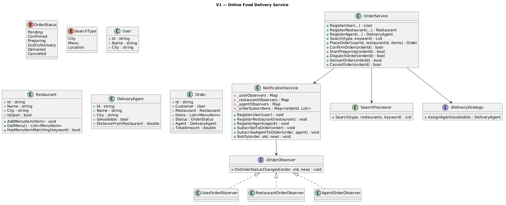
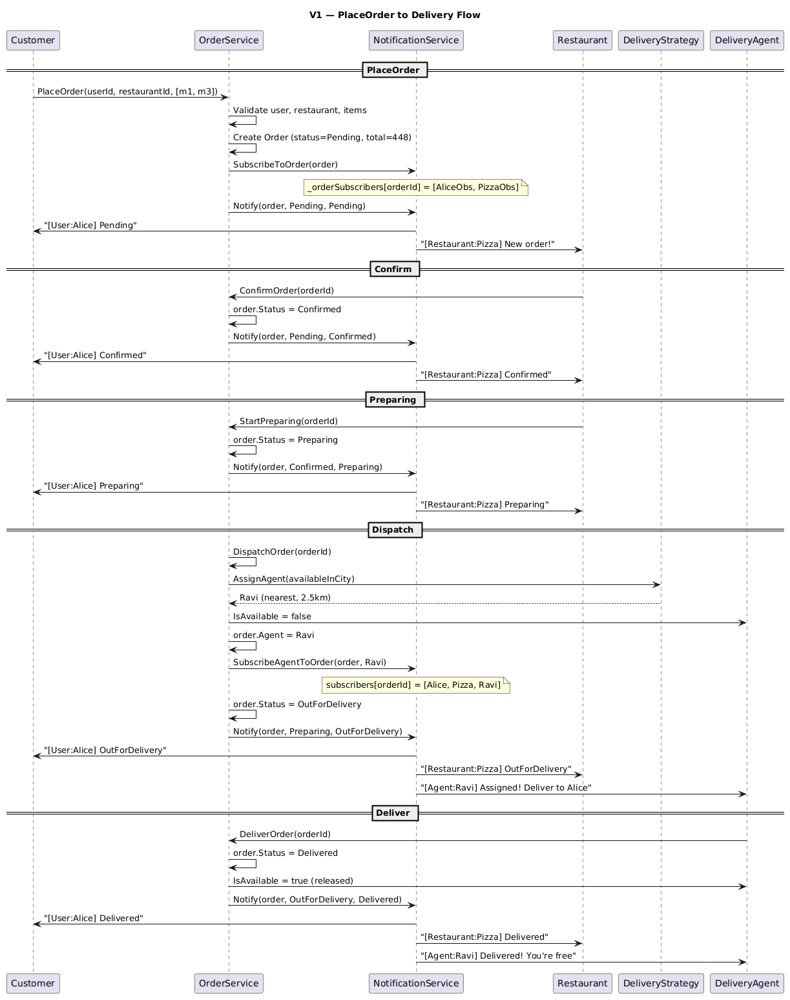
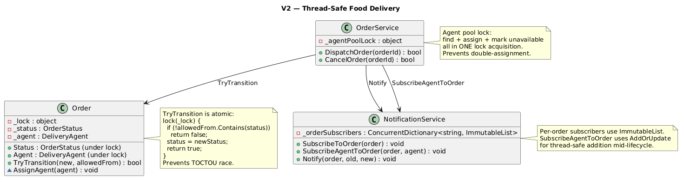
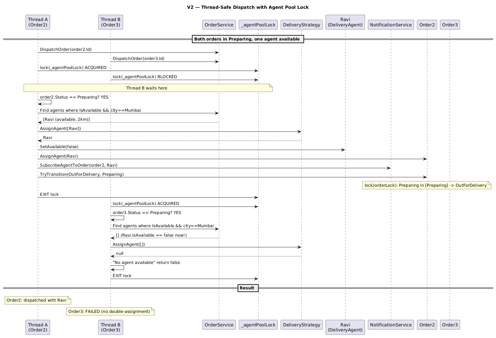

# Online Food Delivery Service

## Table of Contents

- [Problem Statement](#problem-statement)
- [Functional Requirements](#functional-requirements)
- [Non-Functional Requirements](#non-functional-requirements)
- [Core Entities](#core-entities)
- [Relationships Between Entities](#relationships-between-entities)
- [V1 — Basic Pipeline](#v1--basic-pipeline)
- [V1 to V2](#v1-to-v2)
- [V2 — Fully Thread-Safe](#v2--fully-thread-safe)

---

## Problem Statement

An Online Food Delivery Service is a digital platform that connects users with nearby restaurants, allowing them to browse menus, place food orders, and have meals delivered to their doorstep by delivery partners.

---

## Functional Requirements

- Support registration of new users, delivery agents and restaurants
- Support adding restaurants and menu items
- Allow customers to search for restaurants based on city, menu or location
- Allow customers to place orders containing multiple items from a selected restaurant
- Allow customers to cancel an order while the restaurant has not started preparing it
- Notify restaurants of new incoming orders and allow them to update the order status
- Auto-assign delivery agents based on availability and proximity
- Notify relevant parties when the order status changes
- Maintain order history for customers

---

## Non-Functional Requirements

- **Modularity**: Clear separation of components
- **Extensibility**: Flexible for future features
- **Maintainability**: OO principles, easy to test and evolve

---

## Core Entities

| Entity | Responsibility |
|--------|---------------|
| **User** | Customer — id, name, email, city, address |
| **Restaurant** | Menu, city, open/closed status |
| **MenuItem** | Dish on a restaurant's menu — name, price, availability |
| **DeliveryAgent** | Rider — city, availability, distance from restaurant |
| **Order** | Ties customer + restaurant + items + agent + status |
| **NotificationService** | Per-order targeted notifications to relevant parties only |
| **SearchProcessor** | Resolves search strategy from factory, runs search |
| **IDeliveryStrategy** | Strategy for assigning agents (NearestAgent, FirstAvailable) |
| **IOrderObserver** | Observer interface for status change notifications |
| **OrderService** | Facade — orchestrates the full order lifecycle |

---

## Relationships Between Entities

```
OrderService (Facade)
    ├─► NotificationService (per-order targeted notifications)
    │       ├─► UserOrderObserver (customer of this order)
    │       ├─► RestaurantOrderObserver (restaurant of this order)
    │       └─► AgentOrderObserver (assigned agent, added at dispatch)
    ├─► SearchProcessor → SearchStrategyFactory → ISearchStrategy
    ├─► IDeliveryStrategy (agent assignment)
    └─► Repositories (ConcurrentDictionary for users, restaurants, agents, orders)

Order Status Lifecycle:
    Pending → Confirmed → Preparing → OutForDelivery → Delivered
        └── Cancel allowed ──┘              (cancel NOT allowed after Preparing)
```

---

## V1 — Basic Pipeline

### Idea of V1

V1 implements the full order lifecycle with:
- `NotificationService` for per-order targeted notifications (not broadcast)
- `SearchProcessor` with strategy pattern for restaurant search
- Entity-based observers (User, Restaurant, Agent implement `IOrderObserver`)
- Auto-registration: `RegisterUser/Restaurant/Agent` automatically subscribes to notifications

### V1 Class Diagram


### V1 Sequence Diagram — Full Order Lifecycle 


### PlaceOrder Journey (Code + Flow)

#### Step 1: Registration (auto-subscribes to notifications)

```csharp
// When a user registers, NotificationService stores their observer for later use
public User RegisterUser(string id, string name, string email, string city, string address)
{
    var user = new User(id, name, email, city, address);
    _users.TryAdd(id, user);
    _notificationService.RegisterUser(user); // creates UserOrderObserver, stores by userId
    return user;
}

// Inside NotificationService:
public void RegisterUser(User user)
{
    _userObservers.TryAdd(user.Id, new UserOrderObserver(user));
}
```

At this point, Alice has an observer stored — but it's NOT subscribed to any order yet.

#### Step 2: PlaceOrder (subscribe customer + restaurant to this order)

```csharp
public Order? PlaceOrder(string userId, string restaurantId, List<string> itemIds)
{
    // Validate user, restaurant, items...
    var order = new Order(user, restaurant, items);  // status = Pending
    _orders.TryAdd(order.Id, order);

    // KEY: Subscribe the customer + restaurant to THIS specific order
    _notificationService.SubscribeToOrder(order);

    // Notify (only Alice + Pizza Palace receive this — not Bob or Biryani House)
    _notificationService.Notify(order, OrderStatus.Pending, OrderStatus.Pending);
    return order;
}
```

#### Step 3: Inside NotificationService.SubscribeToOrder

```csharp
public void SubscribeToOrder(Order order)
{
    var subscribers = new List<IOrderObserver>();

    // Look up the observer for this order's customer
    if (_userObservers.TryGetValue(order.Customer.Id, out var userObs))
        subscribers.Add(userObs);   // Alice's observer

    // Look up the observer for this order's restaurant
    if (_restaurantObservers.TryGetValue(order.Restaurant.Id, out var restObs))
        subscribers.Add(restObs);   // Pizza Palace's observer

    // Store: orderId → [Alice, PizzaPalace]
    _orderSubscribers.TryAdd(order.Id, subscribers);
}
```

#### Step 4: Status Updates (only relevant parties notified)

```csharp
// Restaurant confirms
service.ConfirmOrder(order.Id);
  → order.Status = Confirmed
  → _notificationService.Notify(order, Pending, Confirmed)
      → _orderSubscribers["order123"] = [Alice, PizzaPalace]
      → Alice: "[User:Alice] Your order: Pending → Confirmed"
      → Pizza: "[Restaurant:Pizza Palace] Order confirmed"
      → Bob: NOT notified (not subscribed to this order)
```

#### Step 5: Dispatch (agent subscribed at assignment time)

```csharp
public bool DispatchOrder(string orderId)
{
    // Find available agents in restaurant's city
    var agent = _deliveryStrategy.AssignAgent(availableAgents); // Ravi (nearest)

    agent.IsAvailable = false;
    order.Agent = agent;

    // KEY: Subscribe agent to this order's notifications NOW
    _notificationService.SubscribeAgentToOrder(order, agent);

    order.Status = OutForDelivery;
    _notificationService.Notify(order, Preparing, OutForDelivery);
    // Now notifies: [Alice, PizzaPalace, Ravi] — all three relevant parties
}
```

#### Step 6: Inside NotificationService.SubscribeAgentToOrder

```csharp
public void SubscribeAgentToOrder(Order order, DeliveryAgent agent)
{
    if (_agentObservers.TryGetValue(agent.Id, out var agentObs))
    {
        // Add Ravi's observer to this order's subscriber list
        // Before: [Alice, PizzaPalace]
        // After:  [Alice, PizzaPalace, Ravi]
        _orderSubscribers[order.Id].Add(agentObs);
    }
}
```

#### Step 7: Delivery (agent released)

```csharp
service.DeliverOrder(order.Id);
  → order.Status = Delivered
  → agent.IsAvailable = true  (Ravi is free again)
  → _notificationService.Notify(order, OutForDelivery, Delivered)
      → Alice: "[User:Alice] Your order: OutForDelivery → Delivered"
      → Pizza: "[Restaurant:Pizza Palace] Order delivered"
      → Ravi:  "[Agent:Ravi] Order delivered! You're free."
```

### Notification Flow (Visual)

```
PlaceOrder("alice", "r1", [m1, m3])
│
├─ NotificationService.SubscribeToOrder(order)
│     _orderSubscribers["ord123"] = [AliceObserver, PizzaObserver]
│
├─ Notify(order, Pending, Pending)
│     → AliceObserver.OnStatusChanged()  → "[User:Alice] Pending → Pending"
│     → PizzaObserver.OnStatusChanged()  → "[Restaurant:Pizza] New order!"
│     → Bob? NO. Ravi? NO. (not in this order's subscriber list)
│
├─ ConfirmOrder → Notify → [Alice, Pizza] notified
├─ StartPreparing → Notify → [Alice, Pizza] notified
│
├─ DispatchOrder
│     ├─ SubscribeAgentToOrder(order, Ravi)
│     │     _orderSubscribers["ord123"] = [Alice, Pizza, Ravi]  ← agent added
│     └─ Notify → [Alice, Pizza, Ravi] all notified
│
├─ DeliverOrder → Notify → [Alice, Pizza, Ravi] all notified
│
└─ Done. Bob never received a single notification for this order.
```

### Why Per-Order Subscription (Not Broadcast)

```
Broadcast (bad, O(N) per notification):
  10,000 users registered → every status change iterates all 10,000
  Each observer checks "is this MY order?" → 9,999 return early
  Wasteful: O(N) work for O(1) useful notifications

Per-order targeted (good, O(1) lookup + O(3) iteration):
  _orderSubscribers["ord123"] = [Alice, Pizza, Ravi]
  Notify() → dictionary lookup → iterate exactly 3 observers
  No filtering needed inside observers — NotificationService guarantees relevance
```

### V1 Limitations

- **Order.Status**: public setter, no lock (race between confirm + cancel)
- **DeliveryAgent.IsAvailable**: public setter (two dispatches can assign same agent)
- **NotificationService._orderSubscribers**: plain `List` (concurrent add + iterate crashes)
- **Status transitions**: TOCTOU gap (check status, then set status without lock)

### V1 TOCTOU Explained

TOCTOU (Time-Of-Check-To-Time-Of-Use) happens when the state changes between checking it and acting on it.

In V1's `OrderService`, status transitions look like this:

```csharp
// V1: ConfirmOrder
public bool ConfirmOrder(string orderId)
{
    var order = _orders[orderId];
    // ... UpdateStatus checks then sets:
}

private bool UpdateStatus(string orderId, OrderStatus newStatus, OrderStatus[] allowedFrom)
{
    var order = _orders[orderId];
    if (!allowedFrom.Contains(order.Status))  // ← CHECK (no lock)
        return false;
    order.Status = newStatus;                  // ← USE (no lock)
    return true;
}
```

The check and the set are separate statements — **no lock protects both together**.

#### The Race

```
Setup:
  Order status = Pending
  Thread A: ConfirmOrder (wants Pending → Confirmed)
  Thread B: CancelOrder  (wants Pending → Cancelled)

Timeline:

T1  Thread A: if (!allowedFrom.Contains(order.Status))
                order.Status == Pending, Pending is in [Pending] ✓ → proceed
    ╔════════════════════════════════════════════════════════╗
    ║ GAP: Thread A passed the check but hasn't set yet     ║
    ╚════════════════════════════════════════════════════════╝

T2  Thread B: if (!allowedFrom.Contains(order.Status))
                order.Status == Pending, Pending is in [Pending, Confirmed] ✓ → proceed

T3  Thread A: order.Status = Confirmed    ← SET
T4  Thread B: order.Status = Cancelled    ← SET (overwrites Confirmed!)

Result:
  Both threads think they succeeded.
  Final status: Cancelled (Thread B's write won).
  But Thread A already told the caller "confirmed = true" and notified observers!
  The restaurant got "Order Confirmed" then "Order Cancelled" — confusing but survivable.

  WORSE scenario: Thread A confirms, Thread B also confirms (from a different code path).
  Now status is Confirmed but TWO success responses were returned — duplicate processing.
```

#### Why it's worse with Dispatch

```
Thread A: DispatchOrder (wants Preparing → OutForDelivery, assigns Ravi)
Thread B: CancelOrder   (wants Preparing → Cancelled... but wait, cancel isn't allowed from Preparing)

Actually the real danger is TWO DispatchOrder calls:

Thread A: DispatchOrder
  check: order.Status == Preparing ✓
  assign Ravi, Ravi.IsAvailable = false
  order.Status = OutForDelivery

Thread B: DispatchOrder (called simultaneously on same order)
  check: order.Status == Preparing ✓  ← STILL Preparing because Thread A hasn't set yet!
  assign Suresh, Suresh.IsAvailable = false
  order.Status = OutForDelivery       ← overwrites Thread A's set

Result:
  TWO agents assigned to one order.
  Both Ravi and Suresh marked unavailable.
  Only one actually delivers — the other is stuck as "unavailable" forever.
```

#### V2 Fix: Atomic TryTransition

```csharp
// V2: check + set under ONE lock — no gap
public bool TryTransition(OrderStatus newStatus, params OrderStatus[] allowedFrom)
{
    lock (_lock)
    {
        if (!allowedFrom.Contains(_status)) return false;  // check
        _status = newStatus;                                // set
        return true;                                        // both atomic
    }
    // No other thread can see Preparing between check and set
}
```

Combined with the agent pool lock in V2, the double-dispatch scenario is impossible:

```csharp
lock (_agentPoolLock)  // global for all dispatches
{
    if (order.Status != Preparing) return false;  // check under lock
    agent.SetAvailable(false);                     // claim agent
    order.TryTransition(OutForDelivery, Preparing); // atomic status change
}
// No gap — check, claim, and transition are all in one critical section
```

---

## V1 to V2

V2 makes the system thread-safe while keeping the same architecture (NotificationService, SearchProcessor, entity observers).

### What Changed

| Aspect | V1 | V2 |
|--------|----|----|
| Order.Status | Public setter (races) | Per-order lock + `TryTransition()` (atomic) |
| Agent assignment | Public `IsAvailable` (double-assign) | Agent pool lock + `internal SetAvailable()` |
| NotificationService subscribers | `List` (crash on concurrent add) | `ImmutableList` per order |
| Restaurant menu | `List` (crash on add during search) | `ImmutableList` + `ImmutableInterlocked` |
| MenuItem.IsAvailable | Plain bool | `volatile` for cross-thread visibility |
| Cancel vs Confirm race | Both can succeed (corrupt state) | `TryTransition` — only one wins from same source state |

---

## V2 — Fully Thread-Safe

### V2 Class Diagram 


### V2 Sequence Diagram — Thread-Safe Dispatch


### V2 Key Code Changes

#### Order.TryTransition (atomic status change)

```csharp
public class Order
{
    private readonly object _lock = new();
    private OrderStatus _status;

    // Atomic check-and-set: no TOCTOU gap.
    // If two threads call TryTransition(Confirmed, Pending) and TryTransition(Cancelled, Pending)
    // simultaneously — only one sees _status == Pending. The other sees Confirmed/Cancelled and fails.
    public bool TryTransition(OrderStatus newStatus, params OrderStatus[] allowedFrom)
    {
        lock (_lock)
        {
            if (!allowedFrom.Contains(_status)) return false;
            _status = newStatus;
            return true;
        }
    }
}
```

#### Agent Pool Lock (prevents double-assignment)

```csharp
public bool DispatchOrder(string orderId)
{
    lock (_agentPoolLock)  // Only one dispatch at a time across ALL orders
    {
        // Find available agents
        var available = _agents.Values.Where(a => a.IsAvailable && a.City == ...).ToList();
        var agent = _deliveryStrategy.AssignAgent(available);

        // Atomic: mark unavailable + assign + transition — all in one lock
        agent.SetAvailable(false);
        order.AssignAgent(agent);
        _notificationService.SubscribeAgentToOrder(order, agent);
        order.TryTransition(OrderStatus.OutForDelivery, OrderStatus.Preparing);
    }
}
```

#### NotificationService (ImmutableList per order)

```csharp
public class NotificationService
{
    // V2: ImmutableList — adding agent mid-lifecycle doesn't crash ongoing notifications
    private readonly ConcurrentDictionary<string, ImmutableList<IOrderObserver>> _orderSubscribers = new();

    public void SubscribeToOrder(Order order)
    {
        var subscribers = ImmutableList<IOrderObserver>.Empty;
        // Add customer + restaurant observers
        subscribers = subscribers.Add(userObs).Add(restObs);
        _orderSubscribers.TryAdd(order.Id, subscribers);
    }

    // Thread-safe addition: uses AddOrUpdate to atomically append to existing ImmutableList
    public void SubscribeAgentToOrder(Order order, DeliveryAgent agent)
    {
        _orderSubscribers.AddOrUpdate(order.Id,
            ImmutableList<IOrderObserver>.Empty.Add(agentObs),
            (_, existing) => existing.Add(agentObs));
    }

    public void Notify(Order order, OrderStatus oldStatus, OrderStatus newStatus)
    {
        if (!_orderSubscribers.TryGetValue(order.Id, out var subscribers)) return;
        // ImmutableList iteration is always safe — even if SubscribeAgentToOrder runs concurrently
        foreach (var obs in subscribers)
            obs.OnOrderStatusChanged(order, oldStatus, newStatus);
    }
}
```

### V2 Concurrent Race Example

```
Setup:
  Alice places order. Restaurant confirms.
  Two threads race: Confirm vs Cancel from Pending.

Timeline (Thread A = Confirm, Thread B = Cancel):

T1  Thread A: order.TryTransition(Confirmed, allowedFrom: [Pending])
    Thread B: order.TryTransition(Cancelled, allowedFrom: [Pending, Confirmed])

T2  Thread A: lock(_lock) ← ACQUIRED
    Thread B: lock(_lock) ← BLOCKED

T3  Thread A (inside lock):
      _status == Pending ✓ (Pending is in allowedFrom)
      _status = Confirmed
      return true
    EXIT lock

T4  Thread B: lock(_lock) ← ACQUIRED
      _status == Confirmed
      Confirmed IS in allowedFrom [Pending, Confirmed] ✓
      _status = Cancelled
      return true
    EXIT lock

Result: Pending → Confirmed → Cancelled (valid path, both succeed in sequence)
Final status: Cancelled

If Thread B had allowedFrom=[Pending] only:
  T4: _status == Confirmed, Confirmed NOT in [Pending] → return false
  Result: Only confirm succeeds, cancel fails.
```

### Agent Double-Assignment Prevention

```
Setup:
  One agent (Ravi). Two orders both in Preparing state.
  Two threads race to dispatch.

T1  Thread A: DispatchOrder(order2)
    Thread B: DispatchOrder(order3)

T2  Thread A: lock(_agentPoolLock) ← ACQUIRED
    Thread B: lock(_agentPoolLock) ← BLOCKED

T3  Thread A (inside lock):
      available = [Ravi(isAvailable=true)]
      agent = NearestStrategy → Ravi
      Ravi.SetAvailable(false)  ← marked unavailable
      order2.AssignAgent(Ravi)
      order2.TryTransition(OutForDelivery)
    EXIT lock

T4  Thread B: lock(_agentPoolLock) ← ACQUIRED
      available = _agents.Where(a.IsAvailable) → [] (Ravi is now false!)
      agent = NearestStrategy → null
      "No agent available" → return false
    EXIT lock

Result:
  Order2: dispatched with Ravi ✓
  Order3: no agent available ✗ (no double-assignment)
```
