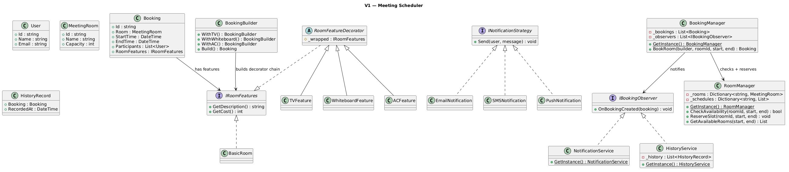
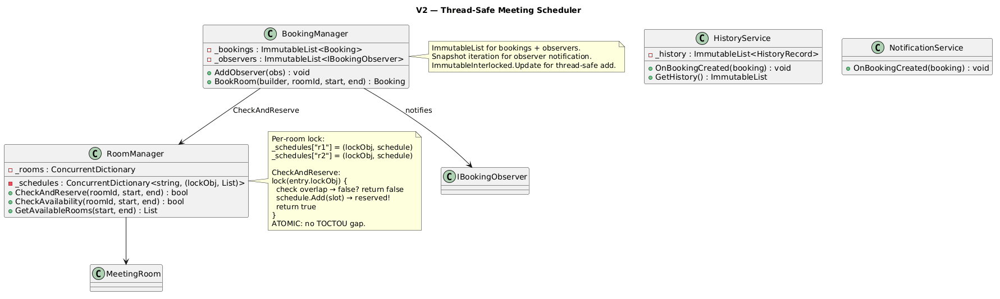
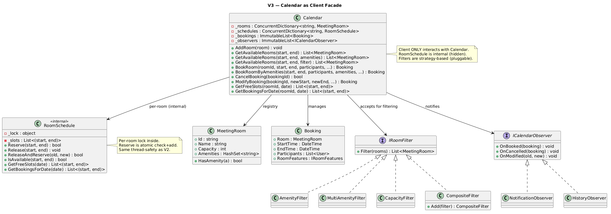

# Meeting Scheduler System

## Table of Contents

- [Problem Statement](#problem-statement)
- [Functional Requirements](#functional-requirements)
- [Non-Functional Requirements](#non-functional-requirements)
- [Core Entities](#core-entities)
- [Design Patterns](#design-patterns)
- [V1 — Basic Pipeline](#v1--basic-pipeline)
- [V1 to V2](#v1-to-v2)
- [V2 — Fully Thread-Safe](#v2--fully-thread-safe)
- [V2 to V3](#v2-to-v3)
- [V3 — Calendar as Client Facade](#v3--calendar-as-client-facade)

---

## Problem Statement

A meeting scheduler allows users to book meeting rooms for specific time slots. Rooms have optional features (TV, whiteboard, AC). The system prevents double-bookings, notifies participants, and maintains meeting history.

---

## Functional Requirements

- Book a meeting room from start time to end time if available
- Show room unavailability immediately if conflicting
- Notify all participants of a booking
- Store history of all scheduled meetings
- View all available rooms for a time slot
- Support optional room features (TV, whiteboard, AC) at booking time

---

## Non-Functional Requirements

- **Thread-safety**: Handle concurrent booking requests without double-booking
- **Atomicity**: Check availability + reserve must be atomic
- **Extensibility**: Easy to add new features, notification channels, room types
- **Maintainability**: OO principles, testable in isolation

---

## Core Entities

| Entity | Responsibility |
|--------|---------------|
| **User** | Organizer/participant |
| **MeetingRoom** | Bookable room (id, name, capacity) |
| **Booking** | Scheduled meeting: room + time + participants + features |
| **HistoryRecord** | Stored record of a past booking |
| **IRoomFeatures** | Decorator interface: description + cost |
| **BasicRoom / TVFeature / WhiteboardFeature / ACFeature** | Decorator chain |
| **BookingBuilder** | Builder: fluent API for optional features |
| **INotificationStrategy** | Strategy: Email / SMS / Push |
| **IBookingObserver** | Observer: NotificationService, HistoryService |
| **RoomManager** | Singleton: manages rooms + schedules |
| **BookingManager** | Singleton: orchestrates booking + notifies observers |

### Why RoomManager Exists (Separate from BookingManager)

`RoomManager` is the **single source of truth** for which rooms exist and when they're occupied. Separating it from `BookingManager` provides:

**Single Responsibility:**
- `RoomManager` = "what rooms exist and when are they free" (resource management)
- `BookingManager` = "orchestrate a booking: check → build → reserve → notify" (workflow)

**Reusability — other services need room state without booking:**
- A "find me a room" UI calls `GetAvailableRooms()` — doesn't create a booking
- A dashboard shows room occupancy — reads schedules, never writes
- A maintenance system marks rooms unavailable — modifies room state without bookings

**Lock ownership is clear (V2):**
The per-room lock lives inside `RoomManager` because it protects the *schedule* — a concern of room management, not booking orchestration.

```
Without RoomManager (simple):
  BookingManager does everything → one class, tightly coupled

With RoomManager (extensible):
  BookingManager → asks RoomManager "is it free? reserve it"
  Dashboard → asks RoomManager "show me all room schedules"
  Maintenance → tells RoomManager "mark room unavailable"
  All use the same source of truth, without touching booking logic.
```

If the system is truly simple (no dashboard, no maintenance, no multi-service access), you can fold `RoomManager` into `BookingManager`. The separation is a design choice for extensibility.

---

## Design Patterns

| Pattern | Usage |
|---------|-------|
| **Singleton** | RoomManager, BookingManager, NotificationService, HistoryService |
| **Builder** | BookingBuilder — `.WithTV().WithWhiteboard().WithAC().Build()` |
| **Decorator** | BasicRoom → TVFeature → WhiteboardFeature → ACFeature (stacked) |
| **Strategy** | INotificationStrategy: Email, SMS, Push + NotificationFactory |
| **Observer** | BookingManager notifies NotificationService + HistoryService after booking |

---

## V1 — Basic Pipeline

### V1 Class Diagram

```plantuml

```

### V1 Booking Flow

```
user calls: bookingManager.BookRoom(builder, "r1", 9:00, 10:00)
│
├─ Step 1: roomManager.CheckAvailability("r1", 9:00, 10:00)
│     → scans schedule list for overlaps
│     → returns true (no conflict)
│
├─ Step 2: builder.Build()
│     → BasicRoom("Conference A")
│     → wrap with TVFeature
│     → wrap with WhiteboardFeature
│     → returns Booking with decorated features
│
├─ Step 3: roomManager.ReserveSlot("r1", 9:00, 10:00)
│     → adds (9:00, 10:00) to room's schedule
│
├─ Step 4: _bookings.Add(booking)
│
├─ Step 5: Notify observers
│     → NotificationService: sends email to all participants
│     → HistoryService: stores HistoryRecord
│
└─ return booking
```

### Cancel Flow

```
bookingManager.CancelBooking(bookingId)
│
├─ Find booking in _bookings list
├─ roomManager.ReleaseSlot(roomId, start, end)
│     → removes (start, end) from room's schedule
│     → room is now free for that time slot again
├─ Remove booking from _bookings
├─ Notify observers (participants get "meeting cancelled")
└─ return true
```

### Modify Flow

```
bookingManager.ModifyBooking(bookingId, newBuilder, newStart, newEnd)
│
├─ Find existing booking
├─ V1: Release old slot → Check new slot → Reserve new slot (3 steps — TOCTOU gap!)
│  V2: ReleaseAndReserve (ONE lock — atomic release + check + reserve)
│
├─ If new slot unavailable:
│     V1: Rollback — re-reserve old slot
│     V2: Rollback inside lock (old slot re-added)
│     → "Cannot modify — new time not available. Original preserved."
│     → return null
│
├─ If new slot available:
│     Replace booking in list
│     Notify observers
│     → return new booking
└─ Old time slot is now free, new slot occupied
```

### Modify TOCTOU Issue (V1)

```
V1 ModifyBooking:
  Step 1: ReleaseSlot(old)           ← room is free
  ═══ GAP: another thread sees room free, books it! ═══
  Step 2: CheckAvailability(new)     ← might conflict with step 1's released slot being taken
  Step 3: ReserveSlot(new)

V2 ReleaseAndReserve (atomic):
  lock(roomLock):
    RemoveAll(old slot)
    check conflict for new slot
    if conflict: re-add old slot (rollback)
    if no conflict: add new slot
  No gap — entire operation is one lock acquisition.
```

### V1 Thread-Safety Issues (with examples)

#### Issue 1: CheckAvailability + ReserveSlot TOCTOU

```csharp
// V1: Two SEPARATE calls — gap between check and reserve
public Booking? BookRoom(...)
{
    if (!_roomManager.CheckAvailability(roomId, start, end))  // CHECK
        return null;
    // ═══════ GAP: another thread can reserve the same slot here ═══════
    var booking = builder.Build();
    _roomManager.ReserveSlot(roomId, start, end);             // USE (reserve)
    ...
}
```

```
Thread A: CheckAvailability("r1", 9:00, 10:00) → true (room is free)
Thread B: CheckAvailability("r1", 9:00, 10:00) → true (room STILL free — A hasn't reserved yet!)

Thread A: ReserveSlot("r1", 9:00, 10:00) → schedule now has [9:00-10:00]
Thread B: ReserveSlot("r1", 9:00, 10:00) → schedule now has [9:00-10:00, 9:00-10:00] ← DOUBLE BOOKED!

Result: Two bookings for the same room at the same time.
  Both threads thought the room was available because Check and Reserve are separate.
```

#### Issue 2: Schedule List Concurrent Modification

```csharp
// V1: plain List<(DateTime, DateTime)>
public void ReserveSlot(string roomId, DateTime start, DateTime end)
{
    schedule.Add((start, end)); // List.Add — not thread-safe
}
```

```
Thread A: ReserveSlot → schedule.Add(...) — modifying the list
Thread B: CheckAvailability → schedule.Any(...) — iterating the list

Result: InvalidOperationException "Collection was modified during enumeration"
```

#### Issue 3: Observer List Race

```
Thread A: BookRoom succeeds → foreach (var obs in _observers) obs.OnBookingCreated(...)
Thread B: bookingManager.AddObserver(newObserver) → _observers.Add(...)

Result: "Collection was modified during enumeration" crash
```

#### Issue 4: Singleton Race

```csharp
// V1: not thread-safe
public static RoomManager GetInstance()
{
    _instance ??= new RoomManager(); // two threads can both see null!
    return _instance;
}
```

```
Thread A: _instance is null → creates RoomManager #1
Thread B: _instance is null (before A's write visible) → creates RoomManager #2

Result: Two different instances — rooms added to #1 aren't visible in #2.
```

#### Issue 5: History List Race

```
Thread A: HistoryService.OnBookingCreated → _history.Add(record)
Thread B: historyService.GetHistory() → _history.ToList() (iterates)

Result: ConcurrentModification crash or corrupted list.
```

---

## V1 to V2

### What Changed

| Aspect | V1 | V2 |
|--------|----|----|
| Check + Reserve | Two separate calls (TOCTOU) | Atomic `CheckAndReserve()` under per-room lock |
| Lock granularity | None | Per-room lock (different rooms parallel) |
| Schedule storage | `Dictionary<string, List>` | `ConcurrentDictionary` + per-room lock object |
| Bookings list | `List` (crash) | `ImmutableList` + `ImmutableInterlocked` |
| Observer list | `List` (crash) | `ImmutableList` + snapshot iteration |
| History | `List` (crash) | `ImmutableList` |
| Singleton init | `??=` (race) | `lock` + double-check locking |

---

## V2 — Fully Thread-Safe

### V2 Class Diagram


### How V2 Became Thread-Safe

#### Fix 1: Atomic CheckAndReserve (eliminates TOCTOU)

```csharp
// V2: Check + Reserve in ONE lock acquisition
public bool CheckAndReserve(string roomId, DateTime start, DateTime end)
{
    if (!_schedules.TryGetValue(roomId, out var entry)) return false;

    lock (entry.lockObj) // Per-room lock
    {
        // CHECK: any overlap?
        bool hasConflict = entry.schedule.Any(s => start < s.end && end > s.start);
        if (hasConflict) return false;

        // RESERVE: add to schedule (ATOMIC with check — no gap)
        entry.schedule.Add((start, end));
        return true;
    }
}
```

**Why per-room lock (not global):**
- Different rooms should be bookable in parallel
- Only same-room bookings need serialization
- Global lock would be a bottleneck (all rooms blocked)

#### Fix 4: Atomic ReleaseAndReserve (for Modify)

```csharp
// V2: Release old + check new + reserve new in ONE lock (no TOCTOU gap)
public bool ReleaseAndReserve(string roomId, DateTime oldStart, DateTime oldEnd, DateTime newStart, DateTime newEnd)
{
    if (!_schedules.TryGetValue(roomId, out var entry)) return false;
    lock (entry.lockObj)
    {
        // Release old slot
        entry.schedule.RemoveAll(s => s.start == oldStart && s.end == oldEnd);

        // Check new slot for conflicts
        bool hasConflict = entry.schedule.Any(s => newStart < s.end && newEnd > s.start);
        if (hasConflict)
        {
            // Rollback: re-add old slot (atomic — still inside lock)
            entry.schedule.Add((oldStart, oldEnd));
            return false;
        }

        // Reserve new slot
        entry.schedule.Add((newStart, newEnd));
        return true;
    }
}
```

**Why this is better than V1's 3-step approach:**
- V1: `ReleaseSlot` → gap → `CheckAvailability` → gap → `ReserveSlot` (3 lock acquisitions, 2 gaps)
- V2: `ReleaseAndReserve` (1 lock acquisition, 0 gaps, atomic rollback on failure)

#### Fix 2: ImmutableList for Collections

```csharp
// V2: Bookings — safe concurrent add + iterate
private ImmutableList<Booking> _bookings = ImmutableList<Booking>.Empty;

// Add: creates new list, old references unaffected
ImmutableInterlocked.Update(ref _bookings, list => list.Add(booking));

// Iterate: snapshot is immutable, safe even if Add runs concurrently
var observers = _observers; // snapshot
foreach (var obs in observers) obs.OnBookingCreated(booking);
```

#### Fix 3: Thread-Safe Singletons

```csharp
// V2: Double-checked locking
private static RoomManager? _instance;
private static readonly object _singletonLock = new();

public static RoomManager GetInstance()
{
    if (_instance == null)           // fast path (no lock after init)
        lock (_singletonLock)        // only one thread creates
            _instance ??= new RoomManager();
    return _instance;
}
```

### V2 Concurrent Booking Race (Example)

```
Setup:
  Conference A: empty schedule
  Thread A: Book 9:00-10:00 (Alice's team meeting)
  Thread B: Book 9:00-10:00 (Bob's standup)

Timeline:

T1  Thread A: BookRoom(..., "r1", 9:00, 10:00)
    Thread B: BookRoom(..., "r1", 9:00, 10:00)

T2  Thread A: roomManager.CheckAndReserve("r1", 9:00, 10:00)
    Thread B: roomManager.CheckAndReserve("r1", 9:00, 10:00)

T3  Thread A: lock(r1.lockObj) ← ACQUIRED
    Thread B: lock(r1.lockObj) ← BLOCKED (waiting)

T4  Thread A (inside lock):
      schedule.Any(s => 9:00 < s.end && 10:00 > s.start) → false (empty)
      schedule.Add((9:00, 10:00)) ← RESERVED
      return true
    EXIT lock

T5  Thread B: lock(r1.lockObj) ← ACQUIRED
      schedule.Any(s => 9:00 < s.end && 10:00 > s.start) → TRUE!
        (9:00 < 10:00 && 10:00 > 9:00 → overlap with Thread A's booking)
      return false ← REJECTED
    EXIT lock

T6  Thread A: builder.Build(), add to bookings, notify observers → SUCCESS
    Thread B: "Room r1 NOT available" → FAILED

Result:
  Alice: BOOKED ✓
  Bob: REJECTED ✗ (no double-booking)
  Per-room lock ensured check + reserve was atomic.
```

### Different Rooms in Parallel

```
Thread A: CheckAndReserve("r1", ...) → lock(r1.lockObj) ← ACQUIRED
Thread B: CheckAndReserve("r2", ...) → lock(r2.lockObj) ← ACQUIRED (different lock!)

Both proceed simultaneously — no contention.
Different rooms never block each other.
```

### Decorator Chain Example

```
BookingBuilder(room, 9:00, 10:00, [Alice, Bob])
  .WithTV()
  .WithWhiteboard()
  .Build()

Build() creates:
  BasicRoom("Conference A")                          → "Conference A (Table & Chairs)"
    └─ TVFeature(basicRoom)                          → + " + TV"           cost: +50
        └─ WhiteboardFeature(tvFeature)              → + " + Whiteboard"   cost: +20

Final: "Conference A (Table & Chairs) + TV + Whiteboard"
Cost: 0 + 50 + 20 = $70
```

### Amenity-Based Booking Flow

```
bookingManager.BookRoomByAmenities(16:00, 17:00, [Alice, Bob], ["Projector", "VideoConf"], withTV: true)
│
├─ Step 1: Filter available rooms by amenities
│     roomManager.FilterRooms(16:00, 17:00, MultiAmenityFilter(["Projector", "VideoConf"]))
│       → GetAvailableRooms(16:00, 17:00) → [Conference A, Board Room, Huddle Space]
│       → Filter: must have BOTH Projector AND VideoConf
│       → Result: [Board Room]
│
├─ Step 2: Auto-pick first matching room
│     → Board Room (cap:20, [TV, Projector, VideoConf, AC])
│
├─ Step 3: V1: CheckAvailability + ReserveSlot (two calls)
│           V2: CheckAndReserve atomically (one per-room lock)
│
├─ Step 4: Build booking (Builder applies decorators)
│     BasicRoom("Board Room") + TVFeature
│
├─ Step 5: Notify observers
│     → Email to Alice, Bob
│     → History stored
│
└─ Return booking

If no room matches: "No room with [Projector, VideoConf] available for 16:00-17:00"
```

**V2 thread-safety for BookRoomByAmenities:**

```
V1: Filter returns [Board Room] → check availability → reserve
    GAP: another thread could book Board Room between filter and reserve!

V2: Filter returns [Board Room] → TRY CheckAndReserve (atomic per-room lock)
    If another thread grabbed it first → CheckAndReserve returns false
    → Try next matching room in the list
    → If all taken: "All matching rooms taken"
    This retry loop handles races without TOCTOU.
```

#### Code: V2 BookRoomByAmenities (retry loop)

```csharp
public Booking? BookRoomByAmenities(DateTime start, DateTime end, List<User> participants,
    List<string> requiredAmenities, ...)
{
    var matching = _roomManager.FilterRooms(start, end, new MultiAmenityFilter(requiredAmenities));

    if (matching.Count == 0) return null; // no rooms with those amenities

    // Try each matching room — handles race where another thread grabs one
    foreach (var room in matching)
    {
        if (_roomManager.CheckAndReserve(room.Id, start, end)) // atomic per-room lock
        {
            // Success — this room is ours
            var booking = builder.Build();
            return booking;
        }
        // This room was taken by another thread — try next
    }

    return null; // all matching rooms grabbed by other threads
}
```

### Observer Flow After Booking

```
bookingManager.BookRoom(builder, "r1", 9:00, 10:00)
  │
  ├─ CheckAndReserve → success
  ├─ builder.Build() → Booking with decorators
  ├─ ImmutableInterlocked.Update(_bookings, add)
  │
  └─ Notify observers (snapshot iteration):
       ├─ NotificationService.OnBookingCreated(booking)
       │     → EmailNotification.Send(alice, "Meeting booked: Conference A (09:00-10:00)")
       │     → EmailNotification.Send(bob, "Meeting booked: Conference A (09:00-10:00)")
       │
       └─ HistoryService.OnBookingCreated(booking)
             → ImmutableInterlocked.Update(_history, add record)
             → "[History] Stored: Booking(...)"
```

### Thread-Safety Summary

```
Component         | V1 Issue              | V2 Fix
──────────────────┼───────────────────────┼─────────────────────────────────
Check+Reserve     | TOCTOU (two calls)    | Atomic CheckAndReserve (one lock)
Lock scope        | None                  | Per-room lock (parallel rooms OK)
Schedule list     | Plain List (crash)    | List under per-room lock
Bookings/History  | List (crash)          | ImmutableList + ImmutableInterlocked
Observer list     | List (crash)          | ImmutableList (snapshot iteration)
Singleton init    | ??= (race)            | lock + double-check locking
```

---

## V2 to V3

V3 restructures the system so the **Calendar is the single client-facing facade**. The client no longer interacts with `RoomManager` or `BookingManager` — they talk only to `Calendar`.

### What Changed

| Aspect | V2 | V3 |
|--------|----|----|
| Client entry point | `BookingManager` + `RoomManager` (2 classes) | `Calendar` (single facade) |
| Who manages schedules | `RoomManager` (external dict of schedules) | `RoomSchedule` (internal, per-room, client never sees it) |
| Who manages bookings | `BookingManager` | `Calendar` |
| Who manages rooms | `RoomManager` (Singleton) | `Calendar` (owns room registry) |
| Availability query | `roomManager.GetAvailableRooms(...)` | `calendar.GetAvailableRooms(...)` |
| Booking | `bookingManager.BookRoom(builder, roomId, ...)` | `calendar.BookRoom(roomId, ..., withTV: true)` |
| Cancel | `bookingManager.CancelBooking(id)` | `calendar.CancelBooking(id)` |
| Free slots | `roomManager.GetFreeSlots(roomId, date)` | `calendar.GetFreeSlots(roomId, date)` |
| Builder visible to client | Yes (client constructs BookingBuilder) | No (Calendar builds internally) |
| RoomManager/BookingManager | Public Singletons | Don't exist as separate classes |

---

## V3 — Calendar as Client Facade

### V3 Class Diagram 


### V3 Client API

```csharp
var calendar = new Calendar();

// Admin setup
calendar.AddRoom(new MeetingRoom("r1", "Conference A", 10, "TV", "Whiteboard", "AC"));
calendar.AddRoom(new MeetingRoom("r2", "Board Room", 20, "TV", "Projector", "VideoConf", "AC"));
calendar.AddObserver(new NotificationObserver());

// Client: "What rooms are free 9-10?"
var rooms = calendar.GetAvailableRooms(start, end);

// Client: "What rooms have Projector and are free 9-10?"
var projRooms = calendar.GetAvailableRooms(start, end, new List<string> { "Projector" });

// Client: "Custom filter: capacity >= 10 AND has AC"
var filtered = calendar.GetAvailableRooms(start, end,
    new CompositeFilter()
        .Add(new CapacityFilter(10))
        .Add(new AmenityFilter("AC")));

// Client: "Rooms with BOTH Projector AND VideoConf"
var multiFiltered = calendar.GetAvailableRooms(start, end,
    new MultiAmenityFilter(new List<string> { "Projector", "VideoConf" }));

// Client: "Book Conference A 9-10 with TV"
calendar.BookRoom("r1", start, end, new List<User> { alice, bob }, withTV: true);

// Client: "Find me a room with VideoConf and book it"
calendar.BookRoomByAmenities(start, end, participants, new List<string> { "VideoConf" });

// Client: "Show me free slots for Conference A"
calendar.GetFreeSlots("r1", today);

// Client: "Cancel my meeting"
calendar.CancelBooking(bookingId);

// Client: "Move my 2pm to 11am"
calendar.ModifyBooking(bookingId, newStart, newEnd, withAC: true);
```

### Filter Strategy (pluggable room filtering)

```
IRoomFilter interface: Filter(List<MeetingRoom>) → List<MeetingRoom>

Implementations:
  AmenityFilter("TV")        → rooms with TV
  MultiAmenityFilter(["Projector", "VideoConf"]) → rooms with ALL listed
  CapacityFilter(10)         → rooms with capacity >= 10
  CompositeFilter            → chains filters: filter1 → filter2 → filter3 (AND logic)

Usage with Calendar:
  calendar.GetAvailableRooms(start, end, filter)
    Step 1: Get rooms available in time slot (RoomSchedule.IsAvailable)
    Step 2: Apply filter on the available list
    Step 3: Return matching rooms

Adding a new filter (e.g., "has phone", "on floor 3"):
  Just implement IRoomFilter — no changes to Calendar.
```

### V3 Booking Flow (Client → Calendar)

```
Client: calendar.BookRoom("r1", 9:00, 10:00, [Alice, Bob], withTV: true)
│
├─ Calendar looks up MeetingRoom "r1" from _rooms
├─ Calendar looks up RoomSchedule for "r1" from _schedules
│
├─ RoomSchedule.Reserve(9:00, 10:00)
│     lock(_lock)
│       check overlap → none
│       _slots.Add((9:00, 10:00))
│       return true
│     unlock
│
├─ Calendar builds Booking internally:
│     BasicRoom("Conference A") + TVFeature → decorated features
│
├─ ImmutableInterlocked.Update(_bookings, add)
│
├─ Notify observers:
│     NotificationObserver → "Email → Alice: Meeting booked..."
│     HistoryObserver → stores in history
│
└─ return Booking
```

### V3 Book-by-Amenities Flow

```
Client: calendar.BookRoomByAmenities(9:00, 10:00, [All], ["Projector", "VideoConf"])
│
├─ calendar.GetAvailableRooms(9:00, 10:00, ["Projector", "VideoConf"])
│     → filter rooms: available AND has ALL amenities
│     → result: [Board Room]
│
├─ Try Board Room:
│     _schedules["r2"].Reserve(9:00, 10:00)
│       lock → check → no conflict → add → return true
│
├─ Build Booking with Board Room + features
├─ Notify observers
└─ return Booking

If another thread grabbed Board Room between filter and reserve:
  → Reserve returns false
  → Try next matching room in the list
  → If all taken: "All matching rooms taken"
```

### How RoomSchedule Works (with examples)

`RoomSchedule` is the internal per-room time slot manager. It owns a list of booked `(start, end)` tuples and all operations are under a per-room lock.

#### Data Structure

```
_slots: List<(DateTime start, DateTime end)>

After 2 bookings:
  _slots = [(9:00, 10:00), (14:00, 16:00)]
```

#### Reserve(start, end) — check overlap with for loop

```csharp
public bool Reserve(DateTime start, DateTime end)
{
    lock (_lock)
    {
        for (int i = 0; i < _slots.Count; i++)
        {
            if (start < _slots[i].end && end > _slots[i].start)
                return false; // overlap found — reject
        }
        _slots.Add((start, end));
        return true;
    }
}
```

```
Overlap formula: start < slot.end && end > slot.start

Example 1: Reserve(11:00, 12:00), existing = [(9:00, 10:00)]
  i=0: 11:00 < 10:00? NO → no overlap
  Loop done → _slots.Add → RESERVED ✓

Example 2: Reserve(9:30, 10:30), existing = [(9:00, 10:00)]
  i=0: 9:30 < 10:00? YES  AND  10:30 > 9:00? YES → OVERLAP → REJECTED ✗

Example 3: Reserve(10:00, 11:00), existing = [(9:00, 10:00)]
  i=0: 10:00 < 10:00? NO → no overlap (back-to-back is OK)
  → RESERVED ✓
```

#### Release(start, end) — reverse loop for safe removal

```csharp
public void Release(DateTime start, DateTime end)
{
    lock (_lock)
    {
        for (int i = _slots.Count - 1; i >= 0; i--)
        {
            if (_slots[i].start == start && _slots[i].end == end)
            {
                _slots.RemoveAt(i);
                break; // exact match found, done
            }
        }
    }
}
```

```
Why reverse loop: RemoveAt(i) shifts elements left. Iterating backwards avoids
skipping elements after removal.

Example: Release(14:00, 16:00), _slots = [(9:00, 10:00), (14:00, 16:00)]
  i=1: (14:00, 16:00) == (14:00, 16:00)? YES → RemoveAt(1) → break
  Result: _slots = [(9:00, 10:00)]
```

#### ReleaseAndReserve — atomic modify (no TOCTOU)

```csharp
lock (_lock)
{
    // 1. Remove old slot (reverse loop)
    // 2. Check new slot for conflicts (forward loop)
    //    If conflict: ROLLBACK (re-add old)
    // 3. Add new slot
}
```

```
Example: Modify (14:00, 16:00) → (11:00, 12:00)
  Before: _slots = [(9:00, 10:00), (14:00, 16:00)]

  Step 1: Remove (14:00, 16:00) → _slots = [(9:00, 10:00)]
  Step 2: Check (11:00, 12:00) vs [(9:00, 10:00)]
           i=0: 11:00 < 10:00? NO → no conflict
  Step 3: Add → _slots = [(9:00, 10:00), (11:00, 12:00)]
  Result: true ✓

Example: Modify (14:00, 16:00) → (9:30, 10:30) — FAILS
  Step 1: Remove (14:00, 16:00) → _slots = [(9:00, 10:00)]
  Step 2: Check (9:30, 10:30) vs [(9:00, 10:00)]
           i=0: 9:30 < 10:00? YES → CONFLICT!
  ROLLBACK: re-add (14:00, 16:00) → _slots = [(9:00, 10:00), (14:00, 16:00)]
  Result: false ✗ (original preserved)
```

#### GetFreeSlots — sweep algorithm

```csharp
lock (_lock)
{
    // 1. Collect today's slots into daySlots, sort by start time
    // 2. "Cursor" starts at workStart (e.g., 9:00)
    // 3. For each booked slot:
    //      - If gap between cursor and slot start → that's FREE
    //      - Advance cursor past slot end
    // 4. After loop: if cursor < workEnd → remaining is FREE
}
```

```
Example: _slots = [(9:00, 10:00), (14:00, 16:00)], work hours 9:00-18:00

  daySlots sorted = [(9:00, 10:00), (14:00, 16:00)]
  cur = 9:00

  i=0: slot (9:00, 10:00)
    sStart=9:00 > cur=9:00? NO → no gap
    Advance: cur = 10:00

  i=1: slot (14:00, 16:00)
    sStart=14:00 > cur=10:00? YES → FREE (10:00, 14:00) ✓
    Advance: cur = 16:00

  After loop: cur=16:00 < dayEnd=18:00 → FREE (16:00, 18:00) ✓

  Result: [(10:00, 14:00), (16:00, 18:00)]
```

**Visual:**
```
9:00       10:00                14:00       16:00                18:00
  │█████████│                    │███████████│                    │
  │ booked  │    FREE 10-14      │  booked   │    FREE 16-18     │
  │         │◄──────────────────►│           │◄─────────────────►│
```

**Another example: 3 bookings**
```
_slots = [(9:00, 9:30), (11:00, 12:00), (14:00, 16:00)]

  cur=9:00
  i=0: (9:00, 9:30) → no gap, cur=9:30
  i=1: (11:00, 12:00) → gap! FREE (9:30, 11:00). cur=12:00
  i=2: (14:00, 16:00) → gap! FREE (12:00, 14:00). cur=16:00
  After: FREE (16:00, 18:00)

  Result: [(9:30, 11:00), (12:00, 14:00), (16:00, 18:00)]

9:00 9:30     11:00 12:00     14:00 16:00     18:00
 │███│          │████│          │████│          │
      FREE 9:30      FREE 12        FREE 16
      to 11:00       to 14:00       to 18:00
```

### Why Calendar (not BookingManager + RoomManager)

```
V2 Client code:
  var roomManager = RoomManager.GetInstance();
  var bookingManager = BookingManager.GetInstance(roomManager);
  bookingManager.AddObserver(NotificationService.GetInstance());
  bookingManager.AddObserver(HistoryService.GetInstance());
  var available = roomManager.GetAvailableRooms(start, end);
  bookingManager.BookRoom(builder, "r1", start, end);

V3 Client code:
  var calendar = new Calendar();
  calendar.AddObserver(new NotificationObserver());
  var available = calendar.GetAvailableRooms(start, end);
  calendar.BookRoom("r1", start, end, participants, withTV: true);

V3 is simpler because:
  - ONE object to interact with (not 2 singletons + observer wiring)
  - No Builder visible to client (Calendar builds internally from flags)
  - No need to know about RoomManager or BookingManager
  - Same thread-safety (per-room lock inside RoomSchedule)
  - Same features (book, cancel, modify, filter, free slots)
```

### Thread-Safety (same as V2)

```
Component            | Mechanism
─────────────────────┼─────────────────────────────────────
RoomSchedule         | Per-room lock (Reserve/Release/Modify atomic)
Different rooms      | Independent locks (parallel booking OK)
_bookings            | ImmutableList + ImmutableInterlocked
_observers           | ImmutableList (snapshot iteration)
Room registry        | ConcurrentDictionary
```
