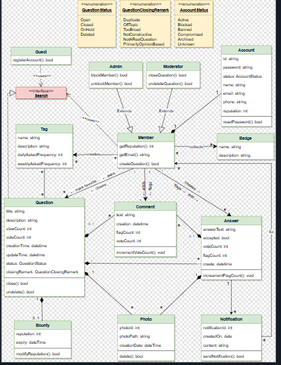

# StackOverflow System

## Table of Contents

- [Problem Statement](#problem-statement)
- [Functional Requirements](#functional-requirements)
- [Non-Functional Requirements](#non-functional-requirements)
- [Core Entities](#core-entities)
- [Relationships Between Entities](#relationships-between-entities)
- [V1 — Basic Pipeline](#v1--basic-pipeline)
- [V1 to V2](#v1-to-v2)
- [V2 — Fully Thread-Safe](#v2--fully-thread-safe)

---

## Problem Statement

A Q&A platform where members post questions, others answer, the community votes, and moderators manage quality. Reputation and badges incentivize helpful participation.

---

## Functional Requirements

- Guests can search/view; must become members to post or vote
- Members post questions (with tags), answers, and comments
- Members upvote questions, answers, and comments
- Members can flag posts for moderator attention
- Members can add bounties to their questions
- Members earn badges for being helpful
- Members vote to close questions (5 votes needed)
- Moderators can close/reopen/undelete questions
- Admins can block/unblock members
- System identifies most frequently used tags

---

## Non-Functional Requirements

- **Consistency**: Votes and reputation updates reflected immediately
- **Concurrency**: Handle simultaneous votes on the same post
- **Scalability**: Support growing users, questions, and answers

---

## Core Entities

| Entity | Responsibility |
|--------|---------------|
| **Account** | id, password, name, email, phone, reputation, status |
| **Guest** | Can search only, registerAccount() |
| **Member** (extends Guest) | Post questions/answers/comments, vote, flag, bounty, badges |
| **Admin** (extends Member) | blockMember(), unblockMember() |
| **Moderator** (extends Member) | closeQuestion(), undeleteQuestion() |
| **Question** | title, description, viewCount, voteCount, status, closingRemark, bounty |
| **Answer** | answerText, accepted, voteCount, flagCount |
| **Comment** | text, flagCount, voteCount |
| **Tag** | name, dailyAskedFrequency, weeklyAskedFrequency |
| **Bounty** | reputation, expiry |
| **Badge** | name, description |
| **Notification** | notificationId, content, sendNotification() |

---
## Class Diagram

---

## Relationships Between Entities

```
Guest ──► Member ──► Admin
                ──► Moderator

Member:
  - asks → Question (1:many)
  - answers → Answer (1:many)
  - comments → Comment (1:many)
  - marks favorite → Question (many:many)
  - collects → Badge (1:many)
  - receives → Notification (1:many)

Question:
  - has → Answer[] (1:many)
  - has → Comment[] (1:many)
  - tagged with → Tag[] (many:many)
  - may have → Bounty (0..1)
  - status: Open/Closed/OnHold/Deleted

Answer:
  - has → Comment[] (1:many)
  - may be accepted (0..1 per question)
```

---

## V1 — Basic Pipeline

### All Flows

#### 1. Registration Flow

```
Guest.RegisterAccount() → Account(status=Active, rep=1)
    ↓
Service wraps in Member/Admin/Moderator
    ↓
Stored in _members registry

Roles:
  Guest     → search/view only
  Member    → post, vote, comment, flag, bounty, badges
  Admin     → + block/unblock members
  Moderator → + close/undelete questions
```

#### 2. Post Question Flow

```
service.PostQuestion("alice", title, description, ["c#", "algorithms"])
│
├─ Validate: member exists? Account.Status == Active?
├─ Resolve tags: _tags.GetOrAdd(name) → increment frequency
├─ Create Question(authorId, title, desc, tags) → Status=Open
├─ Store in _questions
└─ "[Q] Alice posted: 'How to reverse...' [c#, algorithms]"
```

#### 3. Post Answer Flow

```
service.PostAnswer("bob", questionId, "Use three pointers")
│
├─ Validate: member? active? question exists? Status==Open?
├─ Create Answer(authorId, text) → VoteCount=0, Accepted=false
├─ question.AddAnswer(answer)
├─ Notify question author:
│     alice.AddNotification("New answer by Bob")
│     → "[Notification] New answer on '...' by Bob"
└─ "[A] Bob answered: '...'"
```

#### 4. Voting Flow

```
service.VoteQuestion("bob", questionId)
├─ question.IncrementVoteCount()  → VoteCount++
└─ author.Account.Reputation += 10

service.VoteAnswer("alice", questionId, answerId)
├─ answer.IncrementVoteCount()    → VoteCount++
└─ author.Account.Reputation += 10

service.VoteComment("bob", questionId, commentId)
└─ comment.IncrementVoteCount()   → VoteCount++ (no rep change)
```

#### 5. Accept Answer Flow

```
service.AcceptAnswer("alice", questionId, answerId)
│
├─ Validate: question.AuthorId == callerId? (only author accepts)
├─ answer.Accepted = true
├─ Answer author gets +15 rep
└─ "[✓] Accepted answer by bob"
```

#### 6. Bounty Flow

```
service.AddBounty("alice", questionId, 50)
│
├─ Validate: member? author? has enough rep?
├─ Create Bounty(rep=50, expiry=7 days)
├─ bounty.ModifyReputation(account) → account.Reputation -= 50
├─ question.Bounty = bounty
└─ "[Bounty] Alice added 50 rep bounty"
```

#### 7. Comment Flow

```
service.CommentOnQuestion("bob", questionId, "Have you tried iterative?")
├─ Create Comment(text)
└─ question.AddComment(comment)

service.CommentOnAnswer("alice", questionId, answerId, "Thanks!")
├─ Create Comment(text)
└─ answer.AddComment(comment)
```

#### 8. Moderator Close/Undelete Flow

```
mod.CloseQuestion(question, OffTopic)
├─ question.Close(remark) → Status: Open → Closed, ClosingRemark = OffTopic
└─ "[Mod] ModDave closed 'Favorite color?' (OffTopic)"

mod.UndeleteQuestion(question)
├─ question.Undelete() → Status: Deleted → Open
└─ "[Mod] ModDave undeleted 'Favorite color?'"
```

#### 9. Admin Block/Unblock Flow

```
admin.BlockMember(charlie)
├─ charlie.Account.Status = Blocked
├─ Effect: PostQuestion/PostAnswer return null (status check fails)
└─ "[Admin] AdminEve blocked Charlie"

admin.UnblockMember(charlie)
├─ charlie.Account.Status = Active
└─ "[Admin] AdminEve unblocked Charlie"
```

#### 10. Search Flow

```
service.Search("linked list")
├─ Scan all questions where Status != Deleted
├─ Match: Title.Contains OR Description.Contains OR Tags.Any(name==query)
└─ Return matching questions

service.GetTopTags(5)
├─ _tags.Values.OrderByDescending(DailyAskedFrequency)
└─ Return top 5
```

#### 11. Flagging Flow

```
service.FlagAnswer("alice", questionId, answerId)
├─ answer.IncrementFlagCount()
└─ "[Flag] Answer by charlie flagged by alice"
```

#### 12. Badge Flow

```
service.AwardBadge("bob", "First Answer", "Posted first answer")
├─ member.CollectBadge(new Badge(...))
└─ "[Badge] Bob earned 'First Answer'"
```

#### 13. Reputation Summary

```
Action                    | Rep Change
──────────────────────────┼───────────
Question upvoted          | Author +10
Answer upvoted            | Author +10
Answer accepted           | Author +15
Bounty offered            | Offerer −(amount)
Minimum reputation        | 1 (never below)
```

#### 14. Status Transitions

```
Question:
  Open ──► Closed (moderator or 5 community votes)
  Open ──► OnHold
  Open ──► Deleted (author or admin)
  Closed ──► Open (moderator reopens)
  Deleted ──► Open (moderator undeletes)

Account:
  Active ──► Blocked (admin)
  Blocked ──► Active (admin unblocks)
```

### V1 Limitations (with race condition examples)

#### Limitation 1: VoteCount++ is not atomic

```
V1 code: public void IncrementVoteCount() => VoteCount++;

VoteCount++ is actually: read → add 1 → write (3 operations)

Thread A: reads VoteCount = 5
Thread B: reads VoteCount = 5  (same value! A hasn't written yet)
Thread A: writes VoteCount = 6
Thread B: writes VoteCount = 6  (overwrites A's result!)

Expected: 7 (two votes). Actual: 6 (lost update).
With 10 concurrent voters, you might get 7-8 instead of 10.
```

#### Limitation 2: Reputation += N is not atomic

```
V1 code: author.Account.Reputation += 10;

Same problem as VoteCount:
Thread A: reads Rep = 100, computes 110
Thread B: reads Rep = 100, computes 110  (before A writes!)
Thread A: writes 110
Thread B: writes 110

Expected: 120. Actual: 110. Lost 10 rep.
```

#### Limitation 3: Lists crash on concurrent add + iterate

```
V1 code: question.AddAnswer(answer) uses List.Add()

Thread A: service.Search() → iterates question._answers (foreach)
Thread B: service.PostAnswer() → question._answers.Add(newAnswer)

Result: Thread A throws InvalidOperationException
  "Collection was modified during enumeration"
```

#### Limitation 4: Answer during Close (TOCTOU)

```
V1 code:
  PostAnswer: if (question.Status != Open) return null;  // CHECK
              question.AddAnswer(answer);                  // USE

Thread A (PostAnswer):
  Check: question.Status == Open ✓ (passes)
  ── GAP ──
Thread B (Moderator Close):
  question.Status = Closed

Thread A (continues):
  question.AddAnswer(answer)  ← adds to a CLOSED question!

Result: Answer posted on a closed question — inconsistent state.
```

#### Limitation 5: Two threads accept different answers

```
V1 code: answer.Accepted = true (plain setter)

Thread A: AcceptAnswer(q, answer1) → answer1.Accepted = true
Thread B: AcceptAnswer(q, answer2) → answer2.Accepted = true

Both succeed — now TWO answers are "accepted" on the same question.
(May be valid in some designs, but if you want exactly one accepted answer,
this is a bug without a lock.)
```

#### Limitation 6: Tag frequency lost updates

```
V1 code: tag.DailyAskedFrequency++

Two threads post questions with the same tag:
Thread A: reads freq = 5, writes 6
Thread B: reads freq = 5, writes 6 (should be 7)

Result: One increment lost.
```

---

## V1 to V2

### What Changed

| Aspect | V1 | V2 |
|--------|----|----|
| VoteCount/FlagCount | Plain `++` (race) | `Interlocked.Increment` |
| Reputation | Plain `+=` (race) | `Interlocked.Add` |
| Tag frequency | Plain `++` | `Interlocked.Increment` |
| Answers/Comments lists | `List` (crash) | `ImmutableList` + `ImmutableInterlocked` |
| Question.Status | Plain setter (TOCTOU) | Per-question lock + `TryClose/TryAddAnswer` |
| Answer.Accepted | Plain setter | Per-question lock + `TryAcceptAnswer` |
| Bounty | Plain setter | Per-question lock + `TrySetBounty` |
| Badges/Favorites/Notifications | `List` | `ImmutableList` |
| Notification/Photo IDs | `_nextId++` | `Interlocked.Increment` |

---

## V2 — Fully Thread-Safe

### V2 Key Fixes

#### Fix 1: Interlocked for counters

```csharp
// V1: VoteCount++ (read-modify-write race)
// V2: Interlocked.Increment (atomic single instruction)
private int _voteCount;
public void IncrementVoteCount() => Interlocked.Increment(ref _voteCount);

// V1: account.Reputation += 10 (race)
// V2: Interlocked.Add (atomic)
private int _reputation;
public void AddReputation(int amount) => Interlocked.Add(ref _reputation, amount);
```

#### Fix 2: ImmutableList for collections

```csharp
// V1: List<Answer> _answers → Add() crashes during concurrent iteration
// V2: ImmutableList — Add creates new list, old iterations continue safely
private ImmutableList<Answer> _answers = ImmutableList<Answer>.Empty;

public bool TryAddAnswer(Answer answer)
{
    lock (_lock) // per-question lock
    {
        if (_status != QuestionStatus.Open) return false;
        ImmutableInterlocked.Update(ref _answers, list => list.Add(answer));
        return true;
    }
}
```

#### Fix 3: Per-question lock for status transitions

```csharp
// V2: Atomic check + set — no TOCTOU gap between status check and modification
public bool TryClose(QuestionClosingRemark remark)
{
    lock (_lock)
    {
        if (_status != QuestionStatus.Open && _status != QuestionStatus.OnHold) return false;
        _status = QuestionStatus.Closed;
        _closingRemark = remark;
        return true;
    }
}

// PostAnswer uses TryAddAnswer which also holds the per-question lock:
// If close wins the lock first → status=Closed → TryAddAnswer fails
// If answer wins first → answer added → then close succeeds (answer is preserved)
```

#### Fix 4: Per-question lock for accept

```csharp
public bool TryAcceptAnswer(string answerId, string callerId)
{
    lock (_lock)
    {
        if (AuthorId != callerId) return false;
        var answer = _answers.FirstOrDefault(a => a.Id == answerId);
        if (answer == null) return false;
        answer.SetAccepted(true);
        return true;
    }
}
```

### V2 Concurrent Voting Example

```
Setup: 10 threads upvote the same question simultaneously

V1 result (broken):
  Thread 1-10 all read VoteCount=0
  All compute 0+1=1
  All write 1
  Final: VoteCount = 1 (9 votes lost!)

V2 result (correct):
  Thread 1: Interlocked.Increment(ref _voteCount) → atomically 0→1
  Thread 2: Interlocked.Increment(ref _voteCount) → atomically 1→2
  Thread 3: Interlocked.Increment(ref _voteCount) → atomically 2→3
  ...
  Thread 10: Interlocked.Increment(ref _voteCount) → atomically 9→10
  Final: VoteCount = 10 ✓ (no lost updates)

  Interlocked.Increment is a single CPU instruction (lock xadd)
  — no thread can see a partial result.
```

### V2 Answer vs Close Race

```
Setup:
  Question "Favorite IDE?" status = Open
  Thread A: PostAnswer("charlie", questionId, "VS Code!")
  Thread B: mod.CloseQuestion(question, PrimarilyOpinionBased)

Timeline (per-question lock):

T1  Thread A: TryAddAnswer(answer)
    Thread B: TryClose(PrimarilyOpinionBased)

T2  Thread B: lock(_lock) ← ACQUIRED
    Thread A: lock(_lock) ← BLOCKED

T3  Thread B (inside lock):
      _status == Open ✓
      _status = Closed
      return true
    EXIT lock

T4  Thread A: lock(_lock) ← ACQUIRED
      _status == Open? NO (it's Closed now!)
      return false
    EXIT lock

Result:
  Close: succeeded → Status = Closed
  Answer: REJECTED ("Cannot answer — question is Closed")
  No answer on a closed question — consistent!

If Thread A won the lock first:
  Answer added (while still Open) → then close succeeds
  Answer is preserved — also consistent! (it was valid when added)
```

### V2 Concurrent Accept

```
Thread A: TryAcceptAnswer(q, answer1, "alice")
Thread B: TryAcceptAnswer(q, answer2, "alice")

T1  Thread A: lock(_lock) ← ACQUIRED
    Thread B: lock(_lock) ← BLOCKED

T2  Thread A: answer1.SetAccepted(true), return true. EXIT lock.
T3  Thread B: lock(_lock) ← ACQUIRED
              answer2.SetAccepted(true), return true. EXIT lock.

Result: Both accepted. No crash, no corruption.
(If business rule is "only one accepted" — add a check inside the lock:
  if (_answers.Any(a => a.Accepted)) return false;)
```
