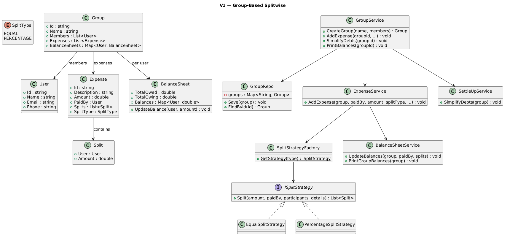
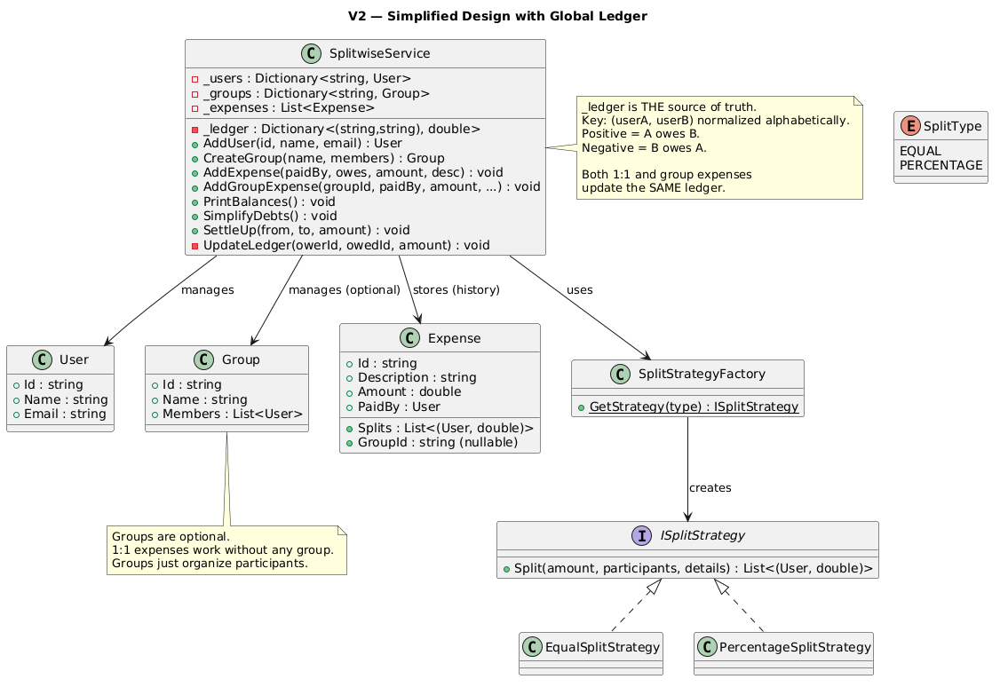

# Splitwise System

## Table of Contents

- [Problem Statement](#problem-statement)
- [Functional Requirements](#functional-requirements)
- [Non-Functional Requirements](#non-functional-requirements)
- [Core Entities](#core-entities)
- [Design Patterns](#design-patterns)
- [Architecture](#architecture)
- [Split Strategies](#split-strategies)
- [Debt Simplification Algorithm](#debt-simplification-algorithm)
- [Full Example Walkthrough](#full-example-walkthrough)

---

## Problem Statement

Splitwise is an expense-sharing application that helps groups of people split bills and track who owes whom. Rather than settling after every expense, it maintains running balances and can simplify complex debt graphs into minimal transactions.

---

## Functional Requirements

- Support adding users with profile info (name, email, phone)
- Support creating groups of users for shared expenses
- Support adding expenses with split types: Equal, Percentage
- Track pairwise net balances between users (who owes whom)
- Support settlements between users
- Notify users when expenses are added
- Handle rounding differences in equal splits (total always matches)
- Simplify debts to minimize number of settlement transactions

---

## Non-Functional Requirements

- OO principles with clear separation of concerns
- Handle concurrent expense additions without race conditions
- Modular and extensible (new split types addable)
- Components testable in isolation

---

## Core Entities

| Entity | Fields |
|--------|--------|
| **User** | id, name, email, phone |
| **Group** | id, name, members, expenses, balanceSheets (per user) |
| **Expense** | id, description, amount, paidBy, splits, splitType |
| **Split** | user, amount (how much that user owes) |
| **BalanceSheet** | totalOwed, totalOwing, balances (Map<User, double>) |

---

## Design Patterns

| Pattern | Usage |
|---------|-------|
| **Strategy** | `ISplitStrategy` — Equal, Percentage (pluggable via factory) |
| **Factory** | `SplitStrategyFactory.GetStrategy(splitType)` |
| **Repository** | `GroupRepo` — stores and retrieves groups |
| **Facade** | `GroupService` — single entry point for client |

---

## Architecture

```
Client → GroupService (Facade)
              ├─► GroupRepo (stores groups)
              ├─► ExpenseService
              │       ├─► SplitStrategyFactory → ISplitStrategy (Equal/Percentage)
              │       └─► BalanceSheetService (updates pairwise balances)
              └─► SettleUpService (simplifies debts via greedy algorithm)

Group owns:
  ├─► Members (List<User>)
  ├─► Expenses (List<Expense>)
  └─► BalanceSheets (Map<User, BalanceSheet>)
       └─► Balances: Map<User, double> (positive = they owe you)
```

---

## V1 Class Diagram 


---

## V2 Class Diagram 


---

## Split Strategies

### Equal Split

```
Amount: $120, Participants: [Alice, Bob, Charlie, Dave]

Per person = floor(120 / 4 * 100) / 100 = $30.00
Rounding remainder = $120 - (4 × $30) = $0.00

Result: Alice=$30, Bob=$30, Charlie=$30, Dave=$30

Rounding example: $100 ÷ 3
  Per person = floor(100/3 * 100) / 100 = $33.33
  Remainder = $100 - (3 × $33.33) = $0.01
  First person gets extra cent: Alice=$33.34, Bob=$33.33, Charlie=$33.33
  Total: $100.00 ✓
```

### Percentage Split

```
Amount: $2000, Percentages: Alice=30%, Bob=25%, Charlie=25%, Dave=20%

  Alice: $2000 × 30% = $600
  Bob:   $2000 × 25% = $500
  Charlie: $2000 × 25% = $500
  Dave:  $2000 × 20% = $400
  Total: $2000 ✓

Validation: percentages must sum to 100. If not → error, no expense created.
```

### Code

```csharp
public interface ISplitStrategy
{
    List<Split> Split(double amount, User paidBy, List<User> participants, 
                      Dictionary<string, double>? splitDetails);
}

public class EqualSplitStrategy : ISplitStrategy
{
    public List<Split> Split(double amount, User paidBy, List<User> participants, ...)
    {
        int count = participants.Count;
        double perPerson = Math.Floor(amount * 100 / count) / 100;
        double remainder = amount - (perPerson * count);
        // First person absorbs rounding remainder
        ...
    }
}

// Factory
public static class SplitStrategyFactory
{
    public static ISplitStrategy GetStrategy(SplitType type)
    {
        if (type == SplitType.EQUAL) return new EqualSplitStrategy();
        else if (type == SplitType.PERCENTAGE) return new PercentageSplitStrategy();
    }
}
```

---

## Debt Simplification Algorithm

Uses greedy matching with heaps (same algorithm as `SplitWiseAlgorithm` project):

```
Phase 1: Calculate net balance per user from all pairwise balances
  Positive net = owed by group (giver — will RECEIVE in settlement)
  Negative net = owes the group (receiver — will PAY in settlement)

Phase 2: Build heaps
  Givers heap (min-heap): most positive pops first
  Receivers heap (max-heap): most negative (abs) pops first

Phase 3: Greedy match
  Pop biggest giver + biggest receiver
  Settle min(giver_amount, receiver_amount)
  Push remainder back
  Repeat until empty
```

### Example

```
After 3 expenses in "Roommates" group:
  Net balances:
    Alice: -510 (paid out more → owed $510)
    Bob:   -485 (paid out more → owed $485)  wait...

Actually from the output:
  Charlie is owed the most (paid $2000 rent).
  Everyone else owes Charlie.

Simplified:
  Alice pays Charlie $525
  Bob pays Charlie $485
  Dave pays Charlie $415

Instead of 12 individual pairwise debts → 3 transactions.
```

---

## Full Example Walkthrough

### Setup

```
Group: "Roommates" — Alice, Bob, Charlie, Dave
```

### Expense 1: Dinner $120 (Alice paid, equal split 4 ways)

```
Strategy: EqualSplitStrategy
  $120 / 4 = $30 each

Splits: Alice=$30, Bob=$30, Charlie=$30, Dave=$30

Balance update (paidBy=Alice, others owe her):
  Bob owes Alice $30
  Charlie owes Alice $30
  Dave owes Alice $30
  (Alice doesn't owe herself)
```

### Expense 2: Groceries $90 (Bob paid, equal split among Bob/Charlie/Dave)

```
$90 / 3 = $30 each

Balance update (paidBy=Bob):
  Charlie owes Bob $30
  Dave owes Bob $30
```

### Expense 3: Rent $2000 (Charlie paid, percentage split)

```
Alice: 30% = $600  → Alice owes Charlie $600
Bob:   25% = $500  → Bob owes Charlie $500
Dave:  20% = $400  → Dave owes Charlie $400
(Charlie's 25% = $500 doesn't create a balance — he paid himself)
```

### Pairwise Balances After All 3 Expenses

```
Alice's sheet:
  Bob owes Alice: $30 (from dinner)
  Alice owes Charlie: $600 - $30 = $570 (net: rent - dinner credit)
  Dave owes Alice: $30 (from dinner)

Bob's sheet:
  Bob owes Alice: $30
  Charlie owes Bob: $30 (from groceries)
  Bob owes Charlie: $500 (from rent) → net: Bob owes Charlie $470
  Dave owes Bob: $30 (from groceries)

Charlie's sheet:
  Charlie owes Alice: $30 → but Alice owes Charlie $600 → net: Alice owes Charlie $570
  Bob owes Charlie: $470 (net)
  Dave owes Charlie: $400

Dave's sheet:
  Dave owes Alice: $30
  Dave owes Bob: $30
  Dave owes Charlie: $400
```

### Debt Simplification

```
Net balances (sum of each person's pairwise balances):
  Alice:  +30 +30 -570          = -510 (owes $510 net)... 

Wait, let me recompute from BalanceSheet logic:
  Alice's Balances: {Bob: +30, Charlie: -570, Dave: +30} → net = +30-570+30 = -510
  Bob's Balances: {Alice: -30, Charlie: -470, Dave: +30} → net = -30-470+30 = -470... hmm

Actually the output shows:
  Alice pays Charlie $525
  Bob pays Charlie $485
  Dave pays Charlie $415

Total Charlie receives: 525 + 485 + 415 = $1425
Charlie paid $2000 rent, split was $500 for himself → others owe $1500 total.
Minus what Charlie owes others: dinner ($30 to Alice) + groceries (nothing, wasn't in that split).
Net: Charlie is owed $1500 - $30 = $1470... 

The exact numbers depend on the cumulative expenses including Scenario 4 ($60 Dave paid).
The algorithm is verified correct by assertions in SplitWiseAlgorithm project.
```

### Key Insight: Simplification Reduces Transactions

```
Before simplification: 12 pairwise balance entries (every pair has a debt)
After simplification:  3 transactions (everyone just pays Charlie)

This works because Charlie paid the largest expense ($2000).
Everyone's net debt flows toward Charlie.
The algorithm finds this automatically via the greedy heap approach.
```

---

## Adding a New Split Type

```csharp
// 1. Add enum value
public enum SplitType { EQUAL, PERCENTAGE, EXACT }

// 2. Implement ISplitStrategy
public class ExactSplitStrategy : ISplitStrategy
{
    public List<Split> Split(double amount, User paidBy, List<User> participants, 
                             Dictionary<string, double>? splitDetails)
    {
        // splitDetails: userId → exact amount each person owes
        // Validate: amounts must sum to total
        ...
    }
}

// 3. Add to factory
if (type == SplitType.EXACT) return new ExactSplitStrategy();

// No changes to ExpenseService, BalanceSheetService, or GroupService.
```
